# Linux

# 1.Linux的入门

## 1.1Linux的介绍

​		Linux是一个开源的，免费的操作系统，其安全性，稳定性，处理多并发的能力已经得到业界认可，目前很多企业级的项目都会部署到Linux或UNIX系统上。

​		Linux的创始人：林纳斯（Linus）。

​		Linux的主要发行版本：<font color="red">Ubuntu（乌班图）</font>、<font color="red">Redhat（红帽）</font>、<font color="red">CentOS</font>、Debain（蝶变）等。

​		Linux和Unix的关系：

# 2.VM和Linux的安装

## 2.1安装vm和CentOS

虚拟机桥接模式，net和主机模式的理解

- 桥接模式：ip在同一个网段，好处可以互相通信，缺点是，因为ip地址有限，可能造成ip冲突。
- Nat（网络地址转换环模式）：不占用本机其他ip，所以不会发生ip冲突，缺点：内网的其他人不能和虚拟机通讯。
- 主机模式：单独的一台电脑，与本机的ip没有关系。

如图：

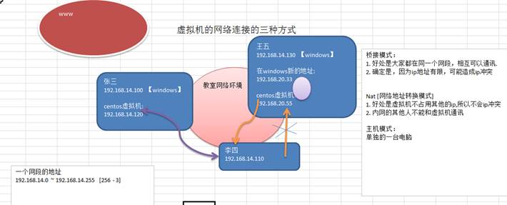


# 3.Linux目录结构

​		Linux的文件系统是采用级层式的树状目录结构，在此结构中的最上层是根目录“/”，然后在此目录下再创建其他的目录.在Linux系统中一切皆为文件，即使是一个硬件设备，也是使用文本来标志

**目录结构**

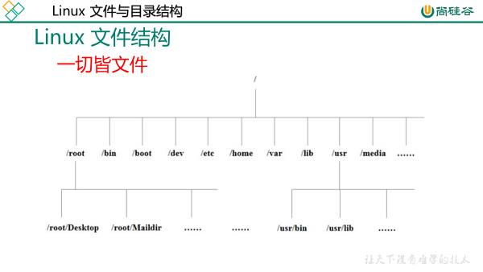

- **/bin** (/usr/bin 、 /usr/local/bin)：是Binary的缩写, 这个目录存放着最经常使用的命令。
- /sbin：(/usr/sbin 、 /usr/local/sbin)，s就是Super User的意思，这里存放的是系统管理员使用的系统管理程序。
- **/home** ：存放普通用户的主目录，在Linux中每个用户都有一个自己的目录，一般该目录名是以用户的账号命名的。
- **/root**：该目录为系统管理员，也称作超级权限者的用户主目录。
- **/lib**：系统开机所需要最基本的动态连接共享库，其作用类似于Windows里的DLL文件。几乎所有的应用程序都需要用到这些共享库。
- **/etc**：所有的系统管理所需要的配置文件和子目录 my.conf
- **/usr**： 这是一个非常重要的目录，用户的很多应用程序和文件都放在这个目录下，类似与windows下的program files目录。
- **/boot**：存放的是启动Linux时使用的一些核心文件，包括一些连接文件以及镜像文件。
- **/tmp**：这个目录是用来存放一些临时文件的。
- /dev：类似于windows的设备管理器，把所有的硬件用文件的形式存储。
- **/media**：linux系统会自动识别一些设备，例如U盘、光驱等等，当识别后，linux会把识别的设备挂载到这个目录下。
- **/mnt**：系统提供该目录是为了让用户临时挂载别的文件系统的，我们可以将外部的存储挂载在/mnt/上，然后进入该目录就可以查看里的内容了。 d:/myshare
- /opt：这是给主机额外安装软件所摆放的目录。如安装ORACLE数据库就可放到该目录下。默认为空。
- **usr/local **：这是另一个给主机额外安装软件所安装的目录。一般是通过编译源码方式安装的程序。
- **/var **：这个目录中存放着在不断扩充着的东西，习惯将经常被修改的目录放在这个目录下。包括各种日志文件。


**总结**：

​		①在Linux中，目录结构有一个根目录，其他的目录都是根目录的分支。

​		②在Linux中，有很多目录是安装后就存在的，每个目录中存放着相应的文件，不要随意修改。

​		③在Linux中，优点:设备都是以文件来体现，比如键盘，鼠标。

​		④要在脑海里形成一个目录树。

# 4.远程登录到Linux服务器

## 4.1为什么需要远程登入到Linux

说明: 公司开发时候， 具体的情况是这样的

​		1) linux服务器是开发小组共享的.

​		2) 正式上线的项目是运行在公网的.

​		3) 因此程序员需要远程登录到centos进行项目管理或者开发.

​		4) 画出简单的网络拓扑示意图(**帮助理解**)

​		5) 远程登录客户端有 Xshell5，Xftp5 secureCRT , 我们学习使用 Xshell5 和 Xftp5 secureCRT, 其它的远程工具大同小异.

# 5.Vi和Vim编辑器

## 5.1基本介绍

​		所有的Linux系统都会内置vi文本编辑器

​		**Vim** 具有程序编辑的能力，可以看做是Vi增强版本，可以主动的以字体颜色辨别语法的正确性，方便程序设计。代码补完、编译及错误跳转等方便编程的功能特别丰富，在程序员中被广泛使用。

- `yy`：拷贝当前行。`y5y`：拷贝当前行向下的5行。`q`：粘贴。
- `dd`：删除当前行。`5dd`：删除当前行向下的5行。
- `set nu`：显示文件行号。`set nonu`：取消行号。（底行模式下执行）
- `G`：定位当最末行。`gg`：定位到首行。`数字+G`：定位到固定行
- `^`：定位到行头，`$`：定位到行尾

# 6.开机、重启和用户登录注销

## 6.1常用指令

- `shutdown -h now`：立刻关机
- `shutdown -h 1`：1分钟后关机
- `shutdown -r now`：立即重启
- `shutdown -r 1`：1分钟后重启
- `halt`：立刻关机
- `reboot`：立即重启
- `sync`：把内存中的数据写入到磁盘中
  - 注意不管是重启系统还是关闭系统，首先要运行sync命令，把内存中的数据写到磁盘中。
- `su - wse`：切换wse用户
- `logout`：注销用户
  - 注意：logout注销指令在图形运行级别无效，在运行级别3下有效。

- `exit`：注销用户

# 7.用户管理

## 7.1简单示意图

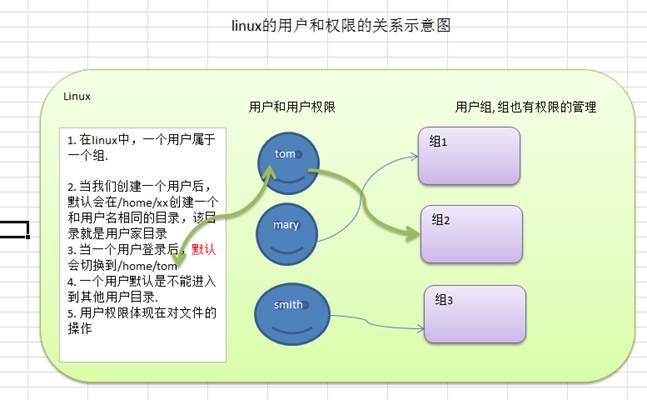

## 7.2基本介绍

​		Linux系统是一个多用户多任务的操作系统，任何一个要使用系统资源的用户，都必须首先向系统管理员申请一个账号，然后以这个账号的身份进入系统。

**常用指令**

- `useradd wse`：添加wse用户。
- `passwd wse`：给用户wse设置密码。
- `useradd -d /home/aaa wse`：添加用户wse并指定家目录/home/aaa。
- `userdel wse`：删除用户wse。
- `userdel -r wse`：删除用户wse并删除家目录（工作中一般不删除家目录）。
- `id wse`：查询用户wse信息
-  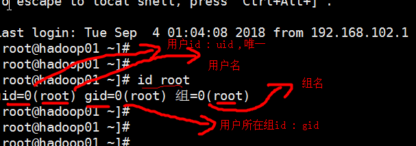
- `su - root`：切换用户。当用户权限不够时，切换用户。`su -`:不加用户，默认切换到root。
- `groupadd animal`：添加animal组。
- `useradd -g animal cat`：添加用户cat至组animal.
- `groupdel animal`：删除animal组（注意：当组下没有用户时才能删除）。
- `usermod -g aaa dog`：修改用户dog至aaa组。

## 7.3用户和组的相关文件

### 7.3.1 /etc/passwd 文件 

​    	用户（user）的配置文件，记录用户的各种信息。

​		每行的含义：用户名:口令:用户标识号:组标识号:注释性描述:主目录:登录Shell [图]。

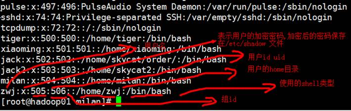

### 7.3.2 /etc/shadow 文件

​    	口令的配置文件。

​		每行的含义：登录名:加密口令:最后一次修改时间:最小时间间隔:最大时间间隔:警告时间:不活动时间:失效时间:保留 [图]。

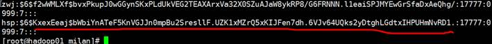

### 7.3.3 /etc/group 文件

​    	组(group)的配置文件，记录Linux包含的组的信息。

​		每行含义：组名:口令:组标识号:组内用户列表。

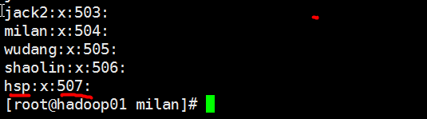

# 8.实用指令

## 8.1运行级别

### 8.1.1基本介绍

- 0 ：关机 
- 1 ：单用户 [类似安全模式， 这个模式可以帮助找回root密码]
- 2：多用户状态没有网络服务
- <font color ="red">3：多用户状态有网络服务 [使用]</font>
- 4：系统未使用保留给用户
- <font color ="red">5：图形界面 【】</font>
- 6：系统重启 

最常用的运行指令是3和5。

**如何指定运行级别**？

​		可以通过修改/etc/inittab文件中的

​		id:5:initdefault:		这行中的数字来进行修改。也可以通过命令`init 1`来修改。

**<font color="red">面试题</font>:如何找回root密码？**

​		启动时->引导时快速输入enter->输入e-> 进入到编辑界面-> 选择中间有kernel 项->输入e(edit)-> 在该行的最后写入 1 [表示修改内核，临时生效]-> 输入enter->
输入b [boot]-> 进入到单用户模式 。

## 8.2帮助指令

### 8.2.1获得帮助信息man 

- `man [命令或配置文件]`:获取帮助信息。`man ls`：查看ls命令的帮助信息.

### 8.2.3help指令

- `help [命令]` ：获得shell内置命令的帮助信息。

## 8.3文件和目录相关的指令

- `pwd`：显示当前工作目录的绝对路径。

- ` ls  [选项]   [目录或是文件]`：显示目录或文件下的文件信息。
  - -a：显示当前目录所有的文件和目录，包括隐藏的 (文件名以.开头就是隐藏)。
  - -l：以列表的形式显示信息。
  - -h：显示文件大小时，以k，m，G单位显示。
  
- `cd [目录]`:切换到指定目录。

- `mkdir [选项] 要创建的文件夹 `：创建文件夹。
  
  - -p：创建多级目录。
  
- `rmdir [选项]  要删除的空目录`：删除空文件夹。
  - -r：表示递归删除。
  - -f：表示强制删除。
  
- `touch 文件名称`：创建空文件。如果文件存在，则表示刷新文件的修改时间。

- `cp [选项] [源] [目的文件]`:拷贝指令。
  
  - -r：递归复制整个文件夹。
  
- `rm [选项] 要删除的文件或目录`：移除文件或目录。

- `rm -rf /home/aaa.txt`：强制删除/home/aaa.txt并且不提醒

  - -r：递归删除整个文件夹
  - -f：强制删除不提示

- `mv 旧的文件名 新的文件名`：移动文件或者重命名文件。

- `mv /home/aaa.txt /root/`：将home下的aaa.txt移动到root目录下。

- `cat -n aaa.txt`：查看文件aaa.txt的内容，并显示行号。

  - -n：显示行号。

  注意：cat指令只能查看文件内容，不能修改文件内容。为了浏览方便，一般会带上 管道命令 | more，`cat xxx.txt | more `(把cat xxx.txt 输出结果交给 more 处理

- `more 文件名`：文本过滤指令，more中内置了很多快捷键。

  - `more /etc/profile`：查看文件/etc/profile的内容。

  - 快捷键：

  - | 操作           | 功能说明                                  |
    | -------------- | ----------------------------------------- |
    | 空白键 (space) | 代表向下翻一页；                          |
    | Enter          | 代表向下翻『一行』；                      |
    | q              | 代表立刻离开  more ，不再显示该文件内容。 |
    | Ctrl+F         | 向下滚动一屏                              |
    | Ctrl+B         | 返回上一屏                                |
    | =              | 输出当前行的行号                          |
    | :f             | 输出文件名和当前行的行号                  |

- `less 要查看的文件名`：查看文件内容。比more更强大。less指令在显示文件内容时，并不是一次将整个文件加载之后才显示，而是根据显示需要加载内容，对于显示大型文件具有较高的效率。
- `echo hello  `：输出内容到控制台。常用指令：`echo $PATH`：输出环境变量。
- `head  文件名`：显示文件开头10行内容。
  
  - -n：`head -n 5`：显示文件开头5行内容。
- `tail 文件名`：显示文件后10行内容。
  - -n：`tail -n 5`：显示文件后5行的内容
  - -f：实时追踪该文档的所有更新。
- `ls -l > /home/aaa.txt`：列表的内容写入文件a.txt中（覆盖写）。
- `ls- l >> /home/aaa.txt`：列表的内容追加到文件aa.txt的末尾
- `cat aaa.txt > bbb.txt`：将文件1的内容覆盖到文件2
- `ln -s [原文件或目录] [软链接名] `：给原文件创建一个软链接
  
- 注意：当我们使用pwd指令查看目录时，仍然看到的是软链接所在目录。
  
- `history`：查看已经执行过历史命令,也可以执行历史指令。
- `date `   （功能描述：显示当前时间）
  - `date + %Y  `（功能描述：显示当前年份）
  - `date + %m  `（功能描述：显示当前月份）
  - `date + %d `  （功能描述：显示当前是哪一天）
  - `date "+ %Y-%m-%d %H:%M:%S"`（功能描述：显示年月日时分秒）
  - `data -s "2020-09-06 11:11:11:11"`：设置系统当前时间。
- `cal [选项]`：不加选项，显示本月日历。
  
  - `cat 2020`：显示2020年日历。
- `find [搜索范围] [选项] 文件名` ：从指定目录向下递归地遍历其各个子目录，将满足条件的文件或者目录显示在终端。
  - -name：`find /home  -name hello.txt`：根据名称查找/home 目录下的hello.txt文件。
  - -user：`find /opt  -user nobody`：查找/opt目录下，用户名称为 nobody的文件。
  - -size：`find  / -size  +10M`：查找整个linux系统下大于10M的文件（+n 大于 -n小于  n等于）。
- **locate指令可以快速定位文件路径。locate指令利用事先建立的系统中所有文件名称及路径的locate数据库实现快速定位给定的文件。Locate指令无需遍历整个文件系统，查询速度较快。为了保证查询结果的准确度，管理员必须定期更新locate时刻。**
  - 由于locate指令基于数据库进行查询，所以第一次运行前，必须使用updatedb指令创建locate数据库。
  - `updatedb`,`locate hello.txt`：使用locate 指令快速定位 hello.txt 文件所在目录。
- grep指令和 管道符号 | 
  - `grep [选项] 查找内容 源文件`
  - - -n：显示行号。
    - -i：忽略字母大小写。
    - `grep –n  if /etc/profile`：在/etc/profile 中查找 if ,并显示行，区别大小写。
    - `grep –ni  if /etc/profile`：在/etc/profile 中查找 if ,并显示行，不区别大小写。
    - `netstat -anp | grep sshd`：**查看当前服务器有没有 sshd 服务在监听.**
- `zip   [选项] XXX.zip 需要压缩的内容`：压缩文件和目录的命令。
  
  - -r：递归压缩。` zip -r  mypackage.zip /home/`：将整个home，目录压缩成mypackage.zip
- `unzip [选项] XXX.zip `：（功能描述：解压缩文件）
  
  - `unzip –d /opt/tmp mypackage.zip`：将 mypackge.zip 解压到 /opt/tmp 目录下。如果/opt/tmp 不存在，会自动创建。
- `tar`：打包指令。最后打包后的文件是 **.tar.gz** **的文件。** **[可以压缩，和解压]**
  - `tar -zcvf a.tar.gz a1.txt a2.txt `：压缩多个文件，将 /home/a1.txt 和 /home/a2.txt 压缩成 a.tar.gz。
  - `tar -zcvf  myhome.tar.gz  /home/`：将/home 的文件夹 压缩成myhome.tar.gz。
  - `tar -zxvf a.tar.gz`：将 a.tar.gz 解压到当前目录。
  - `tar -zxvf myhome.tar.gz -C /opt/tmp2`：**将myhome.tar.gz 解压到 /opt/tmp2目录下 【-C】**，注意：**<font color="red">/opt/tmp2 事先需要创建好</font>**

# 9.组管理和权限管理

## 9.1组的基本介绍

​		在Linux系统中，每一个文件都有所有者，所在组，和其他组。谁创建了这个文件。谁就是这个文件的所有者。

​		如图：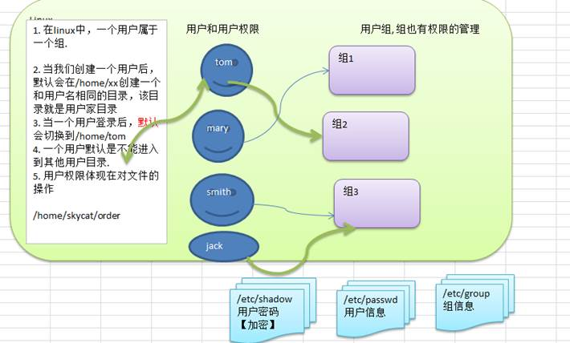


**指令**

查看文件的所有者：

- `ls -anl`
  - 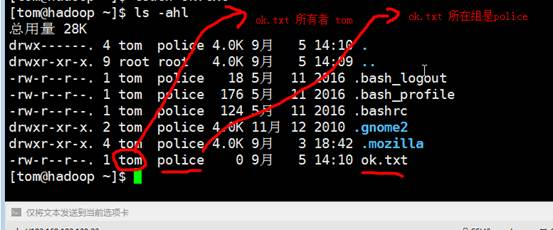

修改文件所有者：

- `chown 用户名 文件名`
- `chown -R 用户名 目录`：将目录下的所有文件级目录的所有者修改为此用户
- `chown –R tom:police  /home/`：将home下的所有文件和目录的所有者都改成 tom，将所在组改成police。

修改文件所在组：

- `chgrp 组名 文件名`
- `chgrp -R shaolin /home/kkk`：将 /home/kkk 目录下所有的文件和目录的所在组都修改成 shaolin(少林)。

改变用户所在组（root的管理权限）：

- `usermod  -g 组名`：`usermod -g animal dog`

改变用户登入的初始目录

- `usermod -d 目录名 用户名`

## 9.2权限的基本介绍

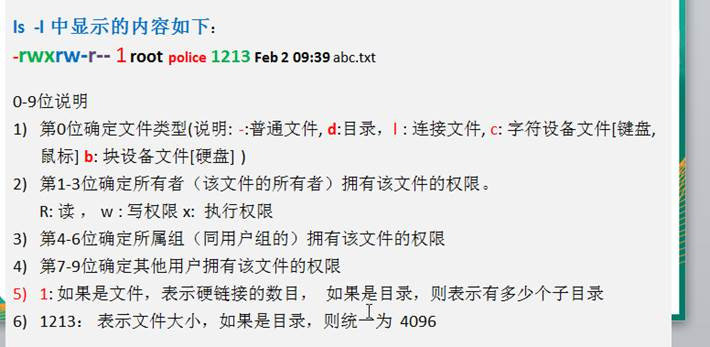

## 9.3权限详解

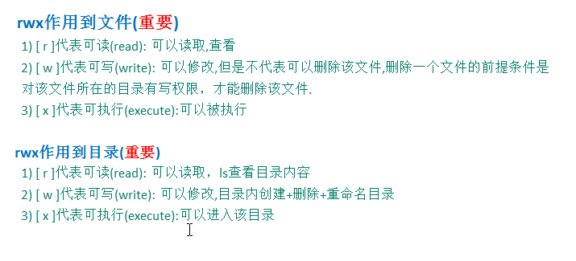

**修改权限  chmod**

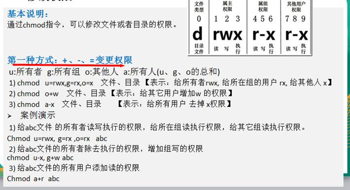

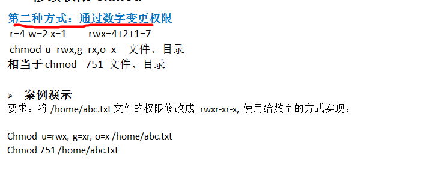

# 10.定时任务调度

## 10.1简单介绍

​		任务调度：是指系统在某个时间执行的特定的命令或程序。

  	  任务调度分类：1.系统工作：有些重要的工作必须周而复始地执行。如病毒扫描等

​    						 	  2.个别用户工作：个别用户可能希望执行某些程序，比如对mysql数据库的备份。

基本语法：`crontab [选项]`

- -e：编辑crontab定时任务。
- -l：查询crontab任务
- -r：删除当前用户的crontab任务。

按例：

- `*/1 \* \* \* \* ls –l /etc/ > /tmp/to.txt`：每隔一分钟执行一次`ls –l /etc/ > /tmp/to.txt`命令。
- `service crond restart `： [重启任务调度]

说明：


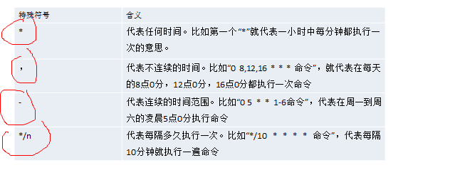

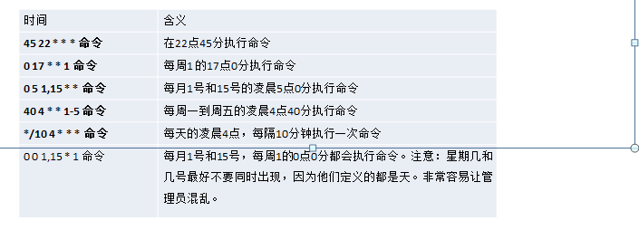

## 10.2shell脚本的任务调度

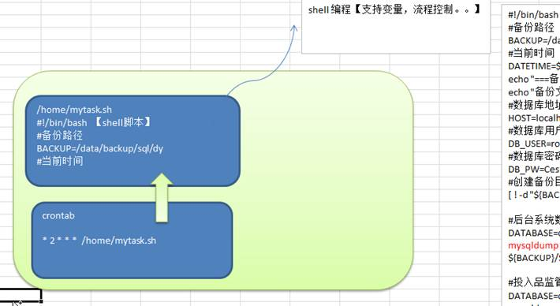

步骤：

- ①编写一个shell脚本。mydate.sh内容：`date >> /tmp/mydate.txt`  
- ②给shell脚本一个可执行的权限：`chmod u+x mydate.sh`
- ③将脚本部署到crontab中：`crontab e`，`*/1 * * * * /home/mydate.sh`

案例：每天凌晨2:00 将mysql数据库 testdb ，备份到文件中。

步骤：1， 首先编写一个 脚本 backupdb.sh

```sh
 #!/bin/bash
 #备份路径 
 BACKUP=/data/backup/sql/dy
 #当前时间  
 DATETIME=$(date +%Y-%m-%d_%H%M%S)  
 echo "===备份开始==="  
 echo "备份文件存放于${BACKUP}/$DATETIME.tar.gz"  
 #数据库地址  
 HOST=localhost  
 #数据库用户名  
 DB_USER=root  
 #数据库密码  
 DB_PW=Ces123456  
 #创建备份目录  
 [ ! -d "${BACKUP}/$DATETIME" ] && mkdir -p  "${BACKUP}/$DATETIME"     
 #后台系统数据库  
 DATABASE=dy_backgroundms  
 mysqldump -u${DB_USER} -p${DB_PW} --host=$HOST -q -R --databases  $DATABASE | gzip > ${BACKUP}/$DATETIME/$DATABASE.sql.gz     
 #投入品监管数据库  
 DATABASE=dy_firip  mysqldump -u${DB_USER} -p${DB_PW} --host=$HOST -q -R --databases  $DATABASE | gzip > ${BACKUP}/$DATETIME/$DATABASE.sql.gz     #压缩成tar.gz包  
 cd $BACKUP  
 tar -zcvf $DATETIME.tar.gz $DATETIME  
 #删除备份目录  
 rm -rf ${BACKUP}/$DATETIME    
 #删除30天前备份的数据  
 find $BACKUP -mtime +30 -name "*.tar.gz" -exec rm -rf {} \;  
 echo "===备份成功==="  
```

 步骤2: 给 /home/backupdb.sh 一个可以执行的权限

`chmod u+x backupdb.sh`

步骤3:  将backupdb.sh 部署到crontab 

`crontab -e `

增加

`\* 2 * * * /home/backupdb.sh`

# 11.Linux磁盘分区、挂载

## 11.1分区的基本介绍

- mbr分区:
  - 1.最多支持四个主分区
  - 2.系统只能安装在主分区
  - 3.扩展分区要占一个主分区
  - 4.MBR最大只支持2TB，但拥有最好的兼容性

- gtp分区:
  - 1.支持无限多个主分区（但操作系统可能限制，比如 windows下最多128个分区
  - 2.最大支持18EB的大容量（1EB=1024 PB，1PB=1024 TB ）
  - 3.windows7 64位以后支持gtp

### 11.1.1 windows下的磁盘分区

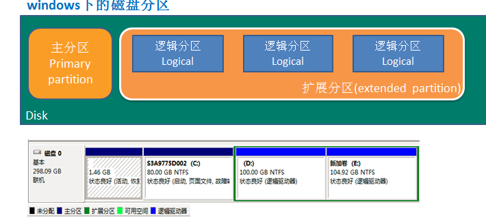

## 11.2Linux的分区

​		 Linux来说无论有几个分区，分给哪一目录使用，它归根结底就只有一个根目录，一个独立且唯一的文件结构 , Linux中每个分区都是用来组成整个文件系统的一部分。

​		Linux采用了一种叫**载入(mount)**的处理方法，它的整个文件系统中包含了一整套的文件和目录，且将一个分区和一个目录联系起来。这时要载入的一个分区将使它的存储空间在一个目录下获得。

示意图：

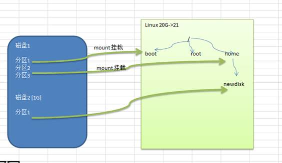


### 11.2.1硬盘说明

​		Linux硬盘分IDE硬盘和SCSI硬盘，目前基本上是SCSI硬盘。

​		对于IDE硬盘，驱动器标识符为“hdx~”,其中“hd”表明分区所在设备的类型，这里是指IDE硬盘了。“x”为盘号（a为基本盘，b为基本从属盘，c为辅助主盘，d为辅助从属盘）,“~”代表分区，前四个分区用数字1到4表示，它们是主分区或扩展分区，从5开始就是逻辑分区。例，hda3表示为第一个IDE硬盘上的第三个主分区或扩展分区,hdb2表示为第二个IDE硬盘上的第二个主分区或扩展分区。 

​		对于SCSI硬盘则标识为“sdx~”，SCSI硬盘是用“sd”来表示分区所在设备的类型的，其余则和IDE硬盘的表示方法一样。sdb1 [表示第2块scsi 硬盘的第1个分区]。

### 11.2.2增加一块硬盘

1) 增加一块硬盘 1G [到设置中添加一块硬盘即可]

2) 重启一下系统

**查看所有设备(光驱 /media，u盘， 硬盘)挂载情况**

- `lsblk`或`lsblk -f`

3)给sdb硬盘分区

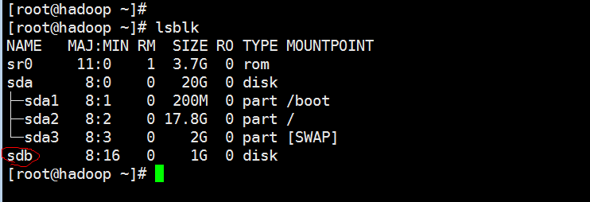

分区指令：

- `fdisk /dev/sdb`：/dev是存放设备的目录

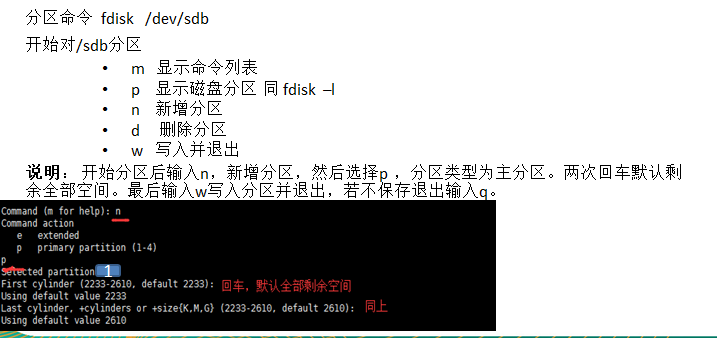

4)格式化硬盘

- `mkfs -t ext4 /dev/sdb1`
- `lsblk -f`

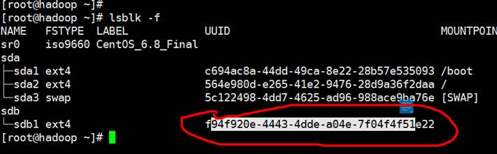

5)将硬盘挂载到文件上

`mkdir /home/newdisk`

`mount /dev/sdb1  /home/newdisk`

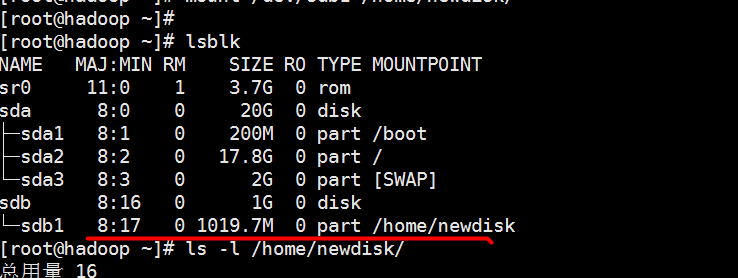

6)上面的方式，只是临时生效，当你重启系统，挂载的关系没有， 配置linux的分区表，实现启动时，自动挂载.

`vim /etc/fstab`

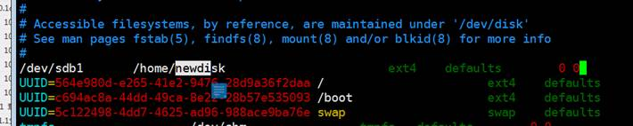

7) 重启后，会自动挂载.

8) 如果，我们希望卸载，指令

`umount 设备名 | 挂载路径`

`umount /dev/sdb1 | /home/newdisk`

## 11.4磁盘情况查询

**查询系统整体磁盘使用情况指令：**

- `df -h`

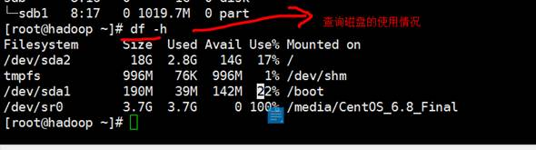

**查询指定目录的磁盘占用情况**：du -h /目录

默认为当前目录

  -s 指定目录占用大小汇总

  -h 带计量单位

  -a 含文件

  --max-depth=1 子目录深度

  -c 列出明细的同时，增加汇总值

- `du -ach --max-depth=1 /usr `

## 11.5磁盘情况-工作实用指令

1) 统计/home文件夹下文件的个数
` ls –l /home/ | grep “^-” | wc -l`

2) 统计/home文件夹下目录的个数
` ls –l /home/ | grep “^d” | wc -l`

3) 统计/home文件夹下文件的个数，包括子文件夹里的
` ls –lR /home/ | grep “^-” | wc -l`

4) 统计/home文件夹下目录的个数，包括子文件夹里的
 `ls –lR /home/ | grep “^d” | wc -l`

以树状显示home目录结构 [没有tree指令咋办, 使用yum 来安装]

先安装

`yum install tree`

# 12.Linux的网络配置

## 12.1配置固定的ip地址

指令

- `vim /etc/sysconfig/network-scripts/ifcfg-eth0`

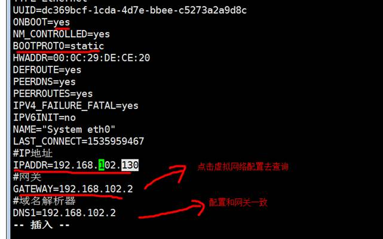

如果希望配置生效

1) reboot或

2) service network restart // 重启网络服务

## 12.2修改主机名

①查看当前主机名

- `hostname`

②修改当前主机名

- `vim /etc/sysconfig/network`：注意主机名不能有下划线

③修改/etc/hosts/增加ip和主机的映射

# 13.进程管理(重点)

## 13.1基本介绍

1) 在LINUX中，每个执行的程序（代码）都称为一个进程。每一个进程都分配一个ID号。

2) 每一个进程，都会对应一个父进程，而这个父进程可以复制多个子进程。例如www服务器

3) 每个**进程都可能以两种方式存在的。前台与后台（守护进程）**，所谓前台进程就是用户目前的屏幕上可以进行操作的。后台进程则是实际在操作，但由于屏幕上无法看到的进程，通常使用后台方式执行[sshd , crond]。 

4)一般系统的**服务都是以后台进程的方式存在**，而且都会常驻在系统中。直到关机才才结束。

**显示所有进程**

- `ps -aux`

显示sshd进程

- `ps -aux |grep sshd`

## 13.2ps详解

System V展示风格

USER：用户名称 

PID：进程号 

%CPU：进程占用CPU的百分比 

%MEM：进程占用物理内存的百分比 

VSZ：进程占用的虚拟内存大小（单位：KB） 

RSS：进程占用的物理内存大小（单位：KB） 

TTY：终端名称,缩写 .

STAT：进程状态，其中S-睡眠，s-表示该进程是会话的先导进程，N-表示进程拥有比普通优先级更低的优先级，R-正在运行，D-短期等待，Z-僵死进程，T-被跟踪或者被停止等等 

STARTED：进程的启动时间 

TIME：CPU时间，即进程使用CPU的总时间 

COMMAND：启动进程所用的命令和参数，如果过长会被截断显示

## 13.3终止进程kill和killall

- `kill [选项] 进程号`：通过进程号杀死进程 -9 强制终止。
  - -9：强制终止进程
- `killall 进程名`：通过进程名称杀死进程，也支持通配符，这在系统因负载过大而变得很慢时很有用。

## 13.4进程树pstree

- `pstree [选项]`：可以更加直观的来看进程信息
  - -p :显示进程的PID。
  - -u :显示进程的所属用户。

## 13.5服务管理

介绍:

​		服务(service) 本质就是进程，但是是运行在后台的，通常都会监听某个端口，等待其它程序的请求，比如(mysql , sshd 防火墙等)，因此我们又称为守护进程，是Linux中非常重要的知识点。

- `service 服务名{start | stop | restart | reload | status}`

查看当前防火墙的状况，关闭防火墙和重启防火墙

- `service iptables status`
- `service iptables stop`
- `service iptables start`

**重点**

- `chkconfig --list |grep 服务名`
- `chkconfig 服务名 --list`
- `chkconfig --level 5 服务名 on/off`
- `chkconfig 服务名 off`：彻底关闭服务

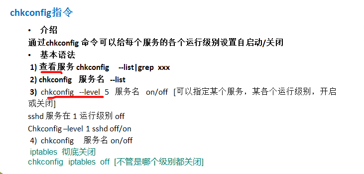

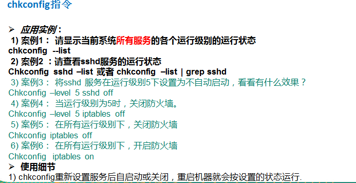

## 13.6动态监控进程

​		top与ps命令很相似。它们都用来显示正在执行的进程。Top与ps最大的不同之处，在于top在执行一段时间可以更新正在运行的的进程(默认每3秒变化一次)。

- `top [选项]`
  - 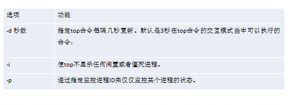

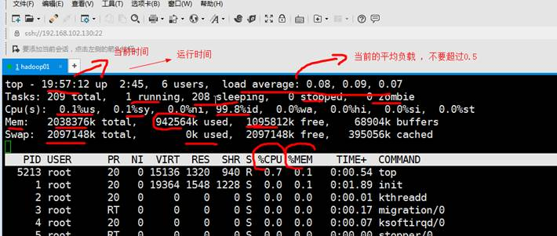

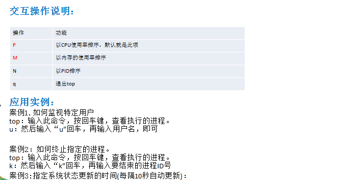

## 13.7监控网络状态

- `netstat [选项]`
  - -an 按一定顺序排列输出
  - -p 显示哪个进程在调用

查看所有：

- `netstat -anp | grep more`：

查看服务为sshd的的服务信息：

- `netstat -anp | grep sshd`

查看当前系统有哪些端口在监听

- `netstat -tlnp`

**<font color = "red">高级指令</font>**

- `netstat`
- `top`
- `lsblk`
- `find`
- `ps -aux`
- `chkconfig`

## 13.8瓜子二手车面试题

问题：Linux查看内存、磁盘存储、io 读写（iotop）、端口占用、进程等命令。

Linux查看内存：

- `top`

磁盘存储

- `df -lh`

io 读写（iotop）

- 

端口占用

- `netstat -tunlp`

进程

- `ps -aux |grep 进程名`

# 14.rpm和yum软件安装

## 14.1rpm包的管理

介绍：

​		一种用于互联网下载包的打包及安装工具，它包含在某些Linux分发版中。它生成具有.RPM扩展名的文件。RPM是RedHat Package Manager（RedHat软件包管理工具）的缩写，类似windows的setup.exe，这一文件格式名称虽然打上了RedHat的标志，但理念是通用的。

Linux的分发版本都有采用（suse,redhat, centos 等等），可以算是公认的行业标准了。

## 14.2rpm常用指令

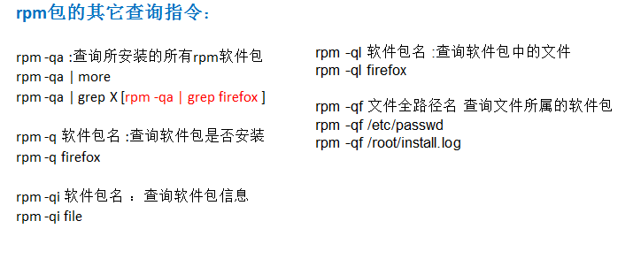

卸载rpm包

- `rpm -e firefox`：卸载火狐

注意：如果其它软件包依赖于您要卸载的软件包，卸载时则会产生错误信息。

如： ` rpm -e foo `

**removing these packages would break dependencies:foo is needed by bar-1.0-1**

 		如果我们就是要删除 foo这个rpm 包，可以增加参数 --nodeps ,就可以强制删除，但是一般不推荐这样做，因为依赖于该软件包的程序可能无法运行。

安装rpm包

- `rpm -ivh firefox`：安装火狐。

## 14.3yum的使用

