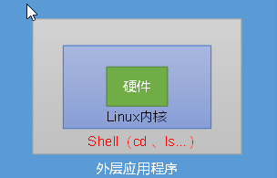

# Shell

# 1.Shell概述

​		Shell是一个命令行解释器，可以接受应用程序或用户的指令，来操作系统内核。

​		Shell也是一种语言，以编写，以调试，灵活性强。          



# 2.Shell解析器

（1）Linux 提供的 Shell 解析器有：

```shell
[atguigu@hadoop101 ~]$ cat /etc/shells
/bin/sh
/bin/bash
/sbin/nologin
/bin/dash
/bin/tcsh
/bin/csh
```

