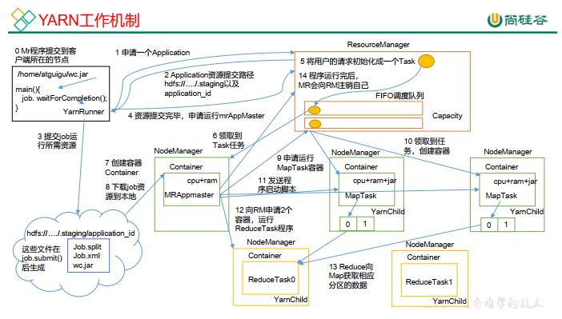

#  Hadoop总结

## Hadoop 组成及架构


​		在Hadoop2.x时代，增加了Yarn。Yarn只负责资源的调度，MapReduce只负责算。  

### HDFS架构概述


### YARN 架构概述


### MapReduce 架构概述  

MapReduce 将计算过程分为两个阶段： Map 和 Reduce
1） Map 阶段并行处理输入数据
2） Reduce 阶段对 Map 结果进行汇总  


## HDFS

### HDFS 的数据流（面试重点）  

---

**HDFS的写数据流程  **


（1） 客户端通过 Distributed FileSystem 模块向 NameNode 请求上传文件， NameNode 检查目标文件是否已存在，父目录是否存在。

（2） NameNode 返回是否可以上传。

（3） 客户端请求第一个 Block 上传到哪几个 DataNode 服务器上。

（4） NameNode 返回 3 个 DataNode 节点， 分别为 dn1、 dn2、 dn3。

（5） 客户端通过 FSDataOutputStream 模块请求 dn1 上传数据， dn1 收到请求会继续调用dn2，然后 dn2 调用 dn3，将这个通信管道建立完成。

（6） dn1、 dn2、 dn3 逐级应答客户端。

（7）客户端开始往 dn1 上传第一个 Block（先从磁盘读取数据放到一个本地内存缓存），以 Packet 为单位， dn1 收到一个 Packet 就会传给 dn2， dn2 传给 dn3； dn1 每传一个 packet会放入一个应答队列等待应答。

（8） 当一个 Block 传输完成之后，客户端再次请求 NameNode 上传第二个 Block 的服务器。（重复执行 3-7 步）。  

**HDFS的读数据流程  **


（1） 客户端通过 Distributed FileSystem 向 NameNode 请求下载文件， NameNode 通过查询元数据，找到文件块所在的 DataNode 地址。

（2） 挑选一台 DataNode（就近原则，然后随机）服务器，请求读取数据。

（3） DataNode 开始传输数据给客户端（从磁盘里面读取数据输入流，以 Packet 为单位来做校验）。  

（4） 客户端以 Packet 为单位接收，先在本地缓存，然后写入目标文件。  

### NN 和 2NN  

---

#### NN 和 2NN 工作机制  


上图工作过程：

1. 第一阶段： NameNode 启动

    （1）第一次启动 NameNode 格式化后， 创建 Fsimage 和 Edits 文件。如果不是第一次启动，直接加载编辑日志和镜像文件到内存。

    （2） 客户端对元数据进行增删改的请求。

    （3） NameNode 记录操作日志，更新滚动日志。

    （4） NameNode 在内存中对数据进行增删改。

2. 第二阶段： Secondary NameNode 工作
    （1） Secondary NameNode 询问 NameNode 是否需要 CheckPoint。 直接带回 NameNode是否检查结果。

    （2） Secondary NameNode 请求执行 CheckPoint。

    （3） NameNode 滚动正在写的 Edits 日志。

    （4）将滚动前的编辑日志和镜像文件拷贝到 Secondary NameNode。

    （5） Secondary NameNode 加载编辑日志和镜像文件到内存，并合并。

    （6） 生成新的镜像文件 fsimage.chkpoint。

    （7） 拷贝 fsimage.chkpoint 到 NameNode。

    （8） NameNode 将 fsimage.chkpoint 重新命名成 fsimage。  

**详解**

Fsimage： NameNode 内存中元数据序列化后形成的文件，用于记录元数据的状态。 

Edits： 记录客户端更新元数据信息的每一步操作（可通过 Edits 运算出元数据） 。

​		 NameNode启动时，先滚动Edits并生成一个空的edits.inprogress，然后加载Edits和Fsimage 到内存中，此时 NameNode 内存就持有最新的元数据信息。 Client 开始对 NameNode 发送元数据的增删改的请求，这些请求的操作首先会被记录到 edits.inprogress 中（查询元数据的操作不会被记录在 Edits 中，因为查询操作不会更改元数据信息），如果此时 NameNode 挂掉，重启后会从 Edits 中读取元数据的信息。然后，NN会在内存中执行元数据 的增删改的操作。 由于 Edits 中记录的操作会越来越多， Edits文件会越来越大，导致 NameNode 在启动加载 Edits 时会很慢，所以需要对 Edits 和 Fsimage 进行合并（所谓合并，就是将 Edits 和 Fsimage 加载到内存中，照着 Edits 中的操作一步步执行，最终形成新的 Fsimage）。 

​		SecondaryNameNode 的作用就是帮助 NameNode 进行 Edits 和 Fsimage 的合并工作。 SecondaryNameNode 首先会询问 NameNode 是否需要 CheckPoint（触发 CheckPoint 需要 满足两个条件中的任意一个，定时时间到和 Edits 中数据写满了)。 直接带回 NameNode 是否检查结果。2NN 执行 CheckPoint 操作，首先会让 NameNode 滚动 Edits 并生成一个空的edit.inpropress, 滚动 Edits 的目的是给 Edits 打个标记，以后所有新的操 作都写入 edits.inprogress，其他未合并的 Edits 和 Fsimage 会拷贝到 2NN的本地，然后将拷贝的 Edits 和 Fsimage 加载到内存中进行合并，生成 fsimage.chkpoint， 然后将 fsimage.chkpoint 拷贝给 NameNode，重命名为 Fsimage 后替换掉原来的 Fsimage。 NameNode 在启动时就只需要加载之前未合并的 Edits 和 Fsimage 即可，因为合并过的 Edits 中的元数据信息已经被记录在 Fsimage 中。

### DataNode 工作机制


（1） 一个数据块在 DataNode 上以文件形式存储在磁盘上，包括两个文件，一个是数据本身，一个是元数据包括数据块的长度，块数据的校验和，以及时间戳。

（2） DataNode 启动后向 NameNode 注册，通过后，周期性（1 小时） 的向 NameNode 上报所有的块信息。

（3） 心跳是每 3 秒一次，心跳返回结果带有 NameNode 给该 DataNode 的命令如复制块数据到另一台机器，或删除某个数据块。 如果超过 10 分钟30秒没有收到某个 DataNode 的心跳，则认为该节点不可用。

（4） 集群运行中可以安全加入和退出一些机器。  

## MapReduce

MapReduce是一个分布式编程框架。优点：简单。缺点：速度慢。

### 核心思想

- map：映射，将数据映射成我们需要的格式。
- reduce：减少，归约。将map阶段的数据进行计算，归约。


### MapReduce 框架原理  

---

#### Job 提交流程源码和切片源码详解  

1. Job 提交流程源码详解  

    ```
    waitForCompletion()
    
    submit();
    
    // 1 建立连接
        connect();
            // 1）创建提交 Job 的代理
            new Cluster(getConfiguration());
            // （1）判断是本地 yarn 还是远程
        initialize(jobTrackAddr, conf);
    // 2 提交 job	
        submitter.submitJobInternal(Job.this, cluster)
        
        // 1）创建给集群提交数据的 Stag 路径
        Path jobStagingArea =JobSubmissionFiles.getStagingDir(cluster, conf);
        
        // 2）获取 jobid ，并创建 Job 路径
        JobID jobId = submitClient.getNewJobID();
        
        // 3）拷贝 jar 包到集群
        copyAndConfigureFiles(job, submitJobDir);
        rUploader.uploadFiles(job, jobSubmitDir);
        
        // 4）计算切片，生成切片规划文件
        writeSplits(job, submitJobDir);
        maps = writeNewSplits(job, jobSubmitDir);
        input.getSplits(job);
        
        // 5）向 Stag 路径写 XML 配置文件
        writeConf(conf, submitJobFile);
        conf.writeXml(out);
        
        // 6）提交 Job,返回提交状态
        status = submitClient.submitJob(jobId,
        submitJobDir.toString(), job.getCredentials());
    ```

    

2. FileInputFormat 切片源码解析  

    

    

#### InputFormat 数据输入

| 实现类                  | 切片方式                                                     | 切片大小           | key                  | value        |
| ----------------------- | ------------------------------------------------------------ | ------------------ | -------------------- | ------------ |
| TextInputFormat         | 一个文件一个切片，按行读取                                   | 默认128M           | 偏移量               | 该行数据     |
| KeyValueTextInputFormat | 一个文件一个切片，按行读取                                   | 128M               | 行分割后的第一列数据 | 第二列的数据 |
| NLineInputFormat        | 按指定行数切（输入文件的总行数/N=切片数， 如果不整除， 切片数=商+1） | 128M               | 偏移量               | 该行数据     |
| CombineTextInputFormat  | 虚拟存储过程和切片过程。                                     | 虚拟存储切片最大值 | 偏移量               | 该行数据     |
| 自定义InputFormat       |                                                              | 128M               |                      |              |

#### MapReduce 工作流程  


1. **read阶段**：一个待处理的文件，在客户端提交之前，会去先获取待处理数据的信息，然后根据参数配置形成一个任务的分配规划，这里指的就是切片过程，获取切片信息。
2. 提交信息，信息包括：Job.split,wcjar,Job.xml
3. 提交完信息后有YARN控制，YARN调用ResourceManager，ResourceManager会去创建一个MR APPmaster，一个job的管理者。MR APPmaster根据切片信息计算MapTask的个数。并开启MapTask。
4. **Map阶段**：启动完MapTask后，就要去读取数据，通过默认的TextInputFormat（一行一行的读，可以自定义）去待处理的文件中读取数据，读取出一个个的Key/value。将获取的数据给Mapper，在map()的方法中对数据进行处理然后写出。收集器会先获取分区信息，再将数据写入到环形缓冲区（内存中）。
5. **收集阶段**：收集器将数据写出到环形缓冲区（默认大小100M），右侧写数据，左侧写索引（元数据），元数据值的是kv的存储位置，起始位置，长度等数据，当数据写到80%时，对数据进行分区排序。
6. **溢写阶段**：将分区，区内有序的数据溢写到文件中。
7. **Combine**：归并阶段，将分好区的文件归并排序。
8. 当所有的MapTask结束后，然后进入ReduceTask阶段。
9. **Copy阶段**：ReduceTask 从各个 MapTask 上远程拷贝一片数据，并针对某一片数据，如果其大小超过一定阈值，则写到磁盘上，否则直接放到内存中。  
10. **Merge 阶段**：在远程拷贝数据的同时， ReduceTask 启动了两个后台线程对内存和磁盘上的文件进行合并，以防止内存使用过多或磁盘上文件过多。 
11. **sort阶段** ：Sort 阶段：按照 MapReduce 语义，用户编写 reduce()函数输入数据是按 key 进行聚集的一组数据。 为了将 key 相同的数据聚在一起， Hadoop 采用了基于排序的策略。由于各个 MapTask 已经实现对自己的处理结果进行了局部排序，因此， ReduceTask 只需对所有数据进行一次归并排序即可。  
12. **Reduce 阶段**： reduce()函数将计算结果写到 HDFS 上。  


#### Shuffle 机制

Map 方法之后， Reduce 方法之前的数据处理过程称之为 Shuffle。  Shuffle对数据的处理包括：分区，排序，Combiner合并，归并排序，数据压缩。


（1） MapTask 收集我们的 map()方法输出的 kv 对，放到内存缓冲区中

（2） 从内存缓冲区不断溢出本地磁盘文件，可能会溢出多个文件

（3） 多个溢出文件会被合并成大的溢出文件

（4） 在溢出过程及合并的过程中，都要调用 Partitioner 进行分区和针对 key 进行排序
（5） ReduceTask 根据自己的分区号，去各个 MapTask 机器上取相应的结果分区数据

（6） ReduceTask 会取到同一个分区的来自不同 MapTask 的结果文件， ReduceTask 会将这些文件再进行合并（归并排序）

（7） 合并成大文件后， Shuffle 的过程也就结束了，后面进入 ReduceTask 的逻辑运算过程（从文件中取出一个一个的键值对 Group，调用用户自定义的 reduce()方法）  

**注意：**
（1） Shuffle 中的缓冲区大小会影响到 MapReduce 程序的执行效率，原则上说，缓冲区
越大，磁盘 io 的次数越少，执行速度就越快。
（2） 缓冲区的大小可以通过参数调整，参数： io.sort.mb 默认 100M。
（3） 源码解析流程

```
context.write(k, NullWritable.get());
    output.write(key, value);
        collector.collect(key, value,partitioner.getPartition(key, value, partitions));
        HashPartitioner();
        collect()  
            close()
                collect.flush()
                    sortAndSpill()
                    	sort() QuickSort
                    mergeParts();
                collector.close();
```


#### MapTask 工作机制


（1） Read 阶段： MapTask 通过用户编写的 RecordReader， 从输入 InputSplit 中解析出一个个 key/value。

（2） Map 阶段：该节点主要是将解析出的 key/value 交给用户编写 map()函数处理，并产生一系列新的 key/value。

（ 3） Collect 收集阶段：在用户编写 map()函数中，当数据处理完成后，一般会调用OutputCollector.collect()输出结果。在该函数内部，它会将生成的 key/value 分区（ 调用Partitioner） ， 并写入一个环形内存缓冲区中。

（4） Spill 阶段： 即“溢写”， 当环形缓冲区满后， MapReduce 会将数据写到本地磁盘上，生成一个临时文件。需要注意的是，将数据写入本地磁盘之前，先要对数据进行一次本地排序，并在必要时对数据进行合并、 压缩等操作。

溢写阶段详情：

- 步骤 1： 利用快速排序算法对缓存区内的数据进行排序，排序方式是，先按照分区编号Partition 进行排序，然后按照 key 进行排序。这样， 经过排序后，数据以分区为单位聚集在一起，且同一分区内所有数据按照 key 有序。

- 步骤 2： 按照分区编号由小到大依次将每个分区中的数据写入任务工作目录下的临时文件output /spillN.out （N 表示当前溢写次数）中。如果用户设置了 Combiner，则写入文件之前，对每个分区中的数据进行一次聚集操作。

- 步骤 3： 将分区数据的元信息写到内存索引数据结构 SpillRecord 中，其中每个分区的元信息包括在临时文件中的偏移量、压缩前数据大小和压缩后数据大小。如果当前内存索引大小超过 1MB，则将内存索引写到文件 output/spillN.out.index 中。

（5） Combine 阶段：当所有数据处理完成后， MapTask 对所有临时文件进行一次合并，以确保最终只会生成一个数据文件。

​		当所有数据处理完后， MapTask 会将所有临时文件合并成一个大文件， 并保存到文件output/file.out 中，同时生成相应的索引文件 output/file.out.index。

​		在进行文件合并过程中， MapTask 以分区为单位进行合并。对于某个分区， 它将采用多轮递归合并的方式。 每轮合并 io.sort.factor（默认 10） 个文件，并将产生的文件重新加入待合并列表中，对文件排序后，重复以上过程，直到最终得到一个大文件。

​		让每个 MapTask 最终只生成一个数据文件，可避免同时打开大量文件和同时读取大量小文件产生的随机读取带来的开销。

#### ReduceTask 工作机制  


（1） Copy 阶段： ReduceTask 从各个 MapTask 上远程拷贝一片数据，并针对某一片数据，如果其大小超过一定阈值，则写到磁盘上，否则直接放到内存中。

（2） Merge 阶段：在远程拷贝数据的同时， ReduceTask 启动了两个后台线程对内存和磁盘上的文件进行合并，以防止内存使用过多或磁盘上文件过多。

（3） Sort 阶段：按照 MapReduce 语义，用户编写 reduce()函数输入数据是按 key 进行聚集的一组数据。 为了将 key 相同的数据聚在一起， Hadoop 采用了基于排序的策略。由于各个 MapTask 已经实现对自己的处理结果进行了局部排序，因此， ReduceTask 只需对所有  数据进行一次归并排序即可。

（4） Reduce 阶段： reduce()函数将计算结果写到 HDFS 上。  

## Yarn

​		YARN 主要由 ResourceManager、 NodeManager、 ApplicationMaster 和 Container 等组件构成。  

### Yarn 工作机制


（1） MR 程序提交到客户端所在的节点。

（2） YarnRunner 向 ResourceManager 申请一个 Application。

（3） RM 将该应用程序的资源路径返回给 YarnRunner。

（4）该程序将运行所需资源提交到 HDFS 上。

（5）程序资源提交完毕后，申请运行 mrAppMaster。

（6） RM 将用户的请求初始化成一个 Task。

（7）其中一个 NodeManager 领取到 Task 任务。

（8）该 NodeManager 创建容器 Container， 并产生 MRAppmaster。

（9） Container 从 HDFS 上拷贝资源到本地。

（10） MRAppmaster 向 RM 申请运行 MapTask 资源。

（11） RM 将运行 MapTask 任务分配给另外两个 NodeManager， 另两个 NodeManager 分别领取任务并创建容器。

（12） MR 向两个接收到任务的 NodeManager 发送程序启动脚本， 这两个 NodeManager分别启动 MapTask， MapTask 对数据分区排序。

（13）MrAppMaster 等待所有 MapTask 运行完毕后，向 RM 申请容器， 运行 ReduceTask。

（14） ReduceTask 向 MapTask 获取相应分区的数据。

（15）程序运行完毕后， MR 会向 RM 申请注销自己。  

### 作业提交全过程  



**作业提交全过程详解：**

（1） **作业提交**

第 1 步： Client 调用 job.waitForCompletion 方法，向整个集群提交 MapReduce 作业。
第 2 步： Client 向 RM 申请一个作业 id。
第 3 步： RM 给 Client 返回该 job 资源的提交路径和作业 id。
第 4 步： Client 提交 jar 包、切片信息和配置文件到指定的资源提交路径。
第 5 步： Client 提交完资源后，向 RM 申请运行 MrAppMaster。

（2） **作业初始化**

第 6 步： 当 RM 收到 Client 的请求后，将该 job 添加到容量调度器中。
第 7 步： 某一个空闲的 NM 领取到该 Job。
第 8 步： 该 NM 创建 Container， 并产生 MRAppmaster。
第 9 步：下载 Client 提交的资源到本地。

（3） **任务分配**

第 10 步： MrAppMaster 向 RM 申请运行多个 MapTask 任务资源。
第 11 步： RM 将运行 MapTask 任务分配给另外两个 NodeManager， 另两个 NodeManager分别领取任务并创建容器。

（4） **任务运行**

第 12 步： MR 向两个接收到任务的 NodeManager 发送程序启动脚本， 这两个  NodeManager 分别启动 MapTask， MapTask 对数据分区排序。
第13步： MrAppMaster 等待所有MapTask运行完毕后，向RM申请容器， 运行ReduceTask。
第 14 步： ReduceTask 向 MapTask 获取相应分区的数据。
第 15 步： 程序运行完毕后， MR 会向 RM 申请注销自己。

（5） **进度和状态更新**

YARN 中的任务将其进度和状态(包括 counter)返回给应用管理器, 客户端每秒(通过
mapreduce.client.progressmonitor.pollinterval 设置)向应用管理器请求进度更新, 展示给用户。

（6） **作业完成**

除了向应用管理器请求作业进度外, 客户端每 5 秒都会通过调用 waitForCompletion()来检查作业是否完成。 时间间隔可以通过 mapreduce.client.completion.pollinterval 来设置。 作业完成之后, 应用管理器和 Container 会清理工作状态。 作业的信息会被作业历史服务器存储以备之后用户核查。  


### 资源调度器

Hadoop共有三种调度器：FIFO、 Capacity Scheduler 和 Fair Scheduler。
Hadoop3.1.3 默认的资源调度器是 **Capacity Scheduler**。  

**FIFO调度器（先进先出调度器）**

- 只有一个queue（队列），按到达的时间排序，先到的先服务，先进先出


**Capacity Scheduler(容量调度器)**

简单描述：以队列为单位划分资源，*每个队列可设定一定比例的资源最低保证和使用上限，同时，每个用户也可设定一定的资源使用上限以防止资源滥用*。而当一个队列的资源有剩余时，可暂时将剩余资源共享给其他队列。

- *容量保证：*管理员可为每个队列设置资源最低保证和资源使用上限，而所有提交到该队列的应用程序共享这些资源。
- *灵活性：*yarn会计算每个队列中正在运行的job数和其应该分得的计算资源之间的比值，该值最小的队列可以暂时共享给那些需要资源的队列，而一旦该队列有新的应用程序提交，则其他队列释放的资源会归还给该队列。即会综合按照作业的优先级和提交时间顺序，并同时考虑用户的资源限制和内存限制对队列内任务排序。
- *多重租赁：*支持多用户同时共享集群和多应用程序同时运行。为防止单个应用程序，单用户或队列独占集群的资源，管理员可为之增加多重约束。（比如单个应用程序同时运行的任务数等）。
- *安全保证：*每个队列有严格的ACL列表规定它的访问用户，每个用户可指定哪些用户允许查看自己应用程序的运行状态或者控制应用程序（比如杀死应用程序）。此外，管理员可指定队列管理员和集群系统管理员。
- **动态更新配置文件**：管理员可根据需要动态修改各种配置参数，以实现在线集群管理