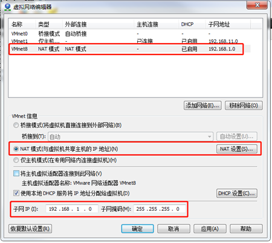
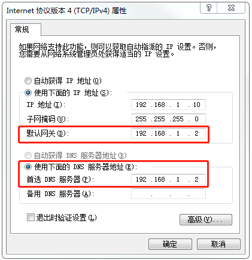
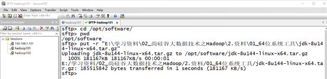
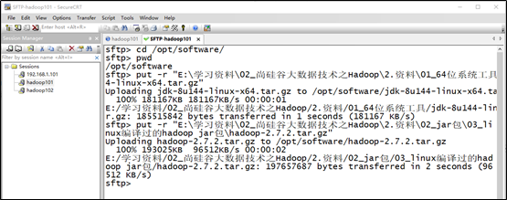
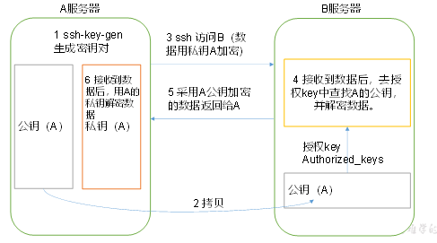
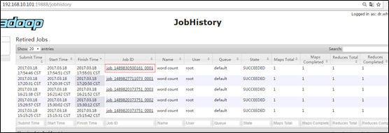
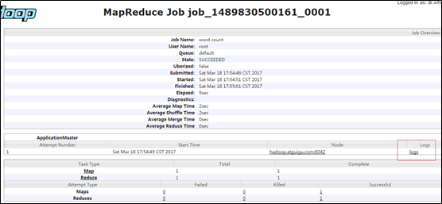
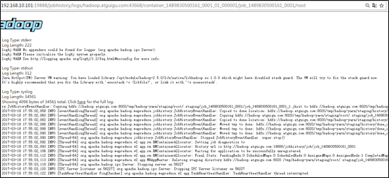

# Hadoop运行环境搭建

## 虚拟机环境准备

1. 准备三台虚拟机，虚拟机配置要求如下：

    （1）准备三台虚拟机，虚拟机配置要求如下：

    ```
    [atguigu@hadoop102 ~]# sudo yum install -y epel-release
    [atguigu@hadoop102 ~]# sudo yum install -y psmisc nc net-tools rsync vim lrzsz ntp libzstd openssl-static tree iotop git
    ```

    （2）修改克隆虚拟机的静态IP

    ```
    [atguigu@hadoop102 ~]# sudo vim /etc/sysconfig/network-scripts/ifcfg-ens33
    ```

    改成

    ```
    DEVICE=ens33
    TYPE=Ethernet
    ONBOOT=yes
    BOOTPROTO=static
    NAME="ens33"
    IPADDR=192.168.1.102
    PREFIX=24
    GATEWAY=192.168.1.2
    DNS1=192.168.1.2
    ```

    （4）查看Linux虚拟机的虚拟网络编辑器，编辑->虚拟网络编辑器->VMnet8

    

    

    （5）查看Windows系统适配器VMware Network Adapter VMnet8的IP地址



​			（6）保证Linux文件中IP地址、Linux虚拟网络编辑器地址和Windows系统VM8网络IP地址相同。

2. 修改主机名

3. 关闭防火墙

```
[atguigu@hadoop102 ~]# sudo systemctl stop firewalld
[atguigu@hadoop102 ~]# sudo systemctl disable firewalld
```

4. 创建atguigu用户

```
[atguigu@hadoop102 ~]# sudo useradd atguigu
[atguigu@hadoop102 ~]# sudo passwd atguigu
```

5. 重启虚拟机

```
[atguigu@hadoop102 ~]# reboot
```

6. 配置atguigu用户具有root权限

```
[atguigu@hadoop102 ~]# vi sudo
```

修改/etc/sudoers文件，找到下面一行（91行），在root下面添加一行，如下所示：

```
## Allow root to run any commands anywhere
root  ALL=(ALL)   ALL
atguigu  ALL=(ALL)   ALL
```

7. 在/opt目录下创建文件夹

（1）在/opt目录下创建module、software文件夹

```
[atguigu@hadoop102 opt]# sudo mkdir module
[atguigu@hadoop102 opt]# sudo mkdir software
```

​    （2）修改module、software文件夹的所有者cd 

```
[atguigu@hadoop102 opt]# sudo mkdir /opt/module /opt/software
[atguigu@hadoop102 opt]# sudo chown atguigu:atguigu /opt/module /opt/software
```

## 在102安装JDK

1. 卸载现有JDK

```
[atguigu@hadoop102 opt]# rpm -qa | grep -i java | xargs -n1 sudo rpm -e --nodeps
```

2. 用SecureCRT工具将JDK导入到opt目录下面的software文件夹下面

       

3. “alt+p”进入sftp模式

    

4. 选择jdk1.8拖入工具

    

    

5. 在Linux系统下的opt目录中查看软件包是否导入成功

```
[atguigu@hadoop102 software]# ls /opt/software/
```

看到如下结果：

```
hadoop-3.1.3.tar.gz jdk-8u212-linux-x64.tar.gz
```

6. 解压JDK到/opt/module目录下

```
[atguigu@hadoop102 software]# tar -zxvf jdk-8u212-linux-x64.tar.gz -C /opt/module/
```

7. 配置JDK环境变量

​    （1）新建/etc/profile.d/my_env.sh文件

```
[atguigu@hadoop102 module]# sudo vim /etc/profile.d/my_env.sh
```

添加如下内容

```
#JAVA_HOME
export JAVA_HOME=/opt/module/jdk1.8.0_212
export PATH=$PATH:$JAVA_HOME/bin
```

​    （2）保存后退出

```
:wq
```

​    （3）重启xshell窗口，让环境变量生效

8. 测试JDK是否安装成功

```
[atguigu@hadoop102 module]# java -version
```

如果能看到以下结果、则Java正常安装

```
java version "1.8.0_212"
```

注意：重启（如果java -version可以用就不用重启）

```
[atguigu@hadoop102 module]# sudo reboot
```


## 在102安装Hadoop

**Hadoop下载地址**：[https://archive.apache.org/dist/hadoop/common/hadoop-3.1.3/](https://archive.apache.org/dist/hadoop/common/hadoop-2.7.2/)

1. 用SecureCRT工具将hadoop-3.1.3.tar.gz导入到opt目录下面的software文件夹下面切换到sftp连接页面，选择Linux下编译的hadoop jar包拖入，如图所示

    

    

2. 进入到Hadoop安装包路径下

```
[atguigu@hadoop102 ~]$ cd /opt/software/
```

3. 解压安装文件到/opt/module下面

```
[atguigu@hadoop102 software]$ tar -zxvf hadoop-3.1.3.tar.gz -C /opt/module/
```

4. 查看是否解压成功

```
[atguigu@hadoop102 software]$ ls /opt/module/
```

5. 将Hadoop添加到环境变量

​    （1）获取Hadoop安装路径

```
[atguigu@hadoop102 hadoop-3.1.3]$ pwd
/opt/module/hadoop-3.1.3
```

​    （2）打开/etc/profile.d/my_env.sh文件

```
[atguigu@hadoop102 hadoop-3.1.3]$ sudo vim /etc/profile.d/my_env.sh
```

在profile文件末尾添加JDK路径：（shitf+g）

```
##HADOOP_HOME
export HADOOP_HOME=/opt/module/hadoop-3.1.3
export PATH=$PATH:$HADOOP_HOME/bin
export PATH=$PATH:$HADOOP_HOME/sbin
```

（3）保存后退出

```
:wq
```

​    （4）让修改后的文件生效

```
[atguigu@ hadoop102 hadoop-3.1.3]$ source /etc/profile
```

6. 测试是否安装成功

```
[atguigu@hadoop102 hadoop-3.1.3]$ hadoop version
Hadoop 3.1.3
```

7. 重启如果Hadoop命令不能用再重启

```
[atguigu@ hadoop102 hadoop-3.1.3]$ sync
[atguigu@ hadoop102 hadoop-3.1.3]$ sudo reboot
```


## 3.4 Hadoop目录结构

**1****）查看Hadoop****目录结构**

[atguigu@hadoop102 hadoop-3.1.3]$ ll

总用量 52

drwxr-xr-x. 2 atguigu atguigu 4096 5月 22 2017 **bin**

drwxr-xr-x. 3 atguigu atguigu 4096 5月 22 2017 **etc**

drwxr-xr-x. 2 atguigu atguigu 4096 5月 22 2017 include

drwxr-xr-x. 3 atguigu atguigu 4096 5月 22 2017 **lib**

drwxr-xr-x. 2 atguigu atguigu 4096 5月 22 2017 libexec

-rw-r--r--. 1 atguigu atguigu 15429 5月 22 2017 LICENSE.txt

-rw-r--r--. 1 atguigu atguigu  101 5月 22 2017 NOTICE.txt

-rw-r--r--. 1 atguigu atguigu 1366 5月 22 2017 README.txt

drwxr-xr-x. 2 atguigu atguigu 4096 5月 22 2017 **sbin**

drwxr-xr-x. 4 atguigu atguigu 4096 5月 22 2017 **share**

**2****）重要目录**

（1）bin目录：存放对Hadoop相关服务（HDFS,YARN）进行操作的脚本

（2）etc目录：Hadoop的配置文件目录，存放Hadoop的配置文件

（3）lib目录：存放Hadoop的本地库（对数据进行压缩解压缩功能）

（4）sbin目录：存放启动或停止Hadoop相关服务的脚本

（5）share目录：存放Hadoop的依赖jar包、文档、和官方案例

## 集群搭建（开发重点）

分析：

​    1）准备3台客户机（关闭防火墙、静态ip、主机名称）

​    2）安装JDK

​    3）配置环境变量

​    4）安装Hadoop

​    5）配置环境变量

​	6）配置集群

​	7）单点启动

​	8）配置ssh

​	9）群起并测试集群

### 编写集群分发脚本xsync

1. scp（secure copy）安全拷贝

    （1）scp定义：

    scp可以实现服务器与服务器之间的数据拷贝。（from server1 to server

    （2）基本语法

    scp   -r     $pdir/$fname        $user@hadoop$host:$pdir/$fname

    命令  递归    要拷贝的文件路径/名称  目的用户@主机:目的路径/名称

    （3）案例实操

    （a）在hadoop102上，将hadoop102中/opt/module目录下的软件拷贝到hadoop103上。

```
[atguigu@hadoop102 ~]$ scp -r /opt/module/* atguigu@hadoop103:/opt/module
```

​		（b）在hadoop104上，将hadoop102服务器上的/opt/module目录下的软件拷贝到hadoop104上。

```
[atguigu@hadoop104 opt]$ scp -r atguigu@hadoop102:/opt/module/* atguigu@hadoop104:/opt/module
```

注意：拷贝过来的/opt/module目录，别忘了在hadoop102、hadoop103、hadoop104上修改所有文件的，所有者和所有者组。sudo chown atguigu:atguigu -R /opt/module

2. rsync远程同步工具

    rsync主要用于备份和镜像。具有速度快、避免复制相同内容和支持符号链接的优点。

    rsync和scp区别：用rsync做文件的复制要比scp的速度快，rsync只对差异文件做更新。scp是把所有文件都复制过去。

​    （1）基本语法

```
rsync   -av    $pdir/$fname       $user@hadoop$host:$pdir/$fname
```

命令  选项参数  要拷贝的文件路径/名称  目的用户@主机:目的路径/名称

​     选项参数说明

| 选项 | 功能         |
| ---- | ------------ |
| -a   | 归档拷贝     |
| -v   | 显示复制过程 |

（2）案例实操

（a）将hadoop102中/etc/profile.d/my_env.sh文件拷贝到hadoop103的/etc/profile.d/my_env.sh上。

```
[atguigu@hadoop102 ~]$ sudo rsync -av /etc/profile.d/my_env.sh root@hadoop103:/etc/profile.d/my_env.sh
```

（b）将hadoop102中/etc/profile文件拷贝到hadoop104的/etc/profile上。

```
[atguigu@hadoop102 ~]$ sudo rsync -av /etc/profile.d/my_env.sh root@hadoop104:/etc/profile.d/my_env.sh
```

注意：拷贝过来的配置文件别忘了source一下/etc/profile，。

3. xsync集群分发脚本

（1）需求：循环复制文件到所有节点的相同目录下

（2）需求分析：

​	（a）rsync命令原始拷贝：

```
rsync -av   /opt/module     root@hadoop103:/opt/
```

​	（b）期望脚本：

xsync要同步的文件名称

​	（c）说明：在/home/atguigu/bin这个目录下存放的脚本，atguigu用户可以在系统任何地方直接执行。

（3）脚本实现

​	（a）在用的家目录/home/atguigu下创建bin文件夹

```
[atguigu@hadoop102 ~]$ mkdir bin
```

​	（b）在/home/atguigu/bin目录下创建xsync文件，以便全局调用

```
[atguigu@hadoop102 ~]$ cd /home/atguigu/bin
[atguigu@hadoop102 ~]$ vim xsync
```

在该文件中编写如下代码

```shell
#!/bin/bash

#1. 判断参数个数
if [ $# -lt 1 ]
then
    echo Not Enough Arguement!
    exit;
fi

#2. 遍历集群所有机器
for host in hadoop102 hadoop103 hadoop104
do
echo ==================== $host ====================

#3. 遍历所有目录，挨个发送
for file in $@
do
    #4 判断文件是否存在
    if [ -e $file ]
    then
        #5. 获取父目录
        pdir=$(cd -P $(dirname $file); pwd)
        #6. 获取当前文件的名称
        fname=$(basename $file)
        ssh $host "mkdir -p $pdir"
        rsync -av $pdir/$fname $host:$pdir
     else
        echo $file does not exists!
        fi
    done
done
```

​	（c）修改脚本 xsync 具有执行权限

```
[atguigu@hadoop102 bin]$ chmod +x xsync
```

​    （d）测试脚本

```
[atguigu@hadoop102 bin]$ xsync xsync
```


### SSH无密登录配置

1. 配置ssh

（1）基本语法

ssh另一台电脑的ip地址

（2）ssh连接时出现Host key verification failed的解决方法

```
[atguigu@hadoop102 ~]$ ssh hadoop103
```

出现：

```
The authenticity of host '192.168.1.103 (192.168.1.103)' can't be established.
RSA key fingerprint is cf:1e:de:d7:d0:4c:2d:98:60:b4:fd:ae:b1:2d:ad:06.
Are you sure you want to continue connecting (yes/no)? 
```

（3）解决方案如下：直接输入yes

2. 无密钥配置

（1）免密登录原理

   

（2）生成公钥和私钥：

```
[atguigu@hadoop102 .ssh]$ ssh-keygen -t rsa
```

然后敲（三个回车），就会生成两个文件id_rsa（私钥）、id_rsa.pub（公钥）

（3）将公钥拷贝到要免密登录的目标机器上

```
[atguigu@hadoop102 .ssh]$ ssh-copy-id hadoop102
[atguigu@hadoop102 .ssh]$ ssh-copy-id hadoop103
[atguigu@hadoop102 .ssh]$ ssh-copy-id hadoop104
```

注意：

**还需要在hadoop102上采用root账号，配置一下无密登录到hadoop102、hadoop103、hadoop104；**

**还需要在hadoop103上采用atguigu账号配置一下无密登录到hadoop102、hadoop103、hadoop104服务器上。**

3. .ssh文件夹下（~/.ssh）的文件功能解释

| known_hosts     | 记录ssh访问过计算机的公钥(public  key) |
| --------------- | -------------------------------------- |
| id_rsa          | 生成的私钥                             |
| id_rsa.pub      | 生成的公钥                             |
| authorized_keys | 存放授权过的无密登录服务器公钥         |

### 4.2.4 集群配置

1. 集群部署规划

​     注意：NameNode和SecondaryNameNode不要安装在同一台服务器

​     注意：ResourceManager也很消耗内存，不要和NameNode、SecondaryNameNode配置在同一台机器上。

|      | hadoop102          | hadoop103                    | hadoop104                   |
| ---- | ------------------ | ---------------------------- | --------------------------- |
| HDFS | NameNode  DataNode | DataNode                     | SecondaryNameNode  DataNode |
| YARN | NodeManager        | ResourceManager  NodeManager | NodeManager                 |

2. 配置集群

（1）核心配置文件

配置core-site.xml

```
[atguigu@hadoop102 .ssh]$ cd /opt/module/hadoop-3.1.3/etc/hadoop/
[atguigu@hadoop102 hadoop]$ vim core-site.xml
```

文件内容如下：

```xml
<configuration>
    <property>
        <name>fs.defaultFS</name>
        <value>hdfs://hadoop102:8020</value>
    </property>
    <property>
        <name>hadoop.tmp.dir</name>
        <value>/opt/module/hadoop-3.1.3/data</value>
    </property>
    <property>
        <name>hadoop.proxyuser.atguigu.hosts</name>
        <value>*</value>
    </property>
    <property>
        <name>hadoop.proxyuser.atguigu.groups</name>
        <value>*</value>
    </property>
    <property>
        <name>hadoop.http.staticuser.user</name>
        <value>atguigu</value>
    </property>
</configuration>
```

（2）HDFS配置文件

配置hdfs-site.xml

[atguigu@hadoop102 hadoop]$ vim hdfs-site.xml

文件内容如下：

```xml
<configuration>
    <property>
        <name>dfs.namenode.secondary.http-address</name>
        <value>hadoop104:9868</value>
    </property>
<!-- 指定HDFS副本的数量 -->
<property>
	<name>dfs.replication</name>
	<value>1</value>
</property>
</configuration>
```

（3）YARN配置文件

配置yarn-site.xml

[atguigu@hadoop102 hadoop]$ vim yarn-site.xml

文件内容如下：

```xml
<configuration>
    <property>
        <name>yarn.nodemanager.aux-services</name>
        <value>mapreduce_shuffle</value>
    </property>
    <property>
        <name>yarn.resourcemanager.hostname</name>
        <value>hadoop103</value>
    </property>
    <property>
        <name>yarn.nodemanager.env-whitelist</name>
        <value>JAVA_HOME,HADOOP_COMMON_HOME,HADOOP_HDFS_HOME,HADOOP_CONF_DIR,CLASSPATH_PREPEND_DISTCACHE,HADOOP_YARN_HOME,HADOOP_MAPRED_HOME</value>
    </property>
    <property>
        <name>yarn.scheduler.minimum-allocation-mb</name>
        <value>512</value>
    </property>
    <property>
        <name>yarn.scheduler.maximum-allocation-mb</name>
        <value>4096</value>
    </property>
    <property>
        <name>yarn.nodemanager.resource.memory-mb</name>
        <value>4096</value>
    </property>
    <property>
        <name>yarn.nodemanager.pmem-check-enabled</name>
        <value>false</value>
    </property>
    <property>
        <name>yarn.nodemanager.vmem-check-enabled</name>
        <value>false</value>
    </property>
</configuration>
```

3. 在集群上分发配置好的Hadoop配置文件

```
[atguigu@hadoop102 hadoop]$ xsync /opt/module/hadoop-3.1.3/etc/hadoop/
```

4. 查看文件分发情况

```
[atguigu@hadoop103 hadoop]$cat /opt/module/hadoop-3.1.3/etc/hadoop/core-site.xml
```


### 群起集群

1. 配置workers

```
[atguigu@hadoop102 hadoop]$ vim /opt/module/hadoop-3.1.3/etc/hadoop/workers
```

在该文件中增加如下内容：

```
hadoop102
hadoop103
hadoop104
```

注意：该文件中添加的内容结尾不允许有空格，文件中不允许有空行。

同步所有节点配置文件

```
[atguigu@hadoop102 hadoop]$ xsync /opt/module/hadoop-3.1.3/etc
```

2. 启动集群

​    （1）**如果集群是第一次启动**，需要在hadoop102节点格式化NameNode（注意格式化之前，一定要先停止上次启动的所有namenode和datanode进程，然后再删除data和log数据）

```
[atguigu@hadoop102 hadoop-3.1.3]$ bin/hdfs namenode -format
```

（2）启动HDFS

```
[atguigu@hadoop102 hadoop-3.1.3]$ sbin/start-dfs.sh
```

（3）在配置了ResourceManager的节点（hadoop103）启动YARN

```
[atguigu@hadoop103 hadoop-3.1.3]$ sbin/start-yarn.sh
```

（4）Web端查看HDFS的Web页面：http://hadoop102:9870/

（5）Web端查看SecondaryNameNode

（a）浏览器中输入：http://hadoop104:9868/status.html

​        （b）查看SecondaryNameNode信息

3. 集群基本测试

（1）上传文件到集群

​    上传小文件

```
[atguigu@hadoop102 hadoop-3.1.3]$ hadoop fs -mkdir -p /user/atguigu/input
[atguigu@hadoop102 hadoop-3.1.3]$ hadoop fs -put /opt/module/hadoop-3.1.3/wcinput/wc.input /user/atguigu/input
```

​    上传大文件

```
[atguigu@hadoop102 hadoop-3.1.3]$ hadoop fs -put  /opt/software/hadoop-3.1.3.tar.gz  /
```

（2）上传文件后查看文件存放在什么位置

（a）查看HDFS文件存储路径

```
[atguigu@hadoop102 subdir0]$ pwd

/opt/module/hadoop-3.1.3/data/tmp/dfs/data/current/BP-938951106-192.168.10.107-1495462844069/current/finalized/subdir0/subdir0
```

（b）查看HDFS在磁盘存储文件内容

```
[atguigu@hadoop102 subdir0]$ cat blk_1073741825
```

```
hadoop yarn
hadoop mapreduce 
atguigu
atguigu
```

（3）拼接

-rw-rw-r--. 1 atguigu atguigu 134217728 5月 23 16:01 **blk_1073741836**

-rw-rw-r--. 1 atguigu atguigu  1048583 5月 23 16:01 blk_1073741836_1012.meta

-rw-rw-r--. 1 atguigu atguigu 63439959 5月  23 16:01 **blk_1073741837**

-rw-rw-r--. 1 atguigu atguigu  495635 5月 23 16:01 blk_1073741837_1013.meta

```
[atguigu@hadoop102 subdir0]$ cat blk_1073741836>>tmp.jar
[atguigu@hadoop102 subdir0]$ cat blk_1073741837>>tmp.jar
[atguigu@hadoop102 subdir0]$ tar -zxvf tmp.jar
```

（4）下载

```
[atguigu@hadoop102 hadoop-3.1.3]$ bin/hadoop fs -get /hadoop-3.1.3.tar.gz ./
```

（5）执行wordcount程序

```
[atguigu@hadoop102 hadoop-3.1.3]$ hadoop jar share/hadoop/mapreduce/hadoop-mapreduce-examples-3.1.3.jar wordcount /user/atguigu/input /user/atguigu/output
```


### 集群启动/停止方式总结

1. 各个服务组件逐一启动停止

​    （1）分别启动/停止HDFS组件

```
hdfs --daemon start/stop namenode/datanode/secondarynamenode
```

​    （2）启动/停止YARN

```
yarn --daemon start/stop resourcemanager/nodemanager
```

2. 各个模块分开启动停止（配置ssh是前提）常用

​    （1）整体启动/停止HDFS

```
start-dfs.sh/stop-dfs.sh
```

​    （2）整体启动/停止YARN

```
start-yarn.sh/stop-yarn.sh
```


### 配置历史服务器

为了查看程序的历史运行情况，需要配置一下历史服务器。具体配置步骤如下：

1. 配置mapred-site.xml

```
[atguigu@hadoop102 hadoop]$vi mapred-site.xml
```

在该文件里面增加如下配置。

```xml
<!-- 历史服务器端地址 -->
<property>
    <name>mapreduce.jobhistory.address</name>
    <value>hadoop102:10020</value>
</property>

<!-- 历史服务器web端地址 -->
<property>
    <name>mapreduce.jobhistory.webapp.address</name>
    <value>hadoop102:19888</value>
</property>
```

2. 分发配置

[atguigu@hadoop102 hadoop]$ xsync $HADOOP_HOME/etc/hadoop/mapred-site.xml


**3****）在hadoop102****启动历史服务器**

[atguigu@hadoop102 hadoop-3.1.3]$ mapred --daemon start historyserver

**4****）查看历史服务器是否启动**

[atguigu@hadoop102 hadoop-3.1.3]$ jps

**5****）查看JobHistory**

http://hadoop102:19888/jobhistory


### 4.2.8 配置日志的聚集

日志聚集概念：应用运行完成以后，将程序运行日志信息上传到HDFS系统上。

日志聚集功能好处：可以方便的查看到程序运行详情，方便开发调试。

**注意：开启日志聚集功能，需要重新启动NodeManager 、ResourceManager和HistoryManager。**

开启日志聚集功能具体步骤如下：

1. 配置yarn-site.xml

```
[atguigu@hadoop102 hadoop]$ vim yarn-site.xml
```

在该文件里面增加如下配置。

```xml
<property>
    <name>yarn.log-aggregation-enable</name>
    <value>true</value>
</property>
<property>  
    <name>yarn.log.server.url</name>  
    <value>http://${yarn.timeline-service.webapp.address}/applicationhistory/logs</value>
</property>
<property>
    <name>yarn.log-aggregation.retain-seconds</name>
    <value>604800</value>
</property>
<property>
    <name>yarn.timeline-service.enabled</name>
    <value>true</value>
</property>
<property>
    <name>yarn.timeline-service.hostname</name>
    <value>${yarn.resourcemanager.hostname}</value>
</property>
<property>
    <name>yarn.timeline-service.http-cross-origin.enabled</name>
    <value>true</value>
</property>
<property>
    <name>yarn.resourcemanager.system-metrics-publisher.enabled</name>
    <value>true</value>
</property>
```

2. 分发配置

```
[atguigu@hadoop102 hadoop]$ xsync $HADOOP_HOME/etc/hadoop/yarn-site.xml
```

3. 关闭NodeManager 、ResourceManager和HistoryServer

```
在103上执行： stop-yarn.sh
```

```
在102上执行： mapred --daemon stop historyserver
```

4. 启动NodeManager、ResourceManage、Timelineserver和HistoryServer

```
在103上执行：start-yarn.sh
在103上执行：yarn --daemon start timelineserver
在102上执行：mapred --daemon start historyserver
```

5. 删除HDFS上已经存在的输出文件

```
[atguigu@hadoop102 hadoop-3.1.3]$ hdfs dfs -rm -R /user/atguigu/output
```

6. 执行WordCount程序

```
[atguigu@hadoop102 hadoop-3.1.3]$ hadoop jar $HADOOP_HOME/share/hadoop/mapreduce/hadoop-mapreduce-examples-3.1.3.jar wordcount /user/atguigu/input /user/atguigu/output
```

7. 查看日志

http://hadoop102:19888/jobhistory

​     

图 Job History

​     

图 job运行情况

​     

图 查看日志

### 4.2.9 集群时间同步

时间同步的方式：找一个机器，作为时间服务器，所有的机器与这台集群时间进行定时的同步，比如，每隔十分钟，同步一次时间。

 

**配置时间同步具体实操：**

1. 时间服务器配置（必须**root**用户）

（1）在所有节点关闭ntp服务和自启动

```
sudo systemctl stop ntpd
sudo systemctl disable ntpd
```

（2）修改ntp配置文件

```
vim /etc/ntp.conf
```

修改内容如下

a）修改1（授权192.168.1.0-192.168.1.255网段上的所有机器可以从这台机器上查询和同步时间）

```
#restrict 192.168.1.0 mask 255.255.255.0 nomodify notrap
```

为restrict 192.168.1.0 mask 255.255.255.0 nomodify notrap

​    b）修改2（集群在局域网中，不使用其他互联网上的时间）

```
server 0.centos.pool.ntp.org iburst
server 1.centos.pool.ntp.org iburst
server 2.centos.pool.ntp.org iburst
server 3.centos.pool.ntp.org iburst
```

为

```
#server 0.centos.pool.ntp.org iburst
#server 1.centos.pool.ntp.org iburst
#server 2.centos.pool.ntp.org iburst
#server 3.centos.pool.ntp.org iburst
```

c）添加3（当该节点丢失网络连接，依然可以采用本地时间作为时间服务器为集群中的其他节点提供时间同步）

```
server 127.127.1.0
fudge 127.127.1.0 stratum 10
```

（3）修改/etc/sysconfig/ntpd 文件

```
vim /etc/sysconfig/ntpd
```

增加内容如下（让硬件时间与系统时间一起同步）

```
SYNC_HWCLOCK=yes
```

（4）重新启动ntpd服务

```
systemctl start ntpd
```

（5）设置ntpd服务开机启动

```
systemctl enable ntpd
```

2. 其他机器配置（必须**root**用户）

（1）在其他机器配置10分钟与时间服务器同步一次

```
crontab -e
```

编写定时任务如下：

```
*/10 * * * * /usr/sbin/ntpdate hadoop102
```

（2）修改任意机器时间

```
date -s "2017-9-11 11:11:11"
```

（3）十分钟后查看机器是否与时间服务器同步

```
date
```

说明：测试的时候可以将10分钟调整为1分钟，节省时