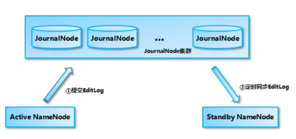
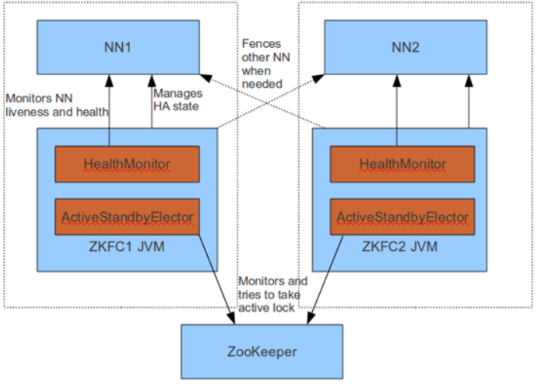
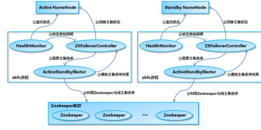

# HA如何控制脑裂

简单说说什么是脑裂和Hadoop集群是如何解决脑裂的状况的。

脑裂，用通俗的话语来描述：有两个大脑同时对我们的身体发送指令。在hadoop集群中就是有两个NameNode同时为集群服务。

Hadoop集群解决脑裂的方式是通过隔离（Fencing），主要通过QJM，ZKFC，Zookeeper来实现隔离。

## QJM

**作用**

​		QJM(Quorum JournalNode Manager)是一个共享存储系统，NameNode通过共享存储系统实现日志数据同步。

​		JournalNode是一个独立的小集群，它的实现原理和Zookeeper的一致( Paxos)。

**工作原理**

​		ANN产生日志文件的时候，就会同时发送到 JournalNode的集群中每个节点上，JournalNode不要求所有的jn节点都接收到日志，只要有半数以上的（n/2+1）节点接受收到日志，那么本条日志就生效。

​		SNN每间隔一段时间就去QJM上面取回最新的日志，所以SNN上的日志有可能不是最新的。

​		HA集群的状态正确至关重要，一次只能有一个NameNode处于活动状态。

​		JournalNode只允许单个NameNode成为作者。在故障转移期间，将变为活动状态的NameNode将承担写入JournalNodes的角色，这将有效地防止另一个NameNode继续处于活动状态，从而使新的Active节点可以安全地进行故障转移。

## ZKFC

ZKFC：Failover Controller（故障转移控制器）

**作用**

- 能够对NameNode的主备切换进行总体控制，能够及时检测到NameNode的健康状态。
- 在主 NameNode 故障时借助 Zookeeper 实现自动的主备选举和切换。

为了防止因为NN的GC失败导致心跳受影响，ZKFC作为一个deamon进程（守护线程）从NN分离出来。

**工作过程：**

**启动时：**

- 当集群启动时，主备节点的概念是很模糊的，当ZKFC只检查到一个节点是健康状态，直接将其设置为主节点。
- 当zkfc检查到两个NN节点是的健康状态，发起投票机制，选出一个主节点，一个备用节点，并修改主备节点的状态。

**运行时：**

- 由 ZKFailoverController、HealthMonitor 和 ActiveStandbyElector 这 3 个组件来协同实现主备切换。

- ZKFailoverController启动的时候会创建*HealthMonitor*和 *ActiveStandbyElector* 这两个主要的内部组件。其中HealthMonitor 主要负责检测 NameNode 的健康状态，ActiveStandbyElector 主要负责完成自动的主备选举，内部封装了 Zookeeper 的处理逻辑。

    

**主备节点的切换**

- NameNode 在选举成功后，ActiveStandbyElector会在 zk 上创建一个ActiveStandbyElectorLock 临时节点和一个ActiveBreadCrumb 的持久节点，而没有选举成功的备NameNode 中的 ActiveStandbyElector会监控这个节点。
- 如果 Active NameNode 对应的 HealthMonitor 检测到 NameNode 的状态异常时， ZKFailoverController 会主动删除当前在 Zookeeper 上建立的临时节点ActiveStandbyElectorLock。
- 如果是 Active 状态的 NameNode 所在的机器整个宕掉的话，那么跟zookeeper连接的客户端线程也挂了,会话结束,那么根据 Zookeepe的临时节点特性，ActiveStandbyElectorLock 节点会自动被删除，从而也会自动进行一次主备切换。
- 处于 Standby 状态的 NameNode 的 ActiveStandbyElector 注册的监听器就会收到这个节点的 NodeDeleted 事件，并创建 ActiveStandbyElectorLock 临时节点，本来处于 Standby 状态的 NameNode 就选举为Active NameNode 并随后开始切换为 Active 状态。

## Zookeeper

- 为主备切换控制器提供主备选举支持。
- 辅助投票
- 和ZKFC保持心跳机制，确定ZKFC的存活

## 脑裂

**概念**

Hadoop2.X后，在集群运行过程中，可能*出现两个NameNode同时服务于整个集群*的情况，被称为脑裂。

**原因**

脑裂常出现出*主从NameNode*的切换时，由于ANN的网络延迟，设备故障等问题，SNN认为ANN成为失效状态，SNN会转换为ANN，此时集群中就会出现两个活跃的NameNode。因此可能出现的因素有网络延迟，心跳故障，设备故障。

**脑裂场景**

- NameNode在垃圾回收（GC）时，整个NameNode节点服务器可能长时间无响应，zkfc客服端也就无法向zk写入心跳信息。这时zk服务器中的NameNode的临时节点就会掉线，zk服务器认为ANN服务器无法使用，备用节点StandbyNameNode会切换到Active状态，这种情况就导致整个Hadoop集群会同时有两个ANN。

**解决方案隔离（Fencing）**

- 1.第三方共享存储：任一时刻，只有一个 NN 可以写入； 
- 2.DataNode：需要保证只有一个 NN 发出与管理数据副本有关的命令； 
- 3.Client需要保证同一时刻只有一个 NN 能够对 Client 的请求发出正确的响应。
    - (a) *每个NN改变状态的时候，向DN发送自己的状态和一个序列号*。 
    - (b) DN在运行过程中维护此序列号，当failover时，新的NN在返回DN心跳时会返回自己的active状态和一个更大的序列号。DN接收到这个返回是认为该NN为新的active。
    - (c) 如果这时原来的active（比如GC）恢复，返回给DN的心跳信息包含active状态和原来的序列号，这时DN就会拒绝这个NN的命令。

- ActiveStandbyElector为了实现 fencing，当NN成为ANN之后*创建一个Zookeeper临时节点ActiveStandbyElectorLock*，和一个*ActiveBreadCrumb 的持久节点*，这个临时节点里面保存了这个 Active NameNode的*地址信息(node-01)*。
- Active NameNode的 ActiveStandbyElector在正常的状态下关闭 Zookeeper Session 的时候，会一起删除这两个节点。
- 但如果 ActiveStandbyElector在*异常的状态下关闭*，那么由于 /hadoop-ha/${dfs.nameservices}/ActiveBreadCrumb 是*持久节点*，会一直*保留*下来，后面当另一个 NameNode 选主成功之后，会注意到上一个 Active NameNode 遗留下来的这个节点，从而会回调 ZKFailoverController的方法对旧的 Active NameNode *进行 fencing*。
    - 首先尝试调用这个旧 Active NameNode 的 HAServiceProtocol RPC 接口的 transitionToStandby 方法，看能不能把它转换为 Standby 状态；
    - 如果 transitionToStandby 方法调用失败，那么就执行 Hadoop 配置文件之中预定义的隔离措施。
        - 1)	sshfence：通过 SSH 登录到目标机器上，执行命令 fuser 将对应的进程杀死
        - 2)	shellfence：执行一个用户自定义的 shell 脚本来将对应的进程隔离
- 在成功地执行完成 fencing 之后，选主成功的 ActiveStandbyElector 才会回调 ZKFailoverController 的 becomeActive 方法将对应的 NameNode 转换为 Active 状态，开始对外提供服务。