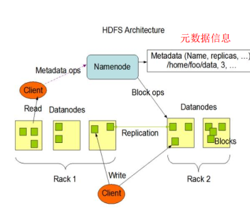
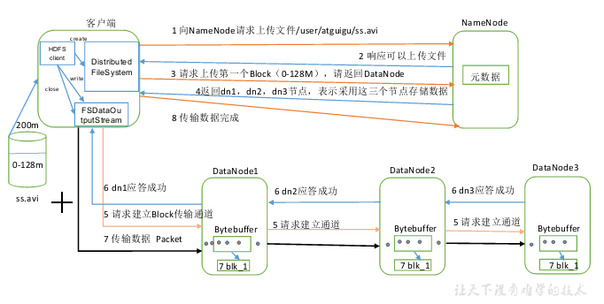
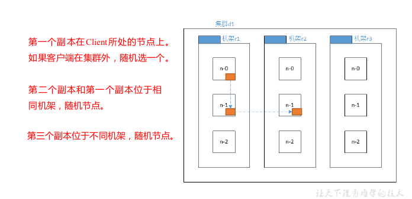
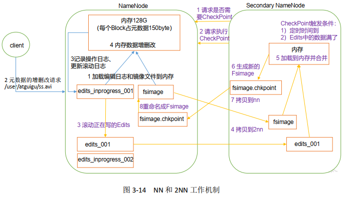

# 大数据技术之Hadoop（HDFS）

# 1.HDFS的概述

## HDFS的背景和定义

### HDFS产生的背景

​		随着数据量的越来越大，在一个操作系统存不下所有的数据，那么分配到更多的操作系统管理的磁盘中，但是不方便管理和维护。迫切需要一种系统来管理多台机器上的文件，这就是分布式管理系统。HDFS只是分布式文件管理系统中的一种。

### HDFS定义

​		HDFS（Hadoop Distributed File System），它是一个文件系统，用于存储文件，通过目树来定位文件；其次，它是分布式的，由很多服务器联合起来实现其功能，集群中的服务器有各自的角色。
​		HDFS的使用场景：适合一次写入，多次读出的场景，且不支持文件的修改。适合用来做数据分析，并不适合用来做网盘应用。

## HDFS的优缺点

### 优点

- 高容错性：数据会自动保存多个副本（3），能过提高容错性。当一个副本丢失后，它能够自动恢复。
- 适合处理大数据：
- 可构建在廉价的机器上。

### 缺点

- 不适合低延迟数据访问，如：毫秒级的存储数据
- 无法高效地对大量小文件进行存储。因为大量的小文件会占用NameNode大量的内存来存储文件目录和信息，但`Namenode的内存是有限的`。小文件的寻址时间大于存储时间。违反了HDFS的设计目标。（所有的文件系统都有这个问题）
- 不支持并发写入和文件随机修改。仅支持数据追加。

## HDFS组成架构



1. NameNode，是文件系统的管理者。
   - 管理HDFS的名称空间。
   - 配置副本策略
   - 管理数据块映射信息
   - 处理客户端的读写请求
2. DateNode就是Slave。NameNode下达命令，DataNode执行操作指令。
   - 存储实际的数据库块
   - 执行数据块的读写操作
3. Client：就是客户端。
   - 文件切分。文件上传HDFS的时候，Client将文件切分成一个一个的Block，然后进行上传；
   - 与NameNode交互，获取文件的位置信息；
   - 与DataNode交互，读取或者写入数据；
   - Client提供一些命令来管理HDFS，比如NameNode格式化；
   - Client可以通过一些命令来访问HDFS，比如对HDFS增删查改操作；
4. Secondary NameNode：并非NameNode的热备。当NameNode挂掉的时候，它并不
   能马上替换NameNode并提供服务。
   - 辅助NameNode，分担其工作量，比如定期合并Fsimage和Edits，并推送给NameNode ；
   - 在紧急情况下，可辅助恢复NameNode。

## HDFS 文件块大小（面试重点）

​		HDFS 中的文件在物理上是分块存储（Block ），块的大小可以通过配置参数( dfs.blocksize)来规定，默认大小在Hadoop2.x版本中是128M，老版本中是64M。

<font color="red">思考：为什么块的大小不能设置太小，也不能设置太大？</font>

（1）HDFS的块设置太小，会增加寻址时间，程序一直在找块的开始位置；
（2）如果块设置的太大，从磁盘传输数据的时间会明显大于定位这个块开始位置所需的时间。导致程序在处理这块数据时，会非常慢。

<font color="red">总结：HDFS块的大小设置主要取决于磁盘传输速率。</font>

# HDFS的Shell操作（**）

基本语法

`bin/hadoop fs` 具体命令OR `bin/hdfs dfs `具体命令

dfs 是fs 的实现类。

常用命令：

本地---->HDFS

- put

- copyfromLocal
- movefromLocal
- appendToFile

HDFS--->HDFS

- cp
- mv
- mkdir
- chown
- chgrp
- chmod
- du
- df
- cat
- rm

HDFS-->本地

- get
- getmerge
- copyToLocal

# HDFS的客户端操作(**)

## HDFS客户端环境准备

1. 将编译后的hadoop.jar包（3.0）拷贝到非中文路径下

2. 配置HADOOP_HOME环境变量

3. 配置Path环境变量（cmd下输入winutils），后重启机器

4. 创建一个Maven工程

5. 导入依赖坐标，和日志添加

   ```xml
   <dependencies>
       <dependency>
           <groupId>junit</groupId>
           <artifactId>junit</artifactId>
           <version>4.12</version>
       </dependency>
       <dependency>
           <groupId>org.apache.logging.log4j</groupId>
           <artifactId>log4j-slf4j-impl</artifactId>
           <version>2.12.0</version>
       </dependency>
       <dependency>
           <groupId>org.apache.hadoop</groupId>
           <artifactId>hadoop-client</artifactId>
           <version>3.1.3</version>
       </dependency>
   </dependencies>
   
   ```

   log4j.propersities

   ```xml
   <?xml version="1.0" encoding="UTF-8"?>
   <Configuration status="error" strict="true" name="XMLConfig">
       <Appenders>
           <!-- 类型名为Console，名称为必须属性 -->
           <Appender type="Console" name="STDOUT">
               <!-- 布局为PatternLayout的方式，
               输出样式为[INFO] [2018-01-22 17:34:01][org.test.Console]I'm here -->
               <Layout type="PatternLayout"
                       pattern="[%p] [%d{yyyy-MM-dd HH:mm:ss}][%c{10}]%m%n" />
           </Appender>
   
       </Appenders>
   
       <Loggers>
           <!-- 可加性为false -->
           <Logger name="test" level="info" additivity="false">
               <AppenderRef ref="STDOUT" />
           </Logger>
   
           <!-- root loggerConfig设置 -->
           <Root level="info">
               <AppenderRef ref="STDOUT" />
           </Root>
       </Loggers>
   </Configuration>
   
   ```

6. 创建HdfsClient 类

   ```java
   public class HdfsClient{
   @Test
   public void testMkdirs() throws IOException,InterruptedException,URISyntaxException{
       // 1 获取文件系统
       Configuration configuration = new Configuration();
       // 配置在集群上运行
       // configuration.set("fs.defaultFS",
       "hdfs://hadoop102:8020");
       // FileSystem fs = FileSystem.get(configuration);
       FileSystem fs = FileSystem.get(new URI("hdfs://hadoop102:8020"), 	 configuration, "atguigu");
       // 2 创建目录
       fs.mkdirs(new Path("/1108/daxian/banzhang"));
       // 3 关闭资源
       fs.close();
   	}
   }
   ```

## HDFS的API操作

### HDFS文件上传并测试参数优先级

1. 代码编写

   ```java
   //需求：把本地e 盘上的banhua.txt 文件上传到HDFS 根目录
   @Test
       public void putFileToHDFS() throws URISyntaxException, IOException, InterruptedException {
           //1 获取文件系统
           Configuration conf = new Configuration();
           //设置副本数，此处为最高优先级
           conf.set("dfs.replication","2");
           FileSystem fs = FileSystem.get(new URI("hdfs://hadoop102:8020"), conf, "atguigu");
           //2 创建输入流
           FileInputStream fis = new FileInputStream(new File("e:/banhau.txt"));
           //3 获取输出流
           FSDataOutputStream fos = fs.create(new Path("/banhua.txt"));
           //4 流对拷
           IOUtils.copyBytes(fis, fos, conf);
           //5 关闭资源
           IOUtils.closeStream(fos);
           IOUtils.closeStream(fis);
           fs.close();
       }
   ```

2. 将hdfs-site.xml 拷贝到项目的根目录下

   ```xml
   <?xml version="1.0" encoding="UTF-8"?>
   <?xml-stylesheet type="text/xsl" href="configuration.xsl"?>
   <configuration>
       <property>
       <name>dfs.replication</name>
       <value>1</value>
       </property>
   </configuration>
   ```

3. 参数优先级
   参数优先级排序：（1）客户端代码中设置的值  >（2）ClassPath 下的用户自定义配置文件  >（3）然后是服务器的默认配置

### HDFS的文件下载

代码如下：

```java
//下载文件
    @Test
    public void testCopyToLocalFile() throws URISyntaxException, IOException, InterruptedException {
        //1、获取文件系统
        Configuration conf = new Configuration();
        FileSystem fileSystem = FileSystem.get(new URI("hdfs://hadoop102:8020"), conf, "atguigu");
        //2、下载文件
        // boolean delSrc 指是否将原文件删除
        // Path src 指要下载的文件路径
        // Path dst 指将文件下载到的路径
        // boolean useRawLocalFileSystem 是否开启文件校验
        fileSystem.copyToLocalFile(false, new Path("/banzhang.txt"), new Path("e:/banhau.txt"), true);
        //3、关闭资源
        fileSystem.close();
    }
```

### HDFS的文件删除

代码如下：

```java
//文件夹删除
    @Test
    public void testDelFile() throws URISyntaxException, IOException, InterruptedException {
        //1、获取文件系统
        Configuration conf = new Configuration();
        FileSystem fileSystem = FileSystem.get(new URI("hdfs://hadoop102:8020"), conf, "atguigu");
        //2、删除文件,true表示递归删除
        fileSystem.delete(new Path("/0529"), true);
        //3、关闭资源
        fileSystem.close();
    }
```

### HDFS文件名更改

代码如下：

```java
//文件夹更名
    @Test
    public void testReName() throws URISyntaxException, IOException, InterruptedException {
        //1、获取文件系统
        Configuration conf = new Configuration();
        FileSystem fileSystem = FileSystem.get(new URI("hdfs://hadoop102:8020"), conf, "atguigu");
        //2、文件更名
        fileSystem.rename(new Path("/banzhang.txt"), new Path("/xiaohua.txt"));
        //3、关闭资源
        fileSystem.close();
    }
```

### HDFS文件详情查看

查看文件路径、名称、权限、长度、块信息。

方法：`listFile(final Path f, final boolean recursive)`

代码如下：

```java
    //文件夹详情查看
    @Test
    public void testListFiles() throws URISyntaxException, IOException, InterruptedException {
        //1、获取文件系统
        Configuration conf = new Configuration();
        FileSystem fileSystem = FileSystem.get(new URI("hdfs://hadoop102:8020"), conf, "atguigu");
        //2、详情查看,listFiles,返回一个迭代器
        RemoteIterator<LocatedFileStatus> listFiles = fileSystem.listFiles(new Path("/"), true);
        while (listFiles.hasNext()) {
            LocatedFileStatus status = listFiles.next();

            System.out.println("文件路径 = " + status.getPath());
            System.out.println("文件名 = " + status.getPath().getName());
            System.out.println("文件长度 = " + status.getLen());
            System.out.println("文件长度 = " + status.getPermission());
            System.out.println("文件组 = " + status.getGroup());
            
            //获取存储块信息，getBlockLocations返回的是一个BlockLocation数组
            BlockLocation[] blockLocations = status.getBlockLocations();
            for (BlockLocation blockLocation : blockLocations) {
                String[] hosts = blockLocation.getHosts();
                for (String host : hosts) {
                    System.out.println("host = " + host);
                }
                System.out.println("-------------分割线----------------");
            }
        }
        //3、关闭资源
        fileSystem.close();
    }
```

### HDFS 文件和文件夹判断

代码如下：

```java
//文件和文件夹判断
    @Test
    public void testListStatus() throws URISyntaxException, IOException, InterruptedException {
        //1、获取文件系统
        Configuration conf = new Configuration();
        FileSystem fs = FileSystem.get(new URI("hdfs://hadoop102:8020"), conf, "atguigu");
        //2、判断
        FileStatus[] fileStatuses = fs.listStatus(new Path("/"));
        for (FileStatus fileStatus:fileStatuses) {
            if (fileStatus.isDirectory()){
                System.out.println("f:"+fileStatus.getPath().getName());
            }else{
                System.out.println("d:"+fileStatus.getPath().getName());
            }
        }
        //3、关闭资源
        fs.close();
    }
```

## HDFS 的I/O 流操作	

​		上面我们学的API 操作HDFS 系统都是框架封装好的。那么如果我们想自己实现上述API 的操作该怎么实现呢？我们可以采用IO 流的方式实现数据的上传和下载。

### HDFS 文件上传

需求：把本地e 盘上的banhua.txt 文件上传到HDFS 根目录

代码如下：

```java
//需求：把本地e 盘上的banhua.txt 文件上传到HDFS 根目录
@Test
public void putFileToHDFS() throws URISyntaxException, IOException, InterruptedException {
    //1 获取文件系统
    Configuration conf = new Configuration();
    FileSystem fs = FileSystem.get(new URI("hdfs://hadoop102:8020"), conf, "atguigu");
    //2 创建输入流
    FileInputStream fis = new FileInputStream(new File("e:/banhau.txt"));
    //3 获取输出流
    FSDataOutputStream fos = fs.create(new Path("/banhua.txt"));
    //4 流对拷
    IOUtils.copyBytes(fis, fos, conf);
    //5 关闭资源
    IOUtils.closeStream(fos);
    IOUtils.closeStream(fis);
    fs.close();
}
```

### HDFS 文件下载

需求：从HDFS 上下载banhua.txt 文件到本地e 盘上

代码如下：

```java
//需求：从HDFS 上下载banhua.txt 文件到本地e 盘上
    @Test
    public void getFileFromHDFS() throws URISyntaxException, IOException, InterruptedException {
        //1 获取文件系统
        Configuration conf = new Configuration();
        FileSystem fs = FileSystem.get(new URI("hdfs://hadoop102:8020"), conf, "atguigu");
        //2 获取输入流
        FSDataInputStream fis = fs.open(new Path("/banhua.txt"));
        //3 获取输出流
        FileOutputStream fos = new FileOutputStream(new File("e:/banhua.txt"));
        //4 流对拷
        IOUtils.copyBytes(fis, fos, conf);
        //5 关闭资源
        IOUtils.closeStream(fos);
        IOUtils.closeStream(fis);
        fs.close();
    }
```

### 定位文件读取

需求：分块读取HDFS 上的大文件，比如根目录下的/hadoop-2.7.2.tar.gz

代码如下：

```java
//需求：分块读取HDFS 上的大文件，比如根目录下的/hadoop-2.7.2.tar.gz
    @Test
    public void readFileSeek1() throws URISyntaxException, IOException, InterruptedException {
        //1 获取文件系统
        Configuration conf = new Configuration();
        FileSystem fs = FileSystem.get(new URI("hdfs://hadoop102:8020"), conf, "atguigu");
        //2 获取输入流
        FSDataInputStream fis = fs.open(new Path("/hadoop-2.7.2.tar.gz"));
        //3 获取输出流
        FileOutputStream fos = new FileOutputStream(new File("e:/hadoop-2.7.2.tar.gz.part1"));
        //4 流的对拷
        byte[] buf = new byte[1024];

        for (int i = 0; i < 1024 * 128; i++) {
            fis.read(buf);
            fos.write(buf);
        }
        //5 关闭资源
        IOUtils.closeStream(fos);
        IOUtils.closeStream(fis);
        fs.close();
    }

    @Test
    public void readFileSeek2() throws URISyntaxException, IOException, InterruptedException {
        //1 获取文件系统
        Configuration conf =  new Configuration();
        FileSystem fs = FileSystem.get(new URI("hdfs://hadoop102:8020"), conf, "atguigu");

        //2 获取输入流
        FSDataInputStream fis = fs.open(new Path("/hadoop-2.7.2.tar.gz"));

        //3 定位输出数据位置,定位到128M的位置
        fis.seek(1024*1024*128);
        //4 获取输出流
        FileOutputStream fos = new FileOutputStream(new File("e:/hadoop-2.7.2.tar.gz.part2"));
        //5 流对拷
        IOUtils.copyBytes(fis,fos,conf);
        //6 关闭资源
        IOUtils.closeStream(fos);
        IOUtils.closeStream(fis);
        fs.close();
    }
```

合并文件：在Window 命令窗口中进入到目录E:\，然后执行如下命令，对数据进行合并type hadoop-2.7.2.tar.gz.part2 >> hadoop-2.7.2.tar.gz.part1
合并完成后，将hadoop-2.7.2.tar.gz.part1 重新命名为hadoop-2.7.2.tar.gz。解压发现该tar包非常完整。

# HDFS的数据流

## HDFS 写数据流程

### 剖析文件写入



1）客户端通过Distributed FileSystem 模块向NameNode 请求上传文件，NameNode 检查目标文件是否已存在，父目录是否存在。

2）NameNode 返回是否可以上传。

3）客户端请求第一个Block 上传到哪几个DataNode 服务器上。

4）NameNode 返回3 个DataNode 节点，分别为dn1、dn2、dn3。

5）客户端通过FSDataOutputStream 模块请求dn1 上传数据，dn1 收到请求会继续调用dn2，然后dn2 调用dn3，将这个通信管道建立完成。

6）dn1、dn2、dn3 逐级应答客户端。

7）客户端开始往dn1 上传第一个Block（先从磁盘读取数据放到一个本地内存缓存），以Packet 为单位，dn1 收到一个Packet 就会传给dn2，dn2 传给dn3，dn1 每传一个packet 会放入一个应答队列等待应答。

8）当一个Block 传输完成之后，客户端再次请求NameNode 上传第二个Block 的服务器。，（重复执行3-7 步）。

### 网络拓扑-节点距离计算

在HDFS 写数据的过程中，NameNode 会选择距离待上传数据最近距离的DataNode 接收数据。

节点距离：两个节点到达最近的共同祖先的距离总和

### 机架感知（副本存储节点选择）



## HDFS 读数据流程

HDFS读数据的流程如下


1）客户端通过Distributed FileSystem 向NameNode 请求下载文件，NameNode 通过查询元数据，找到文件块所在的DataNode 地址。

2）挑选一台DataNode（就近原则，然后随机）服务器，请求读取数据。

3）DataNode 开始传输数据给客户端（从磁盘里面读取数据输入流，以Packet 为单位来做校验）。

4）客户端以Packet 为单位接收，先在本地缓存，然后写入目标文件。

# NameNode 和SecondaryNameNode（面试开发重点）

## NN和2NN的工作机制(*)

思考：NameNode 中的元数据是存储在哪里的？

​		首先假设元数据存储在磁盘中，但因为需要进行随机的访问，和响应客户端的请求，效率较低。因此元数据需要存放在内存中，但是一旦断电，元数据就会丢失，整个集群就无法工作。因此产生在磁盘中备份元数据的<font color="red">FsImage</font>。

​		这样会后新的问题，当内存中的数据更新时，如果同时更新FsImage的话，效率过低。如果不更新，就会发生一致性问题，一旦断电，就会产生数据的丢失。因此引入<font color="red">Edits文件</font>（只进行追加操作，效率很高。），每当元数据更新或添加元数据时，修改内存中的元数据并追加到Edits中。这样，一旦断电，可以已通过将FsImage与Edits合并元数据。但是，如果长时间的添加数据到Edits中，会导致该文件数据量过大，效率降低。一旦断电，恢复元数据时间过长。因此需要定期的合并FsImage和Edits。如果这个操作由NameNode 节点完成，又会效率过低。因此，引入一个新的节点<font color="red">SecondaryNamenode</font>，专门用于FsImage 和Edits 的合并。



1. 第一阶段：NameNode 启动
（1）第一次启动NameNode 格式化后，创建Fsimage 和Edits 文件。如果不是第一次启
动，直接加载编辑日志和镜像文件到内存。
（2）客户端对元数据进行增删改的请求。
（3）NameNode 记录操作日志，更新滚动日志。
（4）NameNode 在内存中对数据进行增删改。
2. 第二阶段：Secondary NameNode 工作
（1）Secondary NameNode 询问NameNode 是否需要CheckPoint。直接带回NameNode
是否检查结果。
（2）Secondary NameNode 请求执行CheckPoint。
（3）NameNode 滚动正在写的Edits 日志。
（4）将滚动前的编辑日志和镜像文件拷贝到Secondary NameNode。
（5）Secondary NameNode 加载编辑日志和镜像文件到内存，并合并。
（6）生成新的镜像文件fsimage.chkpoint。
（7）拷贝fsimage.chkpoint 到NameNode。
（8）NameNode 将fsimage.chkpoint 重新命名成fsimage。

**NN 和2NN 工作机制详解：**
**Fsimage：NameNode 内存中元数据序列化后形成的文件。**
**Edits：记录客户端更新元数据信息的每一步操作（可通过Edits 运算出元数据）。**

​		NameNode 启动时，先滚动Edits 并生成一个空的edits.inprogress，然后加载Edits 和Fsimage到内存中，此时NameNode 内存就持有最新的元数据信息。Client 开始对NameNode 发送元数据的增删改的请求，这些请求的操作首先会被记录到edits.inprogress 中（查询元数据的操作不会被记录在Edits 中，因为查询操作不会更改元数据信息），如果此时NameNode挂掉，重启后会从Edits 中读取元数据的信息。然后，NameNode 会在内存中执行元数据的增删改的操作。

​		由于Edits 中记录的操作会越来越多，Edits 文件会越来越大，导致NameNode 在启动加载Edits 时会很慢，所以需要对Edits 和Fsimage 进行合并（所谓合并，就是将Edits 和Fsimage加载到内存中，照着Edits 中的操作一步步执行，最终形成新的Fsimage ）。SecondaryNameNode 的作用就是帮助NameNode 进行Edits 和Fsimage 的合并工作。SecondaryNameNode 首先会询问NameNode 是否需要CheckPoint（触发CheckPoint 需要满足两个条件中的任意一个，定时时间到和Edits 中数据写满了）。直接带回NameNode是否检查结果。SecondaryNameNode 执行CheckPoint 操作，首先会让NameNode 滚动Edits并生成一个空的edits.inprogress，滚动Edits 的目的是给Edits 打个标记，以后所有新的操作都写入edits.inprogress，其他未合并的Edits 和Fsimage 会拷贝到SecondaryNameNode的本地，然后将拷贝的Edits 和Fsimage 加载到内存中进行合并，生成fsimage.chkpoint，然后将fsimage.chkpoint 拷贝给NameNode，重命名为Fsimage 后替换掉原来的FsimageNameNode 在启动时就只需要加载之前未合并的Edits 和Fsimage 即可，因为合并过的Edits 中的元数据信息已经被记录在Fsimage 中。

## 5.2Fsimage和Edits解析

1. 基本概念：

   （1）Fsimage文件：HDFS文件系统元数据的一个<font color="red">永久性的检查点</font>，其中包含HDFS文件系统的所有目录和文件inode的序列化信息。

   （2）Edits文件：<font color="red">存放HDFS文件系统的所有更新操作的路径</font>，文件系统客户端执行的所有写操作首先会被记录到Edits文件中。

   （3）seen_txid文件保存的是一个数字，就是最后一个edits_的数字

   （4）每次NameNode启动的时候都会将Fsimage文件读入内存，加载Edits里面的更新操作，保证内存中的元数据信息是最新的、同步的，可以看成NameNode启动的时候就将Fsimage和Edits文件进行了合并。

2. oiv 查看Fsimage 文件

   基本语法: 	hdfs oiv -p 文件类型-i 镜像文件-o 转换后文件输出路径

   `hdfs oiv -p XML -i fsimage_0000000000000000025 -o /opt/module/hadoop-
   2.7.2/fsimage.xml`

3. oev 查看Edits 文件

   hdfs oev -p 文件类型-i 编辑日志-o 转换后文件输出路径

   `hdfs oev -p XML -i edits_0000000000000000012-0000000000000000013 -o
   /opt/module/hadoop-2.7.2/edits.xml`

## 5.3 CheckPoint 时间设置

（1）通常情况下，SecondaryNameNode 每隔一小时执行一次。
[hdfs-default.xml]

```xml
<property>
    <name>dfs.namenode.checkpoint.period</name>
    <value>3600</value>
</property>
```

（2）一分钟检查一次操作次数，3 当操作次数达到1 百万时，SecondaryNameNode 执
行一次。

```xml
<property>
    <name>dfs.namenode.checkpoint.txns</name>
    <value>1000000</value>
    <description>操作动作次数</description>
</property>
<property>
    <name>dfs.namenode.checkpoint.check.period</name>
    <value>60</value>
    <description> 1 分钟检查一次操作次数</description>
</property >
```

## 5.4 NameNode 故障处理(**)

​		NameNode 故障后，可以采用如下两种方法恢复数据。

​		**方法一：将SecondaryNameNode 中数据拷贝到NameNode 存储数据的目录；**

​		**方法二：使用-importCheckpoint 选项启动NameNode 守护进程，从而将SecondaryNameNode 中数据拷贝到NameNode 目录中。**

主要步骤：

​		如果SecondaryNameNode 不和NameNode 在一个主机节点上，需要将
SecondaryNameNode 存储数据的目录拷贝到NameNode 存储数据的平级目录，并删除in_use.lock 文件

​		导入检查点数据（等待一会ctrl+c 结束掉）

​		`bin/hdfs namenode -importCheckpoint`

## 5.5 集群安全模式

1. 概述

   1、NameNode启动

   ​		NameNode启动时，首先将镜像文件（Fsimage）载入内存，并执行编辑日志（Edits）中的各项操作。一旦在内存中成功建立文件系统元数据的映像，则创建一个新的Fsimage文件和一个空的编辑日志。此时，NameNode开始监听DataNode请求。这个过程期间，NameNode一直运行在安全模式，即NameNode的文件系统对于客户端来说是只读的。

   2、DataNode启动

   ​		系统中的数据块的位置并不是由NameNode维护的，而是以块列表的形式存储在DataNode中。在系统的正常操作期间，NameNode会在内存中保留所有块位置的映射信息。在安全模式下，各个DataNode会向NameNode发送最新的块列表信息，NameNode了解到足够多的块位置信息之后，即可高效运行文件系统。

   3、安全模式退出判断

   ​		如果满足“最小副本条件”，NameNode会在30秒钟之后就退出安全模式。所谓的最小副本条件指的是在整个文件系统中99.9%的块满足最小副本级别（默认值dfs.replication.min=1）。在启动一个刚刚格式化的HDFS集群时，因为系统中还没有任何块，所以NameNode不会进入安全模式。

2. 基本语法

   ​		集群处于安全模式，不能执行重要操作（写操作）。集群启动完成后，自动退出安全模式。

   （1）bin/hdfs dfsadmin -safemode get （功能描述：查看安全模式状态）
   （2）bin/hdfs dfsadmin -safemode enter （功能描述：进入安全模式状态）
   （3）bin/hdfs dfsadmin -safemode leave （功能描述：离开安全模式状态）
   （4）bin/hdfs dfsadmin -safemode wait （功能描述：等待安全模式状态）

## 5.6 NameNode 多目录配置

1. NameNode 的本地目录可以配置成多个，且每个目录存放内容相同，增加了可靠性

2. 具体配置如下

   （1）在hdfs-site.xml 文件中增加如下内容

```xml
<property>
    <name>dfs.namenode.name.dir</name>
    <value>file:///${hadoop.tmp.dir}/dfs/name1,file:///${hadoop.t
    mp.dir}/dfs/name2</value>
</property>
```

​		（2）停止集群，删除data 和logs 中所有数据。
​	`[atguigu@hadoop102 hadoop-2.7.2]$ rm -rf data/ logs/`
​	`[atguigu@hadoop103 hadoop-2.7.2]$ rm -rf data/ logs/`
​	`[atguigu@hadoop104 hadoop-2.7.2]$ rm -rf data/ logs/`
​		（3）格式化集群并启动。
​	`[atguigu@hadoop102 hadoop-2.7.2]$ bin/hdfs namenode –format`	
​	`[atguigu@hadoop102 hadoop-2.7.2]$ sbin/start-dfs.sh`
​		（4）查看结果
​	`[atguigu@hadoop102 dfs]$ ll`
​		

# 6.DataNode（面试开发重点）

## 6.1DataNode工作机制（*）

如图所示：


1）一个Block数据块在DataNode上以文件的形式存储在磁盘上，其包括两个文件，一个是数据本身，另一个是元数据包括数据块的长度，块数据的校验和，以及时间戳。

2）注册成功后，DataNode会周期性的向NameNode上报所有的块数据。

3）心跳每3秒一次，心跳返回带有NameNode给DataNode的命令，如果超过10分钟，没有收到DataNode的心跳，则NameNode就会认为该节点不可用。并永远不会向该节点传输数据。

4）集群运行中可以安全的加入和退出一些机器。

## 6.2数据完整性

​		DataNode在读取Block的数据 时，会进行校验，计算CheckSum，若该CheckSum与Block创建时的不一致，就认为该Block已损坏，Client就会从其他DataNode读取数据。

​		校验包括简单地奇偶校验，和稍复杂的crc校验。还有其他更复杂的校验方法，实际使用中可能会使用多重校验，保证数据按安全。

## 6.3DataNode掉线实现参数设置

​		当DataNode进程死亡或因网络故障，NameNode无法与DataNode通信时，NameNode不会立刻认为DateNode节点不可用，需要经过一段时间之后，若DataNode仍不可用，则认为DataNode死亡。这段时间称为超时时长，HDFS默认超时时长为10分钟30秒。可在配置文件中修改。

​		需要注意的是hdfs-site.xml 配置文件中的heartbeat.recheck.interval 的单位为<font color = "red">毫秒</font>，dfs.heartbeat.interval 的单位为<font color = "red">秒</font>。

```xml
<property>
    <name>dfs.namenode.heartbeat.recheck-interval</name>
    <value>300000</value>
</property>
<property>
    <name>dfs.heartbeat.interval</name>
    <value>3</value>
</property>
```

## 6.4服役新数据节点（**）

​		随着公司业务的增长，原有的 数据节点容量不能满足数据的存储，需要在集群中添加新的数据节点。

1）环境准备

​	1.克隆hadoop104，并重命名为hadoop105

​	2.修改ip地址和主机名

​		`vim /etc/udev/rules.d/70-presistent-net.rules`

​		`vim /etc/sysconfig/network-scripts/ifcfg-eth0`

​		`vim  /etc/sysconfig/network`

​	3.删除原来的HDFS文件系统的残留文件data和logs

​	4.source一下配置文件

​	`source /etc/profile`

2）服役新节点的具体步骤

​	1.直接启动DataNode，可直接关联到集群

​	2.命令实现集群的在平衡

​	`sbin/start-balancer.sh`

## 6.5退役旧数据节点

### 6.5.1添加白名单

​		白名单中的主机节点都是允许访问NameNode，不在白名单上的主机节点，会被退出。

​		配置白名单的步骤：

  1. 在NameNode的/opt/module/hadoop-2.7.2/etc/hadoop 目录下创建dfs.hosts 文件

     添加白名单主机名称hadoop102，hadoop103，hadoop104

		2. 在NameNode 的hdfs-site.xml 配置文件中增加dfs.hosts 属性

     ```xml
     <property>
         <name>dfs.hosts</name>
         <value>/opt/module/hadoop-2.7.2/etc/hadoop/dfs.hosts</value>
     </property>
     ```

		3. 配置文件分发

     `xsync hdfs-site/xml`

		4. 刷新NameNode

     `hdfs dfsadmin -refreshNodes`

		5. 刷新ResourceManager节点

     `yarn rmadmin -refreshNodes`

		6. 实现集群平衡

     `sbin/start-balance.sh`

### 6.5.2黑名单退役

​		在黑名单上的主机名会被强制退出

1. 在NameNode 的/opt/module/hadoop-2.7.2/etc/hadoop 目录下创dfs.hosts.exclude 文件，添加黑名单主机名hadoop105

2. 在NameNode的hdfs-site.xml 配置文件中增加dfs.hosts.exclude 属性。

   ```xml
   <property>
   <name>dfs.hosts.exclude</name> 	 <value>/opt/module/hadoop2.7.2/etc/hadoop/dfs.hosts.exclude</value>
   </property>
   ```

3. 刷新NameNode和ResourceManager

4. 检查Web 浏览器，退役节点的状态为decommission in progress（退役中），说明数据节点正在复制块到其他节点。

5. 等待退役节点状态为decommissioned（所有块已经复制完成），停止该节点及节点资源管理器。注意：如果副本数是3，服役的节点小于等于3，是不能退役成功的，需要修改副本数后才能退役。

6. 实现集群在平衡。

<font color= "red">注意</font>:不允许白名单和黑名单中同时出现同一个主机名称。

## 6.6 Datanode 多目录配置

1. DataNode 也可以配置成多个目录，每个目录存储的数据不一样。即：数据不是副本

2. 具体配置如下

   ```xml
   <property>
       <name>dfs.datanode.data.dir</name>
       <value>file:///${hadoop.tmp.dir}/dfs/data1,file:///${hadoop.tm
       p.dir}/dfs/data2</value>
   </property>
   ```

# 7.HDFS2.X的新特性

## 7.1集群间数据拷贝

1. scp 实现两个远程主机之间的文件复制。

2. 采用distcp 命令实现两个Hadoop 集群之间的递归数据复制

   `bin/hadoop distcp
   hdfs://haoop102:8020/user/atguigu/hello.txt
   hdfs://hadoop103:8020/user/atguigu/hello.txt`

## 7.2 小文件存档（**）

1）HDFS存储小文件的弊端

​		HDFS中文件都是按块存储的，每块的元数据都是存储在NameNode内存中，每个块都会占用128M的内存，大量的小文件会耗尽NameNode中的大部分内存。注意的是，存储小文件所需要的磁盘容量和数据块的大小无关。

2）解决存储小文件的办法之一

​		将多个小文件存储到一个HAR文件中，HAR文件对内还是一个个的对文件，对NameNode而言却是一个整体，减少了NameNode的内存。

3）实操

1. 启动YARN进程

   `start-yarn.sh`

2. 归档文件

   把/user/atguigu/input 目录里面的所有文件归档成一个叫input.har 的归档文件，并把
   归档后文件存储到/user/atguigu/output 路径下。

   `hadoop archive -archiveName input.har -p /user/atguigu/input /user/atguigu/output`

3. 解归档文件

   `hadoop fs -cp har:///user/atguigu/output/input.har/* /user/atguigu`

## 7.3回收站

​		开启回收站功能后，可以将文件在不超时的情况下，恢复数据。

1. 回收站功能参数说明

   - 默认值fs.trash.interval=0，0表示禁用回收站;其他值表示设置文件的存活时间。
   - 默认值fs.trash.checkpoint.interval=0，检查回收站的间隔时间。如果该值为0，
     则该值设置和fs.trash.interval的参数值相等。
   - 要求fs.trash.checkpoint.interval<=fs.trash.interval。

2. 启动回收站

   修改core-site.xml，配置垃圾回收时间为1 分钟。

   ```xml
   <property>
       <name>fs.trash.interval</name>
       <value>1</value>
   </property>
   ```

3. 修改访问垃圾回收站用户名称

   ```xml
   <property>
       <name>hadoop.http.staticuser.user</name>
       <value>atguigu</value>
   </property>
   ```

4. 恢复回收站数据

   `hadoop fs -mv /user/atguigu/.Trash/Current/user/atguigu/input /user/atguigu/input`
   
5. 清空回收站

   `hadoop fs -expunge`

## 7.4快照管理

1）快照常用命令

快照相当于对目录做一个备份。并不会立即复制所有文件，而是记录文件变化。

（1）hdfs dfsadmin -allowSnapshot 路径（功能描述：开启指定目录的快照功能）
（2）hdfs dfsadmin -disallowSnapshot 路径（功能描述：禁用指定目录的快照功能，默认是禁用）
（3）hdfs dfs -createSnapshot 路径（功能描述：对目录创建快照）
（4）hdfs dfs -createSnapshot 路径名称（功能描述：指定名称创建快照）
（5）hdfs dfs -renameSnapshot 路径旧名称新名称（功能描述：重命名快照）
（6）hdfs lsSnapshottableDir （功能描述：列出当前用户所有可快照目录）
（7）hdfs snapshotDiff 路径1 路径2 （功能描述：比较两个快照目录的不同之处）
（8）hdfs dfs -deleteSnapshot <path> <snapshotName> （功能描述：删除快照）

2）案例实操

（1）开启/禁用指定目录的快照功能
`[atguigu@hadoop102 hadoop-2.7.2]$ hdfs dfsadmin -allowSnapshot /user/atguigu/input`

`[atguigu@hadoop102 hadoop-2.7.2]$ hdfs dfsadmin -disallowSnapshot /user/atguigu/input`

（2）对目录创建快照

`[atguigu@hadoop102 hadoop-2.7.2]$ hdfs dfs -createSnapshot /user/atguigu/input`

通过web 访问hdfs://hadoop102:50070/user/atguigu/input/.snapshot/s…..// 快照和源文件使用相同数据

`[atguigu@hadoop102 hadoop-2.7.2]$ hdfs dfs -lsr/user/atguigu/input/.snapshot/`

（3）指定名称创建快照

`[atguigu@hadoop102 hadoop-2.7.2]$ hdfs dfs -createSnapshot /user/atguigu/input miao17050`