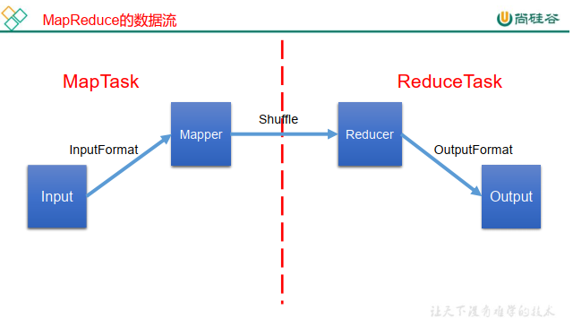
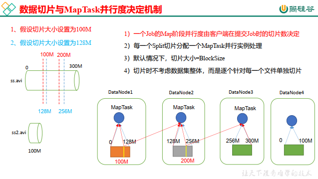
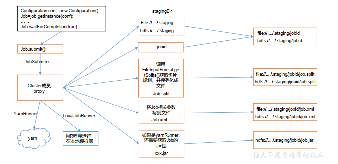
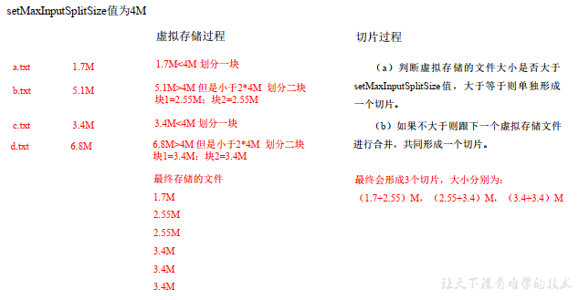
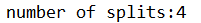
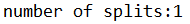
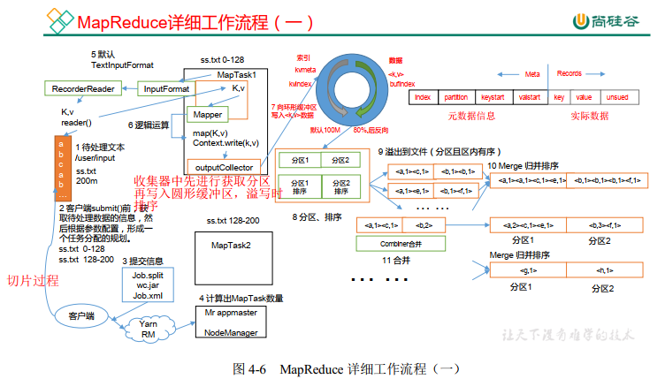
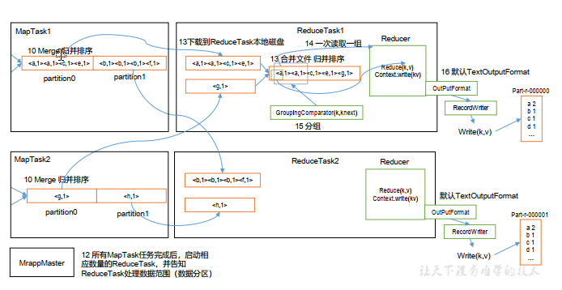
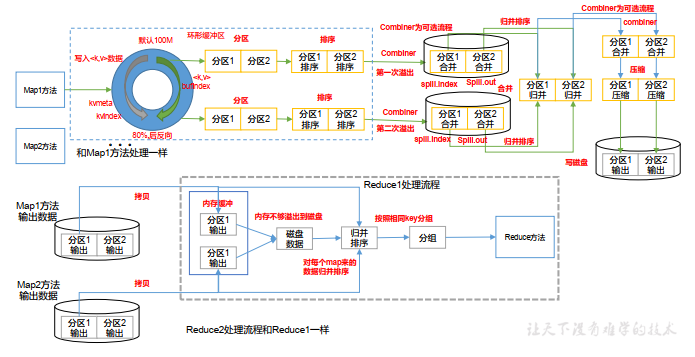
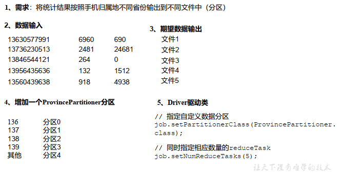

#  大数据技术之Hadoop（MapReduce）

# MapReduce概述

## MapReduce定义

​		MapReduce是一个<font color="red">分布式运算程序的编程框架</font>，使用户开发“基于hadoop的数据分析应用”的核心框架。

​	MapReduce核心功能是将用户编写的业务逻辑代码和自带默认组件整合的成一个完整的分布式运算程序，并运行在一个Hadoop集群上。

## MapReduce的优缺点

### 优点

- 易于编程
- 良好的扩展性
- 高容错性
- 适合PB级以上的海量数据的离线处理。

### 缺点

- 不适合实时处理数据
- 不适合流式计算
- 不擅长DAG（有向图）计算

## MapReduce核心思想

- Map（映射）阶段：对数据进行处理，将数据转换成我们需要的格式。该阶段MapTask并发执行，互不干扰。
    - Reduce（减少，规约）阶段：对Map阶段的数据进行计算，合并，规约。

## MapReduce进程

​		一个完整的MapReduce程序包括三个进程：

- MrAppMaster：负责整个程序的过程调度及状态协调
- MapTask：负责Map阶段的整个数据处理流程
- ReduceTask：负责Reduce阶段的整个数据处理流程

## 官方WordCount 源码

## 常用数据序列化类型

## MapReduce 编程规范

1. Mapper阶段
    （1）用户自定义的Mapper要继承自己的父类
    （2）Mapper的输入数据是KV对的形式（KV的类型可自定义）
    （3）Mapper中的业务逻辑写在map()方法中
    （4）Mapper的输出数据是KV对的形式（KV的类型可自定义）
    （5）map()方法（MapTask进程）对每一个<K,V>调用一次

2. Reducer阶段

    （1）用户自定义的Reducer要继承自己的父类（2）Reducer的输入数据类型对应Mapper的输出数据类型，也是KV
    （3）Reducer的业务逻辑写在reduce()方法中
    （4）ReduceTask进程对每一组相同k的<k,v>组调用一次reduce()方法

3. Driver阶段
    相当于YARN集群的客户端，用于提交我们整个程序到YARN集群，提交的是
    封装了MapReduce程序相关运行参数的job对象

## WordCount 案例实操

# Hadoop序列化

## 序列化概述

### 什么是序列化

​		序列化就是将内存中的对象转换为字节码（或其他数据传输协议）以便于存储到硬盘中（持久化），和网络传输。

​		反序列化就是将受到的字节码序列（或其他数据传输协议）或是磁盘的持久化数据，转换为内存中的对象。

### 为什么要序列化

​		对象只能在本地的内存中使用，无法发送到网络上的其他计算机，而序列化可以存储“活的”对象，将活的对象发送到远程计算机。

### 为什么不使用Java自带的序列化

​		Java自带的序列化是一个重量级序列化框架，一个对象被序列化之后会附带很多信息（如：校验数据，Header，继承体等），十分不便于网络中的高效传输。

**Hadoop序列化的优点**

- 紧凑
- 快速
- 可扩展
- 互操作：支持多语言交互

## 自定义bean 对象实现序列化接口（Writable）

7步：

1. 必须实现Writable接口
2. 反序列化时，必须有空构造，需要反射调用空构造。
3. 重写序列化方法。
4. 重写反序列化方法。
5. 注意序列化方法和反序列化的顺序一致
6. 重写toString方法。
7. 如果Bean作为Key传输，需要实现Comparable接口，必须能够排序。

## 序列化实操

# MapReduce框架原理

## InputFormat数据输出



### 切片与MapTask 并行度决定机制

1. Maptask的并行度决定Map阶段的任务并发度，进而影响整个job的处理速度。

    但，Maptask的并行度并不是越高越好，当处理大数据的时，并行度高，可以提高集群的并发处理速度，但当处理小数据时，过多的MapTask会影响处理速度。

2. MapTask并行度决定机制？

    并行度有切片数决定。切片针对单独文件。

    每一个切片就会分配一个MapTask并行实例处理。

    默认情况下，切片大小=BloSize（本地运行环境32M，集群128M，老集群64M）



###   Job 提交流程源码和切片源码详解

1. Job 提交流程源 码详解:

    ```java
    waitForCompletion()
    submit();
    // 1 建立连接
    connect();
    // 1）创建提交 Job 的代理
    new Cluster(getConfiguration());
    // （1）判断是本地 yarn 还是远程
    initialize(jobTrackAddr, conf);
    // 2 提交 job
    submitter.submitJobInternal(Job.this, cluster)
    // 1）创建给集群提交数据的 Stag 路径
    Path jobStagingArea =
    JobSubmissionFiles.getStagingDir(cluster, conf);
    // 2）获取 jobid ，并创建 Job 路径
    JobID jobId = submitClient.getNewJobID();
    // 3）拷贝 jar 包到集群
    copyAndConfigureFiles(job, submitJobDir);
    rUploader.uploadFiles(job, jobSubmitDir);
    // 4）计算切片，生成切片规划文件
    writeSplits(job, submitJobDir);
    maps = writeNewSplits(job, jobSubmitDir);
    input.getSplits(job);
    // 5）向 Stag 路径写 XML 配置文件
    writeConf(conf, submitJobFile);
    conf.writeXml(out);
    // 6）提交 Job,返回提交状态
    status = submitClient.submitJob(jobId,
    submitJobDir.toString(), job.getCredentials());
    ```



1. FileInputFormat 切片源码解析(input.getSplits(job))

    （1）程序先找到你数据存储的目录。
    （2）开始遍历处理（规划切片）目录下的每一个文件
    （3）遍历第一个文件ss.txt
    		a）获取文件大小fs.sizeOf(ss.txt)
    		b）计算切片大小
    computeSplitSize(Math.max(minSize,Math.min(maxSize,blocksize)))=blocksize=128M
    		c）默认情况下，切片大小=blocksize
    		d）开始切，形成第1个切片：ss.txt—0:128M 第2个切片ss.txt—128:256M 第3个切片ss.txt—256M:300M
    （每次切片时，都要判断切完剩下的部分是否大于块的1.1倍，不大于1.1倍就划分一块切片）
    		e）将切片信息写到一个切片规划文件中
    		f）整个切片的核心过程在getSplit()方法中完成
    		g）InputSplit只记录了切片的元数据信息，比如起始位置、长度以及所在的节点列表等。
    （4）提交切片规划文件到YARN上，YARN上的MrAppMaster就可以根据切片规划文件计算开启MapTask个数。

### FileInputFormat 切片机制

**切片机制**

1. 简单地按照文件的内容长度进行切片。
2. 切片大小默认等于Block大小。
3. 切片时不考虑数据整体，而是逐个针对每一个文件单独切片。

**切片源码**

```
Math.max(minSize, Math.min(maxSize, blockSize));
mapreduce.input.fileinputformat.split.minsize=1 默认值为1
mapreduce.input.fileinputformat.split.maxsize= Long.MAXValue 默认值Long.MAXValue  
```

**切片大小设置  **

maxsize（切片最大值）：当该参数调的比blocksize小时，则会使切片大小变小。

minsize（切片最小值）：当改参数比blocksize比blocksize大时，则会使切片大小变大。

### FileInputFormat 实现类  

**思考**

​	在运行在运行MapReduce程序时， 输入的文件格式包括：基于行的日志文件、二进制格式文件、 数据库表等。 那么， 针对不同的数据类型， MapReduce是如何读取这些数据的呢？  

​		FileInputFormat的常见实现类包括：TextInputFormat 、KeyValueTextInputFormat、 NLineInputFormat、 CombineTextInputFormat和自定义InputFormat等。

| 实现类                  | 切片方式                                                     | 切片大小           | key                  | value        |
| ----------------------- | ------------------------------------------------------------ | ------------------ | -------------------- | ------------ |
| TextInputFormat         | 一个文件一个切片，按行读取                                   | 默认128M           | 偏移量               | 该行数据     |
| KeyValueTextInputFormat | 一个文件一个切片，按行读取                                   | 128M               | 行分割后的第一列数据 | 第二列的数据 |
| NLineInputFormat        | 按指定行数切（输入文件的总行数/N=切片数， 如果不整除， 切片数=商+1） | 128M               | 偏移量               | 该行数据     |
| CombineTextInputFormat  | 虚拟存储过程和切片过程。                                     | 虚拟存储切片最大值 | 偏移量               | 该行数据     |
| 自定义InputFormat       |                                                              | 128M               |                      |              |


### CombineTextInputFormat 切片机制

**应用场景**

CombinTextInputFormat应用于小文件过多的场景，它将小文件从逻辑上规划到一个切片上，将多个小文件交给一个MapTask处理。

**虚拟存储切片最大值的设置**

CombineTextInputFormat.setMaxInputSplitSize(job, 4194304);// 4m  

注意： 虚拟存储切片最大值设置最好根据实际的小文件大小情况来设置具体的值。  

**切片机制**

生成切片的过程分为：虚拟存储过程和切片过程。



1. 虚拟存储过程

    将输出目录下的所有文件大小，依次和设置的setMaxInputSplitSize的值进行比较，当文件大小不大于最大值时，逻辑上划分为一个块，如果文件大小大于最大值，且大于最大值的两倍，则按最大值切割一块，当剩余文件大小超过设置的最大值且不大于最大值的2倍时，此时将文件均分为2块（这样能够防止出现太小切片）。

2. 切片过程

    - 判断上一过程产生的虚拟文件是否大于setMaxInputSplitSize值，大于等于则单独形成一个切片。
    - 如果不大于则与下一个虚拟文件进行合并，共同形成一个切片。

### CombineTextInputFormat 案例实操

1. 需求

    将输入文件夹中的小文件合并成一个切片进行统一处理。

    （1）输入数据

    ​		准备4个小文件

    （2）期望

    ​		期望一个切片处理4个小文件

2. 实现过程

    1） 不做任何处理，运行 1.6 节的 WordCount 案例程序，观察切片个数为 4。  

    

    2）在 WordcountDriver 中增加如下代码， 运行程序，并观察运行的切片个数为 3。

    （a）驱动类中添加代码如下：  

    ```java
    // 如果不设置 InputFormat，它默认用的是 TextInputFormat.class
    job.setInputFormatClass(CombineTextInputFormat.class);
    //虚拟存储切片最大值设置 4m
    CombineTextInputFormat.setMaxInputSplitSize(job, 4194304);
    ```

    （b）运行如果为 3 个切片。

     

    3） 在 WordcountDriver 中增加如下代码， 运行程序，并观察运行的切片个数为 1。   

    （a） 驱动中添加代码如下：  

    ```java
    // 如果不设置 InputFormat，它默认用的是 TextInputFormat.class
    job.setInputFormatClass(CombineTextInputFormat.class);
    //虚拟存储切片最大值设置 20m
    CombineTextInputFormat.setMaxInputSplitSize(job, 20971520);
    （b）运行如果为 1 个切片
    ```

    （b）运行如果为 1 个切片。  

    

### TextInputFormat 的 KV

​		TextInputFormat是默认的FileInputFormat实现类。 按行读取每条记录。 键是存储该行在整个文件中的起始字节偏移量， LongWritable类型。 值是这行的内容， 不包括任何行终止符（换行符和回车符） ，Text类型。

**案例**

以下是一个示例， 比如， 一个分片包含了如下4条文本记录。  

```
Rich learning form
Intelligent learning engine
Learning more convenient
From the real demand for more close to the enterprise
```

每条记录表示为以下键/值对：  

```
(0,Rich learning form)
(19,Intelligent learning engine)
(47,Learning more convenient)
(72,From the real demand for more close to the enterprise）
```

## MapReduce 工作流程（v131）

**工作流程图**





上面的流程是整个 MapReduce 最全工作流程，但是 Shuffle 过程只是从第 7 步开始到第16 步结束， 具体 Shuffle 过程详解， 如下：
（1） MapTask 收集我们的 map()方法输出的 kv 对，放到内存缓冲区中
（2） 从内存缓冲区不断溢出本地磁盘文件，可能会溢出多个文件
（3） 多个溢出文件会被合并成大的溢出文件
（4） 在溢出过程及合并的过程中，都要调用 Partitioner 进行分区和针对 key 进行排序
（5） ReduceTask 根据自己的分区号，去各个 MapTask 机器上取相应的结果分区数据
（6） ReduceTask 会取到同一个分区的来自不同 MapTask 的结果文件， ReduceTask 会将
这些文件再进行合并（归并排序）
（7） 合并成大文件后， Shuffle 的过程也就结束了，后面进入 ReduceTask 的逻辑运算过
程（从文件中取出一个一个的键值对 Group，调用用户自定义的 reduce()方法）
注意：
（1） Shuffle 中的缓冲区大小会影响到 MapReduce 程序的执行效率，原则上说，缓冲区越大，磁盘 io 的次数越少，执行速度就越快。
（2） 缓冲区的大小可以通过参数调整，参数： io.sort.mb 默认 100M。
（3） 源码解析流程  

```
context.write(k, NullWritable.get());
    output.write(key, value);
        collector.collect(key, value,partitioner.getPartition(key, value, partitions));
        	HashPartitioner();
        collect()  
        close()
            collect.flush()
                sortAndSpill()
                    sort() QuickSort
                mergeParts();
            collector.close();  
```

## Shuffle 机制  

### Shuffle 机制  

Map 方法之后， Reduce 方法之前的数据处理过程称之为 Shuffle。  Shuffle对数据的处理包括：分区，排序，Combiner合并，归并排序，数据压缩。



### Partition 分区（重要）

1.  问题引出
    要求将统计结果按照条件输出到不同文件中（ 分区） 。 比如：将统计结果按照手机归属地不同省份输出到不同文件中（ 分区）。

2. 默认Partitioner分区

    ```java
    public class HashPartitioner<K, V> extends Partitioner<K, V> {
        public int getPartition(K key, V value, int numReduceTasks) {
            return (key.hashCode() & Integer.MAX_VALUE) % numReduceTasks;
        }
    }
    ```

    默认分区是根据key的hashCode对ReduceTasks个数取模得到的。 用户没法控制哪个key存储到哪个分区。  

3. 自定义Partitioner步骤

    （ 1）自定义类继承Partitioner，重写getPartition()方法

    ```java
    public class CustomPartitioner extends Partitioner<Text, FlowBean> {
        @Override
        public int getPartition(Text key, FlowBean value, int numPartitions) {
            // 控制分区代码逻辑
            … …
                return partition;
        }
    }
    ```

    （ 2） 在Job驱动中， 设置自定义Partitioner

    ```java
    job.setPartitionerClass(CustomPartitioner.class);
    ```

    （ 3）自定义Partition后，要根据自定义Partitioner的逻辑设置相应数量的ReduceTask

    ```java
    job.setNumReduceTasks(5);  
    ```


4. **分区总结**

    （ 1） 如果ReduceTask的数量> getPartition的结果数， 则会多产生几个空的输出文件part-r-000xx；
    （ 2） 如果1<ReduceTask的数量<getPartition的结果数， 则有一部分分区数据无处安放， 会产生Exception；
    （ 3） 如果ReduceTask的数量=1， 则不管MapTask端输出多少个分区文件， 最终结果都交给这一个
    ReduceTask， 最终也就只会产生一个结果文件 part-r-00000；  

    （ 4） 分区号必须从零开始， 逐一累加。  

5. 案例分析

    例如：假设自定义分区数为5，则
    （1） job.setNumReduceTasks(1);
    （2） job.setNumReduceTasks(2);
    （3） job.setNumReduceTasks(6);
    会正常运行，只不过会产生一个输出文件会报错
    大于5， 程序会正常运行， 会产生空文件  

### Partition 分区案例实操  

1. 需求
    将统计结果按照手机归属地不同省份输出到不同文件中（分区）
    （1）输入数据
    phone_data .txt
    （2）期望输出数据
    手机号 136、 137、 138、 139 开头都分别放到一个独立的 4 个文件中，其他开头的放到一个文件中。

2. 需求分析  

    

3. 在案例 2.4 的基础上，增加一个分区类  

    ```java
    package com.atguigu.mapreduce.flowsum;
    import org.apache.hadoop.io.Text;
    import org.apache.hadoop.mapreduce.Partitioner;
    public class ProvincePartitioner extends Partitioner<Text,
    FlowBean> {
        @Override
        public int getPartition(Text key, FlowBean value, int
                                numPartitions) {
            // 1 获取电话号码的前三位
            String preNum = key.toString().substring(0, 3);
            int partition = 4;
            // 2 判断是哪个省
            if ("136".equals(preNum)) {
                partition = 0;
            }else if ("137".equals(preNum)) {
                partition = 1;
            }else if ("138".equals(preNum)) {
                partition = 2;
            }else if ("139".equals(preNum)) {
                partition = 3;
            }
            return partition;
        }
    }
    ```

4. 在驱动函数中增加自定义数据分区设置和 ReduceTask 设置  

    ```java
    package com.atguigu.mapreduce.flowsum;
    import java.io.IOException;
    import org.apache.hadoop.conf.Configuration;
    import org.apache.hadoop.fs.Path;
    import org.apache.hadoop.io.Text;
    import org.apache.hadoop.mapreduce.Job;
    import org.apache.hadoop.mapreduce.lib.input.FileInputFormat;
    import
        org.apache.hadoop.mapreduce.lib.output.FileOutputFormat;
    public class FlowsumDriver {
        public static void main(String[] args) throws
            IllegalArgumentException, IOException, ClassNotFoundException,
        InterruptedException {
            // 输入输出路径需要根据自己电脑上实际的输入输出路径设置
            args = new String[]{"e:/output1","e:/output2"};
            // 1 获取配置信息，或者 job 对象实例
            Configuration configuration = new Configuration();
            Job job = Job.getInstance(configuration);
            // 2 指定本程序的 jar 包所在的本地路径
            job.setJarByClass(FlowsumDriver.class);
            // 3 指定本业务 job 要使用的 mapper/Reducer 业务类
            job.setMapperClass(FlowCountMapper.class);
            job.setReducerClass(FlowCountReducer.class);
            // 4 指定 mapper 输出数据的 kv 类型
            job.setMapOutputKeyClass(Text.class);
            job.setMapOutputValueClass(FlowBean.class);
            // 5 指定最终输出的数据的 kv 类型
            job.setOutputKeyClass(Text.class);
            job.setOutputValueClass(FlowBean.class);
            // 8 指定自定义数据分区
            job.setPartitionerClass(ProvincePartitioner.class);
            // 9 同时指定相应数量的 reduce task
            job.setNumReduceTasks(5);
            // 6 指定 job 的输入原始文件所在目录
            FileInputFormat.setInputPaths(job, new Path(args[0]));
            FileOutputFormat.setOutputPath(job, new Path(args[1]));
            // 7 将 job 中配置的相关参数，以及 job 所用的 java 类所在的 jar 包，提交给 yarn 去运行
            boolean result = job.waitForCompletion(true);
            System.exit(result ? 0 : 1);
        }
    }
    ```

### WritableComparable 排序（重要）

**排序概述**

​		排序是MapReduce框架中最重要的操作之一。	

​		MapTask和ReduceTask均会对数据<font color = "red">按照Key</font>进行排序，该操作属于Hadoop的默认行为。 <font color = "red">任何应用程序中的数据均会被排序</font>， 而不管逻辑上是否需要。

​		默认排序是<font color = "red">按照字典顺序</font>排序， 且实现该排序的方法是快速排序。

​		在MapTask中共会进行**两次排序**，第一次快速排序（数据在环行缓冲区中达到阈值时，MapTask会对数据进行快排，并将有序数据溢写到磁盘上。），第二次归并排序（当所有的数据处理完毕后，MapTask会对磁盘上的所有文件进行归并排序）。

​		对于ReduceTask，它从每个MapTask上远程拷贝相应的数据文件，如果文件大小超过一定阈值， 则溢写磁盘上， 否则存储在内存中。如果磁盘上文件数目达到一定阈值，则进行一次归并排序以生成一个更大文件；如果内存中文件大小或者数目超过一定阈值，则进行一次合并后将数据溢写到磁盘上。当所有数据拷贝完毕后， **ReduceTask统一对内存和磁盘上的所有数据进行一次归并排序。  **

**排序分类  **

（1）部分排序

MapReduce根据输入记录的键对数据集排序。 保证输出的每个文件内部有序。

（2）全排序

最终输出结果只有一个文件， 且文件内部有序。 实现方式是只设置一个ReduceTask。 但该方法在处理大型文件时效率极低， 因为一台机器处理所有文件， 完全丧失了MapReduce所提供的并行架构。

（3） 辅助排序： （GroupingComparator分组）

在Reduce端对key进行分组。应用于：在接收的key为bean对象时，想让一个或几个字段相同（全部字段比较不相同）的key进入到同一个reduce方法时，可以采用分组排序。

（4）二次排序

在自定义排序过程中，如果compareTo中的判断条件为两个即为二次排序。  

### WritableComparable 排序案例实操（全排序）  

# Hadoop 数据压缩  

## 概述  	

​		压缩技术能够有效减少底层存储系统（ HDFS） 读写字节数。 压缩提高了网络带宽和磁盘空间的效率。 <font color = "red">在运行MR程序时， I/O操作、 网络数据传输、 Shuffle和Merge要花大量的时间</font>， 尤其是数据规模很大和工作负载密集的情况下， 因此，使用数据压缩显得非常重要。

​		鉴于磁盘I/O和网络带宽是Hadoop的宝贵资源， **数据压缩对于节省资源、最小化磁盘I/O和网络传输非常有帮助。** 可以在任意MapReduce阶段启用压缩。 不过，尽管压缩与解压操作的CPU开销不高，其性能的提升和资源的节省并非没有代价 。

​		**压缩是提高Hadoop运行效率的一种优化策略。**

​		通过对Mapper、 Reducer运行过程的数据进行压缩， 以减少磁盘IO，提高MR程序运行速度。  

​		**注意： 采用压缩技术减少了磁盘IO， 但同时增加了CPU运算负担。 所以， 压缩特性运用得当能提高性能， 但运用不当也可能降低性能。**  

压缩基本原则：

（ 1） 运算密集型的job， 少用压缩

（ 2） IO密集型的job， 多用压缩

## 压缩方式选择

| 压缩方式   | 优点                         | 缺点                                                       |
| ---------- | ---------------------------- | ---------------------------------------------------------- |
| Gzip 压缩  | 压缩率较高，速度较快         | 不支持切片                                                 |
| Bzip2压缩  | 压缩率最高，支持切片         | 速度慢                                                     |
| Lzo压缩    | 压缩率高，速度也快，支持切片 | Hadoop本身不支持，需要安装,需要建索引，还需要指 定输入格式 |
| Snappy压缩 | 高速压缩速度和合理的压缩率。 | 不支持切片，Hadoop本身不支持                               |

**应用场景**

- Gzip 压缩

    ​		当每个文件压缩之后在130M以内的（ 1个块大小内） ， 都可以考虑用Gzip压缩格式。 例如说一天或者一个小时的日志压缩成一个Gzip文件。 

- Bzip2 压缩

    ​		适合对速度要求不高， 但需要较高的压缩率的时候； 或者输出之后的数据比较大，处理之后的数据需要压缩存档减少磁盘空间并且以后数据用得比较少的情况；或者对单个很大的文本文件想压缩减少存储空间， 同时又需要支持Split， 而且兼容之前的应用程序的情况。  

- Lzo 压缩  

    ​		一个很大的文本文件， 压缩之后还大于200M以上的可以考虑，而且单个文件越大， Lzo优点越越明显。  

- Snappy 压缩

    ​		当MapReduce作业的Map输出的数据比较大的时候， 作为Map到Reduce的中间数据的压缩格式； 或者作为一个MapReduce作业的输出和另外一个MapReduce作业的输入。  