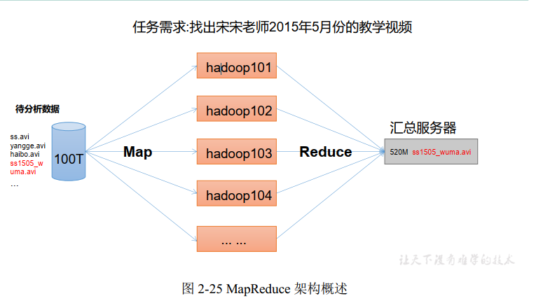
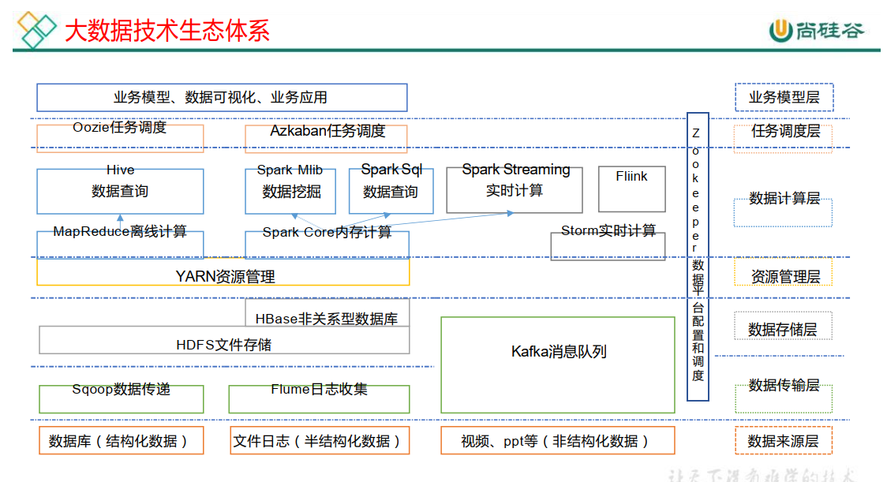

# 大数据概论

## 大数据概念

​		大数据（Big Data）：指<font color = "red">无法在一定时间范围内</font>用常规软件工具进行捕捉、管理和处理的数据集合，是需要新处理模式才能具有更强的决策力、洞察发现力和流程优化能力的<font color = "red">海量、高增长率和多样化的信息资产</font>。

​		大数据主要用于海量数据的<font color = "red">存储</font>和海量数据的<font color = "red">分析计算</font>问题。

​		按顺序给出数据存储单位：bit、Byte、KB、<font color = "red">MB、GB、TB</font>、PB、EB、ZB、YB、BB、NB、DB。
​		1Byte = 8bit 1K = 1024Byte 1MB = 1024K
​		1G = 1024M 1T = 1024G 1P = 1024T。

## 大数据特点（4V）

- Volume（大量）：数据量庞大。
- Velocity（高速）：处理数据的效率高。
- Variety（多样）：数据类型可分为结构化数据和分结构化数据。结构化数据包括：以数据库、文本为主的结构化数据，非结构化数据现在越来越多，包括网络日志，视频，音频，图片，地址信息位置等。数据的多样性对数据处理的处理能力提出了更高的要求。
- Value（低价值密度）：数据量过多，如何快速提取有价值的数据是目前大数据背景下待解决的难题。

## 大数据应用场景

①物流仓储：大数据分析系统助力商家精心化运营，提升销量，节约成本。

例如：美团有选址部门，专门用来分析，线下门店的选址分析，地区存在哪些竞品地区人群的收入，地区的房价，交通，将众多的信心输入到大数据分析模型中，评测出在哪里建立门店最优，这都是通过大数据计算得出。

例如：京东物流大数据，仓储大数据，分析地区人群数据，实时订单数据等进行地区资源分配。

②零售业：分析用户消费习惯，为用户购买商品提供方便，从而提升商品销量。

经典案例，子尿布+啤酒。

​		纸尿布和啤酒之间的关系：女人生完孩子，孩子需要使用纸尿裤，但不会自己出去买，会叫自己老公出去买纸尿裤，而男性普遍爱喝啤酒，会顺便买些啤酒回来，所以商家就会把纸尿裤和啤酒摆在相近的货架上，能够促进购物者消费，增加盈利。这是国外的情况。而在国内的超市，在收营台前通常会排一些口香糖，避孕套之类的物品。

③旅游：深度结合大数据能力与旅游行业需求，共建旅游产业智慧管理、智慧服务和智慧营销的未来。

④商品广告推荐：给用户推荐可能喜欢的商品。

⑤保险：海量数据挖掘及风险预测，助力保险行精准营销，提升精细化定价能力。

⑥金融：多维度体现用户特征，帮助金融机构推荐优质客户，防范欺诈风险。

⑦房产：大数据全面助力房地产行业，打造精准投策与营销，选出更合适的地，建造更合适的楼，卖给更合适的人。

⑧人工智能。

## 大数据发展前景

## 大数据部门业务流程分析

主要负责搭建数据平台，分析数据指标，数据可视化（报表展示，邮件发送等）。

## 大数据部门组织结构（重点）

# 从Hadoop框架讨论大数据生态

## 什么是Hadoop

- Hadoop是一个由Apache基金会所开发的<font color = "red">分布式系统基础架构</font>。
- 主要解决，海量数据的<font color = "red">存储</font>和海量数据的<font color = "red">分析计算</font>问题。
- Hadoop通常指的是Hadoop生态圈。

## Hadoop的发展历史

- 创始人：Dong Cutting

Hadoop思想之源三篇论文：

-  GFS--->HDFS
- Map-Redus-->MR
- BigTable-->HBase

## Hadoop三大发行版本

## Hadoop的优势（4高）

- 高可靠性，Hadoop底层维护多个数据副本，所以即使Hadoop某个计算元素
  或存储出现故障，也不会导致数据的丢失。
- 高扩展性，在集群间分配任务数据，可方便的扩展数以千计的节点。
- 高效性，在MapReduce的思想下，Hadoop是并行工作的，以加快任务处理
  速度。
- 高容错性，能够自动将失败的任务重新分配。

## Hadoop组成（重点）

​		Hadoop2.x由四部分组成分别是辅助工具（Common）、数据存储（HDFS）、资源调度（Yarn）和计算（MapReduce）。

面试题：Hadoop1.x和Hadoop2.x的区别

​		<font color= "red">在Hadoop1.x时代，Hadoop中的MapReduce同时处理业务逻辑运算和资源的调度，耦合性较大，在Hadoop2.x 时代，增加了Yarn。Yarn只负责资源的调度，MapReduce只负责运算。</font>

### HDFS架构概述

​		HDFS（Hadoop Distributed File System）架构由

- ①NameNode（nn）：存储文件的元数据（相当于数据的目录）
- ②DataNode（dn）：数据
- ③Secondary NameNode（2nn）：用来监控HDFS状态的辅助后台程序，每隔一段时间获取HDFS元数据的快照。

### YARN架构概述

1）ResourceManager（RM）主要作用如下

- 处理客户端请求
- 监控NodeManager
- 启动或监控ApplicationMaster
- <font color = "red">整个集群资源（CPU和内存）的分配与调度</font>

2）NodeManager（NM）主要作用如下

- <font color ="red">管理单个节点上的资源</font>
- 处理来自ResourceManager的命令
- 处理来自ApplicationMaster的命令

3）ApplicationMaster（AM）作用如下

- 负责数据的切分
- 为应用程序申请资源并分配给内部的任务（一个job的老大）
- 任务（job）的监控与容错

4）Container 

​		Container 是YARN 中的资源抽象，它封装了某个节点上的多维度资源，如内存、CPU、磁盘、网络等。

### MapReduce 架构概述

- Map阶段进行并行（多台服务器）处理。
- Reduce阶段进行对Map结果进行汇总。



## 大数据技术生态体系



## 推荐系统框架图

# Hadoop运行环境搭建（开发重点）

# 4.Hadoop的运行模式

## 4.1本地运行模式

## 4.2伪分布式运行模式

### 4.2.1启动HDFS并运行MapReduce程序

1.分析

- 配置集群
- 启动、测试集群增、删、查。
- 执行WordCount案例

2.执行步骤

- 配置集群
  - 配置：hadoop-env.sh，修改JAVA_HOME路径
  - 配置：core-site.xml，指定HDFS 中NameNode 的地址，指定Hadoop 运行时产生文件的存储目录。
  - 配置：hdfs-site.xml，（可配可不配），指定HDFS 副本的数量，默认为3
- 启动集群
  - 格式化NameNode，（第一次启动格式化，不能总是格式化）
  - 启动NameNode
  - 启动DataNode
- 查看集群
  - 查看集群是否启动成功，jps，注意jps是JDK的命令。
  - web端查看HDFS文件系统，端口50070
  - 查看log日志
- 操作集群
  - 在HDFS文件系统上创建input文件夹
  - 将系统中的文件上传到文件系统上。
  - 查看上传的文件
  - 运行MapReduce程序
  - 下载文件系统上的文件到本地
  - 删除文件系统的文件

### 4.2.2	启动YARN并运行MapReduce

1. 分析
    （1）配置集群在YARN 上运行MR
    （2）启动、测试集群增、删、查
    （3）在YARN 上执行WordCount 案例

2. 执行步骤

  （1）配置集群

  - 配置：yarn-env.sh

  - 配置：yarn.site.xml，Reducer获取数据的方式（shuffle），指定YARN的ResourceManager的地址。
  - 配置：mapred-env.sh
  - 配置：mapred-site.xml（对mapred-site.xml.template重命名），指定在YARN上运行。

  （2）启动集群

  - 保证NameNode和datenode已经启动
  - 启动ResourceManager
  - 启动NodeManager

  （3）集群操作

  - YARN的web端查看，（端口8088）
  - 删除文件系统的output文件
  - 执行MapReduce程序
  - 查看运行结果

### 4.2.3配置历史服务器

1：配置mapred-site.xml，历史服务器地址和历史服务器web地址

2：启动历史服务器。`sbin/mr-jobnistory-daemon.sh start historyserver`

3：查看历史服务器是否启动成功。

4：查看JobHistory，端口19888

### 4.2.4配置日志的聚集

<font color="red">注意：开启日志聚集功能，需要重新启动NodeManager 、ResourceManager 和
HistoryManager。</font>

1：配置yarn.site.xml，日志聚集功能使能，日志保留时间设置7天

2：关闭NodeManager，ResourceManager和HistoryManager

3:：启动NodeManager，ResourceManager和HistoryManager

4：删除HDFS上的输出文件

5：执行WordCount程序

6：查看日志

### 4.2.5配置文件说明

​		配置文件分为两类，默认配置文件和自定义配置文件。

（1）默认配置文件：

| 要获取的默认文件     | 文件存放在Hadoop 的jar 包中的位置                          |
| -------------------- | ---------------------------------------------------------- |
| [core-default.xml]   | hadoop-common-2.7.2.jar/ core-default.xml                  |
| [hdfs-default.xml]   | hadoop-hdfs-2.7.2.jar/ hdfs-default.xml                    |
| [yarn-default.xml]   | hadoop-yarn-common-2.7.2.jar/ yarn-default.xml             |
| [mapred-default.xml] | hadoop-mapreduce-client-core-2.7.2.jar/ mapred-default.xml |

（2）自定义配置文件：
		core-site.xml、hdfs-site.xml、yarn-site.xml、mapred-site.xml 四个配置文件存放在
$HADOOP_HOME/etc/hadoop 这个路径上，用户可以根据项目需求重新进行修改配置。

## 4.3完全分布式运行模式（<font color= "red">开发重点</font>）

分析：
		1）准备3 台客户机（关闭防火墙、静态ip、主机名称）
		2）安装JDK
		3）配置环境变量
		4）安装Hadoop
		5）配置环境变量
		6）配置集群
		7）单点启动
		8）配置ssh
		9）群起并测试集群

### 4.3.1虚拟机准备

### 4.3.2编写集群分发脚本xsync

1. scp（secure copy）安全拷贝

（1）scp 定义：scp 可以实现服务器与服务器之间的数据拷贝。（from server1 to server2）

（2）基本语法
scp 		-r		$pdir/$fname	 				$user@hadoop$host:$pdir/$fname
命令	递归		要拷贝的文件路径/名称	目的用户@主机:目的路径/名称

（3）实操案例

- 在hadoop101 上，将hadoop101 中/opt/module 目录下的软件拷贝到hadoop102
  上。

  `[atguigu@hadoop101 /]$ scp -r /opt/module root@hadoop102:/opt/module`

- 在hadoop103 上，将hadoop101 服务器上的/opt/module 目录下的软件拷贝到
  hadoop103 上。

  `[atguigu@hadoop103 opt]$ sudo scp -r atguigu@hadoop101:/opt/module root@hadoop103:/opt/module`

- 在hadoop103 上操作将hadoop101 中/opt/module 目录下的软件拷贝到
  hadoop104 上。

  `[atguigu@hadoop103 opt]$ scp -r atguigu@hadoop101:/opt/module root@hadoop104:/opt/module `

<font color="red">注意：拷贝过来的/opt/module 目录，别忘了在hadoop102、hadoop103、hadoop104
上修改所有文件的，所有者和所有者组</font>。`sudo chown atguigu:atguigu -R /opt/module`

- 将hadoop101 中/etc/profile 文件拷贝到hadoop102 的/etc/profile 上。
  `[atguigu@hadoop101 ~]$ sudo scp /etc/profile root@hadoop102:/etc/profile`
- 将hadoop101 中/etc/profile 文件拷贝到hadoop103 的/etc/profile 上。
  `[atguigu@hadoop101 ~]$ sudo scp /etc/profile
  root@hadoop103:/etc/profile`
- 将hadoop101 中/etc/profile 文件拷贝到hadoop104 的/etc/profile 上。
  `[atguigu@hadoop101 ~]$ sudo scp /etc/profile
  root@hadoop104:/etc/profile`
  <font color="red">注意：拷贝过来的配置文件别忘了source 一下/etc/profile.</font>

2. rsync 远程同步工具
    		rsync 主要用于备份和镜像。具有速度快、避免复制相同内容和支持符号链接的优点。
    rsync 和scp 区别：用rsync 做文件的复制要比scp 的速度快，rsync 只对差异文件做更
    新。scp 是把所有文件都复制过去。
  - 基本语法
    rsync    -rvl    		$pdir/$fname		 		$user@hadoop$host:$pdir/$fname
    命令    选项参数	要拷贝的文件路径/名称	目的用户@主机:目的路径/名称
  - 案例实操
    （a）把hadoop101 机器上的/opt/software 目录同步到hadoop102 服务器的root 用户下的/opt/目录
    `[atguigu@hadoop101 opt]$ rsync -rvl /opt/software/
    root@hadoop102:/opt/software`
3. xsync 集群分发脚本

（1）需求：循环复制文件到所有节点的相同目录下

（2）需求分析：

（a）rsync 命令原始拷贝：

`rsync -rvl /opt/module root@hadoop103:/opt/`
（b）期望脚本：
xsync 要同步的文件名称
（c）说明：在/home/atguigu/bin 这个目录下存放的脚本，atguigu 用户可以在系统
任何地方直接执行。
（3）脚本实现

- （a）在/home/atguigu 目录下创建bin 目录，并在bin 目录下xsync 创建文件，文件
  内容如下：

`[atguigu@hadoop102 ~]$ vim bin xsync.sh`

在该文件中编写如下代码

```shell
#!/bin/bash
#1 获取输入参数个数，如果没有参数，直接退出
pcount=$#
if((pcount==0)); then
echo no args;
exit;
fi
#2 获取文件名称
p1=$1
fname=`basename $p1`
echo fname=$fname
#3 获取上级目录到绝对路径
pdir=`cd -P $(dirname $p1); pwd`
echo pdir=$pdir
#4 获取当前用户名称
user=`whoami`
#5 循环
for((host=103; host<105; host++)); do
	echo ------------------- hadoop$host --------------
	rsync -rvl $pdir/$fname $user@hadoop$host:$pdir
done
```

- （b）修改脚本xsync 具有执行权限
  `[atguigu@hadoop102 bin]$ chmod 777 xsync`

- （c）调用脚本形式：xsync 文件名称
  `[atguigu@hadoop102 bin]$ xsync /home/atguigu/bin`

  注意：如果将xsync放到/home/atguigu/bin目录下仍然不能实现全局使用，可以将xsync移动到/usr/local/bin 目录下。

### 4.3.3集群配置

1. 集群部署规划

|      | hadoop101               | hadoop102                       | hadoop103                     |
| ---- | ----------------------- | ------------------------------- | ----------------------------- |
| HDFS | Namenode  <br> Datanode | <br>Datanode                    | SecondaryNamenode<br>Datanode |
| YARn | <br>NodeManager         | ResourceManager<br/>NodeManager | <br>NodeManager               |

2. 配置集群

（1）核心配置文件
配置core-site.xml
`[atguigu@hadoop102 hadoop]$ vi core-site.xml`
在该文件中编写如下配置

```
<!-- 指定HDFS 中NameNode 的地址-->
<property>
	<name>fs.defaultFS</name>
	<value>hdfs://hadoop102:9000</value>
</property>
	<!-- 指定Hadoop 运行时产生文件的存储目录-->
<property>
	<name>hadoop.tmp.dir</name>
	<value>/opt/module/hadoop-2.7.2/data/tmp</value>
</property>
```

（2）HDFS 配置文件
配置hadoop-env.sh
`[atguigu@hadoop102 hadoop]$ vi hadoop-env.sh`
`export JAVA_HOME=/opt/module/jdk1.8.0_144`
配置hdfs-site.xml
`[atguigu@hadoop102 hadoop]$ vi hdfs-site.xml`
在该文件中编写如下配置

```
<property>
	<name>dfs.replication</name>
	<value>3</value>
</property>
<!-- 指定Hadoop 辅助名称节点主机配置-->
<property>
	<name>dfs.namenode.secondary.http-address</name>
	<value>hadoop104:50090</value>
</property>
```

（3）YARN 配置文件
配置yarn-env.sh
`[atguigu@hadoop102 hadoop]$ vi yarn-env.sh`
`export JAVA_HOME=/opt/module/jdk1.8.0_144`
配置yarn-site.xml
`[atguigu@hadoop102 hadoop]$ vi yarn-site.xml`
在该文件中增加如下配置

```
<!-- Reducer 获取数据的方式-->
<property>
	<name>yarn.nodemanager.aux-services</name>
	<value>mapreduce_shuffle</value>
</property>
<!-- 指定YARN 的ResourceManager 的地址-->
<property>
	<name>yarn.resourcemanager.hostname</name>
	<value>hadoop103</value>
</property>
```

（4）MapReduce 配置文件
配置mapred-env.sh
`[atguigu@hadoop102 hadoop]$ vi mapred-env.sh`
`export JAVA_HOME=/opt/module/jdk1.8.0_144`
配置mapred-site.xml
`[atguigu@hadoop102 hadoop]$ cp mapred-site.xml.template
mapred-site.xml`
`[atguigu@hadoop102 hadoop]$ vi mapred-site.xml`

在该文件中增加如下配置

```
<!-- 指定MR 运行在Yarn 上-->
<property>
	<name>mapreduce.framework.name</name>
	<value>yarn</value>
</property>
```

3．在集群上分发配置好的Hadoop 配置文件 <font color = "red">(这里同步hadoop文件夹就可以)</font>
`[atguigu@hadoop102 hadoop]$ xsync /opt/module/hadoop-2.7.2/`
4．查看文件分发情况
`[atguigu@hadoop103 hadoop]$ cat /opt/module/hadoop-
2.7.2/etc/hadoop/core-site.xml`

### 4.3.4 集群单点启动

### 4.3.5 SSH 无密登录配置

1. 配置ssh
（1）基本语法
ssh 另一台电脑的ip 地址

2. 无密钥配置

   在hadoop102上生成私钥和公钥

   `[atguigu@hadoop102 .ssh]$ ssh-keygen -t rsa`

   然后敲（三个回车），就会生成两个文件id_rsa（私钥）、id_rsa.pub（公钥）

   将公钥拷贝到要免密登录的目标机器上

   `[atguigu@hadoop102 .ssh]$ ssh-copy-id hadoop102
   [atguigu@hadoop102 .ssh]$ ssh-copy-id hadoop103
   [atguigu@hadoop102 .ssh]$ ssh-copy-id hadoop104`

   <font color = "red">注意：这里生成的秘钥文件是存在atguigu用户下的bin目录下的（.ssh是隐藏文件）。
   还需要在hadoop102 上采用root 账号，配置一下无密登录到hadoop102、hadoop103、hadoop104；
   还需要在hadoop103 上采用atguigu账号配置一下无密登录到hadoop102、hadoop103、hadoop104 服务器上。</font>

3. .ssh 文件夹下（~/.ssh）的文件功能解释

   | 文件            | 解释                               |
   | --------------- | ---------------------------------- |
   | known_hosts     | 记录素数访问过计算机的公钥         |
   | id_rsa          | 生成的私钥                         |
   | id_rsa.pub      | 生成的公钥                         |
   | authorized_keys | 存放授权过的无秘登入服务器端的秘钥 |

### 4.3.6群集群

1. 配置slaves

   `/opt/module/hadoop-2.7.2/etc/hadoop/slaves
   [atguigu@hadoop102 hadoop]$ vi slaves`

   在该文件中增加如下内容：
   `hadoop102
   hadoop103
   hadoop104`

   <font color = "red">注意：该文件中添加的内容结尾不允许有空格，文件中不允许有空行。</font>

   同步所有节点配置文件

   `[atguigu@hadoop102 hadoop]$ xsync slaves`

2. 启动集群

   （1）如果集群是第一次启动，需要格式化NameNode（<font color = "red">注意格式化之前，一定要先停
   止上次启动的所有namenode 和datanode 进程，然后再删除data 和log 数据</font>）

   `[atguigu@hadoop102 hadoop-2.7.2]$ bin/hdfs namenode -format`

   `[atguigu@hadoop102 hadoop-2.7.2]$ sbin/start-dfs.sh`

   （2）启动HDFS

   `[atguigu@hadoop102 hadoop-2.7.2]$ sbin/start-dfs.sh`

   （3）启动YARN

   `[atguigu@hadoop103 hadoop-2.7.2]$ sbin/start-yarn.sh`

   （4）Web 端查看SecondaryNameNode

3. 集群基本测试

   （1）上传文件到集群

   （2）上传文件后查看文件存放在什么位置

   ​		/opt/module/hadoop-2.7.2/data/tmp/dfs/data/current/BP-938951106-192.168.10.107-1495462844069/current/finalized/subdir0/subdir0

### 4.3.7 集群启动/停止方式总结

1. 各个服务组件逐一启动/停止
（1）分别启动/停止HDFS 组件
`hadoop-daemon.sh start / stop namenode / datanode / secondarynamenode`
（2）启动/停止YARN
`yarn-daemon.sh start / stop resourcemanager / nodemanager`
2. 各个模块分开启动/停止（配置ssh 是前提）常用
（1）整体启动/停止HDFS
`start-dfs.sh / stop-dfs.sh`
（2）整体启动/停止YARN
`start-yarn.sh / stop-yarn.sh`