# 一、Raft算法概述

## 1、三种角色

  **Raft是一个用于管理日志一致性的协议**。它将分布式一致性分解为多个子问题：**Leader选举（Leader election）、日志复制（Log replication）、安全性（Safety）、日志压缩（Log compaction）等**。同时，Raft算法使用了更强的假设来减少了需要考虑的状态，使之变的易于理解和实现。**Raft将系统中的角色分为领导者（Leader）、跟从者（Follower）和候选者**（Candidate）：

- Leader：**接受客户端请求，并向Follower同步请求日志，当日志同步到大多数节点上后告诉Follower提交日志**。
- Follower：**接受并持久化Leader同步的日志，在Leader告之日志可以提交之后，提交日志**。
- Candidate：**Leader选举过程中的临时角色**。
  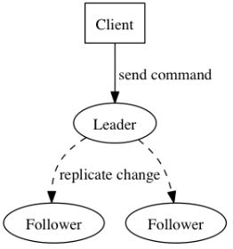

  Raft要求系统在任意时刻最多只有一个Leader，正常工作期间只有Leader和Followers。Raft算法将时间分为一个个的**任期（term）**，每一个term的开始都是Leader选举。在成功选举Leader之后，Leader会在整个term内管理整个集群。如果Leader选举失败，该term就会因为没有Leader而结束。

## 2、Term

  **Raft 算法将时间划分成为任意不同长度的任期（term）**。任期用连续的数字进行表示。**每一个任期的开始都是一次选举（election），一个或多个候选人会试图成为领导人**。如果一个候选人赢得了选举，它就会在该任期的剩余时间担任领导人。在某些情况下，选票会被瓜分，有可能没有选出领导人，那么，将会开始另一个任期，并且立刻开始下一次选举。**Raft 算法保证在给定的一个任期最多只有一个领导人**。

## 3、RPC

  **Raft 算法中服务器节点之间通信使用远程过程调用（RPC）**，并且基本的一致性算法只需要两种类型的 RPC，为了在服务器之间传输快照增加了第三种 RPC。

【RPC有三种】：

- **RequestVote RPC**：**候选人在选举期间发起**。
- **AppendEntries RPC**：**领导人发起的一种心跳机制，复制日志也在该命令中完成**。
- **InstallSnapshot RPC**: 领导者使用该RPC来**发送快照给太落后的追随者**。

# 二、Leader选举

## 1、Leader选举的过程

  **Raft 使用心跳（heartbeat）触发Leader选举**。当服务器启动时，初始化为Follower。**Leader**向所有**Followers**周期性发送**heartbeat**。**如果Follower在选举超时时间内没有收到Leader的heartbeat，就会等待一段随机的时间后发起一次Leader选举**。

  **每一个follower都有一个时钟，是一个随机的值，表示的是follower等待成为leader的时间，谁的时钟先跑完，则发起leader选举**。

  **Follower将其当前term加一然后转换为Candidate。它首先给自己投票并且给集群中的其他服务器发送 RequestVote RPC**。结果有以下三种情况：

- **赢得了多数的选票，成功选举为Leader**；
- 收到了Leader的消息，表示有其它服务器已经抢先当选了Leader；
- 没有服务器赢得多数的选票，Leader选举失败，等待选举时间**超时后发起下一次选举**。
  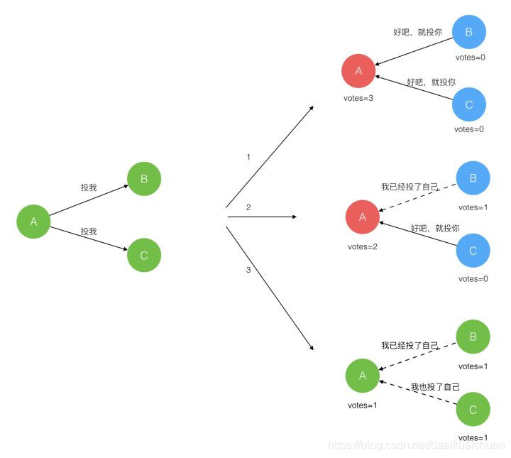

## 2、Leader选举的限制

  **在Raft协议中，所有的日志条目都只会从Leader节点往Follower节点写入，且Leader节点上的日志只会增加，绝对不会删除或者覆盖**。

  这意味着Leader节点必须包含所有已经提交的日志，即能被选举为Leader的节点一定需要包含所有的已经提交的日志。因为日志只会从Leader向Follower传输，所以如果被选举出的Leader缺少已经Commit的日志，那么这些已经提交的日志就会丢失，显然这是不符合要求的。

  这就是Leader选举的限制：**能被选举成为Leader的节点，一定包含了所有已经提交的日志条目**。

# 三、日志复制（保证数据一致性）

## 1、日志复制的过程

  **Leader选出后，就开始接收客户端的请求**。**Leader把请求作为日志条目（Log entries）加入到它的日志中，然后并行的向其他服务器发起 AppendEntries RPC复制日志条目**。当这条日志被复制到大多数服务器上，Leader将这条日志应用到它的状态机并向客户端返回执行结果。

- 客户端的每一个请求都包含被复制状态机执行的指令。
- **leader把这个指令作为一条新的日志条目添加到日志中，然后并行发起 RPC 给其他的服务器，让他们复制这条信息**。
- 假如这条日志被安全的复制，领导人就应用这条日志到自己的状态机中，并返回给客户端。
- **如果 follower 宕机或者运行缓慢或者丢包，leader会不断的重试，直到所有的 follower 最终都复制了所有的日志条目**。

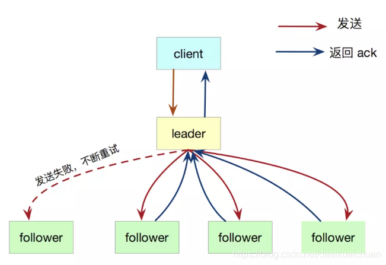
  **简而言之，leader选举的过程是：1、增加term号；2、给自己投票；3、重置选举超时计时器；4、发送请求投票的RPC给其它节点**。

## 2、日志的组成

  **日志由有序编号（log index）的日志条目组成**。**每个日志条目包含它被创建时的任期号（term）和用于状态机执行的命令**。如果一个日志条目被复制到大多数服务器上，就被认为可以提交（commit）了。
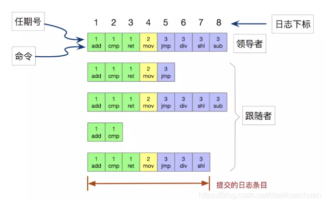

上图显示，共有 8 条日志，提交了 7 条。提交的日志都将通过状态机持久化到磁盘中，防止宕机。

## 3、日志的一致性

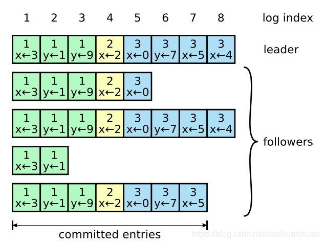

## （1）日志复制的两条保证

- 如果不同日志中的两个条目有着**相同的索引和任期号，则它们所存储的命令是相同的**（原因：**leader 最多在一个任期里的一个日志索引位置创建一条日志条目，日志条目在日志的位置从来不会改变**）。
- 如果不同日志中的两个条目有着**相同的索引和任期号，则它们之前的所有条目都是完全一样的**（原因：**每次 RPC 发送附加日志时**，leader 会把这条日志条目的前面的**日志的下标和任期号一起发送给 follower**，如果 **follower 发现和自己的日志不匹配，那么就拒绝接受这条日志**，这个称之为**一致性检查**）。

## （2）日志的不正常情况

  一般情况下，Leader和Followers的日志保持一致，因此 AppendEntries 一致性检查通常不会失败。然而，Leader崩溃可能会导致日志不一致：**旧的Leader可能没有完全复制完日志中的所有条目**。

  下图阐述了一些Followers可能和新的Leader日志不同的情况。**一个Follower可能会丢失掉Leader上的一些条目，也有可能包含一些Leader没有的条目，也有可能两者都会发生**。丢失的或者多出来的条目可能会持续多个任期。
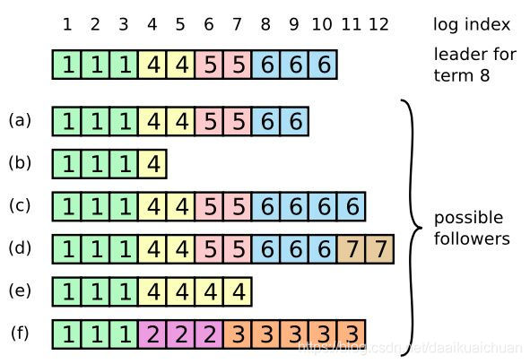

## （3）如何保证日志的正常复制

  Leader通过强制Followers复制它的日志来处理日志的不一致，Followers上的不一致的日志会被Leader的日志覆盖。**Leader为了使Followers的日志同自己的一致，Leader需要找到Followers同它的日志一致的地方，然后覆盖Followers在该位置之后的条目**。

  具体的操作是：**Leader会从后往前试**，每次AppendEntries失败后尝试前一个日志条目，**直到成功找到每个Follower的日志一致位置点（基于上述的两条保证），然后向后逐条覆盖Followers在该位置之后的条目**。

  总结一下就是：**当 leader 和 follower 日志冲突的时候**，leader 将**校验 follower 最后一条日志是否和 leader 匹配**，如果不匹配，**将递减查询，直到匹配，匹配后，删除冲突的日志**。这样就实现了主从日志的一致性。

# 四、安全性

  Raft增加了如下两条限制以保证安全性：

- 拥有**最新的已提交的log entry的Follower才有资格成为leader**。
- **Leader只能推进commit index来提交当前term的已经复制到大多数服务器上的日志**，旧term日志的提交要等到提交当前term的日志来间接提交（log index 小于 commit index的日志被间接提交）。
  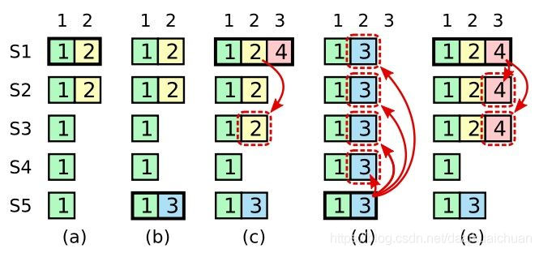

# 五、日志压缩

  在实际的系统中，**不能让日志无限增长**，否则**系统重启时需要花很长的时间进行回放**，从而影响可用性。**Raft采用对整个系统进行snapshot来解决，snapshot之前的日志都可以丢弃（以前的数据已经落盘了）**。

  **每个副本独立的对自己的系统状态进行snapshot，并且只能对已经提交的日志记录进行snapshot**。

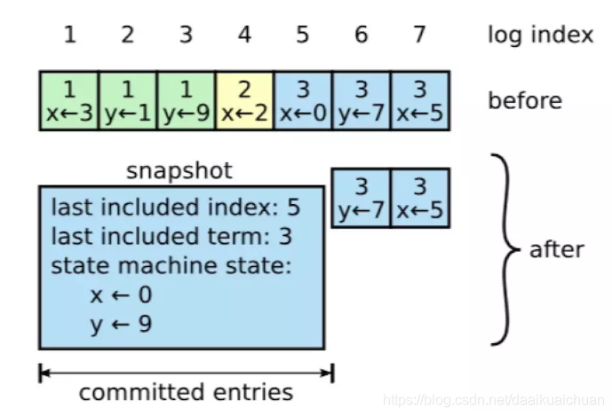

【**Snapshot中包含以下内容**】：

- **日志元数据，最后一条已提交的 log entry的 log index和term**。这两个值在snapshot之后的第一条log entry的AppendEntries RPC的完整性检查的时候会被用上。
- **系统当前状态**。

  当Leader要发给某个日志落后太多的Follower的log entry被丢弃，Leader会将snapshot发给Follower。或者当新加进一台机器时，也会发送snapshot给它。发送snapshot使用InstalledSnapshot RPC。

  做snapshot既不要做的太频繁，否则**消耗磁盘带宽**， 也不要做的太不频繁，否则一旦节点重启需要回放大量日志，影响可用性。**推荐当日志达到某个固定的大小做一次snapshot**。

  做一次snapshot可能耗时过长，会影响正常日志同步。可以通过使用copy-on-write技术避免snapshot过程影响正常日志同步。

# 六、成员变更

## 1、常规处理成员变更存在的问题

  我们先将成员变更请求当成普通的写请求，由领导者得到多数节点响应后，每个节点提交成员变更日志，将从旧成员配置（Cold）切换到新成员配置（Cnew）。但每个节点提交成员变更日志的时刻可能不同，这将造成各个服务器切换配置的时刻也不同，这就有可能选出两个领导者，破坏安全性。

  考虑以下这种情况：集群配额从 3 台机器变成了 5 台，**可能存在这样的一个时间点，两个不同的领导者在同一个任期里都可以被选举成功（双主问题）**，**一个是通过旧的配置，一个通过新的配置**。

  **简而言之，成员变更存在的问题是增加或者减少的成员太多了，导致旧成员组和新成员组没有交集，因此出现了双主**。
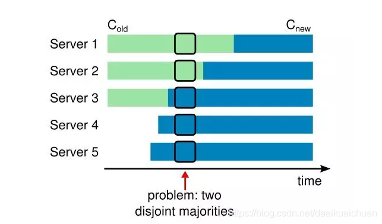

## 2、解决方案之一阶段成员变更

  **Raft解决方法是每次成员变更只允许增加或删除一个成员（如果要变更多个成员，连续变更多次）**。
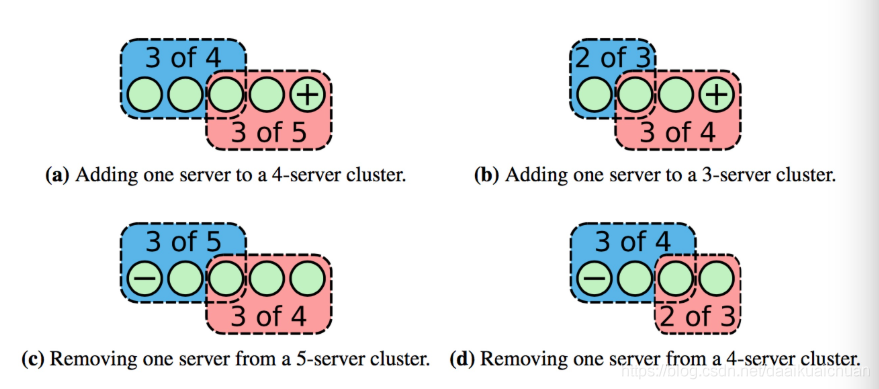

# 七、关于Raft的一些面试题

## 1、Raft分为哪几个部分？

  **主要是分为leader选举、日志复制、日志压缩、成员变更等**。

## 2、Raft中任何节点都可以发起选举吗？

  Raft发起选举的情况有如下几种：

- 刚启动时，所有节点都是follower，这个时候发起选举，选出一个leader；
- 当leader挂掉后，**时钟最先跑完的follower发起重新选举操作**，选出一个新的leader。
- 成员变更的时候会发起选举操作。

## 3、Raft中选举中给候选人投票的前提？

  **Raft确保新当选的Leader包含所有已提交（集群中大多数成员中已提交）的日志条目**。这个保证是在RequestVoteRPC阶段做的，candidate在发送RequestVoteRPC时，会带上自己的**last log entry的term_id和index**，follower在接收到RequestVoteRPC消息时，**如果发现自己的日志比RPC中的更新，就拒绝投票**。日志比较的原则是，如果本地的最后一条log entry的term id更大，则更新，如果term id一样大，则日志更多的更大(index更大)。

## 4、Raft网络分区下的数据一致性怎么解决？

  发生了网络分区或者网络通信故障，**使得Leader不能访问大多数Follwer了，那么Leader只能正常更新它能访问的那些Follower，而大多数的Follower因为没有了Leader，他们重新选出一个Leader**，然后这个 Leader来接受客户端的请求，如果客户端要求其添加新的日志，这个新的Leader会通知大多数Follower。**如果这时网络故障修复 了，那么原先的Leader就变成Follower，在失联阶段这个老Leader的任何更新都不能算commit，都回滚，接受新的Leader的新的更新（递减查询匹配日志）**。
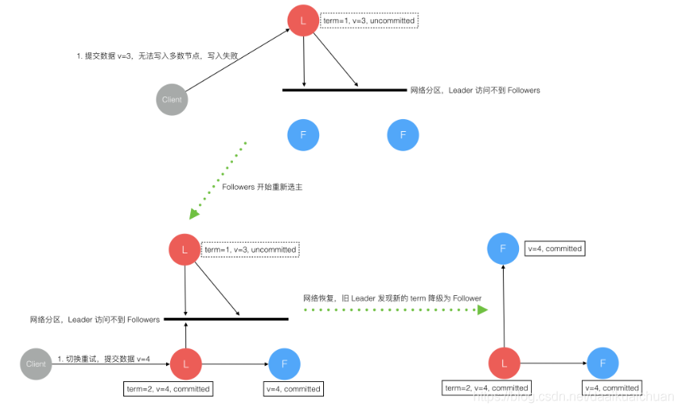

## 5、Raft数据一致性如何实现？

  **主要是通过日志复制实现数据一致性，leader将请求指令作为一条新的日志条目添加到日志中，然后发起RPC 给所有的follower，进行日志复制，进而同步数据**。

## 6、Raft的日志有什么特点？

  **日志由有序编号（log index）的日志条目组成，每个日志条目包含它被创建时的任期号（term）和用于状态机执行的命令**。

## 7、Raft和Paxos的区别和优缺点？

- Raft的leader有限制，**拥有最新日志的节点才能成为leader**，multi-paxos中对成为Leader的限制比较低，**任何节点都可以成为leader**。
- **Raft中Leader在每一个任期都有Term**号。

## 8、Raft prevote机制？

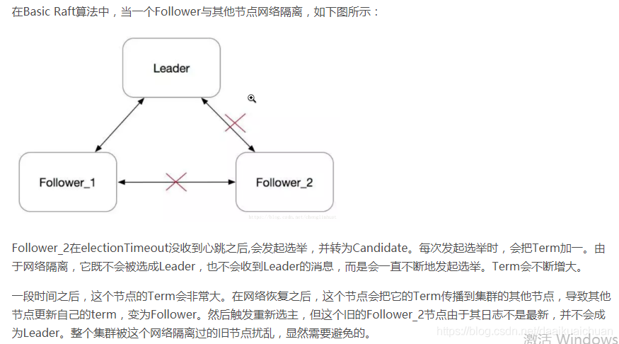
  **Prevote（预投票）是一个类似于两阶段提交的协议**，**第一阶段先征求其他节点是否同意选举，如果同意选举则发起真正的选举操作，否则降为Follower角色**。这样就**避免了网络分区节点重新加入集群，触发不必要的选举操作**。

## 9、Raft里面怎么保证数据被commit，leader宕机了会怎样，之前的没提交的数据会怎样？

  **leader会通过RPC向follower发出日志复制，等待所有的follower复制完成，这个过程是阻塞的**。

  **老的leader里面没提交的数据会回滚，然后同步新leader的数据**。

## 10、Raft日志压缩是怎么实现的？增加或删除节点呢？？

  在实际的系统中，**不能让日志无限增长**，否则**系统重启时需要花很长的时间进行回放**，从而影响可用性。**Raft采用对整个系统进行snapshot来解决，snapshot之前的日志都可以丢弃（以前的数据已经落盘了）**。

  **snapshot里面主要记录的是日志元数据，即最后一条已提交的 log entry的 log index和term**。

## 11、Raft里面的lease机制是什么，有什么作用？

  **租约机制确保了一个时刻最多只有一个leader，避免只使用心跳机制产生双主的问题**。**中心思想是每次租约时长内只有一个节点获得租约、到期后必须重新颁发租约**。
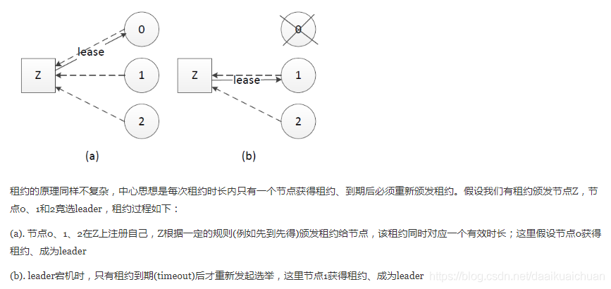

## 12、Raft协议的leader选举，正常情况下，网络抖动造成follower发起leader选举，且该follower的Term比现有leader高，集群中所有结点的日志信息当前一致，这种情况下会选举成功吗？