# 1、MySql 安装  

见 MySql 安装文档

# 2、Hive 安装及配置

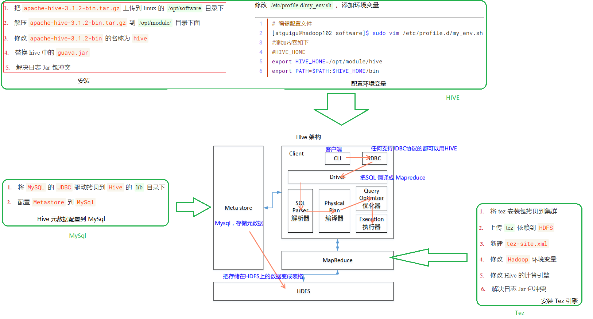

---

## 2.1、Hive 安装地址

* Hive 官网地址：http://hive.apache.org/
* 文档查看地址：https://cwiki.apache.org/confluence/display/Hive/GettingStarted
* 下载地址：http://archive.apache.org/dist/hive/ 
* github 地址：https://github.com/apache/hive  


## 2.2、Hive 安装部署

### 2.2.1、安装 Hive

​		Hive 安装部署可以用命令行方式或编写脚本来执行，两者选其一即可。另外 `Hive` 和 `Tez` 在 ==hadoop102== 上就可以了不需要 `xsync`。

---

> **（1）命令行方式**

1. 把 `apache-hive-3.1.2-bin.tar.gz` 上传到 linux 的 ==/opt/software== 目录下
2. 解压 `apache-hive-3.1.2-bin.tar.gz` 到 ==/opt/module/== 目录下面

```shell
[atguigu@hadoop102 software]$ tar -zxvf /opt/software/apache-hive-3.1.2-bin.tar.gz -C /opt/module/
```

3. 修改 `apache-hive-3.1.2-bin` 的名称为 `hive`

```shell
[atguigu@hadoop102 software]$ mv /opt/module/apache-hive-3.1.2-bin/ /opt/module/hive
```

4. 替换 hive 中的 `guava.jar`

```shell
[atguigu@hadoop102 software]$ cp $HADOOP_HOME/share/hadoop/common/lib/guava-27.0-jre.jar /opt/module/hive/lib/

[atguigu@hadoop102 software]$ rm /opt/module/hive/lib/guava-19.0.jar
```

5. 解决日志 Jar 包冲突，对于 `$HIVE_HOME` 要配置环境变量

```shell
[atguigu@hadoop102 software]$ mv $HIVE_HOME/lib/log4j-slf4j-impl-2.10.0.jar $HIVE_HOME/lib/log4j-slf4j-impl-2.10.0.bak
```


> **（2）编写执行脚本方式 install.sh**

```shell
#！/bin/bash
HADOOP_HOME=/opt/module/hadoop-3.1.3
HIVE_HOME=/opt/module/hive

# 1、解压 apache-hive-3.1.2-bin.tar.gz 到/opt/module/目录下面
tar -zxvf /opt/software/apache-hive-3.1.2-bin.tar.gz -C /opt/module/

# 2、修改 apache-hive-3.1.2-bin.tar.gz 的名称为 hive
mv /opt/module/apache-hive-3.1.2-bin/ /opt/module/hive

# 3、复制 guava.jar
cp $HADOOP_HOME/share/hadoop/common/lib/guava-27.0-jre.jar $HIVE_HOME/lib/

# 3、因为Hadoop兼容性问题，可以删除掉来解决日志 Jar 包冲突
mv $HIVE_HOME/lib/log4j-slf4j-impl-2.10.0.jar $HIVE_HOME/lib/log4j-slf4j-impl-2.10.0.bak
```

**注意**：对于 `rm /opt/module/hive/lib/guava-19.0.jar`，看是否有再决定是否删除。


### 2.2.2、添加环境变量

修改 ==/etc/profile.d/my_env.sh==， 添加环境变量

```shell
# 编辑配置文件
[atguigu@hadoop102 software]$ sudo vim /etc/profile.d/my_env.sh
#添加内容如下
#HIVE_HOME
export HIVE_HOME=/opt/module/hive
export PATH=$PATH:$HIVE_HOME/bin

# 重新加载配置文件
[atguigu@hadoop102 software]$ source /etc/profile.d/my_env.sh

# 测试是否配置成功
[atguigu@hadoop102 software]$ echo $HIVE_HOME
```

**注意**：重启 Xshell 对话框使环境变量生效


## 2.3、Hive 元数据配置到 MySql

1. 将 `MySQL` 的 `JDBC` 驱动拷贝到 `Hive` 的 ==lib== 目录下  

```shell
# 让 Hive 能读取 MySQL
[atguigu@hadoop102 software]$ cp /opt/software/mysql-connector-java-5.1.48.jar $HIVE_HOME/lib
```

2. 配置 `Metastore` 到 `MySql`

在 ==$HIVE_HOME/conf== 目录下新建 ==hive-site.xml== 文件  

```shell
[atguigu@hadoop102 software]$ vim $HIVE_HOME/conf/hive-site.xml
```

添加如下内容

```xml
<?xml version="1.0"?>
<?xml-stylesheet type="text/xsl" href="configuration.xsl"?>
<configuration>
    <!--metastore是数据库名，可以改成hive更容易理解-->
    <property>
        <name>javax.jdo.option.ConnectionURL</name>
        <value>jdbc:mysql://hadoop102:3306/metastore?useSSL=false</value>
    </property>
    
    <!--连接的驱动类型-->
    <property>
        <name>javax.jdo.option.ConnectionDriverName</name>
        <value>com.mysql.jdbc.Driver</value>
    </property>
    
    <!--用户名：root-->
    <property>
        <name>javax.jdo.option.ConnectionUserName</name>
        <value>root</value>
    </property>
    
    <!--密码：topcloud-->
    <property>
        <name>javax.jdo.option.ConnectionPassword</name>
        <value>topcloud</value>
    </property>
    
    <!--hive 的数据仓库在 hdfs 的位置-->
    <property>
        <name>hive.metastore.warehouse.dir</name>
        <value>/user/hive/warehouse</value>
    </property>
    
    <!--不验证-->
    <property>
        <name>hive.metastore.schema.verification</name>
        <value>false</value>
    </property>
    
    <!--metastore 的访问地址-->
    <property>
        <name>hive.metastore.uris</name>
        <value>thrift://hadoop102:9083</value>
    </property>
    
    <!--hive服务器端口号-->
    <property>
        <name>hive.server2.thrift.port</name>
        <value>10000</value>
    </property>
    
    <!--hive服务器主机名-->
    <property>
        <name>hive.server2.thrift.bind.host</name>
        <value>hadoop102</value>
    </property>
    
    <property>
        <name>hive.metastore.event.db.notification.api.auth</name>
        <value>false</value>
    </property>
</configuration>
```

# 3、安装 Tez 引擎

## 3.1、安装 Tez

将 tez 安装包拷贝到集群，并解压 tar 包

```shell
[topcloud@hadoop102 ~]$ mkdir /opt/module/tez

[topcloud@hadoop102 ~]$ tar -zxvf /opt/software/tez-0.10.1-SNAPSHOT.tar.gz -C /opt/module/tez/
```


## 3.2、Tez、HDFS 之间的配置

1. 上传 ==tez== 依赖到 `HDFS`

```shell
# 因为是散装版本，所以要新建文件夹 tez
[topcloud@hadoop102 software]$ hadoop fs -mkdir /tez

# 上传文件到文件夹
[topcloud@hadoop102 hadoop]$ hdoop fs -put /opt/software/tez-0.10.1-SNAPSHOT.tar.gz /tez
```

2. 新建 `tez-site.xml`

```shell
[atguigu@hadoop102 software]$ vim $HADOOP_HOME/etc/hadoop/tez-site.xml
```

添加如下内容：  

```xml
<?xml version="1.0" encoding="UTF-8"?>
<?xml-stylesheet type="text/xsl" href="configuration.xsl"?>
<configuration>
    <property>
        <name>tez.lib.uris</name>
        <value>${fs.defaultFS}/tez/tez-0.10.1-SNAPSHOT.tar.gz</value>
    </property>
    <property>
        <name>tez.use.cluster.hadoop-libs</name>
        <value>true</value>
    </property>
    <property>
        <name>tez.am.resource.memory.mb</name>
        <value>1024</value>
    </property>
    <property>
        <name>tez.am.resource.cpu.vcores</name>
        <value>1</value>
    </property>
    <property>
        <name>tez.container.max.java.heap.fraction</name>
        <value>0.4</value>
    </property>
    <property>
        <name>tez.task.resource.memory.mb</name>
        <value>1024</value>
    </property>
    <property>
        <name>tez.task.resource.cpu.vcores</name>
        <value>1</value>
    </property>
</configuration>
```

3. 修改  `Hadoop` 环境变量

   * **方式一**

   编辑 ==shellprofile.d/tez.sh==

   ```shell
   # 编辑 hadoop-env.sh
   [atguigu@hadoop102 software]$ vim $HADOOP_HOME/etc/hadoop/shellprofile.d/tez.sh
   ```

   添加 Tez 的 Jar 包相关信息

   ```shell
   hadoop_add_profile tez
   function _tez_hadoop_classpath
   {
       hadoop_add_classpath "$HADOOP_HOME/etc/hadoop" after
       hadoop_add_classpath "/opt/module/tez/*" after
       hadoop_add_classpath "/opt/module/tez/lib/*" after
   }
   ```

   * **方式二**

   编辑 ==hadoop-env.sh==

   ```shell
   [topcloud@hadoop102 hadoop]$ vim $HADOOP_HOME/etc/hadoop/hadoop-env.sh
   ```

   在 126 行添加 Tez 的 Jar 包相关信息

   ```shell
   export TEZ_CONF_DIR=$HADOOP_HOME/etc/hadoop
   export TEZ_JARS=/opt/module/tez
   export HADOOP_CLASSPATH=$HADOOP_CLASSPATH:${TEZ_CONF_DIR}:${TEZ_JARS}/*:${TEZ_JARS}/lib/*
   ```


## 3.3、Tez、Hive 之间的配置

1. 修改 Hive 的计算引擎

```shell
[atguigu@hadoop102 ~]$ vim $HIVE_HOME/conf/hive-site.xml
```

添加

```xml
<!--执行引擎为 tez-->
<property>
    <name>hive.execution.engine</name>
    <value>tez</value>
</property>
<property>
    <name>hive.tez.container.size</name>
    <value>1024</value>
</property>
```

2. 解决日志 Jar 包冲突

```shell
[topcloud@hadoop102 ~]$ rm /opt/module/tez/lib/slf4j-log4j12-1.7.10.jar
```

# 4、启动 Hive

## 4.1、始化元数据库

1. 登陆 `MySQL`

```shell
[topcloud@hadoop102 ~]$ mysql -uroot -ptopcloud
```

2. 新建 `Hive` 元数据库

```mysql
# 这里的数据名要叫做 metastore，这与前面的配置有关
mysql> create database metastore;
mysql> quit
```

3. 初始化 `Hive` 元数据库

```shell
[topcloud@hadoop102 ~]$ schematool -initSchema -dbType mysql -verbose
```


## 4.3、启动 metastore 和 hiveserver2  

1. `Hive 2.x` 以上版本， 要先 `metastore` 和 `hiveserver2` 启动这两个服务， 否则会报错
   *  `metastore` 位于 ==/opt/lzj/hive/bin/ext/metastore.sh==
   *  `hiveserver2` 位于 ==/opt/lzj/hive/bin/ext/hiveserver2.sh==

```shell
FAILED: HiveException java.lang.RuntimeException: Unable to instantiate
org.apache.hadoop.hive.ql.metadata.SessionHiveMetaStoreClient
```

2. 编写 `hive` 服务启动脚本

```shell
[atguigu@hadoop102 software]$ vim $HIVE_HOME/bin/hiveservices.sh
```

内容如下：

```shell
#!/bin/bash
HIVE_LOG_DIR=$HIVE_HOME/logs

mkdir -p $HIVE_LOG_DIR

#检查进程是否运行正常，参数1为进程名，参数2为进程端口
function check_process()
{
    pid=$(ps -ef 2>/dev/null | grep -v grep | grep -i $1 | awk '{print $2}')
    ppid=$(netstat -nltp 2>/dev/null | grep $2 | awk '{print $7}' | cut -d '/' -f 1)
    echo $pid
    [[ "$pid" =~ "$ppid" ]] && [ "$ppid" ] && return 0 || return 1
}

function hive_start()
{
    metapid=$(check_process HiveMetastore 9083)
    cmd="nohup hive --service metastore >$HIVE_LOG_DIR/metastore.log 2>&1 &"
    cmd=$cmd" sleep 4; hdfs dfsadmin -safemode wait >/dev/null 2>&1"
    [ -z "$metapid" ] && eval $cmd || echo "Metastroe服务已启动"
    server2pid=$(check_process HiveServer2 10000)
    cmd="nohup hive --service hiveserver2 >$HIVE_LOG_DIR/hiveServer2.log 2>&1 &"
    [ -z "$server2pid" ] && eval $cmd || echo "HiveServer2服务已启动"
}

function hive_stop()
{
    metapid=$(check_process HiveMetastore 9083)
    [ "$metapid" ] && kill $metapid || echo "Metastore服务未启动"
    server2pid=$(check_process HiveServer2 10000)
    [ "$server2pid" ] && kill $server2pid || echo "HiveServer2服务未启动"
}

case $1 in
"start")
    hive_start
    ;;
"stop")
    hive_stop
    ;;
"restart")
    hive_stop
    sleep 2
    hive_start
    ;;
"status")
    check_process HiveMetastore 9083 >/dev/null && echo "Metastore服务运行正常" || echo "Metastore服务运行异常"
    check_process HiveServer2 10000 >/dev/null && echo "HiveServer2服务运行正常" || echo "HiveServer2服务运行异常"
    ;;
*)
    echo Invalid Args!
    echo 'Usage: '$(basename $0)' start|stop|restart|status'
    ;;
esac
```

3. 添加执行权限

```shell
[atguigu@hadoop102 software]$ chmod +x $HIVE_HOME/bin/hiveservices.sh
```

4. 启动 `Hive` 后台服务

```shell
[atguigu@hadoop102 software]$ hiveservices.sh start
```

5. 查看启动的进程

```shell
[topcloud@hadoop102 bin]$ jpsall
==========
1920 DataNode
2984 RunJar
1773 NameNode
2286 NodeManager
2798 RunJar
==========
1680 DataNode
1893 ResourceManager
2021 NodeManager
==========
1888 NodeManager
1748 SecondaryNameNode
1641 DataNode
```

6. 看考端口，若有三个则开启成功

```shell
[topcloud@hadoop102 bin]$ netstat -nltp | grep -E 2984\|2798
(Not all processes could be identified, non-owned process info
 will not be shown, you would have to be root to see it all.)
tcp6       0      0 :::10000                :::*                    LISTEN      2984/java           
tcp6       0      0 :::10002                :::*                    LISTEN      2984/java           
tcp6       0      0 :::9083                 :::*                    LISTEN      2798/java 
```


## 4.4、HiveJDBC 访问

只要客户端支持 JDBC 即可访问。

### 4.4.1、使用 beeline 客户端连接 

1. 配置 Haoop 的 `core-site.xml`

```xml
<!--下面两个配置是为了兼容hive,否则登不上 hive 服务器。其中“xxx”是连接beeline的用户，将“xxx”替换成自己的用户名即可。改完后记得分发，和重启服务器-->
<property>
    <name>hadoop.proxyuser.xxx.hosts</name>
    <value>*</value>
</property>
<property>
    <name>hadoop.proxyuser.xxx.groups</name>
    <value>*</value>
</property>
```

2. 启动 Hive 自带的 ==beeline 客户端==

```shell
[topcloud@hadoop102 ~]$ beeline -u jdbc:hive2://hadoop102:10000 -n topcloud
```

看到如下界面即成功

```shell
Connecting to jdbc:hive2://hadoop102:10000
Connected to: Apache Hive (version 3.1.2)
Driver: Hive JDBC (version 3.1.2)
Transaction isolation: TRANSACTION_REPEATABLE_READ
Beeline version 3.1.2 by Apache Hive
0: jdbc:hive2://hadoop102:10000>
```

3. 创建一个表

```mysql
# 创建表
0: jdbc:hive2://hadoop102:10000> create table student(id int, value string);

# 插入数据
0: jdbc:hive2://hadoop102:10000> insert into table student values(1001, "zhangsan");
```

4. 查看 MapReduce 前台界面

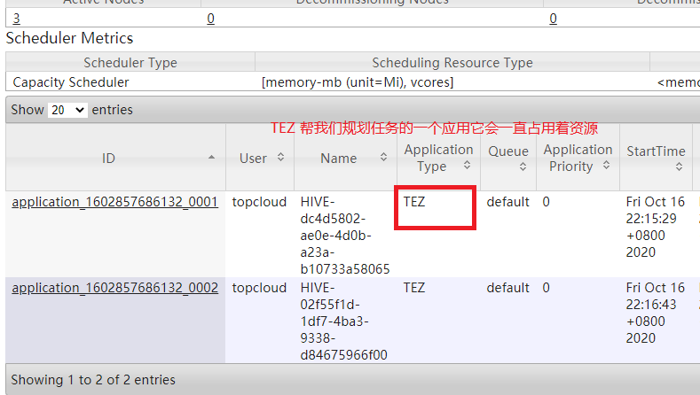

5. 执行结束后查看表数据

```mysql
# 查看表中数据
0: jdbc:hive2://hadoop102:10000> select * from student;
INFO  : Concurrency mode is disabled, not creating a lock manager
+-------------+----------------+
| student.id  | student.value  |
+-------------+----------------+
| 1001        | zhangsan       |
+-------------+----------------+
1 row selected (0.672 seconds)

# 查看数量
0: jdbc:hive2://hadoop102:10000> select id, count(*) from student group by id;
+-------+------+
|  id   | _c1  |
+-------+------+
| 1001  | 1    |
+-------+------+
```


### 4.4.2、使用第三方客户端连接 

下载地址：https://dbeaver.io/download/

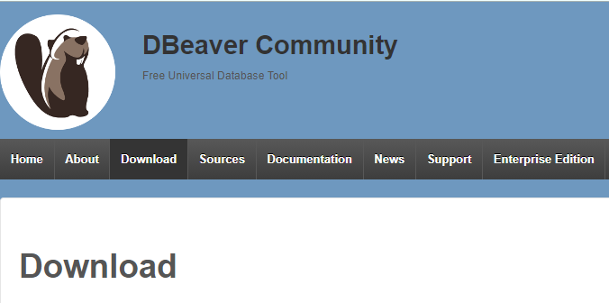

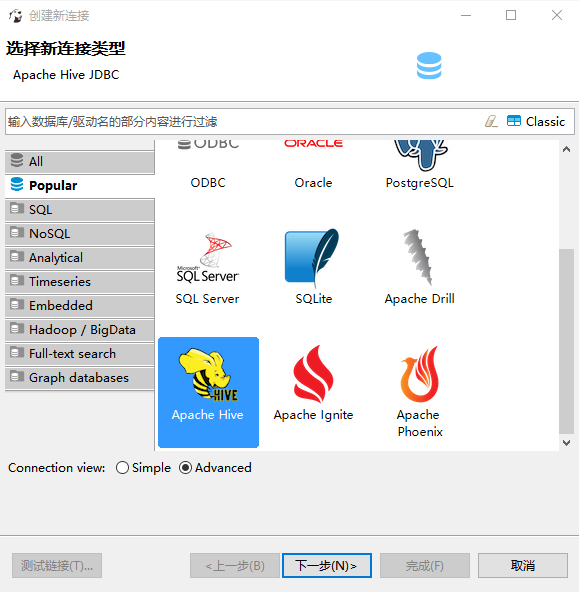

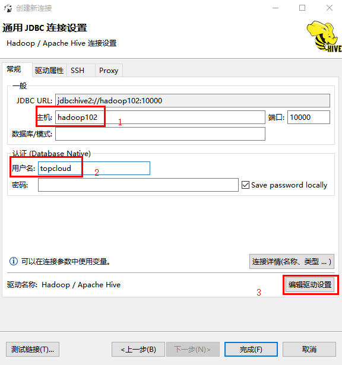

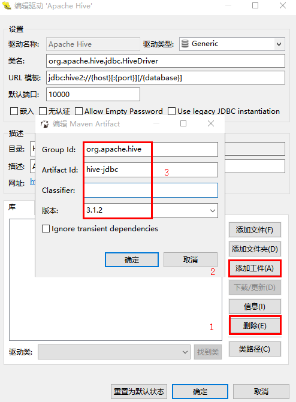

> （1）添加工件方式

去 `Maven` 仓库查找

```xml
<!-- https://mvnrepository.com/artifact/org.apache.hive/hive-jdbc -->
<dependency>
    <groupId>org.apache.hive</groupId>
    <artifactId>hive-jdbc</artifactId>
    <version>3.1.2</version>
</dependency>
```

确定后点击下载更新

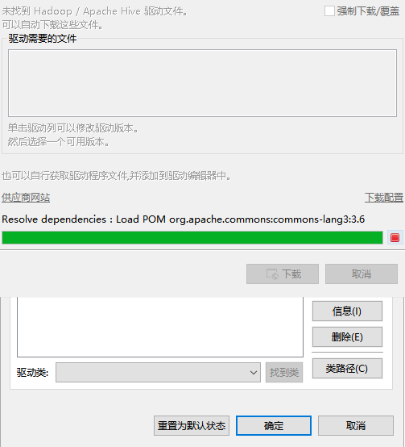

> （2）选择添加文件的方式

文件位于 `hive` 压缩包下的 ==jdbc== 中，将其进行解压

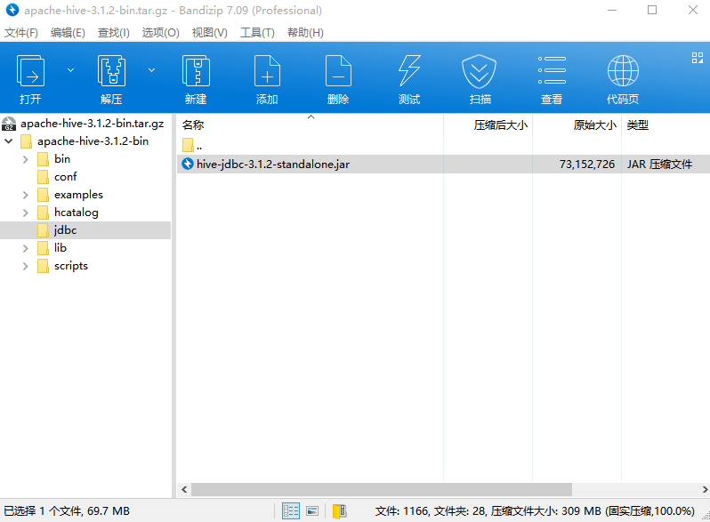

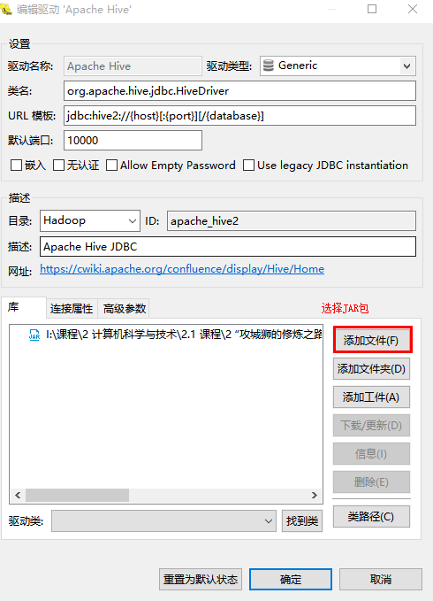

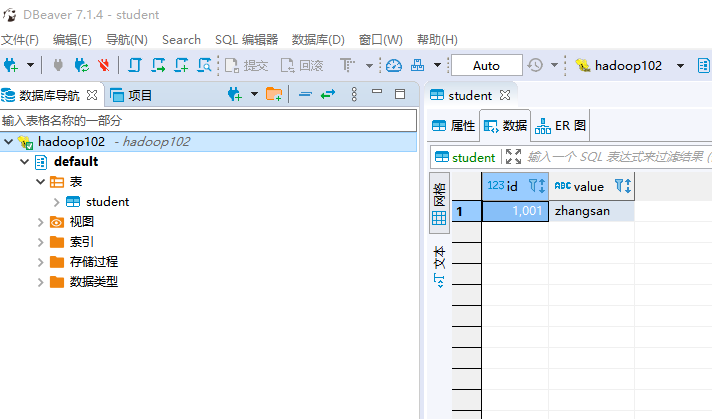

**说明**：如果觉得字体太小了，可以选择 ==首选项 -> 常规 -> 外观 -> 颜色和字体 ->  基本 -> 文本字体==，进行修改。

# 5、Hive 常用交互命令  

```shell
[topcloud@hadoop102 hive]$ bin/hive -help
usage: hive
 -d,--define <key=value>          Variable substitution to apply to Hive
                                  commands. e.g. -d A=B or --define A=B
    --database <databasename>     Specify the database to use
 -e <quoted-query-string>         SQL from command line
 -f <filename>                    SQL from files
 -H,--help                        Print help information
    --hiveconf <property=value>   Use value for given property
    --hivevar <key=value>         Variable substitution to apply to Hive
                                  commands. e.g. --hivevar A=B
 -i <filename>                    Initialization SQL file
 -S,--silent                      Silent mode in interactive shell
 -v,--verbose                     Verbose mode (echo executed SQL to the
                                  console)
```

* `"-e"`：不进入 hive 的交互窗口执行 sql 语句；

* `"-f"`：执行脚本中 sql 语句；

  1. 在/opt/module/datas 目录下创建 hivef.sql 文件

  ```shell
  [atguigu@hadoop102 datas]$ touch hivef.sql
  ```

  2. 文件中写入正确的 sql 语句

  ```shell
  select *from student;
  ```

  3. 执行文件中的 sql 语句

  ```shell
  [atguigu@hadoop102 hive]$ bin/hive -f /opt/module/datas/hivef.sql
  ```

  4. 执行文件中的 sql 语句并将结果写入文件中

  ```shell
  [atguigu@hadoop102 hive]$ bin/hive -f /opt/module/datas/hivef.sql >
  /opt/module/datas/hive_result.txt
  ```

# 6、Hive 其他命令操作

1. 退出 `hive` 窗口

```shell
# 在新版的 hive 中没区别了，在以前的版本是有的
# exit:先隐性提交数据，再退出；
# quit:不提交数据，退出； 

hive(default)> !exit;
hive(default)> !quit;
```

2. 在 `hive cli` 命令窗口中如何查看 ==hdfs 文件系统==

```shell
hive(default)>dfs -ls /;
```

3. 查看在 hive 中输入的所有历史命令

```shell
# 1、进入到当前用户的根目录/root 或/home/atguigu

# 2、查看. hivehistory 文件
[atguigu@hadoop102 ~]$ cat .hivehistory
```

# 7、Hive 常见属性配置  

## 7.1、Hive 运行日志信息配置

Hive 的 `log` 默认存放在 ==/tmp/atguigu/hive.log== 目录下（当前用户名下）

修改 hive 的 log 存放日志到 ==/opt/module/hive/logs==

1. 复制 ==/opt/module/hive/conf/hive-log4j.properties.template== 文件名称为 ==hive-log4j.properties==

```shell
[topcloud@hadoop102 hive]$ cd /opt/module/hive/conf/

[topcloud@hadoop102 conf]$ mv hive-log4j2.properties.template hive-log4j2.properties
```

2. 在 ==hive-log4j.properties== 文件中修改 log 存放位置

```shell
property.hive.log.dir = /opt/lzj/hive/logs
```


## 7.2、参数配置的三种方式

查看当前所有的配置信息

```shell
hive> set;
```

> （1）配置文件方式

* 默认配置文件：==hive-default.xml==
* 用户自定义配置文件：==hive-site.xml==

**注意：** 用户自定义配置会覆盖默认配置。 另外， `Hive` 也会读入 `Hadoop` 的配置， 因为 `Hive` 是作为 `Hadoop` 的客户端启动的， `Hive` 的配置会覆盖 `Hadoop` 的配置。配置文件的设定对本机启动的所有 `Hive` 进程都有效。  


> （2）命令行参数方式

启动 Hive 时，可以在命令行添加 `-hiveconf param=value` 来设定参数

```shell
[atguigu@hadoop103 hive]$ bin/hive -hiveconf mapred.reduce.tasks=10;
```

**注意：仅对本次 hive 启动有效**  

查看参数设置：

```mysql
hive (default)> set mapred.reduce.tasks;
```


> （3）参数声明方式

可以在 HQL 中使用 SET 关键字设定参数

```mysql
hive (default)> set mapred.reduce.tasks=100;
```

**注意：仅对本次 hive 启动有效。**

查看参数设置

```shell
hive (default)> set mapred.reduce.tasks;  
```


​		上述三种设定方式的优先级依次递增。即 ==配置文件 < 命令行参数 < 参数声明==。注意某些系统级的参数，例如 `log4j` 相关的设定，必须用前两种方式设定，因为那些参数的读取在会话建立以前已经完成了。  

# 8、错误分析

## 8.1、yarn 资源不足错误


**原因：**该错误是 `YARN` 的==虚拟内存计算方式导致==，上例中用户程序申请的内存为 ==1Gb==，`YARN` 根据此值乘以一个比例（默认为 2.1）得出申请的虚拟内存的值，当 `YARN` 计算的用户程序所需虚拟内存值大于计算出来的值时，就会报出以上错误。调节比例值可以解决该问题。具体参数为：==yarn-site.xml== 中的`yarn.nodemanager.vmem-pmem-ratio`

**解决方法**： 

1. 调整 ==hadoop== 配置文件 ==yarn-site.xml== 中值

```xml
<!--增加yarn.scheduler.minimum-allocation-mb 数量，从缺省1024改为2048；否则可能出现内存不足的情况-->
<property>
    <name>yarn.scheduler.minimum-allocation-mb</name>
    <value>2048</value>
    <description>default value is 1024</description>
</property>
```

2. tez 需要的内存比较大,并且会对虚拟内存有个校验，可以关闭这个校验

```xml
<property>
    <name>yarn.nodemanager.vmem-check-enabled</name>
    <value>false</value>
</property>
```


## 8.2、Beeline连接报错

**Beeline连接报错**：

`Could not open client transport with JDBC Uri: jdbc:hive2://localhost:10000/default`

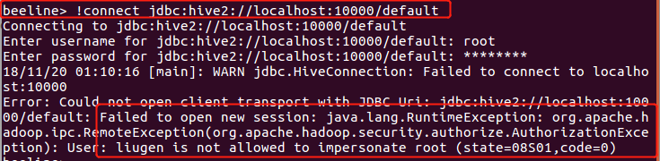

**解决方式**：

​		在 `hadoop` 的配置文件 ==core-site.xml== 增加如下配置，重启 `hdfs`，其中 `“xxx”` 是连接 ``beeline` 的用户，将 `“xxx”` 替换成自己的用户名即可。最关键的是一定要重启 `hadoop` ，先 `stop-all.sh`，再 `start-all.sh`，否则不会生效的！！那样就还是报错！

```xml
<!--下面两个配置是为了兼容hive,否则登不上 hive 服务器。其中“xxx”是连接beeline的用户，将“xxx”替换成自己的用户名即可。改完后记得分发，和重启服务器-->
<property>
    <name>hadoop.proxyuser.xxx.hosts</name>
    <!--“*” 表示可通过超级代理 “xxx” 操作hadoop的用户、用户组和主机-->
    <value>*</value>
</property>
<property>
    <name>hadoop.proxyuser.xxx.groups</name>
    <value>*</value>
</property>
```

**原因分析：**

​		主要原因是 `hadoop` 引入了一个安全伪装机制，使得 `hadoop` 不允许上层系统直接将实际用户传递到 `hadoop` 层，而是将实际用户传递给一个超级代理，由此代理在 `hadoop` 上执行操作，避免任意客户端随意操作 `hadoop`。


## 8.3、更换 Tez 引擎后，执行任务卡住

**如果更换 Tez 引擎后，执行任务卡住，可以尝试调节容量调度器的资源调度策略**

修改 ==$HADOOP_HOME/etc/hadoop/capacity-scheduler.xml== 文件中的 `<value>`

```xml
<property>
    <name>yarn.scheduler.capacity.maximum-am-resource-percent</name>
    <!--<value>0.1</value> 改为 <value>1</value>-->
    <value>0.1</value>
    <description>
      Maximum percent of resources in the cluster which can be used to run 
      application masters i.e. controls number of concurrent running
      applications.
    </description>
</property>
```

