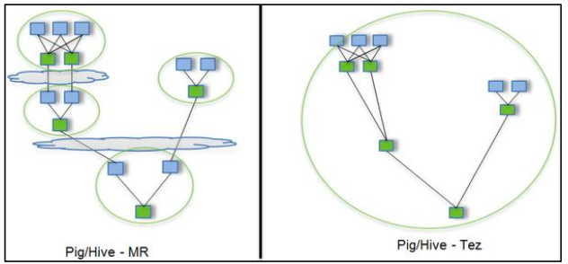
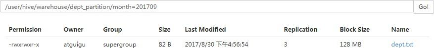

# Hive

# 基本概念

##  什么是Hive

​		Hive是一个基于Hadoop的数据仓库，可以将结构化的数据库文件映射成一张表，并提供类sql的查询功能。

​		Hive本质上就是将HQL转换为MapReduce程序。

##  Hive的架构

​		主要是四个驱动器。

- 解析器
- 编译器
- 优化器
- 执行器

### Hive和数据库的比较

​		Hive和数据库除了拥有类似的查询语句外，没有相似之处。

​		不同主要是由于数据量的不同引起Hive的延迟相对较高，因为它的本质是MapReduce，所以延迟较高，适于对实时性不高的场合，常用于数据的分析。它们数据的存储位置不同，Hive的数据是存储在一个分布式文件系统之中，普通数据库的数据是存储在本地。Hive中的数据读多写少，不建议对数据进行修改。

### Hive的运行机制


​		Hive 通过给用户提供的一系列交互接口，接收到用户的指令(SQL)，使用自己的 Driver，结合元数据(MetaStore)，将这些指令翻译成MapReduce，提交到Hadoop 中执行，最后，将执行返回的结果输出到用户交互接口。  

## Hive的优点

- 操作简单。操作接口采用类SQL
- 避免写MapReduce。
- 适合数据分析，和处理大数据，不适合实时数据分析。
- 支持用户自定义函数。

## Hive的缺点

- 迭代算法无法表达。
- 数据挖掘方面不擅长
- 效率较低

# Hive安装

## Hive安装地址

1）Hive官网地址

http://hive.apache.org/

2）文档查看地址

https://cwiki.apache.org/confluence/display/Hive/GettingStarted

3）下载地址

http://archive.apache.org/dist/hive/

4）github地址

https://github.com/apache/hive

## MySql安装

### 安装包准备

1. 卸载自带的Mysql-libs（如果之前安装过mysq，要全都卸载掉）

```
[atguigu@hadoop102 software]$ rpm -qa | grep -i -E mysql\|mariadb | xargs -n1 sudo rpm -e --nodeps
```


2. 将安装包和JDBC驱动上传到/opt/software，共计6个

```
01_mysql-community-common-5.7.29-1.el7.x86_64.rpm

02_mysql-community-libs-5.7.29-1.el7.x86_64.rpm

03_mysql-community-libs-compat-5.7.29-1.el7.x86_64.rpm

04_mysql-community-client-5.7.29-1.el7.x86_64.rpm

05_mysql-community-server-5.7.29-1.el7.x86_64.rpm

mysql-connector-java-5.1.48.jar
```


### 安装MySql

1. 安装mysql依赖

```
[atguigu@hadoop102 software]$ sudo rpm -ivh 01_mysql-community-common-5.7.29-1.el7.x86_64.rpm
```

```
[atguigu@hadoop102 software]$ sudo rpm -ivh 02_mysql-community-libs-5.7.29-1.el7.x86_64.rpm
```

```
[atguigu@hadoop102 software]$ sudo rpm -ivh 03_mysql-community-libs-compat-5.7.29-1.el7.x86_64.rpm
```

2. 安装mysql-client

```
[atguigu@hadoop102 software]$ sudo rpm -ivh 04_mysql-community-client-5.7.29-1.el7.x86_64.rpm
```

3. 安装mysql-server

[atguigu@hadoop102 software]$ sudo rpm -ivh 05_mysql-community-server-5.7.29-1.el7.x86_64.rpm

4. 启动mysql

```
[atguigu@hadoop102 software]$ sudo systemctl start mysqld
```

5. 查看mysql密码

```
[atguigu@hadoop102 software]$ sudo cat /var/log/mysqld.log | grep password
```

### 配置MySql

配置只要是root用户+密码，在任何主机上都能登录MySQL数据库。

1. 用刚刚查到的密码进入mysql（如果报错，给密码加单引号）

```
[atguigu@hadoop102 software]$ mysql -uroot -p’password’
```

2. 设置复杂密码(由于mysql密码策略，此密码必须足够复杂)

```
mysql> set password=password("Qs23=zs32");
```

3. 更改mysql密码策略

```
mysql> set global validate_password_length=4;

mysql> set global validate_password_policy=0;
```

4. 设置简单好记的密码

```
mysql> set password=password("000000");
```

5. 进入msyql库

```
mysql> use mysql
```

6. 查询user表

```
mysql> select user, host from user;
```

7. 修改user表，把Host表内容修改为%

```
mysql> update user set host="%" where user="root";
```

8. 刷新

```
mysql> flush privileges;
```

9. 退出

```
mysql> quit;
```

##  Hive安装部署

1. 把apache-hive-3.1.2-bin.tar.gz上传到linux的/opt/software目录下 

2. 解压apache-hive-3.1.2-bin.tar.gz到/opt/module/目录下面

```
[atguigu@hadoop102 software]$ tar -zxvf /opt/software/apache-hive-3.1.2-bin.tar.gz -C /opt/module/
```

3. 修改apache-hive-3.1.2-bin.tar.gz的名称为hive

```
[atguigu@hadoop102 software]$ mv /opt/module/apache-hive-3.1.2-bin/ /opt/module/hive
```

4. 修改/etc/profile.d/my_env.sh，添加环境变量

```
[atguigu@hadoop102 software]$ sudo vim /etc/profile.d/my_env.sh
```

5. 添加内容

```
#HIVE_HOME

export HIVE_HOME=/opt/module/hive

export PATH=$PATH:$HIVE_HOME/bin
```

**重启Xshell对话框使环境变量生效**

6. 解决日志Jar包冲突

```
[atguigu@hadoop102 software]$ mv $HIVE_HOME/lib/log4j-slf4j-impl-2.10.0.jar $HIVE_HOME/lib/log4j-slf4j-impl-2.10.0.bak
```

## Hive元数据配置到MySql

### 拷贝驱动

将MySQL的JDBC驱动拷贝到Hive的lib目录下

```
[atguigu@hadoop102 software]$ cp /opt/software/mysql-connector-java-5.1.48.jar $HIVE_HOME/lib
```

### 配置Metastore到MySql

在$HIVE_HOME/conf目录下新建hive-site.xml文件

```
[atguigu@hadoop102 software]$ vim $HIVE_HOME/conf/hive-site.xml
```

添加如下内容

```xml
<?xml version="1.0"?>
<?xml-stylesheet type="text/xsl" href="configuration.xsl"?>
<configuration>
    <property>
        <name>javax.jdo.option.ConnectionURL</name>
        <value>jdbc:mysql://hadoop102:3306/metastore?useSSL=false</value>
    </property>
    <property>
        <name>javax.jdo.option.ConnectionDriverName</name>
        <value>com.mysql.jdbc.Driver</value>
    </property>
    <property>
        <name>javax.jdo.option.ConnectionUserName</name>
        <value>root</value>
    </property>
    <property>
        <name>javax.jdo.option.ConnectionPassword</name>
        <value>000000</value>
    </property> 
    <property>
        <name>hive.metastore.warehouse.dir</name>
        <value>/user/hive/warehouse</value>
    </property>
    <property>
        <name>hive.metastore.schema.verification</name>
        <value>false</value>
    </property>
    <property>
        <name>hive.metastore.uris</name>
        <value>thrift://hadoop102:9083</value>
    </property>
    <property>
        <name>hive.server2.thrift.port</name>
        <value>10000</value>
    </property>
    <property>
        <name>hive.server2.thrift.bind.host</name>
        <value>hadoop102</value>
    </property>
    <property>
        <name>hive.metastore.event.db.notification.api.auth</name>
        <value>false</value>
    </property>
</configuration>
```

## 安装Tez引擎

Tez是一个Hive的运行引擎，性能优于MR。为什么优于MR呢？看下图。



用Hive直接编写MR程序，假设有四个有依赖关系的MR作业，上图中，绿色是Reduce Task，云状表示写屏蔽，需要将中间结果持久化写到HDFS。

Tez可以将多个有依赖的作业转换为一个作业，这样只需写一次HDFS，且中间节点较少，从而大大提升作业的计算性能。

1. 将tez安装包拷贝到集群，并解压tar包

```
[atguigu@hadoop102 software]$ mkdir /opt/module/tez

[atguigu@hadoop102 software]$ tar -zxvf /opt/software/tez-0.10.1-SNAPSHOT-minimal.tar.gz -C /opt/module/tez
```

2. 上传tez依赖到HDFS

```
[atguigu@hadoop102 software]$ hadoop fs -mkdir /tez

[atguigu@hadoop102 software]$ hadoop fs -put /opt/software/tez-0.10.1-SNAPSHOT.tar.gz /tez
```

3. 新建tez-site.xml

```
[atguigu@hadoop102 software]$ vim $HADOOP_HOME/etc/hadoop/tez-site.xml
```

添加如下内容：

```xml
<?xml version="1.0" encoding="UTF-8"?>
<?xml-stylesheet type="text/xsl" href="configuration.xsl"?>
<configuration>
    <property>
        <name>tez.lib.uris</name>
        <value>${fs.defaultFS}/tez/tez-0.10.1-SNAPSHOT.tar.gz</value>
    </property>
    <property>
        <name>tez.use.cluster.hadoop-libs</name>
        <value>true</value>
    </property>
    <property>
        <name>tez.am.resource.memory.mb</name>
        <value>1024</value>
    </property>
    <property>
        <name>tez.am.resource.cpu.vcores</name>
        <value>1</value>
    </property>
    <property>
        <name>tez.container.max.java.heap.fraction</name>
        <value>0.4</value>
    </property>
    <property>
        <name>tez.task.resource.memory.mb</name>
        <value>1024</value>
    </property>
    <property>
        <name>tez.task.resource.cpu.vcores</name>
        <value>1</value>
    </property>
</configuration>
```

4. 修改Hadoop环境变量

编辑hadoop-env.sh

```
[atguigu@hadoop102 software]$ vim $HADOOP_HOME/etc/hadoop/shellprofile.d/tez.sh
```

添加Tez的Jar包相关信息

```
hadoop_add_profile tez
function _tez_hadoop_classpath
{
  hadoop_add_classpath "$HADOOP_HOME/etc/hadoop" after
  hadoop_add_classpath "/opt/module/tez/*" after
  hadoop_add_classpath "/opt/module/tez/lib/*" after
}
```

5. 修改Hive的计算引擎

```
[atguigu@hadoop102 software]$ vim $HIVE_HOME/conf/hive-site.xml
```

添加

```xml
<property>
  <name>hive.execution.engine</name>
  <value>tez</value>
</property>
<property>
  <name>hive.tez.container.size</name>
  <value>1024</value>
</property>
```

6. 解决日志ar包冲突

```
[atguigu@hadoop102 software]$ rm /opt/module/tez/lib/slf4j-log4j12-1.7.10.jar
```

## 启动Hive

### 初始化元数据库

1. 登陆MySQL

```
[atguigu@hadoop102 software]$ mysql -uroot -p000000
```

2. 新建Hive元数据库

```
mysql> create database metastore;

mysql> quit;
```

3. 初始化Hive元数据库

```
[atguigu@hadoop102 software]$ schematool -initSchema -dbType mysql -verbose
```


### 启动metastore和hiveserver2

1. Hive 2.x以上版本，要先启动这两个服务，否则会报错：

FAILED: HiveException java.lang.RuntimeException: Unable to instantiate org.apache.hadoop.hive.ql.metadata.SessionHiveMetaStoreClient

2. 编写hive服务启动脚本

```
[atguigu@hadoop102 software]$ vim $HIVE_HOME/bin/hiveservices.sh
```

内容如下：

```
#!/bin/bash
HIVE_LOG_DIR=$HIVE_HOME/logs

mkdir -p $HIVE_LOG_DIR
#检查进程是否运行正常，参数1为进程名，参数2为进程端口

function check_process()
{
  pid=$(ps -ef 2>/dev/null | grep -v grep | grep -i $1 | awk '{print $2}')
  ppid=$(netstat -nltp 2>/dev/null | grep $2 | awk '{print $7}' | cut -d '/' -f 1)
  echo $pid
  [[ "$pid" =~ "$ppid" ]] && [ "$ppid" ] && return 0 || return 1
}

function hive_start()
{
  metapid=$(check_process HiveMetastore 9083)
  cmd="nohup hive --service metastore >$HIVE_LOG_DIR/metastore.log 2>&1 &"
  cmd=$cmd" sleep 4; hdfs dfsadmin -safemode wait >/dev/null 2>&1"
  [ -z "$metapid" ] && eval $cmd || echo "Metastroe服务已启动"
  server2pid=$(check_process HiveServer2 10000)
  cmd="nohup hive --service hiveserver2 >$HIVE_LOG_DIR/hiveServer2.log 2>&1 &"
  [ -z "$server2pid" ] && eval $cmd || echo "HiveServer2服务已启动"
}

function hive_stop()
{
  metapid=$(check_process HiveMetastore 9083)
  [ "$metapid" ] && kill $metapid || echo "Metastore服务未启动"
  server2pid=$(check_process HiveServer2 10000)
  [ "$server2pid" ] && kill $server2pid || echo "HiveServer2服务未启动"
}

case $1 in
"start")
  hive_start
  ;;
"stop")
  hive_stop
  ;;
"restart")
  hive_stop
  sleep 2
  hive_start
  ;;
"status")
  check_process HiveMetastore 9083 >/dev/null && echo "Metastore服务运行正常" || echo "Metastore服务运行异常"
  check_process HiveServer2 10000 >/dev/null && echo "HiveServer2服务运行正常" || echo "HiveServer2服务运行异常"
  ;;
*)
  echo Invalid Args!
  echo 'Usage: '$(basename $0)' start|stop|restart|status'
  ;;
esac
```

3. 添加执行权限

```
[atguigu@hadoop102 software]$ chmod +x $HIVE_HOME/bin/hiveservices.sh
```

4. 启动Hive后台服务

```
[atguigu@hadoop102 software]$ hiveservices.sh start
```


### HiveJDBC访问

1. 启动beeline客户端

```
[atguigu@hadoop102 software]$ beeline -u jdbc:hive2://hadoop102:10000 -n atguigu
```

2. 看到如下界面

```
Connecting to jdbc:hive2://hadoop102:10000
Connected to: Apache Hive (version 3.1.2)
Driver: Hive JDBC (version 3.1.2)
Transaction isolation: TRANSACTION_REPEATABLE_READ
Beeline version 3.1.2 by Apache Hive
0: jdbc:hive2://hadoop102:10000>
```

## Hive常用交互命令

```
[atguigu@hadoop102 hive]$ bin/hive -help
usage: hive
 -d,--define <key=value>     Variable subsitution to apply to hive
                 commands. e.g. -d A=B or --define A=B
  --database <databasename>   Specify the database to use
 -e <quoted-query-string>     SQL from command line
 -f <filename>          SQL from files
 -H,--help            Print help information
  --hiveconf <property=value>  Use value for given property
  --hivevar <key=value>     Variable subsitution to apply to hive
  						commands. e.g. --hivevar A=B
 -i <filename>          Initialization SQL file
 -S,--silent            Silent mode in interactive shell
 -v,--verbose           Verbose mode (echo executed SQL to the console)
```

1. “-e”不进入hive的交互窗口执行sql语句

```
[atguigu@hadoop102 hive]$ bin/hive -e "select id from student;"
```

2. “-f”执行脚本中sql语句

（1）在/opt/module/datas目录下创建hivef.sql文件

```
[atguigu@hadoop102 datas]$ touch hivef.sql
```

（2）文件中写入正确的sql语句

```
select *from student;
```

（3）执行文件中的sql语句

```
[atguigu@hadoop102 hive]$ bin/hive -f /opt/module/datas/hivef.sql
```

（4）执行文件中的sql语句并将结果写入文件中

```
[atguigu@hadoop102 hive]$ bin/hive -f /opt/module/datas/hivef.sql > /opt/module/datas/hive_result.txt
```


## Hive其他命令操作

1. 退出hive窗口：

```
hive(default)>exit;

hive(default)>quit;
```

在新版的hive中没区别了，在以前的版本是有的：

exit:先隐性提交数据，再退出；

quit:不提交数据，退出；

2. 在hive cli命令窗口中如何查看hdfs文件系统

```
hive(default)>dfs -ls /;
```

3. 查看在hive中输入的所有历史命令

（1）进入到当前用户的根目录/root或/home/atguigu

（2）查看. hivehistory文件

```
[atguigu@hadoop102 ~]$ cat .hivehistory
```

## Hive常见属性配置

### Hive运行日志信息配置

1. Hive的og默认存放在/tmp/atguigu/hive.log目录下（当前用户名下）

2. 修改hive的log存放日志到/opt/module/hive/logs

（1）修改/opt/module/hive/conf/hive-log4j.properties.template文件名称为

hive-log4j.properties

```
[atguigu@hadoop102 conf]$ pwd
/opt/module/hive/conf
```

```
[atguigu@hadoop102 conf]$ mv hive-log4j.properties.template hive-log4j.properties
```

（2）在hive-log4j.properties文件中修改log存放位置

hive.log.dir=/opt/module/hive/logs

### 参数配置方式

1. 查看当前所有的配置信息

```
hive>set;
```

2. 参数的配置三种方式

（1）配置文件方式

默认配置文件：hive-default.xml

用户自定义配置文件：hive-site.xml

注意：*用户自定义配置会覆盖默认配置。*另外，Hive也会读入Hadoop的配置，因为*Hive是作为Hadoop的客户端启动的*，Hive的配置会覆盖Hadoop的配置。配置文件的设定对本机启动的所有Hive进程都有效。

（2）命令行参数方式

启动Hive时，可以在命令行添加-hiveconf param=value来设定参数。

例如：

```
[atguigu@hadoop103 hive]$ bin/hive -hiveconf mapred.reduce.tasks=10;
```

注意：仅对本次hive启动有效

查看参数设置：

```
hive (default)> set mapred.reduce.tasks;
```

（3）参数声明方式

可以在HQL中使用SET关键字设定参数

例如：

```
hive (default)> set mapred.reduce.tasks=100;
```

注意：仅对本次hive启动有效。

查看参数设置

```
hive (default)> set mapred.reduce.tasks;
```

上述三种设定方式的优先级依次递增。即配置文件<命令行参数<参数声明。注意某些系统级的参数，例如log4j相关的设定，必须用前两种方式设定，因为那些参数的读取在会话建立以前已经完成了。

# Hive 数据类型

## 基本数据类型 

| Hive 数据类型 | Java 数据类型 | 长度                                                   | 例子                                   |
| ------------- | ------------- | ------------------------------------------------------ | -------------------------------------- |
| TINYINT       | byte          | 1byte 有符号整数                                       | 20                                     |
| SMALINT       | short         | 2byte 有符号整数                                       | 20                                     |
| INT           | int           | 4byte 有符号整数                                       | 20                                     |
| BIGINT        | long          | 8byte 有符号整数                                       | 20                                     |
| BOOLEAN       | boolean       | 布尔类型， true 或者 false                             | TRUE FALSE                             |
| FLOAT         | float         | 单精度浮点数                                           | 3.14159                                |
| DOUBLE        | double        | 双精度浮点数                                           | 3.14159                                |
| STRING        | string        | 字符系列。可以指定字 符集。可以使用单引号或者双 引号。 | ‘ now is the time ’ “for all good men” |
| TIMESTAMP     |               | 时间类型                                               |                                        |
| BINARY        |               | 字节数组                                               |                                        |

## 集合数据类型

| 数据类型 | 描述                                                         | 语法示例                                          |
| -------- | ------------------------------------------------------------ | ------------------------------------------------- |
| STRUCT   | 和 c 语言中的 struct 类似，都可以通过“点”符号访 问元素内容。例如，如果某个列的数据类型是 STRUCT{first STRING, last STRING},那么第 1 个元素可以通过字段.first 来 引用。 | struct() 例 如 struct<street:string, city:string> |
| MAP      | MAP 是一组键-值对元组集合，使用数组表示法可以 访问数据。例如，如果某个列的数据类型是 MAP，其中键 ->值对是’ first’ ->’ John’和’ last’ ->’ Doe’，那么可以 通过字段名[‘last’ ]获取最后一个元素 | map() 例如 map<string, int>                       |
| ARRAY    | 数组是一组具有相同类型和名称的变量的集合。这些 变量称为数组的元素，每个数组元素都有一个编号，编号从 零开始。例如，数组值为[‘John’ , ‘Doe’ ]，那么第 2 个 元素可以通过数组名[1]进行引用。 | Array() 例如 array<string>                        |

Hive的三种复杂数据类型：

- Map（键值对）
- Array（列表）
- Struts（结构）

**案例实操**

（1） 假设某表有如下一行， 我们用 JSON 格式来表示其数据结构。在 Hive 下访问的格式为：

```json
{
    "name": "songsong",
    "friends": ["bingbing" , "lili"] , //列表Array,
    "children": {						//键值Map,
        "xiao song": 18 ,
        "xiaoxiao song": 19
        }
    "address": {					//结构Struct,
        "street": "hui long guan" ,
        "city": "beijing"
        }
}

```

（2）基于上述数据结构， 我们在 Hive 里创建对应的表， 并导入数据。  

创建本地测试文件 test.txt  

```
songsong,bingbing_lili,xiao song:18_xiaoxiao song:19,hui long
guan_beijing
yangyang,caicai_susu,xiao yang:18_xiaoxiao yang:19,chao yang_beijing
```

注意： MAP， STRUCT 和 ARRAY 里的元素间关系都可以用同一个字符表示， 这里用“_”。

（3） Hive 上创建测试表 test  

`create table test(
name string,
friends array<string>,
children map<string, int>,
address struct<street:string, city:string>
)
row format delimited fields terminated by ','
collection items terminated by '_'
map keys terminated by ':'
lines terminated by '\n';`

字段解释：
row format delimited fields terminated by ',' 			  -- 列分隔符
collection items terminated by '_' 							 	--MAP STRUCT 和 ARRAY 的分隔符(数据分割符号)
map keys terminated by ':' 											-- MAP 中的 key 与 value 的分隔符
lines terminated by '\n'; 											 	-- 行分隔符

（4） 导入文本数据到测试表

`load data local inpath '/opt/module/datas/test.txt' into table test;  `

（5） 访问三种集合列里的数据，以下分别是 ARRAY， MAP， STRUCT 的访问方式.

```
hive (default)> select friends[1],children['xiao song'],address.city from test where name="songsong";
OK
_c0 _c1 city
lili 18 beijing
Time taken: 0.076 seconds, Fetched: 1 row(s)
```

## 类型转化

**隐式转换：**

（1）任何整数类型都可以隐式地转换为一个范围更广的类型，如TINYINT 可以转换成INT，INT 可以转换成BIGINT。

（2）所有整数类型、FLOAT 和STRING 类型都可以隐式地转换成DOUBLE。

（3）TINYINT、SMALLINT、INT 都可以转换为FLOAT。

（4）BOOLEAN 类型不可以转换为任何其它的类型。

**可以使用 CAST 操作显示进行数据类型转换** 

例如 CAST('1' AS INT)将把字符串'1' 转换成整数 1；如果强制类型转换失败，如执行
CAST('X' AS INT)，表达式返回空值 NULL。  

```
0: jdbc:hive2://hadoop102:10000> select '1'+2, cast('1'as int) + 2;
+------+------+--+
| _c0 | _c1 |
+------+------+--+
| 3.0 | 3 |
+------+------+--+
```


# DDL 数据定义

## 数据库

### 创建数据库

```
CREATE DATABASE [IF NOT EXISTS] database_name
[COMMENT database_comment]
[LOCATION hdfs_path]
[WITH DBPROPERTIES (property_name=property_value, ...)];
```

1） 创建一个数据库， 数据库在 HDFS 上的默认存储是/user/hive/warehouse/*.db。  

```
create database db_hive;
```

2）避免要创建的数据库已经存在错误，增加 if not exists 判断。（标准写法）

```
hive (default)> create database db_hive;
FAILED: Execution Error, return code 1 from
org.apache.hadoop.hive.ql.exec.DDLTask. Database db_hive already exists
hive (default)> create database if not exists db_hive;
```

3）创建一个数据库，指定数据库在 HDFS 上存放的位置

```
hive (default)> create database db_hive2 location '/db_hive2.db';
```

### 显示数据库

**显示数据库**

1） 显示数据库

```
hive> show databases;
```

2） 过滤显示查询的数据库

```
hive> show databases like 'db_hive*';
OK
db_hive
db_hive_1  
```

**查看数据库详情**

1 ）显示数据库信息  

```
hive> desc database db_hive;
OK
db_hive hdfs://hadoop102:9000/user/hive/warehouse/db_hive.db
atguiguUSER
```

2）显示数据库详细信息， extended

```
desc database extended db_hive;
```

### 切换当前数据库

```
use db_hive
```

### 修改数据库

用户可以使用 ALTER DATABASE 命令为某个数据库的 DBPROPERTIES 设置键-值对属性值，来描述这个数据库的属性信息。 *数据库的其他元数据信息都是不可更改的，包括数据库名和数据库所在的目录位置。*

```
hive (default)> alter database db_hive set
dbproperties('createtime'='20170830');
```

在 hive 中查看修改结果

```
hive> desc database extended db_hive;
db_name comment location owner_name owner_type parameters
db_hive hdfs://hadoop102:8020/user/hive/warehouse/db_hive.db
atguigu USER {createtime=20170830}
```

### 删除数据库

删除数据库（数据库为空）

`drop database if exists db_hive`

删除数据库（数据库不为空）

`drop database db_hive cascade;`

## 创建表

1. 建表语法

    ```
    CREATE [EXTERNAL] TABLE [IF NOT EXISTS] table_name 
    [(col_name data_type [COMMENT col_comment], ...)] 
    [COMMENT table_comment] 
    [PARTITIONED BY (col_name data_type [COMMENT col_comment], ...)] 
    [CLUSTERED BY (col_name, col_name, ...) 
    [SORTED BY (col_name [ASC|DESC], ...)] INTO num_buckets BUCKETS] 
    [ROW FORMAT row_format] 
    [STORED AS file_format] 
    [LOCATION hdfs_path]
    [TBLPROPERTIES (property_name=property_value, ...)]
    [AS select_statement]
    ```

2. 字段解释说明 

    （1）CREATE TABLE 创建一个指定名字的表。如果相同名字的表已经存在，则抛出异常；用户可以用 IF NOT EXISTS 选项来忽略这个异常。

    （2）EXTERNAL关键字可以让用户创建一个外部表，在建表的同时可以指定一个指向实际数据的路径（LOCATION），*在删除表的时候，内部表的元数据和数据会被一起删除，而外部表只删除元数据，不删除数据*。

    （3）COMMENT：为表和列添加注释。

    （4）PARTITIONED BY创建分区表

    （5）CLUSTERED BY创建分桶表

    （6）SORTED BY不常用，对桶中的一个或多个列另外排序

    （7）ROW FORMAT 

    ```
    DELIMITED [FIELDS TERMINATED BY char] [COLLECTION ITEMS TERMINATED BY char]
            [MAP KEYS TERMINATED BY char] [LINES TERMINATED BY char] 
       | SERDE serde_name [WITH SERDEPROPERTIES (property_name=property_value, property_name=property_value, ...)]
    ```

    用户在建表的时候可以自定义SerDe或者使用自带的SerDe。如果没有指定ROW FORMAT 或者ROW FORMAT DELIMITED，将会使用自带的SerDe。在建表的时候，用户还需要为表指定列，用户在指定表的列的同时也会指定自定义的SerDe，Hive通过SerDe确定表的具体的列的数据。
    SerDe是Serialize/Deserilize的简称， hive使用Serde进行行对象的序列与反序列化。

    （8）STORED AS指定存储文件类型
    常用的存储文件类型：SEQUENCEFILE（二进制序列文件）、TEXTFILE（文本）、RCFILE（列式存储格式文件）
    如果文件数据是纯文本，可以使用STORED AS TEXTFILE。如果数据需要压缩，使用 STORED AS SEQUENCEFILE。

    （9）LOCATION ：指定表在HDFS上的存储位置。

    （10）AS：后跟查询语句，根据查询结果创建表。

    （11）LIKE允许用户复制现有的表结构，但是不复制数据。

    

### 内部表（管理表）

1. 概念

    默认创建的表就是内部表（管理表），因为这种表，Hive会（或多或少地）控制着数据的生命周期。Hive默认情况下会将这些表的数据存储在由配置项hive.metastore.warehouse.dir(例如，/user/hive/warehouse)所定义的目录的子目录下。   当我们*删除一个管理表时，Hive也会删除这个表中数据*。管理表*不适合和其他工具共享数据。*

2. 实操

（1）普通创建表

```
create table if not exists student2(id int, name string)		
	row format delimited fields terminated by '\t'
	stored as textfile
	location '/user/hive/warehouse/student2';
```

（2）根据查询结果创建表（查询的结果会添加到新创建的表中）

```
create table if not exists student3 as select id, name from student;
```

（3）根据已经存在的表结构创建表

```
create table if not exists student4 like student;
```

（4）查询表的类型

```
desc formatted student2;
```


### 外部表

1. 概念

    因为表是外部表，所以Hive并非认为其完全拥有这份数据。删除该表并不会删除掉这份数据，不过描述表的元数据信息会被删除掉。

2. **内部表和外部表的额使用场景**

    外部表的数据不会随着删除表而删除，所以可以用来存储日志，作为结果表，内部表常用与作为中间表。

    每天将收集到的网站日志定期流入HDFS文本文件。在外部表（原始日志表）的基础上做大量的统计分析，用到的中间表、结果表使用内部表存储，数据通过SELECT+INSERT进入内部表。

3. 案例实操

    分别创建部门和员工外部表，并向表中导入数据。

（1）上传数据到HDFS

```
hive (default)> dfs -mkdir /student;
hive (default)> dfs -put /opt/module/datas/student.txt /student;
```

（2）建表语句，创建外部表

```
hive (default)> create external table stu_external(
                id int, 
                name string) 
                row format delimited fields terminated by '\t' 
                location '/student';
```

（3）查看创建的表

```
hive (default)> select * from stu_external;
OK
stu_external.id stu_external.name
1001  lisi
1002  wangwu
1003  zhaoliu
```

（4）查看表格式化数据

```
hive (default)> desc formatted dept;
Table Type:       EXTERNAL_TABLE
```

（5）删除外部表

```
hive (default)> drop table stu_external;
```

*外部表删除后，hdfs中的数据还在，但是metadata中stu_external的元数据已被删除*

### 管理表与外部表的互相转换

（1）查询表的类型

```
hive (default)> desc formatted student2;
Table Type:       MANAGED_TABLE
```

（2）修改内部表student2为外部表

```
alter table student2 set tblproperties('EXTERNAL'='TRUE');
```

（3）查询表的类型

```
hive (default)> desc formatted student2;
Table Type:       EXTERNAL_TABLE
```

（4）修改外部表student2为内部表

```
alter table student2 set tblproperties('EXTERNAL'='FALSE');
```

（5）查询表的类型

```
hive (default)> desc formatted student2;
Table Type:       MANAGED_TABLE
```

<font color ="red">注意：('EXTERNAL'='TRUE')和('EXTERNAL'='FALSE')为固定写法，区分大小写！</font>

### 分区表

1. **概念**

    分区表实际上就是对应一个 HDFS 文件系统上的独立的文件夹，该文件夹下是该分区
    所有的数据文件。 Hive 中的分区就是分目录，把一个大的数据集根据业务需要分割成小的数据集。在查询时通过 WHERE 子句中的表达式选择查询所需要的指定的分区，这样的查询效率会提高很多。  

    **分区表能够避免全表扫描**

2. 实操

    引入分区表（ 需要根据日期对日志进行管理）  

    ```
    /user/hive/warehouse/log_partition/20170702/20170702.log
    /user/hive/warehouse/log_partition/20170703/20170703.log
    /user/hive/warehouse/log_partition/20170704/20170704.log  
    ```

    创建分区表语法  

    ```
    hive (default)> create table dept_partition(
                    deptno int, dname string, loc string
                    )
                    partitioned by (month string)
                    row format delimited fields terminated by '\t';
    ```

3. 加载数据到分区表中  

    ```
    hive (default)> load data local inpath
    '/opt/module/datas/dept.txt' into table default.dept_partition
    partition(month='201709');
    hive (default)> load data local inpath
    '/opt/module/datas/dept.txt' into table default.dept_partition
    partition(month='201708');
    hive (default)> load data local inpath
    '/opt/module/datas/dept.txt' into table default.dept_partition
    partition(month='201707’);
    ```




4. 查询分区表中数据  

    单分区查询  

    ```
    hive (default)> select * from dept_partition where month='201709';
    ```

    多分区联合查询  

    ```
    hive (default)> select * from dept_partition where month='201709'
                    union
                    select * from dept_partition where month='201708'
                    union
                    select * from dept_partition where month='201707';
    _u3.deptno _u3.dname _u3.loc _u3.month
    10 ACCOUNTING NEW YORK 201707
    10 ACCOUNTING NEW YORK 201708
    10 ACCOUNTING NEW YORK 201709
    20 RESEARCH DALLAS 201707
    20 RESEARCH DALLAS 201708
    20 RESEARCH DALLAS 201709
    30 SALES CHICAGO 201707
    30 SALES CHICAGO 201708
    30 SALES CHICAGO 201709
    40 OPERATIONS BOSTON 201707
    40 OPERATIONS BOSTON 201708
    40 OPERATIONS BOSTON 201709
    ```

5. 增加分区  

    创建单个分区  

    ```
    hive (default)> alter table dept_partition add
    				partition(month='201706') ;
    ```

    同时创建多个分区  

    ```
    hive (default)> alter table dept_partition add
    				partition(month='201705') partition(month='201704');
    ```

6. 删除分区  

    删除单个分区  

    ```
    hive (default)> alter table dept_partition drop partition
    				(month='201704');
    ```

    同时删除多个分区  

    ```
    hive (default)> alter table dept_partition drop partition
    				(month='201705'), partition (month='201706');
    ```

7. 查看分区表有多少分区  

    ```
    hive> show partitions dept_partition;
    ```

8. 查看分区表结构  

    ```
    hive> desc formatted dept_partition;
    # Partition Information
    # col_name		data_type			comment
    month			string
    ```

### 分桶表

*分区针对的是数据的存储路径；分桶针对的是数据文件。*

分区表提供的是一个隔离数据和优化查询的便利方式。不过，并非所有的数据集都可形成合理的分区，特别是之前所提到过的要确定合适的划分大小这个疑虑。  

分桶是将数据集分解成更容易管理的若干部分另一个技术

*平时中分桶表的使用不多，因为使用较为繁琐，需要进行设置开启两个参数并且插入数据时需要使用子查询（走MR）*

set hive.enforce.bucketing=true;
set mapreduce.job.reduces=-1;

1. 开启分桶（不指定reduce的数量）

```
set hive.enforce.bucketing=true;
set mapreduce.job.reduces=-1;
```

2. 创建分桶表

```
create table stu_buck(id int, name string) clustered by(id) into 4 buckets row format delimited fields terminated by '\t';
```

3. 查看表结构

```
desc formatted stu_buck;
```

4. 导入数据到分桶表中,数据通过子查询的方式导入

```
insert into table stu_buck select id, name from stu;
```

5. 查询分桶的数据

```
select * from stu_buck;
OK
stu_buck.id stu_buck.name
1004 ss4
1008 ss8
1012 ss12
1016 ss16
1001 ss1
1005 ss5
1009 ss9
1013 ss13
1002 ss2
1006 ss6
1010 ss10
1014 ss14
1003 ss3
1007 ss7
1011 ss11
1015 ss15
```


### 分桶抽样查询

`select * from stu_buck tablesample(bucket 1 out of 4 on id);`

注：tablesample 是抽样语句，语法：TABLESAMPLE(BUCKET x OUT OF y) 。

*x 表示从哪个bucket 开始抽取，如果需要取多个分区，以后的分区号为当前分区号加上y*。

例如，table 总bucket 数为4，tablesample(bucket 1 out of 2)，表示总共抽取（4/2=）2 个bucket 的数据，抽取第1(x)个和第3(x+y)个bucket 的数据。

*注意：x 的值必须小于等于y 的值，否则报错*

### 二级分区表

1. 创建二级分区表  

```
hive (default)> create table dept_partition2(
               deptno int, dname string, loc string
               )
               partitioned by (month string, day string)
               row format delimited fields terminated by '\t';
```

- （2）正常的加载数据

  `load data local inpath
  '/opt/module/datas/dept.txt' into table
  default.dept_partition2 partition(month='201709', day='13');`

- （3）查询分区数据

  `select * from dept_partition2 wheremonth='201709' and day='13';`

- （4）把数据直接上传到分区目录上，让分区表和数据产生关联的三种方式

  - 上传数据后修复（适用于数据量过多）：

    `msck repair table dept_partition2;`

  - 上传数据后添加分区

  - 创建文件夹后load 数据到分区

## 修改表

### 重命名表

`alter table dept_partition2 rename to dept_partition3;`

### 增加/修改/替换列信息

- （1）查询表结构

  `desc dept;`

- （2）添加列

  `alter table dept add columns(deptdesc string);`

- （3）更新列

  `alter table dept change cloumn deptdesc desc int;`

- （4）替换列

  `alter table dept replace clomns(deptno string dname string loc string);`（全替换）

## 删除表

`drop table dept;`

# DML 数据操作

## 数据导入

### 向表中装载数据（ Load）

1. 语法
`hive> load data [local] inpath '/opt/module/datas/student.txt' [overwrite] | into table student
[partition (partcol1=val1,…)];`
（1）load data:表示加载数据
（2）local:表示从本地加载数据到hive 表；否则从HDFS 加载数据到hive 表
（3）inpath:表示加载数据的路径
（4）overwrite:表示覆盖表中已有数据，否则表示追加
（5）into table:表示加载到哪张表
（6）student:表示具体的表
（7）partition:表示上传到指定分区

2. 实操案例
    （0）创建一张表

    ```
    hive (default)> create table student(id string, name string) row format delimited fields terminated by '\t';
    ```

    （1）**加载本地文件到hive**

    ```
    hive (default)> load data local inpath '/opt/module/datas/student.txt' into table default.student;
    ```

    （2）**加载HDFS文件**到hive中上传文件到HDFS

    ```
    hive (default)> dfs -put /opt/module/datas/student.txt /user/atguigu/hive;
    ```

    **加载HDFS上数据**

    ```
    hive (default)> load data inpath '/user/atguigu/hive/student.txt' into table default.student;
    ```

    （3）加载数据**覆盖表中已有的数据**上传文件到HDFS

    ```
    hive (default)> dfs -put /opt/module/datas/student.txt /user/atguigu/hive;
    ```

    加载数据覆盖表中已有的数据

    ```
    hive (default)> load data inpath '/user/atguigu/hive/student.txt' overwrite into table default.student;
    ```


### 通过查询语句向表中插入数据（Insert）

1. 创建一张分区表

    ```
    hive (default)> create table student_par(id int, name string) 						partitioned by (month string)
    				row format delimited fields terminated by '\t';
    ```

2. 基本插入数据

    ```
    hive (default)> insert into table  student_par 										partition(month='201709')
    				values(1,'wangwu'),(2,'zhaoliu');
    ```

3. 基本模式插入（**根据单张表查询结果**）

    ```
    hive (default)> insert overwrite table student 										partition(month='201708')
                	select id, name from student where month='201709';
    ```

    *insert into：以追加数据的方式插入到表或分区，原有数据不会删除*
    *insert overwrite：会覆盖表或分区中已存在的数据*
    注意：insert不支持插入部分字段

4. 多表（多分区）插入模式（根据多张表查询结果）

    ```
    hive (default)> from student
                  insert overwrite table student 									  partition(month='201707')
                  select id, name where month='201709'
                  insert overwrite table student 									  partition(month='201706')
                  select id, name where month='201709';
    ```

    

### 查询语句中创建表并加载数据（As Select）

详见5.5.2章创建表。

根据查询结果创建表（查询的结果会添加到新创建的表中）

```
create table if not exists student3 as select id, name from student;
```

### 创建表时通过Location指定加载数据路径

1）上传数据到hdfs上

```
hive (default)> dfs -mkdir /student;
hive (default)> dfs -put /opt/module/datas/student.txt /student;
```

2）**创建表，并指定在hdfs上的位置**

```
hive (default)> create external table if not exists student5(
              id int, name string
              )
              row format delimited fields terminated by '\t'
              location '/student;
```

3）查询数据

```
hive (default)> select * from student5;
```

### Import数据到指定Hive表中

**注意：先用export导出后，再将数据导入。**

```
hive (default)> import table student2 partition(month='201709') from
 '/user/hive/warehouse/export/student';
```

## 数据导出

###  Insert导出

1. 将查询的结果导出到本地

    ```
    hive (default)> insert overwrite local directory 							   '/opt/module/datas/export/student' 
    				select * from student;
    ```

2. 将查询的结果格式化导出到本地

    ```
    hive(default)>insert overwrite local directory 								'/opt/module/datas/export/student1'
               ROW FORMAT DELIMITED FIELDS TERMINATED BY '\t'            			 select * from student;
    ```

3. 将查询的结果导出到HDFS上(没有local)

    ```
    hive (default)> insert overwrite directory '/user/atguigu/student2'
                 	ROW FORMAT DELIMITED FIELDS TERMINATED BY '\t' 
               	  	select * from student;
    ```

### Hadoop命令导出到本地

```
hive (default)> dfs -get 															/user/hive/warehouse/student/month=201709/000000_0
				/opt/module/datas/export/student3.txt;
```

### Hive Shell 命令导出

基本语法：（hive -f/-e 执行语句或者脚本 > file）

```
[atguigu@hadoop102 hive]$ bin/hive -e 'select * from default.student;' >
 /opt/module/datas/export/student4.txt;
```

### Export导出到HDFS上

```
(defahiveult)> export table default.student to
			 '/user/hive/warehouse/export/student';
```

export和import主要用于两个Hadoop平台集群之间Hive表迁移。

### Sqoop导出

后续课程专门讲。

### 清除表中数据（Truncate）

注意：Truncate只能删除管理表，不能删除外部表中数据

```
hive (default)> truncate table student;
```

# 查询

https://cwiki.apache.org/confluence/display/Hive/LanguageManual+Select

查询语句语法：

```
SELECT [ALL | DISTINCT] select_expr, select_expr, ...
 FROM table_reference
 [WHERE where_condition]
 [GROUP BY col_list]
 [ORDER BY col_list]
 [CLUSTER BY col_list
  | [DISTRIBUTE BY col_list] [SORT BY col_list]
 ]
 [LIMIT number]
```

## 基本查询（Select…From）

### 全表和特定列查询

0. 数据准备

（1）创建部门表

```
create table if not exists dept(
    deptno int,
    dname string,
    loc int
)
row format delimited fields terminated by '\t';
```

（2）创建员工表

```
create table if not exists emp(
    empno int,
    ename string,
    job string,
    mgr int,
    hiredate string, 
    sal double, 
    comm double,
    deptno int)
row format delimited fields terminated by '\t';
```

（3）导入数据

```
load data local inpath '/opt/module/datas/dept.txt' into table dept;
load data local inpath '/opt/module/datas/emp.txt' into table emp;
```

1. 全表查询

```
hive (default)> select * from emp;
```

2. 选择特定列查询

```
hive (default)> select empno,ename from emp;
```

注意：

（1）SQL 语言**大小写不敏感**。 

（2）SQL 可以写在一行或者多行

（3）关键字不能被缩写也不能分行

（4）各子句一般要**分行写**。

（5）使用缩进提高语句的可读性。

### 列别名

1. 重命名一个列

2. 便于计算

3. 紧跟列名，也可以在列名和别名之间加入关键字'AS'

4. 案例实操

查询名称和部门

```
hive (default)> select ename AS name, deptno dn from emp;
```

### 算术运算符

| 运算符 | 描述           |
| ------ | -------------- |
| A+B    | A和B 相加      |
| A-B    | A减去B         |
| A*B    | A和B 相乘      |
| A/B    | A除以B         |
| A%B    | A对B取余       |
| A&B    | A和B按位取与   |
| A\|B   | A和B按位取或   |
| A^B    | A和B按位取异或 |
| ~A     | A按位取反      |

案例实操：查询出所有员工的薪水后加1显示。

```
hive (default)> select sal +1 from emp;
```

### 常用函数

1. 求总行数（count）

```
hive (default)> select count(*) cnt from emp;
```

2. 求工资的最大值（max）

```
hive (default)> select max(sal) max_sal from emp;
```

3. 求工资的最小值（min）

```
hive (default)> select min(sal) min_sal from emp;
```

4. 求工资的总和（sum）

```
hive (default)> select sum(sal) sum_sal from mp; 
```

5. 求工资的平均值（avg）

```
hive (default)> select avg(sal) avg_sal from emp;
```

### Limit语句

典型的查询会返回多行数据。**LIMIT子句用于限制返回的行数**。

```
hive (default)> select * from emp limit 5;
```

### Where语句

1. 使用WHERE子句，将不满足条件的行过滤掉

2. WHERE子句紧随FROM子句

3. 案例实操

    查询出薪水大于1000的所有员工

```
hive (default)> select * from emp where sal >1000;
```

**注意：where子句中不能使用字段别名。**

### 比较运算符（Between/In/ Is Null）

1. 下面表中描述了谓词操作符，这些操作符同样可以用于**JOIN…ON**和**HAVING**语句中。

| 操作符                   | 支持的     数据类型 | 描述                                                         |
| ------------------------ | ------------------- | ------------------------------------------------------------ |
| A=B                      | 基本数据类型        | 如果A等于B则返回TRUE，反之返回FALSE                          |
| A<=>B                    | 基本数据类型        | 如果A和B都为NULL，则返回TRUE，如果一边为NULL，返回False      |
| A<>B, A!=B               | 基本数据类型        | A或者B为NULL则返回NULL；如果A不等于B，则返回TRUE，反之返回FALSE |
| A<B                      | 基本数据类型        | A或者B为NULL，则返回NULL；如果A小于B，则返回TRUE，反之返回FALSE |
| A<=B                     | 基本数据类型        | A或者B为NULL，则返回NULL；如果A小于等于B，则返回TRUE，反之返回FALSE |
| A>B                      | 基本数据类型        | A或者B为NULL，则返回NULL；如果A大于B，则返回TRUE，反之返回FALSE |
| A>=B                     | 基本数据类型        | A或者B为NULL，则返回NULL；如果A大于等于B，则返回TRUE，反之返回FALSE |
| A [NOT] BETWEEN B  AND C | 基本数据类型        | 如果A，B或者C任一为NULL，则结果为NULL。如果A的值大于等于B而且小于或等于C，则结果为TRUE，反之为FALSE。如果使用NOT关键字则可达到相反的效果。 |
| A IS NULL                | 所有数据类型        | 如果A等于NULL，则返回TRUE，反之返回FALSE                     |
| A IS NOT NULL            | 所有数据类型        | 如果A不等于NULL，则返回TRUE，反之返回FALSE                   |
| IN(数值1, 数值2)         | 所有数据类型        | 使用 IN运算显示列表中的值                                    |
| A [NOT] LIKE B           | STRING 类型         | B是一个SQL下的简单正则表达式，也叫通配符模式，如果A与其匹配的话，则返回TRUE；反之返回FALSE。B的表达式说明如下：‘x%’表示A必须以字母‘x’开头，‘%x’表示A必须以字母’x’结尾，而‘%x%’表示A包含有字母’x’,可以位于开头，结尾或者字符串中间。如果使用NOT关键字则可达到相反的效果。 |
| A RLIKE B, A  REGEXP B   | STRING 类型         | B是基于java的正则表达式，如果A与其匹配，则返回TRUE；反之返回FALSE。匹配使用的是JDK中的正则表达式接口实现的，因为正则也依据其中的规则。例如，正则表达式必须和整个字符串A相匹配，而不是只需与其字符串匹配。 |

2. 案例实操

（1）查询出薪水等于5000的所有员工

```
hive (default)> select * from emp where sal =5000;
```

（2）查询工资在500到1000的员工信息

```
hive (default)> select * from emp where sal between 500 and 1000;
```

（3）查询comm为空的所有员工信息

```
hive (default)> select * from emp where comm is null;
```

（4）查询工资是1500或5000的员工信息

```
hive (default)> select * from emp where sal IN (1500, 5000);
```

### Like和RLike

1. 使用LIKE运算选择类似的值

2. 选择条件可以包含字符或数字:

    % 代表零个或多个字符(任意个字符)。

    _ 代表一个字符。

3. RLIKE子句

    RLIKE子句是Hive中这个功能的一个扩展，其可以通过*Java的正则表达式*这个更强大的语言来指定匹配条件。

4. 案例实操

（1）查找以2开头薪水的员工信息

```
hive (default)> select * from emp where sal LIKE '2%';
```

（2）查找第二个数值为2的薪水的员工信息

```
hive (default)> select * from emp where sal LIKE '_2%';
```

（3）查找薪水中含有2的员工信息

```
hive (default)> select * from emp where sal RLIKE '[2]';
```

### 6.1.9 逻辑运算符（And/Or/Not）

| 操作符 | 含义   |
| ------ | ------ |
| AND    | 逻辑并 |
| OR     | 逻辑或 |
| NOT    | 逻辑否 |

1. 案例实操

（1）查询薪水大于1000，部门是30

```
hive (default)> select * from emp where sal>1000 and deptno=30;
```

（2）查询薪水大于1000，或者部门是30

```
hive (default)> select * from emp where sal>1000 or deptno=30;
```

（3）查询除了20部门和30部门以外的员工信息

```
hive (default)> select * from emp where deptno not IN(30, 20);
```


## 分组

### Group By语句

GROUP BY语句通常会和聚合函数一起使用，按照一个或者多个列队结果进行分组，然后对每个组执行聚合操作。

1. 案例实操：

（1）计算emp表每个部门的平均工资

```
hive (default)> select t.deptno, avg(t.sal) avg_sal from emp t group by t.deptno;
```

（2）计算emp每个部门中每个岗位的最高薪水

```
hive (default)> select t.deptno, t.job, max(t.sal) max_sal from emp t group by t.deptno, t.job;
```


### Having语句

1. having与where不同点

（1）where后面不能写分组函数，而having后面可以使用分组函数。

（2）having只用于group by分组统计语句。

2. 案例实操

（1）求每个部门的平均薪水大于2000的部门

求每个部门的平均工资

```
hive (default)> select deptno, avg(sal) from emp group by deptno;
```

求每个部门的平均薪水大于2000的部门

```
hive (default)> select deptno, avg(sal) avg_sal from emp group by deptno having avg_sal > 2000;
```

## Join语句

### 6.3.1 等值Join

Hive支持通常的SQL JOIN语句，但是只支持等值连接，不支持非等值连接。

**1****）案例实操**

（1）根据员工表和部门表中的部门编号相等，查询员工编号、员工名称和部门名称；

hive (default)> select e.empno, e.ename, d.deptno, d.dname from emp e join dept d on e.deptno = d.deptno;

### 6.3.2 表的别名

**1****）好处**

（1）使用别名可以简化查询。

（2）使用表名前缀可以提高执行效率。

**2****）案例实操**

合并员工表和部门表

hive (default)> select e.empno, e.ename, d.deptno from emp e join dept d on e.deptno

 = d.deptno;

### 6.3.3 内连接

内连接：只有进行连接的两个表中都存在与连接条件相匹配的数据才会被保留下来。

hive (default)> select e.empno, e.ename, d.deptno from emp e join dept d on e.deptno

 = d.deptno;

### 6.3.4 左外连接

左外连接：JOIN操作符左边表中符合WHERE子句的所有记录将会被返回。

hive (default)> select e.empno, e.ename, d.deptno from emp e left join dept d on e.deptno = d.deptno;

### 6.3.5 右外连接

右外连接：JOIN操作符右边表中符合WHERE子句的所有记录将会被返回。

hive (default)> select e.empno, e.ename, d.deptno from emp e right join dept d on e.deptno = d.deptno;

### 6.3.6 满外连接

满外连接：将会返回所有表中符合WHERE语句条件的所有记录。如果任一表的指定字段没有符合条件的值的话，那么就使用NULL值替代。

hive (default)> select e.empno, e.ename, d.deptno from emp e full join dept d on e.deptno

 = d.deptno;

### 6.3.7 多表连接

注意：连接 n个表，至少需要n-1个连接条件。例如：连接三个表，至少需要两个连接条件。

数据准备

​                               

**1****）创建位置表**

create table if not exists location(

loc int,

loc_name string

)

row format delimited fields terminated by '\t';

**2****）****导入数据**

hive (default)> load data local inpath '/opt/module/datas/location.txt' into table location;

**3****）****多表连接查询**

hive (default)>SELECT e.ename, d.dname, l.loc_name

FROM  emp e 

JOIN  dept d

ON   d.deptno = e.deptno 

JOIN  location l

ON   d.loc = l.loc;

大多数情况下，Hive会对每对JOIN连接对象启动一个MapReduce任务。本例中会首先启动一个MapReduce job对表e和表d进行连接操作，然后会再启动一个MapReduce job将第一个MapReduce job的输出和表l;进行连接操作。

注意：为什么不是表d和表l先进行连接操作呢？这是因为Hive总是按照从左到右的顺序执行的。

优化：当对3个或者更多表进行join连接时，如果每个on子句都使用相同的连接键的话，那么只会产生一个MapReduce job。

### 6.3.8 笛卡尔积

**1****）笛卡尔集会在下面条件下产生**

（1）省略连接条件

（2）连接条件无效

（3）所有表中的所有行互相连接

**2****）案例实操**

hive (default)> select empno, dname from emp, dept;

## 排序

### 全局排序（Order By）

**Order By：全局排序，只有一个Reducer**

1. 使用 **ORDER BY** 子句排序

    ASC（ascend）: 升序（默认）

    DESC（descend）: 降序

2. ORDER B子句在SELECT语句的结尾
3. 案例实操

（1）查询员工信息按工资升序排列

```
hive (default)> select * from emp order by sal;
```

（2）查询员工信息按工资降序排列

```
hive (default)> select * from emp order by sal desc;
```


### 按照别名排序

按照员工薪水的2倍排序

```
hive (default)> select ename, sal*2 twosal from emp order by twosal;
```


### 6.4.3 多个列排序

按照部门和工资升序排序

```
hive (default)> select ename, deptno, sal from emp order by deptno, sal ;
```


###  每个MapReduce内部排序（Sort By）

Sort By：对于大规模的数据集order by的效率非常低。在很多情况下，并不需要全局排序，此时可以使用**sort by**。

Sort by为每个reducer产生一个排序文件。每个Reducer内部进行排序，对全局结果集来说不是排序。

1. 设置reduce个数

```
hive (default)> set mapreduce.job.reduces=3
```

2. 查看设置reduce个数

```
hive (default)> set mapreduce.job.reduces;
```

3. 根据部门编号降序查看员工信息

```
hive (default)> select * from emp sort by deptno desc;
```

4. 将查询结果导入到文件中（按照部门编号降序排序）生成3个文件

```
hive (default)> insert overwrite local directory 									'/opt/module/datas/sortby-result'
				 select * from emp sort by deptno desc;
```


### 分区排序（Distribute By）

Distribute By： 在有些情况下，我们需要控制某个特定行应该到哪个reducer，通常是为了进行后续的聚集操作。**distribute by** 子句可以做这件事。**distribute by**类似MR中partition（自定义分区），*进行分区，结合sort by使用。*

对于distribute by进行测试，一定要分配多reduce进行处理，否则无法看到distribute by的效果。

1. 案例实操：

（1）先按照部门编号分区，再按照员工编号降序排序。*三个文件按部门分成文件*

```
hive (default)> set mapreduce.job.reduces=3;

hive (default)> insert overwrite local directory '/opt/module/datas/distribute-result' select * from emp distribute by deptno sort by empno desc;
```

注意：

distribute by的分区规则是根据分区字段的hash码与reduce的个数进行模除后，余数相同的分到一个区。

*Hive要求DISTRIBUTE BY语句要写在SORT BY语句之前。*

### Cluster By

当distribute by和sorts by字段相同时，可以使用cluster by方式。

cluster by除了具有distribute by的功能外还兼具sort by的功能。但是排序*只能是升序排序*，不能指定排序规则为ASC或者DESC。

（1）以下两种写法等价

```
hive (default)> select * from emp cluster by deptno;

hive (default)> select * from emp distribute by deptno sort by deptno;
```

**注意**：按照部门编号分区，不一定就是固定死的数值，可以是20号和30号部门分到一个分区里面去。

## 抽样查询

对于非常大的数据集，有时用户需要使用的是一个具有代表性的查询结果而不是全部结果。Hive可以通过对表进行抽样来满足这个需求。

查询表stu_buck中的数据。

```
hive (default)> select * from stu_buck tablesample(bucket 1 out of 4 on id);
```

注：tablesample是抽样语句，语法：TABLESAMPLE(BUCKET x OUT OF y) 。

y必须是table总bucket数的倍数或者因子。hive根据y的大小，决定抽样的比例。例如，table总共分了4份，当y=2时，抽取(4/2=)2个bucket的数据，当y=8时，抽取(4/8=)1/2个bucket的数据。

*x表示从哪个bucket开始抽取，如果需要取多个分区，以后的分区号为当前分区号加上y*。例如，table总bucket数为4，tablesample(bucket 1 out of 2)，表示总共抽取（4/2=）2个bucket的数据，抽取第1(x)个和第3(x+y)个bucket的数据。

**注意**：x的值必须小于等于y的值，否则

FAILED: SemanticException [Error 10061]: Numerator should not be bigger than denominator in sample clause for table stu_buck

# 函数

# 压缩和存储

# 分区表和分桶表

## 分区表

​		分区表实际上就是对应一个HDFS文件系统上的独立的文件夹，该文件夹下是该分区所有的数据文件。Hive中的分区就是分目录，把一个大的数据集根据业务需要分割成小的数据集。在查询时通过WHERE子句中的表达式选择查询所需要的指定的分区，这样的查询效率会提高很多。

分区表的作用：避免全表扫描，提高查询效率。


### 分区表基本操作

1. 引入分区表（需要根据日期对日志进行管理）

    ```
    /user/hive/warehouse/log_partition/20170702/20170702.log
    /user/hive/warehouse/log_partition/20170703/20170703.log
    /user/hive/warehouse/log_partition/20170704/20170704.log
    ```

2. 创建分区表语法

    ```
    hive (default)> create table dept_partition(
                    deptno int, dname string, loc string
                    )
                    partitioned by (month string)
                    row format delimited fields terminated by '\t';
    ```

    注意：*分区字段不能是表中已经存在的数据*，可以将分区字段看作表的伪列。

3. 加载数据到分区表中

    ```
    hive (default)> load data local inpath '/opt/module/datas/dept.txt' 				into table default.dept_partition 									partition(month='201709');
    hive (default)> load data local inpath '/opt/module/datas/dept.txt' 				into table default.dept_partition 									partition(month='201708');
    hive (default)> load data local inpath '/opt/module/datas/dept.txt' 				into table default.dept_partition 									partition(month='201707');
    ```

    注意：分区表加载数据时，必须指定分区

图 加载数据到分区表

图 分区表

4. 查询分区表中数据
    单分区查询

    ```
    hive (default)> select * from dept_partition where month='201709';
    ```

    多分区联合查询

    ```
    hive (default)> select * from dept_partition where month='201709'
                    union
                    select * from dept_partition where month='201708'
                    union
                    select * from dept_partition where month='201707';
    ```

    ```
    _u3.deptno      _u3.dname       _u3.loc _u3.month
    10      ACCOUNTING      NEW YORK        201707
    10      ACCOUNTING      NEW YORK        201708
    10      ACCOUNTING      NEW YORK        201709
    20      RESEARCH        DALLAS  201707
    20      RESEARCH        DALLAS  201708
    20      RESEARCH        DALLAS  201709
    30      SALES   CHICAGO 201707
    30      SALES   CHICAGO 201708
    30      SALES   CHICAGO 201709
    40      OPERATIONS      BOSTON  201707
    40      OPERATIONS      BOSTON  201708
    40      OPERATIONS      BOSTON  201709
    ```

5. 增加分区
    创建单个分区

    ```
    hive (default)> alter table dept_partition add 										partition(month='201706') ;
    ```

    同时创建多个分区

    ```
    hive (default)> alter table dept_partition add 										partition(month='201705') partition(month='201704');
    ```

6. 删除分区
    删除单个分区

    ```
    hive (default)> alter table dept_partition drop partition (month='201704');
    ```

    同时删除多个分区

    ```
    hive (default)> alter table dept_partition drop partition (month='201705'), partition (month='201706');
    ```

7. 查看分区表有多少分区

    ```
    hive> show partitions dept_partition;
    ```

8. 查看分区表结构

    ```
    hive> desc formatted dept_partition;
    ```

    

### 分区表注意事项

1. 创建二级分区表

    ```
    hive (default)> create table dept_partition2(
                   deptno int, dname string, loc string
                   )
                   partitioned by (month string, day string)
                   row format delimited fields terminated by '\t';
    ```

2. 正常的加载数据

    （1）加载数据到二级分区表中

    ```
    hive (default)> load data local inpath '/opt/module/datas/dept.txt' 				into table default.dept_partition2 									partition(month='201709', day='13');
    ```

    （2）查询分区数据

    ```
    hive (default)> select * from dept_partition2 where month='201709' and day='13';
    ```

3. 把数据直接上传到分区目录上，让分区表和数据产生关联的三种方式

    （1）方式一：上传数据后修复
    上传数据

    ```
    hive (default)> dfs -mkdir -p
     /user/hive/warehouse/dept_partition2/month=201709/day=12;
    hive (default)> dfs -put /opt/module/datas/dept.txt  /user/hive/warehouse/dept_partition2/month=201709/day=12;
    ```

    查询数据（查询不到刚上传的数据）

    ```
    hive (default)> select * from dept_partition2 where month='201709' and day='12';
    ```

    执行修复命令

    ```
    hive> msck repair table dept_partition2;
    ```

    再次查询数据

    ```
    hive (default)> select * from dept_partition2 where month='201709' and day='12';
    ```

    （2）方式二：上传数据后添加分区

    上传数据

    ```
    hive (default)> dfs -mkdir -p
     /user/hive/warehouse/dept_partition2/month=201709/day=11;
    hive (default)> dfs -put /opt/module/datas/dept.txt  /user/hive/warehouse/dept_partition2/month=201709/day=11;
    ```

    执行添加分区

    ```
    hive (default)> alter table dept_partition2 add 									partition(month='201709',day='11');
    ```

    查询数据

    ```
    hive (default)> select * from dept_partition2 where month='201709' and day='11';
    ```

    （3）方式三：创建文件夹后load数据到分区

    创建目录

    ```
    hive (default)> dfs -mkdir -p
     /user/hive/warehouse/dept_partition2/month=201709/day=10;
    ```

    上传数据

    ```
    hive (default)> load data local inpath '/opt/module/datas/dept.txt' into table dept_partition2 partition(month='201709',day='10');
    ```

    查询数据

    ```
    hive (default)> select * from dept_partition2 where month='201709' and day='10';
    ```

### 动态分区调整

​		关系型数据库中，对分区表Insert数据时候，数据库自动会根据分区字段的值，将数据插入到相应的分区中，Hive中也提供了类似的机制，即动态分区(Dynamic Partition)，只不过，使用Hive的动态分区，需要进行相应的配置。

1. 开启动态分区参数设置

（1）开启动态分区功能（默认true，开启）

```
hive.exec.dynamic.partition=true
```

（2）设置为非严格模式（动态分区的模式，默认strict，表示必须指定至少一个分区为静态分区，nonstrict模式表示允许所有的分区字段都可以使用动态分区。）

```
hive.exec.dynamic.partition.mode=nonstrict
```

（3）在所有执行MR的节点上，最大一共可以创建多少个动态分区。默认1000

```
hive.exec.max.dynamic.partitions=1000
```

（4）在每个执行MR的节点上，最大可以创建多少个动态分区。该参数需要根据实际的数据来设定。比如：源数据中包含了一年的数据，即day字段有365个值，那么该参数就需要设置成大于365，如果使用默认值100，则会报错。

```
hive.exec.max.dynamic.partitions.pernode=100
```

（5）整个MR Job中，最大可以创建多少个HDFS文件。默认100000

```
hive.exec.max.created.files=100000
```

（6）当有空分区生成时，是否抛出异常。一般不需要设置。默认false

```
hive.error.on.empty.partition=false
```

2. 案例实操
    需求：将dept表中的数据按照地区（loc字段），插入到目标表dept_partition的相应分区中。
    （1）创建目标分区表

    ```
    hive (default)> create table dept_partition(id int, name string) partitioned
    by (location int) row format delimited fields terminated by '\t';
    ```

    （2）设置动态分区

    ```
    set hive.exec.dynamic.partition.mode = nonstrict;
    hive (default)> insert into table dept_partition partition(location) select deptno, dname, loc from dept;
    ```

    （3）查看目标分区表的分区情况

    ```
    hive (default)> show partitions dept_partition;
    ```

    思考：目标分区表是如何匹配到分区字段的？

## 分桶表

​		分区提供一个隔离数据和优化查询的便利方式。不过，并非所有的数据集都可形成合理的分区。对于一张表或者分区，Hive 可以进一步组织成桶，也就是更为细粒度的数据范围划分。

分桶是将数据集分解成更容易管理的若干部分的另一个技术。

*分区针对的是数据的存储路径；分桶针对的是数据文件。*

1. 先创建分桶表，通过直接导入数据文件的方式

    （1）数据准备

    （2）创建分桶表

    ```
    create table stu_buck(id int, name string)
    clustered by(id) 
    into 4 buckets
    row format delimited fields terminated by '\t';
    ```

    （3）查看表结构

    ```
    hive (default)> desc formatted stu_buck; 
    Num Buckets:    4
    ```

    （4）导入数据到分桶表中

    ```
    hive (default)> load data local inpath '/opt/module/datas/student.txt' into table
     stu_buck;
    ```

    （5）查看创建的分桶表中是否分成4个桶

    

    （6）查询分桶的数据

    ```
    select * from stu_buck;
    OK
    stu_buck.id     stu_buck.name
    1004    ss4
    1008    ss8
    1012    ss12
    1016    ss16
    1001    ss1
    1005    ss5
    1009    ss9
    1013    ss13
    1002    ss2
    1006    ss6
    1010    ss10
    1014    ss14
    1003    ss3
    1007    ss7
    1011    ss11
    1015    ss15
    ```

    分桶规则：
    根据结果可知：Hive的分桶采用对分桶字段的值进行哈希，然后除以桶的个数求余的方式决定该条记录存放在哪个桶当中

# 企业级调优

## Fetch 抓取

​	Fetch 抓取是指，Hive 中对某些情况的查询可以不必使用MapReduce 计算。如：SELECT * FROM employees;在这种情况下，Hive 可以简单地读取employee 对应的存储目录下的文件，然后输出查询结果到控制台。

把hive.fetch.task.conversion 设置成more。

`set hive.fetch.task.conversion=more;`

## 本地模式

​		默认关闭，默认输入数据量小于128M（可修改）和文件个数小于4（可修改）走本地模式。

`set hive.exec.mode.local.auto=true;` //开启本地mr
//设置local mr 的最大输入数据量，当输入数据量小于这个值时采用local mr 的
方式，默认为134217728，即128M
`set hive.exec.mode.local.auto.inputbytes.max=50000000;`
//设置local mr 的最大输入文件个数，当输入文件个数小于这个值时采用local mr
的方式，默认为4
`set hive.exec.mode.local.auto.input.files.max=10;`

## 表的优化

### 小表join大表

小表放前面。小表25M以内。

### 大表Join 大表

1. 空KEY 过滤

   `insert overwrite table jointable
   select n.* from (select * from nullidtable where id is not null )
   n left join ori o on n.id = o.id;`

2. 空key 转换解决数据倾斜

   `insert overwrite table jointable
   select n.* from nullidtable n full join ori o on
   case when n.id is null then concat('hive', rand()) else n.id end
   = o.id;`

### MapJoin

​		在Reduce 阶段完成join。容易发生数据倾斜。可以用MapJoin 把小表全部加载到内存在map 端进行join，避免reducer 处理。

`set hive.auto.convert.join = true; 默认为true`

### Group By

​		默认情况下，Map 阶段同一Key 数据分发给一个reduce，当一个key 数据过大时就倾斜了。

​		并不是所有的聚合操作都需要在Reduce 端完成，很多聚合操作都可以先在Map 端进行部分聚合，最后在Reduce 端得出最终结果。

（1）是否在Map 端进行聚合，默认为True

​		`hive.map.aggr = true`

（2）在Map 端进行聚合操作的条目数目

​		`hive.groupby.mapaggr.checkinterval = 100000`

（3）有数据倾斜的时候进行负载均衡（默认是false）

​		`hive.groupby.skewindata = true`

​		当选项设定为true，生成的查询计划会有两个MR Job。第一个MR Job 中，Map 的输出结果会随机分布到Reduce 中，每个Reduce 做部分聚合操作，并输出结果，这样处理的结果是相同的Group By Key 有可能被分发到不同的Reduce 中，从而达到负载均衡的目的；第二个MR Job 再根据预处理的数据结果按照Group By Key 分布到Reduce 中（这个过程可以保证相同的Group By Key 被分布到同一个Reduce 中），最后完成最终的聚合操作。

### Count(Distinct) 去重统计

​		数据量小的时候无所谓，数据量大的情况下，由于COUNT DISTINCT 操作需要用一个Reduce Task 来完成，这一个Reduce 需要处理的数据量太大，就会导致整个Job 很难完成，	一般count distinct 使用先group by 再 count 的方式替换。

### 笛卡尔积

​		尽量避免笛卡尔积，join 的时候不加on 条件，或者无效的on 条件，Hive 只能使用1个reducer 来完成笛卡尔积、

### 行列过滤

​		列处理：在SELECT 中，只拿需要的列，如果有，尽量使用分区过滤，少用SELECT *。

行处理：在分区剪裁中，当使用外关联时，如果将副表的过滤条件写在Where 后面，
那么就会先全表关联，之后再过滤。

### 动态分区调整

开启动态分区参数设置
 （1）开启动态分区功能（默认true，开启）
hive.exec.dynamic.partition=true
 （2）设置为非严格模式（动态分区的模式，默认strict，表示必须指定至少一个分区为静态分区，nonstrict 模式表示允许所有的分区字段都可以使用动态分区。）

`hive.exec.dynamic.partition.mode=nonstrict`

（3）在所有执行MR 的节点上，最大一共可以创建多少个动态分区。

`hive.exec.max.dynamic.partitions=1000`

（4）在每个执行MR 的节点上，最大可以创建多少个动态分区。该参数需要根据实际
的数据来设定。比如：源数据中包含了一年的数据，即day 字段有365 个值，那么该参数就需要设置成大于365，如果使用默认值100，则会报错。

`hive.exec.max.dynamic.partitions.pernode=100`

（5）整个MR Job 中，最大可以创建多少个HDFS 文件。

`hive.exec.max.created.files=100000`

（6）当有空分区生成时，是否抛出异常。一般不需要设置。

`hive.error.on.empty.partition=false`

### 分桶

### 分区

## MR 优化

### 合理设置Map 数


### 小文件进行合并


### 复杂文件增加Map 数


### 合理设置Reduce 数

## 并行执行

## 严格模式

## JVM 重用

## 推测执行

## 压缩

## 执行计划（Explain）