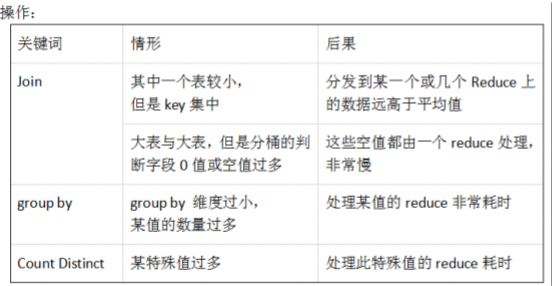

# Hive数据倾斜的数据优化

## 简单介绍

1. 什么是数据倾斜

    由于数据分布不均匀，造成数据大量的集中到一点，造成数据热点

2. 数据倾斜时的表现

    任务进度长时间维持在 99%或者 100%的附近，查看任务监控页面，发现只有少量 reduce子任务未完成，因为其处理的数据量和其他的 reduce 差异过大。单一 reduce 处理的记录数和平均记录数相差太大，通常达到好几倍之多，最长时间远大于平均时长。

3. 容易数据倾斜情况

    

4. 产生数据倾斜的原因：

    A：key 分布不均匀

    B：业务数据本身的特性

    C：建表考虑不周全

    D：某些 HQL 语句本身就存在数据倾斜

## 数据倾斜的优化方案

数据倾斜问题一直以来都是行业内的痛点所在，导致数据倾斜因素也多种多样。比如，key分布不均匀，业务数据本身的特性，建表考虑不周全，某些 HQL 语句本身就存在数据倾斜等。所以优化数据是个不可或缺的工作，虽不一定能完全解决，但也很大程序上优化了资源和效率。为了更好的解释问题，特建立两张测试表。

```
--用户详单表
create table user_list_detail(
user_id    string,    --用户ID
user_name  string,    --用户名
province   string,    --归属省份
city       string)    --归属城市
row format delimited fields terminated by ',';
--用户信息表
create table user_list_info(
user_id    string,    --用户ID
sex        string,    --性别
age        string,    --年龄
address    string)    --住址
row format delimited fields terminated by ',';
```

### 聚合时存在大量null值

如果Null值较多，会导致分到Null值的Reduce处理的数据量过大，产生数据倾斜。一般会发生在Join的连接字段和Group的分组字段里。

1. 统计业务表各城市的用户数，若city字段存在大量空值，group by时则会产生数据倾斜，可在where条件中提前筛选分组字段非空的行。进行空Key过滤

    ```sql
    select 
        t.city,
        count(*) as cnt 
    from user_list_detail t
    where city is not null
    group by city;
    ```

2. 统计所有用户的详细信息（包括省份，城市，性别，年龄，住址），若业务表user_list_detail中user_id为空的数据不需要保留，可在where条件中提前筛选左右表关联字段非空的行。

    ```sql
    select
    	a.user_id,
        a.user_name,
        a.province,
        a.city,
        b.sex,
        b.age,
        b.address
    from 
        (select * from user_list_detail where user_id is not null) a 
    left join
        (select * from user_list_info   where user_id is not null) b 
    on a.user_id = b.user_id;
    ```

3. 若业务表user_list_detail中user_id为空的数据需要保留，可以where条件中提前筛选左表关联字段非空的行，再union all连接关联字段空值的行

    ```sql
    select 
        a.user_id,
        a.user_name,
        a.province,
        a.city,
        b.sex,
        b.age,
        b.address
    from 
        (select * from user_list_detail where user_id is not null) a 
    left join 
        user_list_info b 
    on a.user_id = b.user_id
    union all
        select * from user_list_detail where user_id is null;
    ```

4. 若业务表user_list_detail中user_id为空的数据需要保留，可以在关联字段上加上随机数，赋予空值新的key值。

    ```sql
    select 
        a.user_id,
        a.user_name,
        a.province,
        a.city,
        b.sex,
        b.age,
        b.address
    from 
        user_list_detail a 
    left join 
        user_list_info b 
    on case when a.user_id is null then concat('hive',rand()) else a.user_id end = b.user_id;
    ```

### 不同数据类型关联产生数据倾斜

用户详单表user_list_detail中user_id字段类型为string，若此时用户信息表user_list_info中user_id既有string也有int的类型，当按照两个表的user_id 进行join 操作的时候，默认的hash操作会按照int类型的user_id 进行分配，这样就会导致所有的string 类型的user_id就被分到同一个reducer当中,造成数据倾斜。

1.将用户信息表user_list_info中的user_id字段类型*转化为string*类型，与用户详单表user_list_detail字段中user_id类型保持一致。

```
select a.* 
from 
    user_list_detail a 
left join 
    user_list_info b 
on b.user_id = cast(a.user_id as string);
```

### count（distinct）导致数据倾斜

工作中无论是distinct还是count(distinct user_id)的操作，都不建议使用，因为distinct本身会有一个全局排序的过程，导致计算效率很低，通常会以group by的方式替代。

```
--错误的打开方式：
select 
    count(distinct city) as cnt
from 
    user_list_detail 
where city is not null;

--正确的打开方式：
select 
    count(*) as cnt
from 
   (select 
        city
    from
        user_list_detail 
    where city is not null
    group by city) t;
```

### 关联查询产生数据倾斜

1. **大小表关联查询产生数据倾斜**

（1）解决方案一：Hive在进行join时，按照join的key进行分发，而在join左边的表的数据会首先读入内存，如果左边表的key相对分散，读入内存的数据会比较小，join任务执行会比较快。 而如果左边的表key比较集中，而这张表的数据量很大，那么数据倾斜就会比较严重，而如果这张表是小表，则还是应该把这张表放在join左边。原则即是小表在左，大表在右。

```
--假设左表user_list_detail有10亿行，user_list_info表有10万行，遵循小表在左，大表在右的原则。
select /* +mapjoin(b) */
    b.user_id,
    b.user_name,
    b.province,
    b.city,
    a.sex,
    a.age,
    a.address
from 
    (select * from user_list_info   where user_id is not null) a 
left join
    (select * from user_list_detail where user_id is not null) b 
on a.user_id = b.user_id;
```

（2）解决方案二：map join解决小表关联大表造成的数据倾斜问题，其是将其中做连接的小表（全量数据）分发到所有Map端进行Join，从而避免了reduce任务，当小表全量数据很小的时候可进行此操作。

```
--假设左表user_list_detail有10亿行，右表有10万行，此时可使用map join关联函数。
select /* +mapjoin(b) */
    a.user_id,
    a.user_name,
    a.province,
    a.city,
    b.sex,
    b.age,
    b.address
from 
    (select * from user_list_detail where user_id is not null) a 
left join
    (select * from user_list_info   where user_id is not null) b 
on a.user_id = b.user_id;
```

2. **大大表关联查询导致数据倾斜**

（1）现象：两个表都上千万，跑起来很悬，但是实际上根据业务经验发现，其实每天在线用户数是很少的，可以先统计出当天在线的user_id。

```
Select /* +mapjoin(b) */ 
    a.user_id,
    a.user_name,
    a.province,
    a.city,
    b.sex,
    b.age,
    b.address
from 
    user_list_detail a
left join 
    (
    select /* +mapjoin(t1) */  a.*
    from (
        select 
            distinct user_id 
        from 
            user_list_detail
         ) t1 
    left join 
        user_list_info t2
    on t1.user_id=t2.user_id
    ) b
on a.user_id=b.user_id;
```

### 数据倾斜之空间换时间

当我们进行group by操作并使用多个分组函数，会导致同一个reduce上进行操作时压力很大。甚至是类似于下面样例语句的小白操作，可以使用到空间换时间的优化技巧。

```
--小白操作样例：
select a.city,count(distinct a.user_id),count(distinct user_name) from user_list_detail a group by city;


--空间换时间操作：
select 
    city,
    count(case when type='user_id' then 1 else null end) as id_cnt,
    count(case when type='user_name' then 1 else null end) as name_cnt
from 
    (
    select 
        city,user_id,type
    from (
        select day,user_id,'user_id' as type from user_list_detail a
    union all
        select day user_name,'user_name' as type from user_list_detail b
         ) t1
    group by city,user_id,type
    ) t2
group by city;
```


