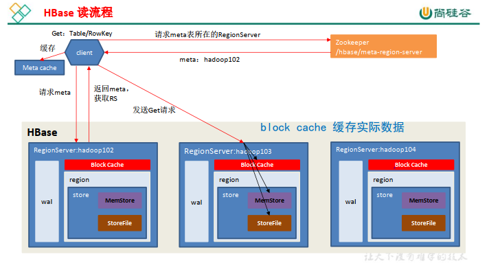

# HBase简介

## HBase定义

HBase 是一种分布式、可扩展、支持海量数据存储的 *NoSQL 数据库*。  

HBase与MySQL都是数据库，而Hive是一个数据仓库工具，Hive中并不能存储数据。在大数据环境中代替MySQL的是HBase。

**HBase的作用**是：存储数据，实现数据的随机写操作。

## HBase 数据模型

逻辑上， HBase 的数据模型同关系型数据库很类似，数据存储在一张表中，有行有列。但从 HBase 的底层*物理存储结构（K-V）*来看， HBase 更像是一个 multi-dimensional map（5个维度）。  

## HBase 逻辑结构


### HBase 物理存储结构


### 数据模型

1. Name Space

    命名空间，类似于关系型数据库的DatabBase概念，每个命名空间下有多个表。HBase有两个自带的命名空间，分别是*hbase*和*default*，hbase中存放的是HBase内置的表，default表是用户默认使用的命名空间。

2. Region（*表的分区、切片，可以手动切*）

    类似于关系型数据库的表概念。不同的是，HBase定义表时*只需要声明列族*即可，不需要声明具体的列。这意味着，往HBase写入数据时，字段可以*动态、按需*指定。因此，和关系型数据库相比，HBase能够轻松应对字段变更的场景。

3. Row

    HBase表中的每行数据都由一个**RowKey**和多个**Column**（列）组成，数据是按照RowKey的*字典顺序*存储的，并且查询数据时只能根据RowKey进行检索，所以RowKey的设计十分重要。

4. Column

    HBase中的每个列都由*Column Family(列族)*和*Column Qualifier（列限定符）*进行限定，例如info：name，info：age。建表时，只需指明列族，而列限定符无需预先定义。

5. Time Stamp

    用于标识数据的不同版本（version），每条数据写入时，如果不指定时间戳，系统会自动为其加上该字段，其值为写入HBase的时间。

6. Cell

    由{rowkey, column Family：column Qualifier, time Stamp} 唯一确定的单元。cell中的数据是没有类型的，全部是字节数组形式存贮。

## HBase 基本架构  


架构角色：

1. Region Server（*DML，负责管理一个或多个Region*）

    Region Server为 Region的管理者，其实现类为HRegionServer，主要作用如下:

    对于*数据*的操作：get, put, delete；

    对于*Region*的操作：splitRegion、compactRegion。

2. Master（*DDL，负责Region Server之间的负载均衡和故障转移*）

    Master是所有Region Server的管理者，其实现类为HMaster，主要作用如下：

    对于*表*的操作：create, delete, alter

    对于*RegionServer*的操作：分配regions到每个RegionServer，监控每个RegionServer的状态，负载均衡和故障转移。

3. Zookeeper

    HBase通过Zookeeper来做Master的高可用、RegionServer的监控、元数据的入口以及集群配置的维护等工作。

4. HDFS

    HDFS为HBase提供最终的*底层数据存储服务*，同时为HBase提供高可用的支持。

# HBase 快速入门  

## HBase 安装部署  

**见安装文档**


## HBase Shell 操作  

---


### 基本操作

1. 进入HBase客户端命令行

    ```
    [atguigu@hadoop102 hbase]$ bin/hbase shell
    ```

2. 查看帮助命令

    ```
    hbase(main):001:0> help
    ```

3. 查看当前数据库中有哪些表

    ```
    hbase(main):002:0> list
    ```

### 表的操作

1. 创建表

    ```
    hbase(main):002:0> create 'student','info'
    ```

    

2. 插入数据到表

    ```
    hbase(main):003:0> put 'student','1001','info:sex','male'
    
    hbase(main):004:0> put 'student','1001','info:age','18'
    
    hbase(main):005:0> put 'student','1002','info:name','Janna'
    
    hbase(main):006:0> put 'student','1002','info:sex','female'
    
    hbase(main):007:0> put 'student','1002','info:age','20'
    ```

3. 扫描查看表数据

    ```
    hbase(main):008:0> scan 'student'
    
    hbase(main):009:0> scan 'student',{STARTROW => '1001', STOPROW => '1001'}
    
    hbase(main):010:0> scan 'student',{STARTROW => '1001'}
    ```

4. 查看表结构

    ```
    hbase(main):011:0> describe ‘student’
    ```

5. 更新指定字段的数据

    ```
    hbase(main):012:0> put 'student','1001','info:name','Nick'
    
    hbase(main):013:0> put 'student','1001','info:age','100'
    ```

6. 查看“指定行”或“指定列族:列”的数据

    ```
    hbase(main):014:0> get 'student','1001'
    
    hbase(main):015:0> get 'student','1001','info:name'
    ```

7. 统计表数据行数

    ```
    hbase(main):021:0> count 'student'
    ```

8. 删除数据

    删除某rowkey的全部数据：

    ```
    hbase(main):016:0> deleteall 'student','1001'
    ```

    删除某rowkey的某一列数据：

    ```
    hbase(main):017:0> delete 'student','1002','info:sex'
    ```

9. 清空表数据

    ```
    hbase(main):018:0> truncate 'student'
    ```

    提示：清空表的操作顺序为先disable，然后再truncate。

10. 删除表

    首先需要先让该表为disable状态：

    ```
    hbase(main):019:0> disable 'student'
    ```

    然后才能drop这个表：

    ```
    hbase(main):020:0> drop 'student'
    ```

    提示：如果直接drop表，会报错：ERROR: Table student is enabled. Disable it first.

11. 变更表信息

    将info列族中的数据存放3个版本：

    ```
    hbase(main):022:0> alter 'student',{NAME=>'info',VERSIONS=>3}
    
    hbase(main):022:0> get 'student','1001',{COLUMN=>'info:name',VERSIONS=>3}
    ```

#  HBase进阶

## 架构原理  


1. StoreFile

    保存*实际数据的文件*。StoreFile以File的形式存储在HDFS上，一个store会刷写出一个或多个HFile，数据在每个StoreFile中是有序的。

2. MemStore

    写缓存，由于HFile中的数据要求有序，所以数据先在内存中排好序后，等到刷写时机才会刷写到HFile中，每次刷写都会形成一个新的HFile。

3. WAL

    数据先写到内存中，等到刷写时机才能刷写到HFile，但是数据存储在内存中有很大的风险，数据容易丢失，为了解决这个问题，数据会先写到Write-Ahead logfile的文件中，然后才写到MEMStore中。在系统出现故障的时候，数据可以通过这个日志文件重建。由于数据先写到WAL中，HBase的写速率减低。

## 写流程


客户端写数据需要知道：这个表有几个region和这些region是由那些RegionServer管理的，这些数据是表的元数据。

1. Client先访问ZK，获取hbase:meta表位于哪个RegionServer上。
2. Client访问RegionServer，获取hbase：meta表，根据请求获取table/RowKey/CF/Column目标数据在哪个RegionServer的哪个Region中。并将table的region信息以及meta表的位置信息缓存到客户端的meta cache缓存中，方便下次访问。
3. client访问目标RegionServer进行通讯。
4. client先将数据写入到WAL中。
5. 再将数据写入到MemStore中，数据在MemStore中进行排序。
6. 数据写入到MEMStore中后，向客户端发送ack。
7. 等到MenStore的刷写时机后将数据写入到HFile中。

**注意点**

- 数据实现写入到WAL中，再往MemStore中写，之后进行同步，若此时同步失败，发生系统宕机，数据没刷写到HFile中，内存中的数据丢失了，此时会进行回滚，将数据进行重写（源码中有一个标记为false，当发生异常时，标记改为true，进行回滚），只有两步都成功，才会数据写入成功。

## MemStore Flush


**刷写时机：**

1. 时间：

    当内存中超过配置`hbase.regionserver.optionalcacheflushinterval（默认 1 小时）  `没有数据写入时，就会到达自动的刷写时机。

2. 内存：

    - 当单个MemStore的大小到了`hbase.hregion.memstore.flush.size（默认值 128M）   `，其所在的region的*所有MemStore*都会刷写。

        当单个region中的所有的MemStore的大小达到

        `hbase.hregion.memstore.flush.size（默认值 128M）
        \* hbase.hregion.memstore.block.multiplier（默认值 4）  `时，

        会阻止继续往该region中写数据。

    - 当region server中的MenStore的总大小达到

        `java_heapsize
        *hbase.regionserver.global.memstore.size（默认值 0.4）
        *hbase.regionserver.global.memstore.size.lower.limit（默认值 0.95） ，  `

        region会按照其所在的MemStore的大小顺序（由大到小）依次进行刷写，直到 region server中所有 memstore 的总大小减小到上述值以下。  

        当 region server 中 memstore 的总大小达到
        `java_heapsize*hbase.regionserver.global.memstore.size（默认值 0.4）`
        时，会阻止继续往所有的 memstore 写数据。  

3. 当 WAL 文件的数量超过 `hbase.regionserver.max.logs`， region 会按照时间顺序依次进行刷写，直到 WAL 文件数量减小到 `hbase.regionserver.max.log` 以下（该属性名已经废弃，
    现无需手动设置， 最大值为 32）。  

## 读流程  



**读数据**

1. Client先访问ZK，获取hbase:meta表位于哪个RegionServer上。
2. Client访问RegionServer，获取hbase：meta表，根据请求获取table/RowKey/CF/Column目标数据在哪个RegionServer的哪个Region中。并将table的region信息以及meta表的位置信息缓存到客户端的meta cache缓存中，方便下次访问。
3. client访问目标RegionServer进行通讯。
4. *同时分别从Block Cache（读缓存），MenStore和StoreFile（HFile）*中查询目标数据。并将查到的*所有数据进行合并*。此处所有数据是指同一条数据的不同版本（time stamp）或者不同的类型（Put/Delete）。  
5. 将从文件中查询到的数据块（Block， HFile 数据存储单元，默认大小为 64KB）缓存到Block Cache。  
6. 将合并后的最终结果返回给客户端。

**注意**

数据读写的过程中HMaster挂了，不影响。

## StoreFile Compaction（文件的合并）

由于memstore每次刷写都会生成一个新的HFile，且同一个字段的不同版本（timestamp）和不同类型（Put/Delete）有可能会分布在不同的 HFile 中，因此查询时需要遍历所有的 HFile。  为了减少 HFile 的个数，以及清理掉过期和删除的数据，会进行 StoreFile Compaction。  

Compaction 分为两种，分别是 *Minor Compaction* 和 *Major Compaction*。Minor Compaction会将临近的若干个较小的 HFile 合并成一个较大的 HFile，但不会清理过期和删除的数据。Major Compaction 会将一个 Store 下的所有的 HFile 合并成一个大 HFile，并且会清理掉过期和删除的数据。  


**HBase文件的删除时机**

1. flush

    刷写只会删除同意内存中未刷写的数据，并且不会删除标记数据和跨文件的数据。因为标记删除后，原有的数据就会暴露出来。

2. Major Compaction

    大合并会将文件删除，可跨文件删除数据，合并后几分钟会将其他的HFile删除。

## Region Split

默认情况下，每个 Table 起初只有一个 Region，随着数据的不断写入， Region 会自动进行拆分。刚拆分时，两个子 Region 都位于当前的 Region Server，但处于负载均衡的考虑，HMaster 有可能会将某个 Region 转移给其他的 Region Server。  

Region Split 时机：  

1. 当1个region中的某个Store下所有StoreFile的总大小超过`hbase.hregion.max.filesize(默认10G)`，该 Region 就会进行拆分（0.94 版本之前）。  

2. 当 1 个 region 中 的 某 个 Store 下 所 有 StoreFile 的 总 大 小 超 过 `Min(R^2 *
    "hbase.hregion.memstore.flush.size",hbase.hregion.max.filesize")`， 该 Region 就会进行拆分，其
    中 R 为当前 Region Server 中属于该 Table 的个数（0.94 版本之后）。  

    R为表的Region数

**注意**

1. Region的自动切分会导致数据的倾斜，造成数据热点问题，导致单台服务器的负载过高。
2. 在生产环境中，建表要预分区，将数据均与的放入到分区中，避免数据的倾斜。

