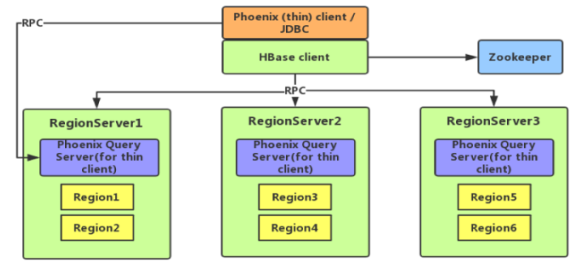
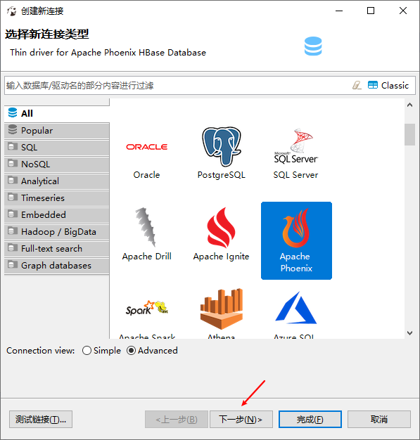
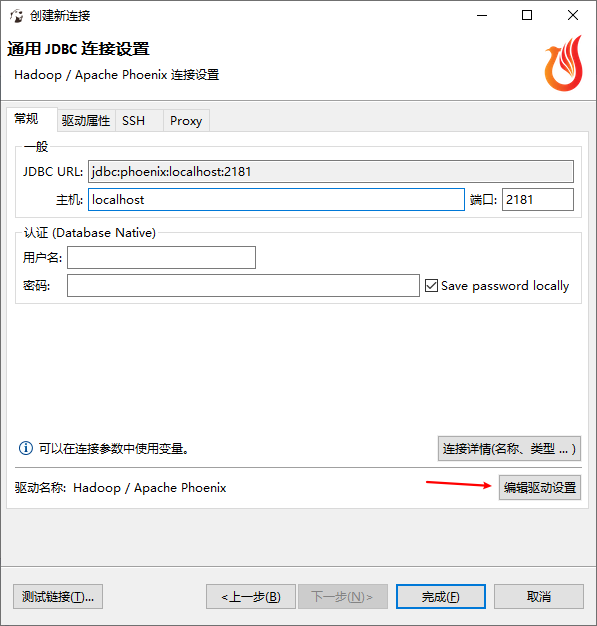
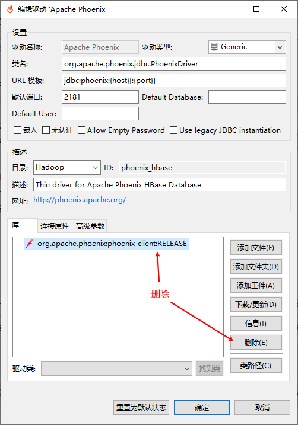
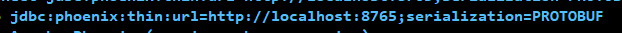
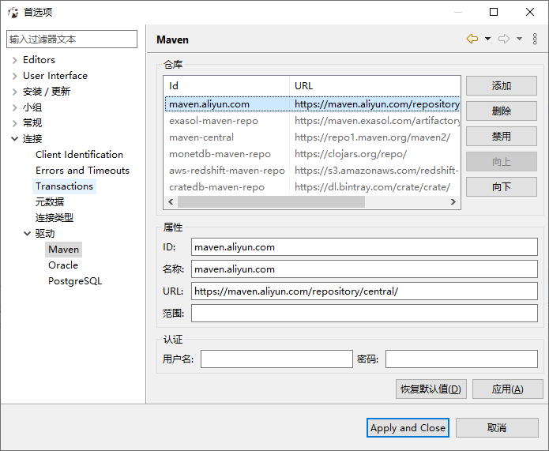
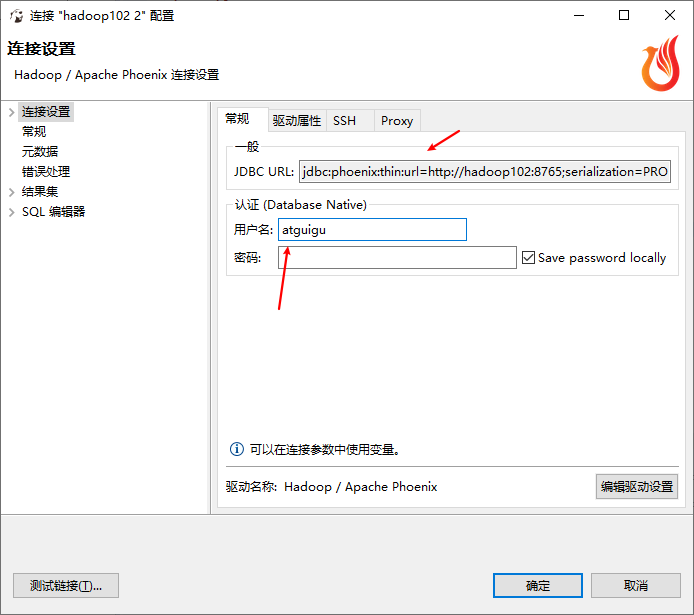

# HBase整合Phoenix

##  Phoenix简介

### Phoenix定义

Phoenix是HBase的开源SQL皮肤。可以使用标准JDBC API代替HBase客户端API来创建表，插入数据和查询HBase数据。

### Phoenix特点

1. 容易集成：如Spark，Hive，Pig，Flume和Map Reduce；
2. 操作简单：DML命令以及通过DDL命令创建和操作表和版本化增量更改；
3. 支持HBase二级索引创建。

**什么是二级索引**

除了主键索引，其他的索引就是二级索引。HBase只有RowKey有索引

建立索引查询速度会变快，付出的代价是占内存，索引更新慢。

### Phoenix架构



## Phoenix快速入门

### 安装

1. 官网地址

    http://phoenix.apache.org/

2. Phoenix部署

    安装bsdtar3（可以不安装）

    ```
    sudo yum install -y epel-release
    sudo yum install -y bsdtar3
    ```

3. 上传并解压 tar 包并解压重命名

    ```
    tar -zxvf /opt/software/apachephoenix-5.0.0-HBase-2.0-bin.tar.gz -C /opt/module
    mv apache-phoenix-5.0.0-HBase-2.0-bin phoenix
    ```

4. 拷贝/opt/module/phoenix/下的server包和client包到hbase/lib下

    ```
    cp phoenix-5.0.0-HBase-2.0-server.jar /opt/module/hbase/lib/
    ```

5. 同步hbase/lib

    ```
    xsync /opt/module/hbase/lib/
    ```

6. 配置环境变量

    ```
    sudo vim /etc/profile.d/my_env.sh
    ```

7. 测试是否安装成功，输入sql，自动补全显示sqlline.py成功。

    

8. 启动Phoenix,首次启动Phoenix会在hdfs上创建很多的Phoenix的系统表格，会很慢。启动Phoenix之前开启HBase。

    ```
    /opt/module/phoenix/bin/sqlline.py hadoop102,hadoop103,hadoop104:2181
    ```


##     Phoenix Shell操作

### 表的操作

1. 显示所有表

    ```
    !table 或 !tables
    ```

2. 创建表，直接指定单个列作为RowKey

    ```sql
    CREATE TABLE IF NOT EXISTS student(
    id VARCHAR primary key,
    name VARCHAR;
    ```

    *在phoenix中，表名在HBase中查看自动转换为大写，若要小写，使用双引号，如"us_population"。*

    指定多个列的联合作为RowKey

    ```sql
    CREATE TABLE IF NOT EXISTS us_population (
    State CHAR(2) NOT NULL,
    City VARCHAR NOT NULL,
    Population BIGINT
    CONSTRAINT my_pk PRIMARY KEY (state, city));
    ```

3. 插入数据（*upsite*）

    ```sql
    upsert into student values('1001','zhangsan');
    ```

4. 查询记录

    ```sql
    select * from student;
    select * from student where id='1001';
    ```

5. 删除记录

    ```sql
    delete from student where id='1001';
    ```

6. 删除表

    ```sql
    drop table student;
    ```

7. 退出命令行

    ```sql
    !quit
    ```

    

## shell客户端（DBeaver）连接操作Phoenix

1. 新建连接

    

2. 编辑驱动类型，删除原有驱动，添加新驱动（工件）

    

    

    ```
    工件：
    <dependency>
        <groupId>org.apache.phoenix</groupId>
        <artifactId>phoenix-queryserver-client</artifactId>
        <version>5.0.0-HBase-2.0</version>
    </dependency>
    
    ```
    
    

类名：org.apache.phoenix.queryserver.client.Driver
URL模板



端口：8765

3. 更换maven驱动地址，并移到最上方，应用。

    ```
    maven.aliyun.com
    maven.aliyun.com
    https://maven.aliyun.com/repository/central/
    ```

    

4. 下载更新，强制覆盖。

5. 修改用户名

    

6. `queryserver.py start`，开启链接，开启thin客户端 `sqlline-thin.py hadoop102:8765`
7. 测试连接
8. 连接成功