# 1Scala的概述

## 学习 sdala 的原因  

- 学习Scala是为了更好地学习Spark，Spark使用Scala编写的。
- Scala是一门<font color = "red">多范式（函数式和面向对象）的编程语言。</font>
- Scala创始于2001年。
- Spark的兴起，带动了Scala语言的发展。

## Scala 语言的特点  

​		Scala是一门以java虚拟机（JVM）为运行环境并将面向对象和函数式编程的最佳特性结合在一起的静态类型编程语言。

- Scala是一门多范式的编程语言，Scala支持面向对象和函数式编程。
- Scala的源码会编译成.class文件，然后运行在JVM上，并可以调用现有的java类库。

## Scala 的 REPL

​		安装完Scala在命令行输入scala所进入的界面，即scala命令行窗口，我们称之为REPL。

​		在命令行窗口中输入 scala 指令代码时，解释器会读取指令代码(R)并计算对应的值(E)，然后将结果打印出来(P)，接着循环等待用户输入指令(L)。从技术上讲，这里其实并不是一个解释器，而是指令代码被快速的编译成 Java 字节码并被 JVM 加载执行。最终将执行结果输出到命令行中。  

## 1.4 Scala 执行流程分析  

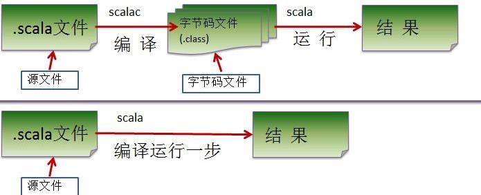

# 变量和数据类型

## 概念	

​		变量是程序的基本组成单位。	

​		变量相当于内存中一个数据存储空间的表示，你可以把变量看做是一个房间的门牌号，通过门牌号我们可以找到房间，而通过变量名可以访问到变量(值)。 

## 入门案例

```scala
object VarDemo01 {
    def main(args: Array[String]): Unit = {
        var age: Int = 10
        var sal: Double = 10.9
        var name:String = "tom"
        var isPass:Boolean = true
        //在 scala 中，小数默认为 Double ,整数默认为 Int
        var score:Float = 70.9f
        println(s"${age} ${isPass}")
    }
}
```

## 使用说明

var | val 变量名 [: 变量类型] = 变量值  

### 注意事项

1. 声明变量时类型可以省略，能够进行类型推断。
2. 类型确定后不能更改。
3. var修饰的变量的值能够进行修改，编译后生成getter和setter的方法，val修饰的变量的值不能够修改，编译后只生成getter的方法，变量是由final修饰的。
4. var修饰的对象引用可以改变，val修饰的对象引用不能改变，但是对象的值可以改变。
5. 声明变量时，需要初始值。

## + 号的使用

1. 当左右两边都是数值型时，则做加法运算
2.  当左右两边有一方为字符串，则做拼接运算  

## 数据类型  

1. Scala与Java有着相同的数据类型，在Scala中数据类型都是对象。Scala中没有Java的原生类型。
2. Scala中数据类型分为AnyVal（值类型）和AnyRef（引用类型）。注意：不管是 AnyVal 还是 AnyRef 都是对象。 [案例演示 Int , Char]  更好的将面向对象和函数式编程结合起来了。

### 案例

```scala
package com.atguigu.chapter02.datatype
object TypeDemo01 {
    def main(args: Array[String]): Unit = {
        var num1: Int = 10
        //因为 Int 是一个类，因此他的一个实例，就是可以使用很多方法
        //在 scala 中，如果一个方法，没有形参，则可以省略()
        println(num1.toDouble + "\t" +num1.toString + 100.toDouble)
        var isPass = true //
        println(isPass.toString)
        sayHi()
    }
    def sayHi(): Unit = {
        println("say hi")
    }
}
```

### scala 数据类型体系一览图

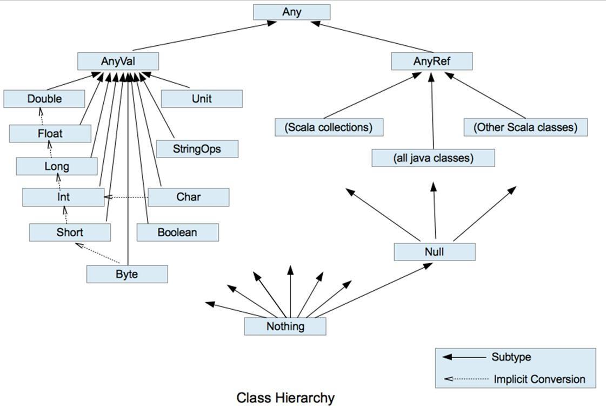

小结：

1. Scala 中一切数据都是对象，根类型为 Any ，*它是所有类的父类。*
2. Scala中一切皆对象分为两大类 *AnyVal(值类型)*， *AnyRef(引用类型)*， 他们都是 Any 子类。
3. Scala仍然遵循自动类型转换，低精度向高精度转换。
4. Scala中的 StringOps 是对 Java 中 String 的增强。
5. Unit：对应Java中的void， 用于方法返回值的位置， 表示方法没有返回值。 Unit是一个数据类型， 只有一个对象就是()。 Void不是数据类型， 只是一个关键字。
6. Null 类型是 scala 的特别类型，它只有一个值 null, 他是 bottom calss ,是 所有 AnyRef 类型的子类。
7. Nothing 类型也是 bottom class ,他是所有类的子类，在开发中通常可以将 Nothing 类型的值返回给任意变量或者函数， 这里抛出异常使用很多。

```scala
object TypeDemo02 {
    def main(args: Array[String]): Unit = {
        println(sayHello)
    }
    //比如开发中，我们有一个方法，就会异常中断，这时就可以返回 Nothing
    //即当我们 Nothing 做返回值，就是明确说明该方法没有没有正常返回值
    def sayHello: Nothing = {
        throw new Exception("抛出异常")
    }
}
```

5. 在 scala 中仍然遵守，低精度的值，向高精度的值自动转换(implicit conversion) 隐式转换。

### scala 数据类型列表 

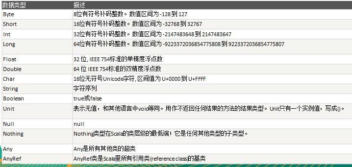

## 整数类型  

### 基本介绍  

Scala 的整数类型就是用于存放整数值的，比如 12 , 30, 3456 等等  

### 整型的类型  

| 数据类型 描述 |                                                              |
| ------------- | ------------------------------------------------------------ |
| Byte [1]      | 8 位有符号补码整数。数值区间为 -128 到 127                   |
| Short [2]     | 16 位有符号补码整数。数值区间为 -32768 到 32767              |
| Int [4]       | 32 位有符号补码整数。数值区间为 -2147483648 到 2147483647    |
| Long [8]      | 64 位有符号补码整数。数值区间为 -9223372036854775808 到 9223372036854775807 = 2 的(64-1)次方-1 |

### 注意事项

1. Scala 各整数类型有固定的表数范围和字段长度，不受具体 OS 的影响，以保证 Scala 程序的可移植性。
2. Scala 的整型 常量/字面量 默认为 Int 型，声明 Long 型 常量/字面量 须后加‘l’’ 或‘L’
   [反编译看]
3. Scala 程序中变量常声明为 Int 型，除非不足以表示大数，才使用 Long 。 

## 浮点类型  

### 基本介绍  

Scala 的浮点类型可以表示一个小数，比如 123.4f， 7.8 ， 0.12 等等。

### 浮点型的分类  

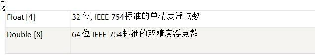

### 注意事项

1. 与整数类型类似， Scala 浮点类型也有固定的表数范围和字段长度，不受具体 OS 的影响。

2. Scala 的浮点型常量默认为 Double 型，声明 Float 型常量，须后加‘f’ 或‘F’ 。  

3. 浮点型常量有两种表示形式 

   十进制数形式：	 如： 5.12 512.0f .512 (必须有小数点）
   科学计数法形式:	如： 5.12e2 = 5.12 乘以 10 的 2 次方 5.12E-2 = 5.12 除以 10 的 2
   次方

4. 通常情况下，应该使用 Double 型，因为它比 Float 型更精确(小数点后大致 7 位)  

## 字符类型(Char)  

### 基本介绍  

​		字符类型可以表示单个字符,字符类型是 Char， 16 位无符号 Unicode 字符(2 个字节), 区间值为U+0000 到 U+FFFF  。

### 案例

```scala
package com.atguigu.chapter02.datatype
object CharDemo {
    def main(args: Array[String]): Unit = {
        var char1: Char = 97
        //当我们输出一个 char 类型是，他会输出该数字对应的字符(码值表 unicode)//unicode 码值表
        包括 ascii
        println("char1=" + char1) // a
        //char 可以当做数字进行运行
        var char2: Char = 'a'
        var num = 10 + char2
        println("num=" + num) // 107
        //原因和分析
        //1. 当把一个计算的结果赋值一个变量，则编译器会进行类型转换及判断（即会看范围+类型）
        //2. 当把一个字面量赋值一个变量，则编译器会进行范围的判定
        // var c2: Char = 'a' + 1
        // var c3: Char = 97 + 1
        // var c4: Char = 98
    }
}
```

### 字符类型使用细节  

1. 字符常量是用单引号(‘ ’ )括起来的单个字符。 例如： var c1 = 'a‘ var c2 = '中‘ var c3 =
2. Scala 也允许使用转义字符‘\’ 来将其后的字符转变为特殊字符型常量。例如： var c3 = ‘\n’// '\n'表示换行符
3. 可以直接给 Char 赋一个整数，然后输出时，会按照对应的 unicode 字符输出 ['\u0061' 97]
4. Char 类型是可以进行运算的，相当于一个整数，因为它都对应有 Unicode 码 。 

## 布尔类型： Boolean  

### 基本介绍  

布尔类型也叫 Boolean 类型， Booolean 类型数据只允许取值 true 和 false
boolean 类型占 1 个字节。
boolean 类型适于逻辑运算，一般用于程序流程控制[后面详解]

## Unit 类型、 Null 类型和 Nothing 类型  

### 基本说明  

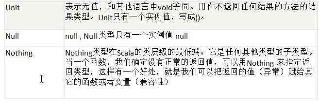

### 注意事项

1. Null 类只有一个实例对象， null，类似于 Java 中的 null 引用。 null 可以赋值给任意引用类型(AnyRef)，但是不能赋值给值类型(AnyVal: 比如 Int, Float, Char, Boolean, Long, Double, Byte, Short)
2. Unit 类型用来标识过程，也就是没有明确返回值的函数。由此可见， Unit 类似于 Java 里的 void。Unit 只有一个实例， ()，这个实例也没有实质的意义。
3. Nothing，可以作为没有正常返回值的方法的返回类型，非常直观的告诉你这个方法不会正常返回，而且由于 Nothing 是其他任意类型的子类，他还能跟要求返回值的方法兼容。  

### 案例

```scala
package com.atguigu.scala.chapter02.datatype

object UnitNullNothingDemo {
  def main(args: Array[String]): Unit = {
    val res = sayHello()
    println("res=" + res)//res=()
    //Null类只有一个实例对象， null，类似于Java中的null引用。 null可以赋值给任意引用类型(AnyRef)，但是不能赋值给值类型(AnyVal: 比如 Int, Float, Char, Boolean, Long, Double, Byte, Short)
    val dog: Dog = null

    //val char1: Char = null 错误，不能赋给值类型
    println("ok~~~")//ok~~~
  }
  //Unit 等价于 java 的 void,只有一个实例值()
  def sayHello(): Unit = {
  }
}
class Dog {}
```

## 值类型转换  

### 值类型隐式转换  

​		当 Scala 程序在进行赋值或者运算时，精度小的类型自动转换为精度大的数据类型，这个就是自动类型转换(隐式转换)。  

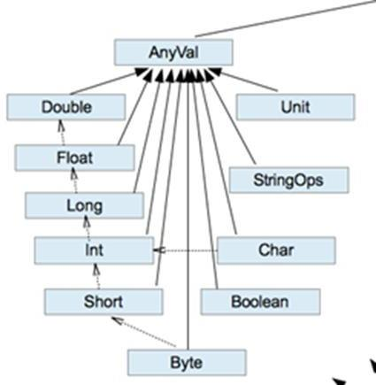

### 注意事项

1. 有多种类型的数据混合运算时，系统首先自动将所有数据转换成容量最大的那种数据类型，然
   后再进行计算。 5.6 + 10 = 》 double
2. 当我们把精度(容量)大 的数据类型赋值给精度(容量)小 的数据类型时，就会报错，反之就会进行自动类型转换。
3. (byte, short) 和 char 之间不会相互自动转换。
4. byte， short， char 他们三者可以计算，在计算时首先转换为 int 类型。
5. 自动提升原则： 表达式结果的类型自动提升为 操作数中最大的类型  


# 函数式编程的基础  

## 函数式编程内容

**函数式编程基础  **

- 函数定义/声明
- 函数运行机制
- 递归//难点 [最短路径，邮差问题，迷宫问题, 回溯]
- 过程
- 惰性函数和异常  

**函数式编程高级**

- 值函数(函数字面量)

- 高阶函数
- 闭包
- 应用函数
- 柯里化函数，抽象控制...

## 函数式编程介绍

### 方法、函数、函数式编程和面向对象的概念

1. 在 scala 中，方法和函数几乎可以等同(比如他们的定义、使用、运行机制都一样的)，只是函数的使用方式更加的灵活多样。
2. 函数式编程是从编程方式(范式)的角度来谈的，可以这样理解：函数式编程把函数当做一等公民，充分利用函数、 支持的函数的多种使用方式。函数式编程中的函数的创建不依赖于类，抽象类或者接口。
3. 面向对象编程是以对象为基础的编程方式。
4. 在 scala 中函数式编程和面向对象编程融合在一起了。

### 函数的作用

1. 解决代码的冗余。
2. 有利于代码的维护。

## 函数的定义

```scala
def 函数名 ([参数名: 参数类型], ...)[[: 返回值类型] =] {
    语句...
    return 返回值
}
```

**注意事项**

1. 函数声明关键字为 def (definition)。

2. [参数名: 参数类型], ...：表示函数的输入(就是参数列表), 可以没有。 如果有，多个参数使用逗号间隔。

3. 函数中的语句：表示为了实现某一功能代码块。

4. 函数可以有返回值,也可以没有。

   返回值形式 1: : 返回值类型 =
   返回值形式 2: = 表示返回值类型不确定，使用类型推导完成
   返回值形式 3: 表示没有返回值， return 不生效

5. 如果没有 return ,默认以执行到最后一行的结果作为返回值。

### 函数递归小结 

1. 程序执行一个函数时，就创建一个新的受保护的独立空间(新函数栈)。
2. 函数的局部变量是独立的，不会相互影响。
3. 递归必须向退出递归的条件逼近，否则就是无限递归，死龟了:)。
4. 当一个函数执行完毕，或者遇到 return，就会返回，遵守谁调用，就将结果返回给谁。  

**案例**

1、斐波那契数
请使用递归的方式，求出斐波那契数 1,1,2,3,5,8,13...
给你一个整数 n，求出它的斐波那契数是多少？  

```scala
//函数
def fbn(n: Int): Int = {
    //分析
    //1. 当 n = 1 结果为 1
    //2. 当 n = 2 结果是 1
    //3. 当 n> 2 是, 结果就是 就是前面两个数的和
    if (n == 1 || n == 2) {
        1
    } else {
        fbn(n - 1) + fbn(n - 2)
    }
}
```

2、求函数值 

已知 f(1)=3; f(n) = 2*f(n-1)+1;  请使用递归的思想编程，求出 f(n)的值?  

```scala
def f(n: Int): Int = {
    if (n == 1) {
        3
    } else {
        2 * f(n - 1) + 1
    }
}
```

3、猴子吃桃子问题
有一堆桃子，猴子第一天吃了其中的一半，并再多吃了一个！以后每天猴子都吃其中的一半，然后再多吃一个。当到第十天时，想再吃时（还没吃） ，发现只有 1 个桃子了。问题：最初共多少个桃子？  

```scala
def peach(day: Int): Int = {
    if (day == 10) {
        1
    } else {
        (peach(day + 1) + 1) * 2
    }
}
```

## 函数注意事项和细节讨论  

1. 函数的形参列表可以是多个, 如果函数没有形参，调用时 可以不带()。

2. 形参列表和返回值列表的数据类型可以是值类型和引用类型。

3. Scala 中的函数可以根据函数体最后一行代码自行推断函数返回值类型。那么在这种情况下，return 关键字可以省略。

4. 因为 Scala 可以自行推断，所以在省略 return 关键字的场合，返回值类型也可以省略。

5. 如果函数明确使用 return 关键字，那么函数返回就不能使用自行推断了,这时要明确写成 : 返回类型 = ，当然如果你什么都不写，即使有 return 返回值为()。

6. 如果函数明确声明无返回值（声明 Unit） ，那么函数体中即使使用 return 关键字也不会有返回值。

7. 如果明确函数无返回值或不确定返回值类型，那么返回值类型可以省略(或声明为 Any。

   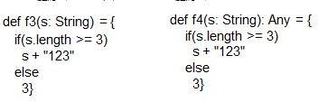

8. Scala 语法中任何的语法结构都可以嵌套其他语法结构(灵活)，即：函数中可以再声明/定义函数，类中可以再声明类 ，方法中可以再声明/定义方法。

9. Scala 函数的形参，在声明参数时，直接赋初始值(默认值)，这时调用函数时，如果没有指定实参，则会使用默认值。如果指定了实参，则实参会覆盖默认值。 

   ```scala
   object Details04 {
       def main(args: Array[String]): Unit = {
           println(sayOk("mary"))
       }
       //name 形参的默认值 jack
       def sayOk(name : String = "jack"): String = {
           return name + " ok! "
       }
   }
   ```

10. 如果函数存在多个参数，每一个参数都可以设定默认值，那么这个时候，传递的参数到底是覆盖默认值，还是赋值给没有默认值的参数，就不确定了(默认按照声明顺序[从左到右])。在这种情况下， 可以采用带名参数.

    ```scala
    package com.atguigu.scala.chapter05.fundetails
    
    object DetailParameter05 {
      def main(args: Array[String]): Unit = {
        mysqlCon()
        mysqlCon("127.0.0.1", 7777) //从左到右覆盖
        mysqlCon(user = "tom", pwd = "123")
        //f6("v2") // (错误)
        f6(p2="v2") // (?)
      }
      def mysqlCon(add:String = "localhost",port : Int = 3306,
                   user: String = "root", pwd : String = "root"): Unit = {
        println("add=" + add)
        println("port=" + port)
        println("user=" + user)
        println("pwd=" + pwd)
      }
      def f6 ( p1 : String = "v1", p2 : String ) {
        println(p1 + p2);
      }
    }
    ```

11. 递归函数未执行之前是无法推断出来结果类型，在使用时必须有明确的返回值类型。

    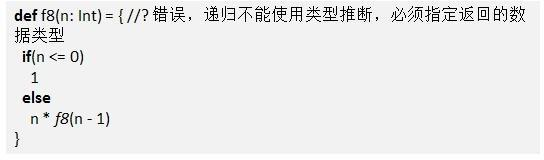

12. Scala 函数支持可变参数

    **注意**

    1. args 是集合, 通过 for 循环 可以访问到各个值。
    2.  案例演示： 编写一个函数 sum ,可以求出 1 到多个 int 的和
    3. 可变参数需要写在形参列表的最后。  

    ```scala
    package com.atguigu.scala.chapter05.fundetails
    object VarParameters {
      def main(args: Array[String]): Unit = {
        //编写一个函数 sum ,可以求出 1 到多个 int 的和
        println(sum(10, 30, 10, 3, 45, 7))
      }
    
      def sum(n1: Int, args: Int*): Int = {
        println("args.length" + args.length)
        //遍历
        var sum = n1
        for (item <- args) {
          sum += item
        }
        sum
      }
    }
    ```

## 过程  

### 概念

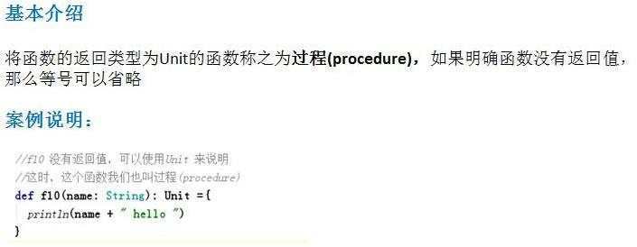

### 注意事项

1. 注意区分: 如果函数声明时没有返回值类型，但是有 = 号，可以进行类型推断最后一行代码。这时这个函数实际是有返回值的，该函数并不是过程。 (这点在讲解函数细节的时候讲过的.)
2. 开发工具的自动代码补全功能，虽然会自动加上 Unit，但是考虑到 Scala 语言的简单，灵活，最好不加.  

## 惰性函数  

​		惰性计算（尽可能延迟表达式求值）是许多函数式编程语言的特性。惰性集合在需要时提供其元素，无需预先计算它们，这带来了一些好处。首先， 您可以将耗时的计算推迟到绝对需要的时候。其次，您可以创造无限个集合，只要它们继续收到请求，就会继续提供元素。函数的惰性使用让您能够得到更高效的代码。 Java 并没有为惰性提供原生支持， Scala 提供了。  

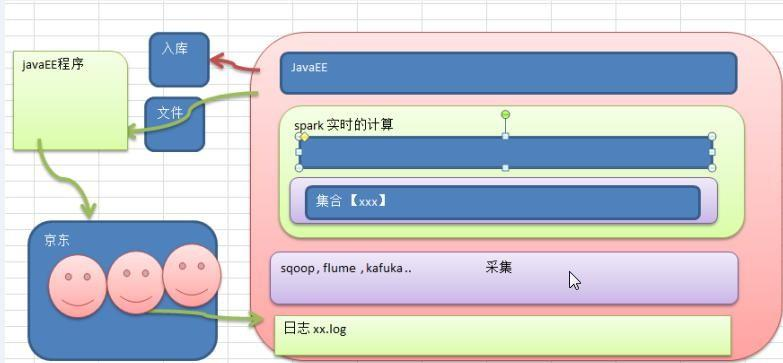

**惰性函数介绍 **	

​		当函数返回值被声明为 lazy 时，函数的执行将被推迟，直到我们首次对此取值，该函数才会执行。 这种函数我们称之为惰性函数，在 Java 的某些框架代码中称之为懒加载(延迟加载)。  

**案例**

```scala
package com.atguigu.chapter05.mylazy
object LazyDemo01 {
    def main(args: Array[String]): Unit = {
        lazy val res = sum(10, 20)
        println(" --------------- ")
        println("res=" + res) //在要使用 res 前，才执行
    }
    //sum 函数，返回和
    def sum(n1: Int, n2: Int): Int = {
        println("sum() 执行了..") //输出一句话
        return n1 + n2
    }
}
```

### 注意事项和细节

1. lazy 不能修饰 var 类型的变量
2. 不但是 在调用函数时，加了 lazy ,会导致函数的执行被推迟， 我们在声明一个变量时，如果给声明了 lazy ,那么变量值得分配也会推迟。 比如 lazy val i = 10  。

## 异常  

### 介绍  

​		Scala 提供 try 和 catch 块来处理异常。 try 块用于包含可能出错的代码。 catch 块用于处理 try 块中发生的异常。可以根据需要在程序中有任意数量的 try...catch 块。  

### 案例

```scala
package com.atguigu.chapter05.myexception
object ScalaExceptionDemo {
    def main(args: Array[String]): Unit = {
        try {
            val r = 10 / 0
        } catch {
            //说明
            //1. 在 scala 中只有一个 catch
            //2. 在 catch 中有多个 case, 每个 case 可以匹配一种异常 case ex: ArithmeticException
            //3. => 关键符号，表示后面是对该异常的处理代码块
            //4. finally 最终要执行的
            case ex: ArithmeticException=> {
                println("捕获了除数为零的算数异常")
            }
            case ex: Exception => println("捕获了异常")
        } finally {
            // 最终要执行的代码
            println("scala finally...")
        }
        println("ok,继续执行~~~~~")
    }
}
```

### Scala 异常处理小结  

1. 我们将可疑代码封装在 try 块中。 在 try 块之后使用了一个 catch 处理程序来捕获异常。如果发生任何异常， catch 处理程序将处理它， 程序将不会异常终止。

2. Scala 的异常的工作机制和 Java 一样，但是 Scala 没有“checked(编译期)” 异常，即 Scala 没有。

3. 用 throw 关键字，抛出一个异常对象。所有异常都是 Throwable 的子类型。 throw 表达式是有类型的，就是 Nothing，因为 Nothing 是所有类型的子类型，所以 throw 表达式可以用在需要类型的地方。

   ```scala
   def test(): Nothing = {
   	throw new ArithmeticException("算术异常")//Exception("异常 NO1 出现~")
   }  
   ```

4. 在 Scala 里，借用了模式匹配的思想来做异常的匹配，因此，在 catch 的代码里，是一系列 case
   子句来匹配异常。【前面案例可以看出这个特点, 模式匹配我们后面详解】，当匹配上后 => 有多条语句可以换行写，类似 java 的 switch case x: 代码块..

5. 异常捕捉的机制与其他语言中一样，如果有异常发生， catch 子句是按次序捕捉的。因此，在 catch  子句中， 越具体的异常越要靠前，越普遍的异常越靠后，如果把越普遍的异常写在前，把具体的异常写在后， 在 scala 中也不会报错，但这样是非常不好的编程风格。  

6. finally 子句用于执行不管是正常处理还是有异常发生时都需要执行的步骤，一般用于对象的清理工作，这点和 Java 一样。  

7. Scala 提供了 throws 关键字来声明异常。可以使用方法定义声明异常。 它向调用者函数提供了此方法可能引发此异常的信息。 它有助于调用函数处理并将该代码包含在 try-catch 块中，以避免程序异常终止。在 scala 中，可以使用 throws 注释来声明异常。

   ```scala
   def main(args: Array[String]): Unit = {
       f11()
   }
   @throws(classOf[NumberFormatException])//等同于 NumberFormatException.class
   def f11() = {
       "abc".toInt
   }
   ```

```scala
package com.atguigu.chapter05.myexception
object ScalaExceptionDemo {
    def main(args: Array[String]): Unit = {
        try {
            val r = 10 / 0
        } catch {
            //说明
            //1. 在 scala 中只有一个 catch
            //2. 在 catch 中有多个 case, 每个 case 可以匹配一种异常 case ex: ArithmeticException
            //3. => 关键符号，表示后面是对该异常的处理代码块
            //4. finally 最终要执行的
            case ex: ArithmeticException=> {
                println("捕获了除数为零的算数异常")
            }
            case ex: Exception => println("捕获了异常")
        } finally {
            // 最终要执行的代码
            println("scala finally...")
        }
        println("ok,继续执行~~~~~")
    }
}
```


# 面向对象初级

​		Scala语言来自于Java，所以Scala天生就是面向对象的，而且sacla是完全面向对象的。在scala中，一切皆为对象。

## 类与对象

1. 类是抽象的，概念的，代表一类事物,比如人类,猫类..
2. 对象是具体的，实际的，代表一个具体事物
3. 类是对象的模板，对象是类的一个个体，对应一个实例
4. Scala 中类和对象的区别和联系 和 Java 是一样的。  

**注意：**

1. 类并不声明为 public，所有这些类都具有公有可见性(即默认就是 public).
2. 一个 Scala 源文件可以包含多个类.,而且默认都是 public.

### 属性

​		属性是类的一个组成部分， 一般是值数据类型,也可是引用类型。  

**注意事项**

1. 属性的定义同变量。
2. 属性的类型可以是任意类型。
3. Scala中声明一个属性必须初始化。（属性类型可以省略，自动推动）
4. 属性如果赋值为null，则一定要加类型，那么该属性的类型就是Null类型。
5. 如果在定义属性时，暂时不赋值，也可以使用符号_(下划线)，让系统分配默认值。

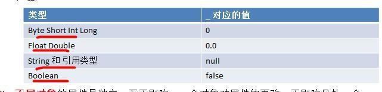

### 创建对象

1. 不希望对象的引用改变，应该声明为val性质，否则声明为var，推荐使用val，在程序中我们一般不会改变对象的引用，而是改变对象的属性值。
2. scala 在声明对象变量时，可以根据创建对象的类型自动推断，所以类型声明可以省略， 但当类型和后面 new 对象类型有继承关系即多态时，就必须写了。

### 类和对象的内存分配机制

```scala
package com.atguigu.chapter06.oop
object MemState {
    def main(args: Array[String]): Unit = {
        val p1 = new Person2
        p1.name = "jack"
        p1.age = 10
        val p2 = p1
        println(p1 == p2) // true
        p1.name = "tom"
        println("p2.name=" + p2.name)
    }
}
class Person2 {
    var name = ""
    var age: Int = _ //如果是用 _ 方式给默认值，则属性必须指定类型
}
```

上面的测试代码对应的内存布局图

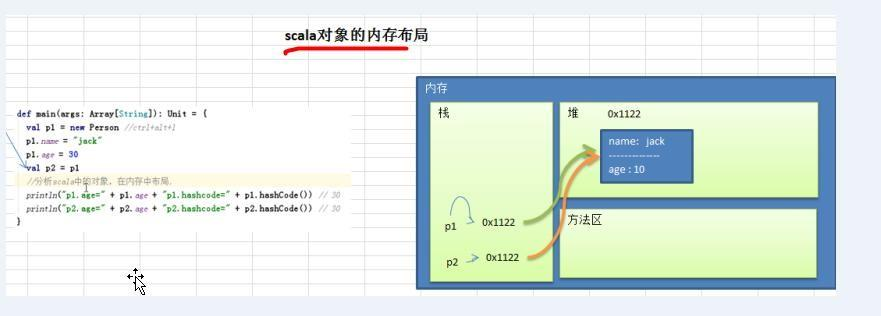

## 函数

​		在Scala中方法就是函数。

## 构造器

Scala 类的构造器包括： 主构造器 和 辅助构造器  

**注意事项**

1. Scala 构造器作用是完成对新对象的初始化，构造器没有返回值。
2. 主构造器的声明直接放置于类名之后。
3. 主构造器会执行类定义中的所有语句。
4. 如果主构造器无参数，小括号可省略，构建对象时调用的构造方法的小括号也可以省略。
5. 辅助构造器名称为 this（这个和 Java 是不一样的）， 多个辅助构造器通过不同参数列表进行区分， 在底层就是 f 构造器重载。  
6. 辅助构造器无论是直接或间接，最终都一定要调用主构造器，执行主构造器的逻辑。
7. 如果想让主构造器变成私有的，可以在()之前加上 private，这样用户只能通过辅助构造器来构造对象了【反编译】
   `class Person2 private() {}  `
8. 辅助构造器的声明不能和主构造器的声明一致,会发生错误(即构造器名重复)。

## 属性高级

### 构造器参数  

1. Scala 类的主构造器的形参未用任何修饰符修饰，那么这个参数是局部变量。  
2. 如果参数使用 val 关键字声明，那么 Scala 会将参数作为类的私有的只读属性使用。
3. 如果参数使用 var 关键字声明，那么那么 Scala 会将参数作为类的成员属性使用,并会提供属性对应的 xxx()[类似 getter]/xxx_$eq()[类似 setter]方法，即这时的成员属性是私有的，但是可读写。

### Bean 属性  

​		JavaBeans 规范定义了 Java 的属性是像 getXxx（） 和 setXxx（） 的方法。许多 Java 工具（框架）都依赖这个命名习惯。为了 Java 的互操作性。将 Scala 字段@BeanProperty 时，这样会自动生成规范的 setXxx/getXxx 方法。这时可以使用 对象.setXxx() 和 对象。getXxx() 来调用属性。 

**注意**:给某个属性加入@BeanPropetry 注解后，会生成 getXXX 和 setXXX 的方法
并且对原来底层自动生成类似 xxx(),xxx_$eq()方法，没有冲突，二者可以共存

**案例  **

```scala
package com.atguigu.chapter06.constructor
import scala.beans.BeanProperty
object BeanPropertDemo {
    def main(args: Array[String]): Unit = {
        val car = new Car
        car.name = "宝马"
        println(car.name)
        //使用 @BeanProperty 自动生成 getXxx 和 setXxx
        car.setName("奔驰")
        println(car.getName())
    }
}
class Car {
    @BeanProperty var name: String = null
}
```

## scala 对象创建的流程分析

```scala
class Person {
    var age: Short = 90
    var name: String = _
    def this(n: String, a: Int) {
        this()
        this.name = n
        this.age = a
    }
}
```

`var p : Person = new Person("小倩",20)  `

1. 加载类的信息(属性信息，方法信息)
2. 在内存中(堆)开辟空间
3. 使用父类的构造器(主和辅助)进行初始
4. 使用主构造器对属性进行初始化 【age:90, naem nul】
5. 使用辅助构造器对属性进行初始化 【 age:20, naem 小倩 】
6. 将开辟的对象的地址赋给 p 这个引用。 

# 面向对象中级

## 包

### 基本介绍

​		和 Java 一样， Scala 中管理项目可以使用包，但 Scala 中的包的功能更加强大，使用也相对复杂些。  

### 作用

1. 区分相同名字的类
2. 当类很多时,可以很好的管理类
3. 控制访问范围
4. 可以对类的功能进行扩展  

**与java的不同**

​		Scala 中<font color  = "red">包名和源码所在的系统文件目录结构</font>可以不一致，但是编译后的字节码文件路径和包名会保持一致(这个工作由编译器完成)。   

### **使用细节**

	1. 包也可以像嵌套类那样嵌套使用（包中有包）。好处：程序员可以在同一个文件中，将类(class / object)、 trait 创建在不同的包中，这样就非常灵活了  。
 	2. 作用域原则：可以直接向上访问。在子包和父包 类重名时，默认采用就近原则，如果希望指定使用某个类，则带上包名即可。 
 	3. 父包要访问子包的内容时，需要 import 对应的类等 。
 	4. 可以在同一个.scala 文件中，声明多个并列的 package(建议嵌套的 pakage 不要超过 3 层)  。  
 	5. 包名可以相对也可以绝对，比如，访问 BeanProperty 的绝对路径是：
     _root_. scala.beans.BeanProperty ，在一般情况下：我们使用相对路径来引入包，只有当包名冲突时，使用绝对路径来处理。

### 包对象  

#### 介绍 

​		包可以包含类、对象和特质 trait，但不能<font color  = "red">包含函数/方法或变量的定义</font>。这是 Java 虚拟机的局限。为了弥补这一点不足， scala 提供了包对象的概念来解决这个问题。

#### 案例

```scala
package com.atguigu { // 包 com.atguigu
    //说明
    //1. 在包中直接写方法，或者定义变量，就错误==>使用包对象的技术来解决
    //2. package object scala 表示创建一个包对象 scala, 他是 com.atguigu.scala 这个包对应的包对象
    //3. 每一个包都可以有一个包对象
    //4. 包对象的名字需要和子包一样
    //5. 在包对象中可以定义变量，方法
    //6. 在包对象中定义的变量和方法，就可以在对应的包中使用
    //7. 在底层这个包对象会生成两个类 package.class 和 package$.class
    package object scala {
        var name = "king"
        def sayHiv(): Unit = {
            println("package object scala sayHI~")
        }
    }
    package scala { // 包 com.atguigu.scala
        class Person { // 表示在 com.atguigu.scala 下创建类 Person
            val name = "Nick"
            def play(message: String): Unit = {
                println(this.name + " " + message)
            }
        }
        class User {
            def testUser(): Unit = {
                println("name = " + name)
                sayHiv()
            }
        }
        object Test100 { //表示在 com.atguigu.scala 创建 object Test
            def main(args: Array[String]): Unit = {
                println("name=" + name)
                name = "yy"
                sayHiv()
            }
        }
    }
}
```

#### 包对象的底层的实现机制

​		一个包对象会生成两个类 package 和 package$  

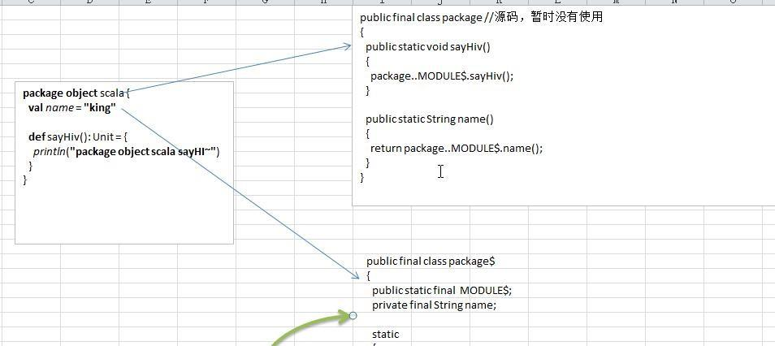

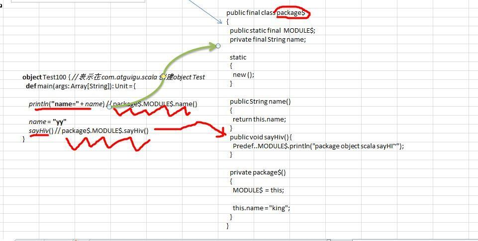

如图所示：说明了包去使用包对象的变量或者方法的原理。

#### 注意事项

1. 每个包都可以有一个包对象。你需要在父包中定义它。包对象和包在同级目录。
2. 包对象名称需要和包名一致，一般用来对包的功能补充，函数和变量。

## 包的可见性问题  

  访问权限分为: public， private， protected 和默认。  

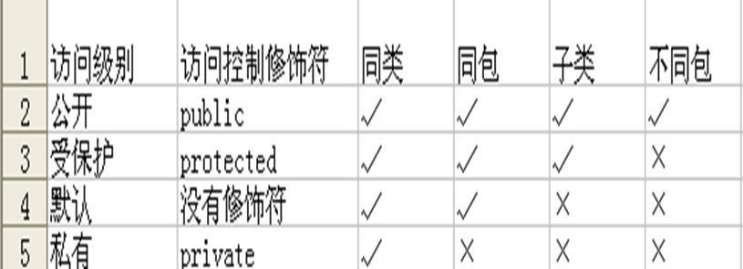

### 访问修饰符的使用

1. 属性的修饰符为默认时，编译后的属性修饰符为private，但是会提供xxx_$eq()[ 类似 setter]/xxx()[类似 getter] 方法， 因此从使用效果来看是任何地方都可以访问的。

2.  当方法访问权限为默认时，默认为 public 访问权限。

3. private 为私有权限，只在类的内部和伴生对象中可用。

4. protected 为受保护权限， scala 中受保护权限比 Java 中更严格，只能子类访问，同包无法访问。

5. 在 scala 中没有 public 关键字,即不能用 public 显式的修饰属性和方法。

6. 包访问权限（表示属性有了限制。同时包也有了限制） ，这点和 Java 不一样，体现出 Scala 包使用的灵活性。

   

## 包的引入 

### 介绍

​		Scala 引入包也是使用 import, 基本的原理和机制和 Java 一样，但是 Scala 中的 import 功能更加强大，也更灵活。  

​	因为scala源于java，所以java.lang包中的内容会自动引入到当前环境中，而 Scala 中的 scala包和 Predef 包的类也会自动引入到当前环境中，即起其下面的类可以直接使用。  

#### 细节和注意事项  

1. 在Scala中，import语句可以出现在任何地方，并不局限于文件顶端。好处是可以缩小 import 包的作用范围，提高效率。  

2. Java 中如果想要导入包中所有的类，可以通过通配符*， Scala 中采用下 _   。

3. 如果不想要某个包中全部的类，而是其中的几个类，可以采用选取器(大括号)  。   

   ```scala
   def test(): Unit = {
       //可以使用选择器，选择引入包的内容，这里，我们只引入 HashMap, HashSet
       import scala.collection.mutable.{HashMap, HashSet}
       var map = new HashMap()
       var set = new HashSet()
   }
   ```

4. 如果引入的多个包中含有相同的类，那么可以将不需要的类进行重命名进行区分，这个就是重命名。

   ```scala
   def test2(): Unit = {
       //下面的含义是 将 java.util.HashMap 重命名为 JavaHashMap
       import java.util.{ HashMap=>JavaHashMap, List}
       import scala.collection.mutable._
       var map = new HashMap() // 此时的 HashMap 指向的是 scala 中的 HashMap
       var map1 = new JavaHashMap(); // 此时使用的 java 中 hashMap 的别名
   }
   ```

5. 如果某个冲突的类根本就不会用到，那么这个类可以直接隐藏掉。

```scala
import java.util.{ HashMap=>_, _} // 含义为 引入 java.util 包的所有类，但是忽略 HahsMap 类.
var map = new HashMap() // 此时的 HashMap 指向的是 scala 中的 HashMap, 而且 idea 工具，的提示也不会显示 java.util 的 HashMaple
```

## 面向对象编程方法-抽象

### 抽象

​		抽象实际上就是将一类食物具有的共同属性和行为提取出来，形成一个物理模板，这种<font color ="red">研究问题的方法</font>称为抽象。

**案例**

## 面向对象编程三大特征  

​		面向对象编程有三大特征：封装、继承和多态。  

### 封装  

**封装的好处**

1. 隐藏实现细节
2. 可提前对数据进行验证，保证安全合理
3. 同时可以加入业务逻辑  

**如何体现封装**

1. 类中属性进行封装
2. 通过成员方法，包实现封装

**实现步骤**

1. 属性私有化
2. 提供set方法，用于属性的判读与赋值
3. 提供get方法，用于获取属性的值

**入门案例**

请大家看一个小程序(TestEncap.scala),不能随便查看人的年龄,工资等隐私，并对输入的年龄进行合理的验证[要求 1-120 之间]。  

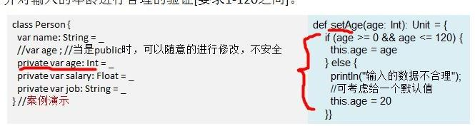

**封装注意事项**

1. Scala中，当用var声明属性时，本身就提供了对应的setter/getter 方法，如果属性声明为 private 的，那么自动生成的 setter/getter 方法也是 private 的，如果属性省略访问权限修饰符，那么自动生成的 setter/getter 方法是 public 的  。

   ```scala
   class Monster(inName: String, inAge: Int, inSal: Double) {
     var name = inName
     private var age = inAge
     var sal = inSal
   }
   ```

   编译后生成Monster和Monster$

   ```java
   public class Monster{
       private String name;
       private int age;
       private double sal;
   
       public static void main(String[] paramArrayOfString){
           Monster..MODULE$.main(paramArrayOfString);
       }
   
       public String name(){ return this.name; } 
       public void name_$eq(String x$1) { this.name = x$1; } 
       private int age() { return this.age; } 
       private void age_$eq(int x$1) { this.age = x$1; } 
       public double sal() { return this.sal; } 
       public void sal_$eq(double x$1) { this.sal = x$1; }
   
   
       public Monster(String inName, int inAge, double inSal){
           this.name = inName;
           this.age = inAge;
           this.sal = inSal;
       }
   }
   ```


### 继承


#### **作用**

1. 继承可以解决代码复用的问题，是编程更加靠近人类的思维方式。当多个类具有相同的属性和方法时，我们将这些属性和方法从父类中提取出来，所有的子类就不需要重新定义这些方法和属性，只需要去继承父类。
2. 代码的扩展性和维护性提高了。体现在当我们修改父类中的方法和属性时，对应的子类中的方法和属性会一并进行修改所以说扩展性和维护性提高了。

继承示意图：

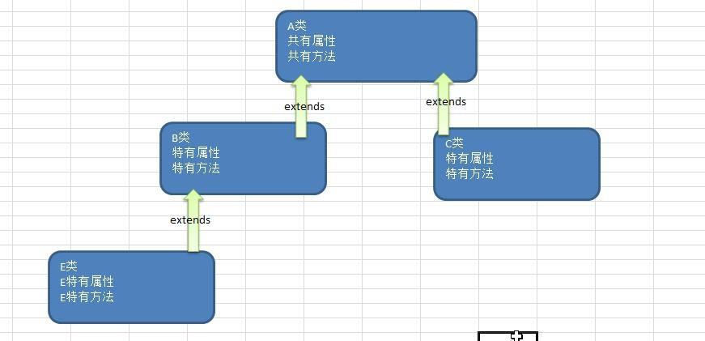

#### **scala 子类继承了什么 **

子类继承了所有的属性，私有的属性不能直接访问，需要通过公共的getter和setter去访问。私有的方法也是不能访问的。

#### 重写方法  

**说明**: scala 明确规定，重写一个非抽象方法需要用 override 修饰符，调用超类的方法使用 super 关键字 。

**案例**

```scala
package com.atguigu.scala.chapter07.myextends

object MethodOverride01 {
  def main(args: Array[String]): Unit = {
    val emp = new Emp
    emp.printName
  }

}
class Person100{
  var name = "tom"
  def printName: Unit ={
    println("Person printName() " + name)
  }
  def sayHi(): Unit = {
    println("sayHi...")
  }
}
class Emp extends Person100 {
  override def printName: Unit ={
    println("Emp printName() " + name)
    super.printName
    super.sayHi()
  }
}
```

输出结果：

`Emp printName() tom
Person printName() tom
sayHi...`

#### 类型检查和转换 

​		要测试某个对象是否属于某个给定的类，首先，需要使用isInstanceOf 判断对象是否为指定类的对象，如果是的话，则可以使用 asInstanceOf 将对象转换为指定类型。

**使用注意**

1. Scala与Java类型检查和转换

   | Scala               | Java             |
   | ------------------- | ---------------- |
   | obj.isInstanceOf[C] | obj instanceof C |
   | obj.asInstanceOf[C] | (C)obj           |
   | classOf[C]          | C.class          |

2. p.isInstanceOf[XX] 判断 p 是否为 XX 对象的实例；p.asInstanceOf[XX] 把 p 转换成 XX 对象的实例。
3. 如果没有用isInstanceOf 先判断对象是否为指定类的实例，就直接asInstanceOf 转换，则可能会抛出异常；
4. 如果对象是 null，则isInstanceOf 一定返回 false， asInstanceOf 一定返回null；

**案例**

```scala
class Person3 {}
class Student3 extends Person3
object Student3{
    def main (args: Array[String] ) {
    val p: Person3 = new Student3
    var s: Student3 = null
    //如果对象是 null，则 isInstanceOf 一定返回 false
    println (s.isInstanceOf[Student3])
    // 判断 p 是否为 Student3 对象的实例
  if (p.isInstanceOf[Student3] ) {
    //把 p 转换成 Student3 对象的实例
      s = p.asInstanceOf[Student3]
  }
  println (s.isInstanceOf[Student3] )
  }
}
```

**Scala中getClass和classOf**

​		isInstanceOf 只能判断出对象是否为指定类以及其子类的对象，而不能精确的判断出，对象就是指定类的对象。

​		如果要求精确地判断出对象就是指定类的对象，那么就只能使用 getClass 和 classOf 了。

​		p.getClass 可以精确地获取对象的类，classOf[XX]可以精确的获取类，然后使用 == 操作符即可判断。

**案例**

```scala
class Person4 {}
class Student4 extends Person4
object Student4{
  def main(args: Array[String]) {
    val p:Person4=new Student4
    //判断p是否为Person4类的实例
    println(p.isInstanceOf[Person4])//true
    //判断p的类型是否为Person4类
    println(p.getClass == classOf[Person4])//false
    //判断p的类型是否为Student4类
    println(p.getClass == classOf[Student4])//true
  }
}
```

#### 超类  

1. 类有一个主构器和任意数量的辅助构造器，而每个辅助构造器都必须先调用主构造器(也可以是间接调用.)
2. 只有主构造器能够调用父类的构造器，辅助构造器不能直接调用父类构造器。不能使用super()。

#### 覆写字段  

​		在 Scala 中， 子类改写父类的字段，我们称为覆写/重写字段。覆写字段需使用 override 修饰。  

**java动态绑定机制  **

1. 如果调用的是方法，则 Jvm 机会将该方法和对象的内存地址绑定
2. 如果调用的是一个属性，则没有动态绑定机制，在哪里调用，就返回对应值  

**案例**

```java
package com.atguigu.scala.chapter07.myextends;

public class JavaDaynamicBind {
    public static void main(String[] args) {
        AA obj = new BB();
        System.out.println(obj.sum());//40  30
        System.out.println(obj.sum1());//30 20
    }
}

class AA {
    int i = 10;
    public int sum() {return getI() + 10;}

    public int sum1() { return i + 10; }

    public int getI() {  return i;}
}

class BB extends AA {
    public int i = 20;

    //    public int sum() {return i + 20;}

    //    public int sum1() {return i + 10;}

    public int getI() {return i;}
}
```

注释BB中的两个方法后，输出结果发生改变。

**Scala 覆写字段快速入门  **

```scala
package com.atguigu.scala.chapter07.myextends

object ScalaDaynamicBind {
  def main(args: Array[String]): Unit = {
    val obj1: AAA = new BBB
    val obj2: BBB = new BBB
    println("obj1.age=" + obj1.i + "\t obj2.age=" + obj2.i)
  }
}

class AAA {
  val i = 10
}

class BBB extends AAA {
  override val i: Int = 20
}
```

输出结果：

`obj1.age=20	 obj2.age=20`

**注意事项**

1. def只能重写另一个def
2. val只能重写另一个val属性，或重写不带参数的def

```scala
object ScalaFiledOverride {
    def main(args: Array[String]): Unit = {
        val obj1: AAA = new BBB
        val obj2: BBB = new BBB
        //obj1.age => obj1.age() //动态绑定机制
        //obj2.age => obj2.age()
        println("obj1.age=" + obj1.age + "\t obj2.age=" + obj2.age)
    }
} /
//如果 val age 改成 var 报错
class AAA {
    val age: Int = 10 // 会生成 public age()
}
class BBB extends AAA {
    override val age: Int = 20 // 会生成 public age()
}
```

```scala
object ScalaFieldOverrideDetail02 {
    def main(args: Array[String]): Unit = {
        println("xxx")
        val bbbbb = new BBBBB()
        println(bbbbb.sal) // 0
        val b2:AAAAA = new BBBBB()
        println("b2.sal=" + b2.sal()) // 0
    }

}
class AAAAA {
    def sal(): Int = {
        return 10
    }}
class BBBBB extends AAAAA {
    override val sal : Int = 0 //底层 public sal
}
```

3. var 只能重写另一个抽象的 var 属性（没有初始化的属性） 

   ```scala
   abstract class A03 {
       var name : String //抽象
       var age: Int = 10
   }
   class Sub_A03 extends A03 {
       //说明
       //1. 如果我们在子类中去重写父类的抽象属性，本质是实现了抽象方法
       //2. 因此这里我们可以写 override ，也可以不写
       override var name : String = ""
   }
   ```

   注意：

   - 一个属性没有初始化，那么这个属性就是抽象属性  
   - 抽象属性在编译成字节码文件时，属性并不会声明，但是会自动生成抽象方法，所以类必须声明为抽象类  。
   - 重写父类的抽象属性时，override关键字可以省略，因为这相当于实现，抽象属性生成的是抽象方法吗，不涉及到方法的重写。

#### 抽象类  

​		在 Scala 中，通过 abstract 关键字标记不能被实例化的类。方法不用标记abstract，只要省掉方法体即可。抽象类可以拥有抽象字段，抽象字段/属性就是没有初始值的字段  

**案例**

```scala
//抽象类
abstract class Animal{
  var name : String //抽象的字段
  var age : Int // 抽象的字段
  var color : String = "black" //普通属性def
  def cry() //抽象方法,不需要标记 abstract
}
```

**注意事项**

1. 抽象类不能被实例。
2. 抽象类不一定要包含 abstract 方法。也就是说,抽象类可以没有 abstract 方法。在抽象类中可以有实现的方法。
3. 一旦类包含了抽象方法或者抽象属性,则这个类必须声明为 abstract。
4. 抽象方法不能有主体，不允许使用 abstract 修饰。
5. 如果一个类继承了抽象类，则它必须实现抽象类的所有抽象方法和抽象属性，除非它自己也声明为 abstract 类。
6. 抽象方法和抽象属性不能使用 private、 final 来修饰，因为这些关键字都是和重写/实现相违背的。
7. 子类重写抽象方法不需要 override，写上也不会错。

#### 匿名子类  

​		和 Java 一样，可以通过包含带有定义或重写的代码块的方式创建一个匿名的子类。

**案例**

```scala
object ScalaNoNameDemo02 {
    def main(args: Array[String]): Unit = {
        val monster = new Monster {
            override def cry(): Unit = {
                println("妖怪嗷嗷叫...:)")
            }
            override var name: String = _
        }
        monster.cry()
    }
}
abstract class Monster {
    var name: String
    def cry()
}
```

#### 继承层级  

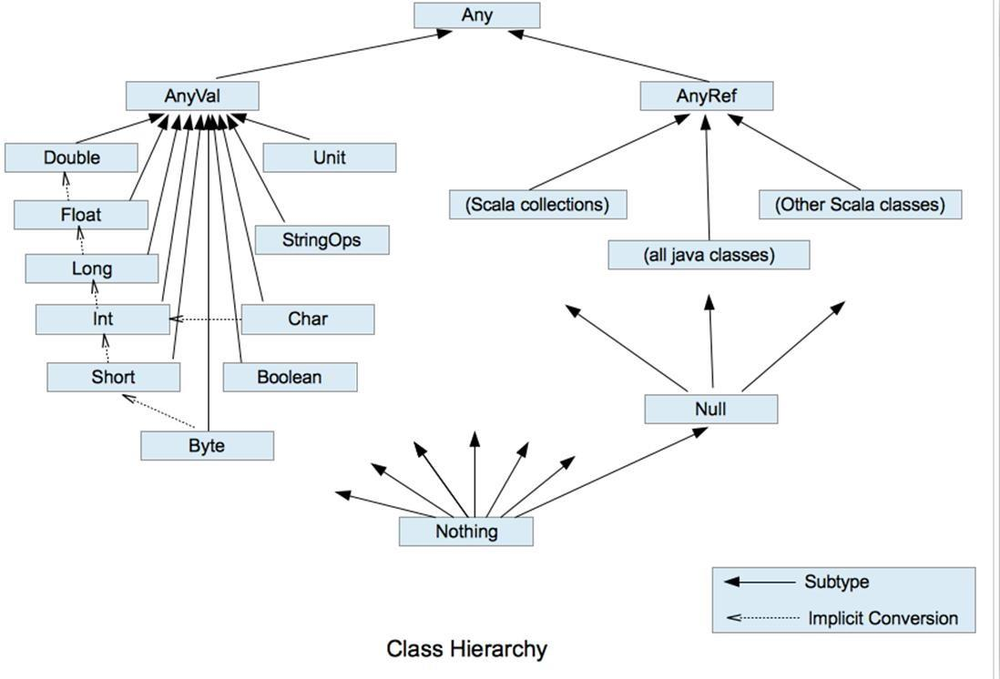

对上图的一个小结

1. 在 scala 中，所有其他类都是 AnyRef 的子类，类似 Java 的 Object。
2. AnyVal 和 AnyRef 都扩展自 Any 类。 Any 类是根节点。
3. Any 中定义了 isInstanceOf、 asInstanceOf 方法，以及哈希方法等。
4. Null 类型的唯一实例就是 null 对象。可以将 null 赋值给任何引用，但不能赋值给值类型的变量
5. Nothing 类型没有实例。它对于泛型结构是有用处的，举例：空列表 Nil 的类型是 List[Nothing]，它是 List[T]的子类型， T 可以是任何类。  

# 面向对象编程(高级特性)  

## 静态属性和静态方法  

### 基本介绍

Scala中的静态概念--伴生对象

​		Scala语言是完全面向对象的，是没有静态的操作的。但为了和java进行交互，就产生了一种特殊的对象来模拟类对象，我们称之为伴生对象。这个类的所有静态内容都可以放置在它的伴生对象中声明和调用。

- 伴生类中存放的是非静态的内容
- 伴生对象中存放静态的额内容

**案例**

```scala
package com.atguigu.scala.chapter08

object AccompanyObject {
  def main(args: Array[String]): Unit = {
    //打印伴生类中的静态属性
    println(ScalaPerson.sex)
    //调用伴生对象中的静态方法
    ScalaPerson.sayHi()
  }
}
//伴生类
class ScalaPerson {
  var name: String = _
}
//伴生对象
object ScalaPerson {
  var sex = true
  def sayHi(): Unit = {
    println("object ScalaPerson sayHi~~")
  }
}
```

查看源码：

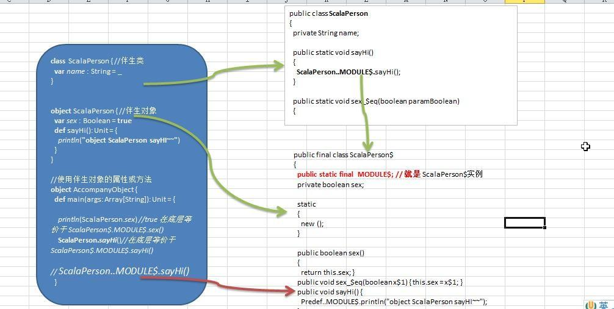

**伴生对象小结**

1. Scala中伴生对象通过object关键字声明，伴生对象中的内容全是"静态"（ScalaPerson$中定义了一个静态的常量，这个常量代表了这个伴生对象，通过这个常量进行属性和方法的调用）的，可以通过伴生对象直接调用。
2. 伴生对象对应的类被称为伴生类。伴生对象和伴生类的名字一致
3. 伴生对象中的属性和方法都可以通过对象名直接调用。
4. 伴生对象就是静态属性和静态方法的集合。
5. 从技术角度看（源码），scala还是没有生成静态的内容，只不过是将伴生对象生成了已给新的类，实现属性和方法的调用。
6. <font color = "red">从源码中看，静态的实现是依赖于</font>`public static final  MODULE$;`这个静态常量
7. 伴生对象和伴生类应存在于同一文件夹下。
8. 若伴生对象单独存在，那他就是一个静态性质的对象。
9. 当一个文件中，存在伴生类和伴生对象时，文件的图标会发生变化。

**案例**

```scala
package com.atguigu.scala.chapter08

object ChildJoinGame {
    def main(args: Array[String]): Unit = {
        val child1 = new Child("zzh")
        val child2 = new Child("lbw")
        val child3 = new Child("mff")
        Child.joinGame(child1)
        Child.joinGame(child2)
        Child.joinGame(child3)
        Child.showNum()
    }
}

class Child(inName: String) {
    val name = inName
}

object Child {
	//统计有多少小孩玩游戏
    var totalChildNum = 0
    def joinGame(child: Child): Unit = {
        printf("小孩：%s 加入游戏\n", child.name)
        totalChildNum += 1
    }
    def showNum(): Unit = {
        printf("共有%d个小孩在游戏", totalChildNum)
    }
}
```

### 伴生对象-apply 方法  

​		在伴生对象中定义 apply 方法，可以实现： 类名(参数) 方式来创建对象实例.

**案例**

```scala
package com.atguigu.scala.chapter08

object ApplyDemo01 {
  def main(args: Array[String]): Unit = {
    //通过 类名.apply的方法创建对象
    println(Pig.apply("猪猪侠").name) //猪猪侠
    println(Pig.apply().name) //无名猪
    //通过new创建对象
    val pig = new Pig("好猪")
  }
}

class Pig(inName: String) {
  var name = inName
}

object Pig {
  def apply(): Pig = new Pig("无名猪")
  def apply(name: String): Pig = new Pig(name)
}
```

## 单例对象


简单实现

```scala
package com.atguigu.scala.chapter08.singleObject
object SingleDemo01 {
  def main(args: Array[String]): Unit = {
    val dog1 = Dog
    println(dog1)//Dog$@6adca536
    val dog2 = Dog
    println(dog2)//Dog$@6adca536
    //打印出dog1 和dog2 是同一个对象
  }
}

class Dog private(){}

object  Dog{
  var singleDog :Dog = null
  def apply(): Dog = {
    if (singleDog == null)
    singleDog = new Dog()
    singleDog
  }
}
```


## 接口

### 回忆java中的接口

1. 在Java中，一个类能够实现多个接口。
2. 在Java中，接口之间能够多继承。
3. 接口中的属性都是常量。
4. 接口中的方法都是抽象的。（jdk1.8中可以定义默认方法(可实现非得方法)和静态方法）。1.8之间只能定义常量和抽象方法。

### Scala 特质的介绍  

1. 从面向对象来看，接口不是面向对象的，所以Scala中是没有接口的。
2. Scala中是使用特制trait来代替接口的概念。当多个类具有相同的特征时，可以将这个特质独立出来，采用trait关键字声明。在Scala中trait相当于java中interface和abstract的结合。
3. 特质的作用：在<font color = "red">不破坏继承关系的额情况下给类添加功能</font>。

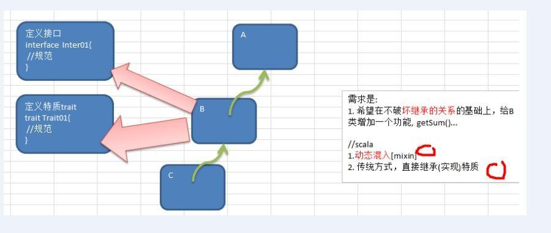

#### trait的声明

```scala
trait 特质名 {//特质名一般大写
	trait 体
}  
```

#### **trait的使用**

特质使用时，采用extends关键字，如果有多个特质或存在父类，那么需要采用 with 关键字连接。

1. 没有父类  

   class 类名 extends 特质 1 	with 特质 2 	with 特质 3 ..  

2. 有父类

   class 类名 extends 父类 	with 特质 1	 with 特质 2 	with 特质 3  

#### **简单案例**

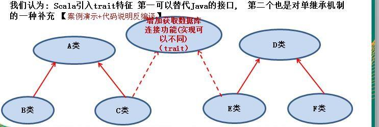

```scala
package com.atguigu.scala.chapter08

object TraitDemo02 {
  def main(args: Array[String]): Unit = {
    val c = new C
    val e = new E
    c.getConnect()
    e.getConnect()
  }
}

trait Trait01 {
  def getConnect()
}

class A {}

class B extends A {}

class C extends A with Trait01 {
  override def getConnect(): Unit = {
    println("获取mysql连接")
  }
}

class D {}

class E extends D with Trait01 {
  override def getConnect(): Unit = {
    println("获取oracle连接")
  }
}

class F extends D {}
```

**特质注意事项**

1. Scala 提供了特质（trait），特质可以同时拥有抽象方法和具体方法，一个类可以实现/继承多个特质通过with。

   ```scala
   package com.atguigu.scala.chapter08
   
   object TraitDemo03 {
     def main(args: Array[String]): Unit = {
       val sheep = new Sheep
       //调用实现了特质中的抽象方法
       sheep.sayHi
       //调用特质中的实现的方法
       sheep.sayHello()
     }
   }
   
   trait Trait03{
     //抽象方法
     def sayHi{}
     //实现方法
     def sayHello(): Unit ={
       println("实现方法 sayHello")
     }
   }
   
   class Sheep() extends Trait03 {
     override def sayHi: Unit = {
       println("实现了抽象方法  sayHi()")
     }
   }
   ```

   源码剖析：当特质只有抽象方法时，编译之后只会编译出一个Trait03.class文件，而特质中有实现了的方法时，会产生两个文件Trait03.class和Trait03$class.class

   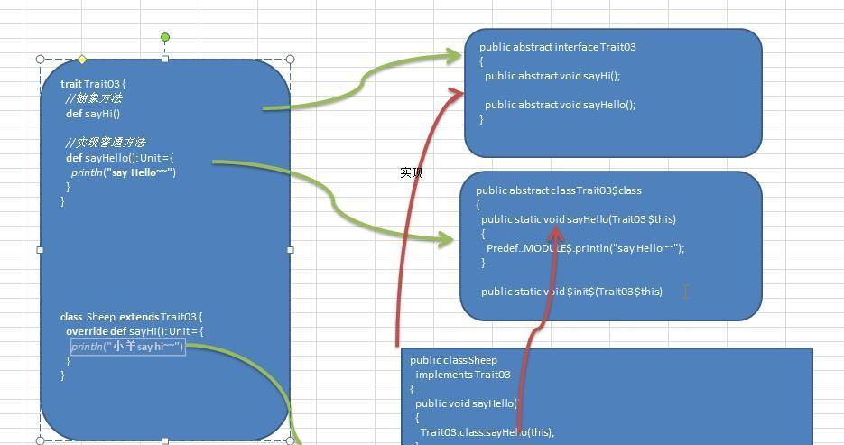

2. 所有java的接口都可以当做Scala的特质的使用。

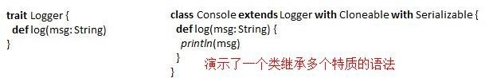

###  带有特质的对象，动态混入  

- 除了在声明类时，继承特质，和可以在创建对象是混入特质，扩展目标类的功能
- 此种方式也可以应用于对抽象类功能进行扩展。
- 动态混入是 Scala 特有的方式（ java 没有动态混入），可在不修改类声明/定义的情况下，扩展类的功能，非常的灵活，耦合性低 。
- 动态混入可以在不影响原有的继承关系的基础上，给指定的类扩展功能。
- 同时要注意动态混入时，如果抽象类有抽象方法，如何混入。

#### 案例

```scala
package com.atguigu.scala.chapter08.mixin

object MixInDemo01 {
  def main(args: Array[String]): Unit = {
    //在不修改 类的定义基础，让他们可以使用 trait 方法
    val oracleDb = new OracleDB with Operate3
    oracleDb.insert(666) //插入数据 = 666
    val mysql_ = new MySQL3 with Operate3
    mysql_.insert(888) //插入数据 = 888

    //抽象类有抽象方法,混入特质并重写方法
    val mySQL3_ = new MySQL3_ with Operate3 {
      override def say(): Unit = {
        println("say")
      }
    }
    mySQL3_.insert(999) //插入数据 = 999
  }

}

trait Operate3 { //特质
  def insert(id: Int): Unit = { //方法（实现）
    println("插入数据 = " + id)
  }
}

class OracleDB { //空
}

abstract class MySQL3 { //空
}

abstract class MySQL3_ { //空
  def say()
}
```

#### 在 Scala 中创建对象共有几种方式？  

1. new 对象
2. apply 创建
3. 匿名子类方式
4.  动态混入  


###  叠加特质


#### 简单介绍

在创建对象时，混入多个特质。那么<font color ="red">特质的声明顺序为从左到右，方法的执行顺序从右到左（底层由栈结构实现，先进的后出）。</font>

#### 案例

```scala
package com.atguigu.scala.chapter08.mixin

object AddTraits {
  def main(args: Array[String]): Unit = {
    //创建 MySQL4 实例时，动态的混入 DB4 和 File4
    val db4 = new MySQL4 with DB4 with File4
    //调用方法
    db4.insert(111)
  }

}

trait Operate4 { //特质
  println("Operate4...")

  def insert(id: Int) //抽象方法
}

trait Data4 extends Operate4 { //特质，继承了 Operate4
  println("Data4")

  override def insert(id: Int): Unit = { //实现/重写 Operate4 的 insert
    println("插入数据 = " + id)
  }
}

trait DB4 extends Data4 { //特质，继承 Data4
  println("DB4")

  override def insert(id: Int): Unit = { // 重写 Data4 的 insert
    println("向数据库")
    super.insert(id)
  }
}

trait File4 extends Data4 { //特质，继承 Data4
  println("File4")

  override def insert(id: Int): Unit = { // 重 写 Data4 的 insert
    println("向文件")
    super.insert(id) //调用了 insert 方法(难点)，这里 super 在动态混入时，不一定是父类
  }
}

class MySQL4 {} //普通类
```

输出结果：

`Operate4...
Data4
DB4
File4
向文件
向数据库
插入数据 = 111`

#### 叠加特质使用事项

1. 特质的声明顺序是从左到右
2. 方法的调用顺序是从右到左
3. 特质中的方法使用到super时，优先调用的是左边特质中的方法，若没有则调用父类特质中的方法。
4. 使用super时，可以使用泛型指定特质：super[特质].XXXX，注意指定的特质必须是该特质的直接父类特质

#### 特质继承特质并重写抽象方法

**案例**

```scala
package com.atguigu.scala.chapter08.mixin

object MixInDemo02 {
  def main(args: Array[String]): Unit = {
    //val mysql2 = new MySQl5 with File5 error
    val mysql2 = new MySQl5 with DB5 //ok
    val mysql4 = new MySQl5 with DB5 with File5 //ok
    //val mysql3 = new MySQl5 with File5 with DB5 //error
  }
}

trait Operate5 { //特质
  //抽象方法
  def insert(id: Int)
}

trait File5 extends Operate5 {
  abstract override def insert(id: Int): Unit = {
    println("将数据保存到文件中")
    super.insert(id)
  }
}

trait DB5 extends Operate5 {
  override def insert(id: Int): Unit = {
    println("将数据保存到数据库中")
  }
}

class MySQl5 {}

```

代码解析：特质Operate5中有一个抽象的方法，特质File5继承了Operate5，并且重写了抽象方法，在方法中有调用了Operate5中的抽象方法，此处的方法并不是完全实现的，所以需要声明为`abstract override`。

###  当作富接口使用的特质  

**富接口**

特质中既有抽象方法和非抽象方法。

```scala
trait Operate {
    def insert( id : Int ) //抽象
    def pageQuery(pageno:Int, pagesize:Int): Unit = { //实现
        println("分页查询")
    }
}
```

###  特质中的具体字段

特质中可以定义具体的字段，字段初始化了就是具体字段，若未初始化就是抽象字段，当有类混入该字段，就会拥有特质中的字段。字段不是继承，而是直接加入类中。

**案例：**

```scala
package com.atguigu.scala.chapter08.mixin

object MixInPro {
  def main(args: Array[String]): Unit = {
    val mySQl6 = new MySQL6 with DB6 {
      //重写抽象字段
      override var sal: Int = _
    }
  }
}

trait DB6 {
  //抽象字段
  var sal: Int
  //具体字段
  var opertype: String = "insert"

  def insert(): Unit = {
  }
}

class MySQL6 {}
```

**注意**

特质中未被初始化的字段在具体的子类中必须被重写。  

###  特质构造顺序  

特质也是有构造器的，构造器中的内容由“字段的初始化”和一些其他语句构成。  

- 声明类的同时混入特质
- 创建类的同时混入特质

**案例**

```scala
package com.atguigu.scala.chapter08.mixin

object MixInSeq {
  def main(args: Array[String]): Unit = {
    val f = new FF
    println(f)
    val k = new KK with CC with DD
    println(k)
  }
}

trait AA {
  println("A...")
}

trait BB extends AA {
  println("B ...")
}

trait CC extends BB {
  println("C ...")
}

trait DD extends BB {
  println("D ... ")
}

class EE { //普通类
  println("E ..")
}

class FF extends EE with CC with DD { //先继承了 EE 类，然后再继承 CC 和 DD
  println("F... ")
}

class KK extends EE { //KK 直接继承了普通类 EE
  println("K... ")
}
```

以上代码输出结果：

`  E ..
A...
B ...
C ...
D ... 
F... 
com.atguigu.scala.chapter08.mixin.FF@6adca536
E ..
K... 
A...
B ...
C ...
D ... 
com.atguigu.scala.chapter08.mixin.MixInSeq$$anon$1@357246de`

结论：

1. 声明类时混入特质时，对象还没创建，会按顺序调用构造。
2. 创建类时混入特质时，对象已经创建，先走类的继承关系中的构造。

###  扩展类的特质（扩展特质）  

- 特质也可以去继承类，以用来扩展特质的功能。

如：LoggedException继承了Exception，便可以调用Exception中的方法。

```scala
trait LoggedException extends Exception{
    def log(): Unit ={
        println(getMessage()) // 方法来自于 Exception 类
    }
}
```

- 一个类混入了扩展特质，那么该类自动成为扩展特质父类的子类。

- 如果混入扩展特质的类，已经继承类另一个类，那么该类必须是扩展特质父类的子类，否则就会发生多继承，发生的错误。scala不支持多继承，只有C语言是支持多继承的。

**案例**

```scala
package com.atguigu.scala.chapter08.extendtrait

object ExtendTraitDemo01 {
  def main(args: Array[String]): Unit = {
    println("aaa")
  }
}

trait LoggedException extends Exception {
  def log()= {
    //调用父类中的方法
    println(getMessage)
  }
}

//UnhappyException是Exception的子类
class UnhappyException extends LoggedException {
  //继承特质后可以重写特质父类中的方法
  override def getMessage = "错误信息"
}

//IndexOutOfBoundsException是Exception的子类
class UnhappyException2 extends IndexOutOfBoundsException with LoggedException{
  override def getMessage = "错误消息！"
}

class CCC {}
//错误的原因是 CCC 不是 Exception 子类
class UnhappyException3 extends CCC with LoggedException{
  override def getMessage = "错误消息！ "
}
```


### 自身类型


#### 说明

自身类型是为了解决循环依赖问题。同时可以确保特质在不扩展某个类的情况下，依然可以做到限制混入该特质的类的类型。  

#### 案例

```scala
package com.atguigu.scala.chapter08.selftype

object SelfTypeDemo {

}

//自身类型特质Logger，要求混入该特质的类也是 Exception 子类
trait Logger{
  //明确告诉编译器，我就是 Exception,如果没有这句话，下面的 getMessage 不能调用
  this: Exception =>
  def log(): Unit ={
    println(getMessage)
  }
}
//class Console extends Logger {} 错误
class Console extends Exception with Logger {} //正确
```

