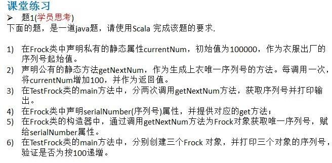

# day01

1. 在Scala REPL(read->evaluateion->print->loop)中，计算3的平方根,然后再对该值求平方。现在，这个结果与3相差多少？

```scala
var b:Double = scala.math.sqrt(3);
println(b)
```

提示：scala.math 找相应的方法

2. Scala语言的sdk是什么?

   sdk是编译,调试scala的工具包

3. Scala环境变量配置及其作用。

   将软件安装的路径配置到环境变量中

   为了方便在系统的任何位置找到Scala软件

4. Scala程序的编写、编译、运行步骤是什么? 能否一步执行?

   编写就是代码的遍写。

   编译就是通过scalac命令将.scala文件编译为.class文件，一个.scala文件编译会生成两个.class文件。再通过scala命令运行

   运行就是将.class文件加载到JVM中运行步骤实现编译后运行。

   可以一步执行（内部还是有编译过程）但是速度慢。

5. Scala程序编写的规则。

   ```scala
   //对scala的基本的程序结构说明
   //1. object 是一个关键字，表示一个伴生对象
   //2. 如果该文件只出现了一个object HelloScala 就会在编译后两个.class文件
   //3. 第一个文件是HelloScala.class 这个表示他的伴生类，但是空的.
   //4. 第2个文件是HelloScala$.class 对应的是object HelloScala,但是本质是调用它对应的一个静态属性 MODULE$
   //5. 这两个文件的关系和main函数的入口关系一会分析
   object HelloScala {
   	// 1. def 表示一个方法或者一个函数
   	// 2. main 表示入口
   	// 3. args: Array[String] 表示形参，args 是形参名 Array[String] 是形参类型表示一个Array数组
   	// 4. :Unit  表示返回值类型为 Unit ，等价于java 的void
   	// 5. = 表示 后面写的是函数体/方法体, 它还有返回值类型推导的作用
   	def main(args: Array[String]):Unit = {
   	       // 表示是 输出， 类似System.out.println("hello, scala世界!")
   	       // 在scala 语句后，不需要带; //体现简洁
   		println("hello, scala世界!")
   	}
   }
   ```

6. 简述：在配置环境、编译、运行各个步骤中常见的错误

7. 如何检测一个变量是val还是var? 

   尝试修改这个变量的值，若能进行修改则为var，反之为val。

8. Scala允许你用数字去乘一个字符串，去REPL中试一下"crazy"*3。这个操作做什么？在Scaladoc中如何找到这个操作? 

   测试

   ```scala
   println("crazy" * 3)
   ```

   输出结果为：crazycrazycrazy，将字符串乘以n并进行了拼接。

   方法：

   

9. 10 max 2的含义是什么？max方法定义在哪个类中？ 

   取10和2之间的较大值，相当于10.max(2)

   定义在package math中

   ```scala
   def max(x: Double, y: Double): Double
   ```

10. 用BigInt计算2的1024次方 

```scala
var a: BigInt = 2   
println(a.pow(1024))
```

提示：在BigInt类找相应的方法

```scala
def pow(exp: Int): BigInt
//Returns a BigInt whose value is (this raised to the power of exp)
```

11. 在Scala中如何获取字符串“Hello”的首字符和尾字符？ 

```scala
var str = "Hello"
//获取字符串的首字母
println(str.charAt(0))
//获取字符串的结尾字母
println(str.charAt(str.length - 1))
```

```scala
"hello".take(1)
"hello".takeRight(1)
"hello".reverse.take(1)
"hello"(0)
```

提示: 在String中找相应的方法

# day02


```scala
 /*
      应用实例：
      1.统计三个班成绩情况，每个班有 5 名同学，求出各个班的平均分和所有班级的平均分[学生的成绩从
      键盘输入]。
      分析思路
      (1) classNum 表示 班级个数 , stuNum 表示学生个数
      (2) classScore 表示各个班级总分 totalScore 表示所有班级总分
      (3) score 表示各个学生成绩
      (4) 使用循环的方式输入成绩
      2.统计三个班及格人数，每个班有 5 名同学。
      3.打印出九九乘法表
     */

var classNum = 3
var stuNum = 5
var classScore = 0.0
var totalScore = 0.0
var count = 0

for (i <- 1 to classNum) {
    for (j <- 1 to stuNum) {
        printf("请输入班级%d的第%d位学生的成绩：", i, j)
        var score = StdIn.readDouble()
        if (score >= 60) count += 1
        classScore += score
    }
    totalScore += classScore
    printf("班级%d的平均分为%.2f\n", i, classScore / stuNum)
    classScore = 0.0
}
printf("所有班级的平均分为%.2f\n", totalScore / (classNum * stuNum))
printf("及格人数:%d1\n", count)


//99乘法表
var num = 9
for (i <- 1 to num) {
    for (j <- 1 to i) {
        printf("%d * %d = %d \t", j, i, i * j)
    }
    println()
}
```


```scala
var sum = 0
for (i <- 1 to 100) {
    sum += i
    if (sum > 20) {
        println(s"i = ${i}")

    }
}
```

```scala
for (i <- 1 to 3) {
    print("请输入用户名：")
    val userName = StdIn.readLine()
    print("请输入密码：")
    val pwd = StdIn.readLine()

    if ("张无忌" == userName && "888" == pwd) {
        println("登入成功！")
    } else {
        println("对不起，您输入的用户名或密码错误！")
        //println("请重新输入，您还有" + (3 - i) + "次机会")
        printf("请重新输入，您还有%d次机会", 3 - i)
    }
}


var money: Double = 100000
var num = 1
var flag = true
while (flag) {
    if (money > 50000) {
        money = 0.95 * money
    } else {
        money -= 1000
    }
    num += 1
    if (money < 1000) {
        println(num)
        flag = false
    }
}

```

# day03

1、一个数字如果为正数，则它的signum为1;如果是负数,则signum为-1;如果为0,则signum为0.编写一个函数来计算这个值

```scala
//1 一个数字如果为正数，则它的signum为1;如果是负数,则signum为-1;如果为0,则signum为0.编写一个函数来计算这个值
def signum(num: Int): Int = {
    if (num == 0) {
        0
    } else if (num > 0) {
        1
    } else {
        -1
    }
}
```

2、一个空的块表达式{}的值是什么？类型是什么？

```scala
val a = {}
printf(a.isInstanceOf[Unit].toString)
```

a的值是（），

以上代码输出true，说明a的类型是Unit

3、针对下列Java循环编写一个Scala版本:
         for(int i=10;i>=0;i–)System.out.println(i);

```scala
for (n <- 0 to 10 ) {
    println(10 - n)
}

//或者
for(n <- 0 to 10 reverse){
    println(n)
}
```

4、编写一个过程countdown(n:Int)，打印从n到0的数字

```scala
//4、编写一个过程countdown(n:Int)，打印从n到0的数字
def countdown(n: Int)() {
    for (i <- 0 to n reverse) {
        println(i)
    }
}

def countDown2(n: Int): Unit = {
    //这里我们使用时第二种方式,使用到高阶函数的特性
    (0 to n).reverse.foreach(println)
}
```

5、编写一个for循环,计算字符串中所有字母的Unicode代码（toLong方法）的乘积。举例来说，"Hello"中所有字符串的乘积为9415087488L

```scala
//5、编写一个for循环,计算字符串中所有字母的Unicode代码（toLong方法）的乘积。举例来说，"Hello"中所有字符串的乘积为9415087488L
def toLong1(str: String): Long = {
    val array = str.toCharArray
    var sum = 1L
    for (item <- array) {
        val long = item.toLong
        sum *= long
    }
    sum
}
```

6、同样是解决前一个练习的问题，请用StringOps的foreach方式解决。

```scala
var res2 = 1L
"Hello".foreach((c: Char) => {
    res2 *= c.toLong
})//这里foreach的参数是一个匿名函数
println("res2=" + res2)

//简化
"Hello".foreach( res2 *= _c.toLong) //只有一个参数，省略
```

7、编写一个函数product(s:String)，计算字符串中所有字母的Unicode代码（toLong方法）的乘积

```scala
def toLong2(str: String): Long = {
    var sum = 1L
    str.foreach(sum *= _.toLong)
    sum
}
```

8、把7练习中的函数改成递归函数

```scala
def toLong3(str: String): Long = {
    if (str.length==1){
        str.charAt(0).toLong
    }else{
        str.charAt(0).toLong * toLong3(str.drop(1))
    }
}
```

9、编写函数计算 ,其中n是整数，使用如下的递归定义:
•	  = x* ,如果n是正数的话
•	  = 1
•	  = 1/ ,如果n是负数的话
•	不得使用return语句

```scala
def nine(x: Double, n: Int): Double = {
    if (n == 0) {
        1
    } else if (n > 0) {
        x * nine(x,n-1)
    } else {
        1 / nine(x,0 - n)
    }
}
```

# day04

1、编写一个Time类，加入只读属性hours和minutes，和一个检查某一时刻是否早于另一时刻的方法before(other:Time):Boolean。Time对象应该以new Time(hrs,min)方式构建。

```scala
class Time(inHours: Int, inMin: Int) {
    private val hours = inHours
    private val min = inMin

    def before(other: Time): Boolean = {
        if (this.hours < other.hours) {
            true
        } else if (this.hours > other.hours) {
            false
        } else {
            if (this.min < other.min) {
                true
            } else {
                false
            }
        }
    }
}
```

2、创建一个Student类，加入可读写的JavaBeans属性name(类型为String)和id(类型为Long)。有哪些方法被生产？(用javap查看。)你可以在Scala中调用JavaBeans的getter和setter方法吗？

```scala
class Student(inName : String,inId : Long){
    var name = inName
    var id  = inId
}
```

主构造方法，和name与id各产生的两个类似getter和setter的方法，方法名分别为name，name_$eq和id，id$eq,

不能够调用getter和setter方法，编译后并未生成这两个方法，字段前加上@Beanrorpetry注解后才会生成这两个方法。并且xxx和xxx_$eq方法也会生成，并不冲突。


包和引入
1、练习使用包的各种声明方式，并查看他们的不同

2、编写一段程序,将Java哈希映射中的所有元素拷贝到Scala哈希映射。用引入语句重命名这两个类。

# day05

## 课堂习题

