# 1、索引概述

​		通俗地来讲，==正向索引==是通过 `key` 找 `value`，==反向索引==则是通过 `value` 找 `key`。

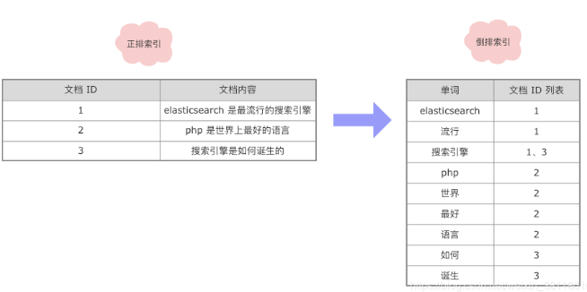

## 1.1、正向索引

​		**正向索引（forward index）**：以文档的 `ID` 为关键字，表中记录文档中==每个字的位置信息==，查找时扫描表中每个文档中==字的信息==直到找出所有包含查询关键字的文档。如==查询万达商场1层楼有多少家店==。

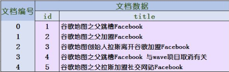

1. 这种组织方法在建立索引的时候结构比较简单，建立比较方便且易于维护。
2. 若是有新的文档加入，直接为该文档建立一个新的索引块，挂接在原来索引文件的后面。
3. 若是有文档删除，则直接找到该文档号文档对应的索引信息，将其直接删除。

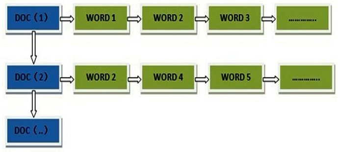

​		**缺点**：文本检索效率太低

## 1.2、反向索引

​		**反向索引（inverted index）**：一般也被别人称之为==倒排索引==，其就是查询某个字段在哪些文档里面出现过，如==万达所有的门店都各自出现在哪几层==。

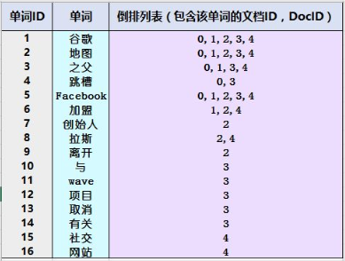

​		倒排表以==字或词为关键字==进行索引，表中关键字所对应的==记录表项==记录了==出现这个字或词的所有文档==，一个表项就是一个字段，它记录该文档的 ==ID 和 字符在该文档中出现的位置情况== 。

​		**优缺点：**

1. 查询的时候由于可以一次得到查询关键字所对应的所有文档，所以==查询效率高于正排索引==。可以简单理解为正向索引是在你搜索的时候才建立信息，而倒排索引是在搜索前就建立了相应的数据信息。
2. 由于每个字或词对应的文档数量在动态变化，所以==倒排表的建立和维护都较为复杂==，在以前，如果数据量较大的话，通常要花费一天甚至一周的时间去构建。

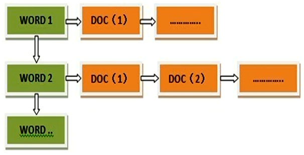

### 1.2.1、倒排索引的过程

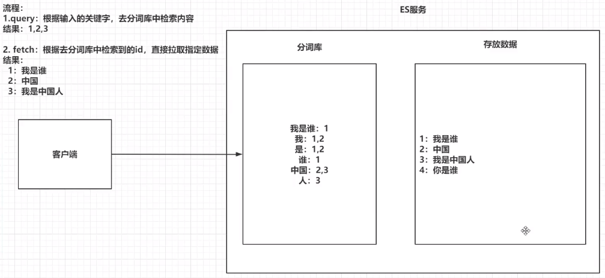

1. 将存放的数据以==一定的方式==进行分词，并将分词的内容存放到一个==单独的分词库==中。
2. 当用户取查询数据时，会将用户的==查询关键字==进行分词，然后去分词库中匹配内容，最终得到数据的 `id` 标识。
3. 根据 `id` 标识去存放数据的位置拉取指定数据。

### 1.2.2、倒排索引的组成

​		倒排索引主要由==单词词典（Term Dictionary）==和==倒排列表（Posting List）==组成。

1. **单词词典（Term Dictionary）：**

​		倒排索引的重要组成，记录==所有文档的单词==，一般都比较大，记录==单词到倒排列表==的关联信息。单词词典一般用 `B+Trees` 来实现，存储在==内存==：

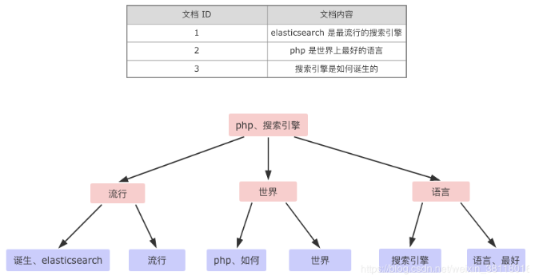

2. **倒排列表（PostingList）：**

​		==倒排列表==记载了出现过某个单词的==所有文档的文档列表==，及单词在该文档中出现的==位置信息及频率==（作关联性算分），每条记录称为一个==倒排项==（Posting）。

​		倒排列表存储在磁盘文件中，主要包含以下信息：

1. 文档 ID
2. 单词频率（TF：Term Frequency)
3. 位置（Position）
4. 偏移（Offset）

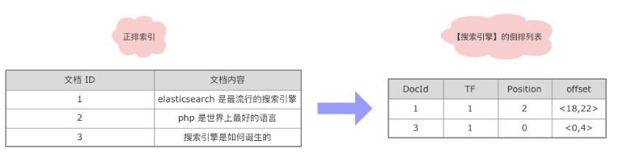

3. **倒排索引**

​		==单词字段==和==倒排列表==整合在一起的结构如下：

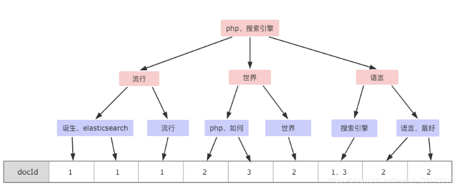

### 1.2.3、临时索引的应用

​		搜索引擎需要处理的文档集合往往都是动态集合，即在建好初始的索引后，不断有新文档进入系统，同时原先的文档集合内有些文档可能被==删除或更改==。

​		动态索引通过在内存中维护==临时索引==，可以实现对==动态文档==和==实时搜索==的支持，服务器内存总是有限的，随着新加入系统的文档越来越多，临时索引消耗的内存也会随之增加。当最初分配的内存将被使用完时，要考虑将临时索引的内容更新到==磁盘索引==中，以释放内存空间来容纳后续的新进文档。

> **倒排索引**：就是对初始文档集合建立的索引结构，一般单词词典都存储在==内存==，对应的倒排列表存储在==磁盘文件==中。
>
> **临时索引**：是在内存中实时建立的==倒排索引==，其结构和前述的倒排索引是一样的，区别在于==词典和倒排列表都在内存中==存储。新文档进入系统时，实时解析文件并将其加入到==临时索引结构==中。

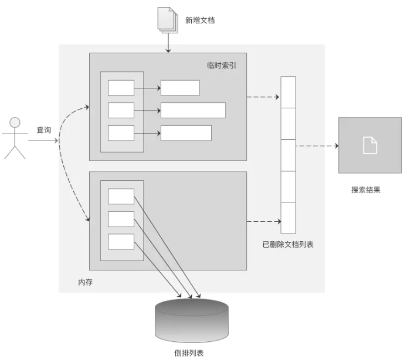

### 1.2.3、索引的更新思想

1. **删除文档**：删除文档列表则用来存储已被删除的文档的相应的文档 `ID`，形成一个文档 `ID` 列表。`ES` 不会直接进行物理删除，而是将删除的文档 `ID` 进行记录在==删除文档列表==中，在对关键字查询完文档 `ID` 后，再走删除文档列表，进行==逻辑删除==。但对于删除文档列表不进行优化的话可能会出问题，如会出现 10 亿条数据，有 8 亿条数据都在删除文档列表的情况，因此应对其进行优化，进行物理上的删除，重建索引。
2. **修改文档**：修改文档可以认为是旧文档先被删除，然后系统在增加一篇新的文档，通过这种间接方式实现对内容更改的支持。

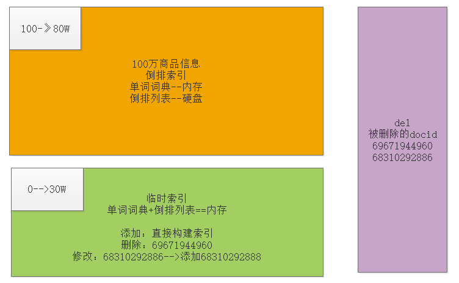

### 1.2.4、索引的更新策略

常用的索引更新策略主要有四种：==完全重建策略==、==再合并策略==、==原地更新策略==及==混合策略==。

#### 1.2.4.1、完全重建策略

​		完全重建策略是一个很直接的方法，当新增文档达到一定数量，将==新增文档==和==原先的老文档==进行合并，然后利用建立==静态索引==的方式，对所有文档==重新建立索引==。新索引建立完成后，老的索引被遗弃释放。

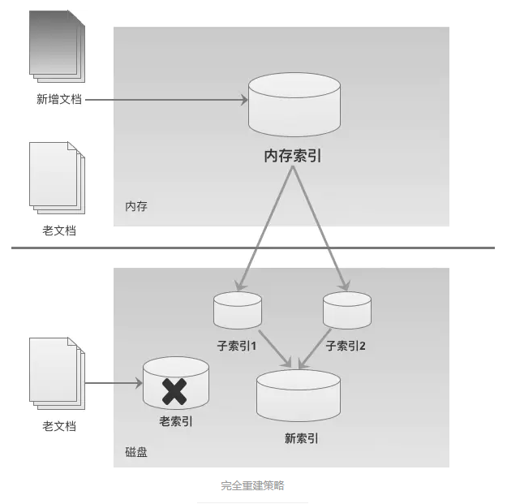

​		**优缺点：**

1. 因为重建索引需要较长时间，在进行索引重建的过程中，内存中仍然需要维护老索引来对用户的查询做出响应。`ES` 能取代 `Solr` 的原因就是，`Solr` 构建索引时就是完全重建策略，在构建索引时是==完全阻塞==的，不能进行搜索，而 `ES` 的索引更新是增量的。
2. 这种策略适合比较小的文档集合

#### 1.2.4.2、再合并策略

​		在合并过程中，需要依次遍历==增量索引和老索引单词词典==中包含的单词以及其对应的倒排列表，可以用两个指针分别指向增量索引和老索引目前需要合并的单词。（*细节非常类似于归并排序的合并过程*）

* 如果增量索引中指针指向的单词 ID *小于* 老索引中指针指向的单词 ID，则说明这个单词在老索引中没有出现过，直接将这个单词对应的倒排列表写入新索引的倒排列表中，同时增量索引单词指针指向下一个单词。

- 如果两个单词 ID *相等*，则先将老索引中这个单词对应的倒排列表加入新索引，然后在把增量索引这个单词对应的倒排列表追加到其后。
- 如果新索引指向的单词 ID *大于* 老索引指针指向的单词 ID，则直接将老索引中对应的倒排列表加入新索引的倒排文件中，老索引的单词指针指向下一个单词。

​		两个索引的所有单词都遍历完后，新索引建成。

​		**优缺点：**

1. 再合并策略是==效率非常高==的一种索引策略，主要是因为在对老索引进行遍历时，因为已经按照索引单词的词典顺序由低到高排好顺序，所以可以顺序读取文件内容，减少磁盘寻道时间。
2. 对于老索引中的很多单词来说，尽管其倒排列表并为发生任何变化，但是也需要将其从老索引中读取出来并写入新索引中，这样就会造成很大的磁盘输入输出消耗。

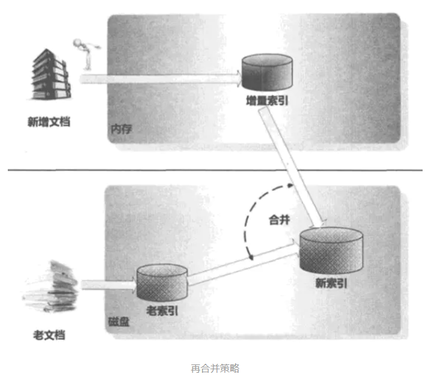

#### 1.2.4.3、原地更新策略

​		在索引更新过程中，如果老索引的倒排列表没有变化，可以不需要读取这些信息，而只是对那些倒排列表变化的单词进行处理，或者是直接将发生变化的倒排列表追加到老索引的末尾，即==只更新增量索引里出现的单词相关信息==，这样就可以减少大量的磁盘读写操作，提升系统执行效率。

​		原地更新策略出发点很好，但是实验数据证明其==索引更新效率比再合并策略低==，主要有两个原因：

1. 在这种方法中，对倒排列表的 ==“迁移”== 是比较常见的。这个策略需要对磁盘可用空间进行维护和管理，这种维护和查找成本非常高，这成为该方法效率的一个瓶颈。
2. 由于存在数据迁移，某些单词及其对应的倒排列表会从==老索引中溢出==，这样就破坏了单词的连续性，导致在进行索引合并的时候不能进行顺序读取，必需维护一个单词到其倒排文件相应位置的映射表，这样不仅降低了磁盘读写速度，而且需要大量的内存来存储这种映射信息。

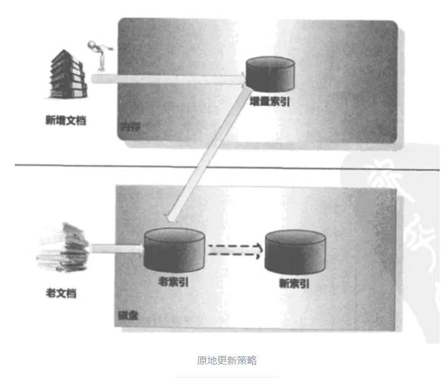

**存在问题**：

​		对于倒排文件中的两个相邻单词，为了在查询时加快读写速度，其倒排列表一般是顺序存储的，这导致没有空余位置来追加新信息。为了能够支持追加操作，原地更新策略在初始建立的索引中，会在每一个单词的倒排列表末尾预留出一定的磁盘空间。当预留空间不足时，需要在磁盘中找到一块完整的连续存储区，将增量索引对应的倒排列表追加到其后，实现倒排列表的*迁移*工作。

#### 1.2.4.4、混合策略

​		混合策略一般会将单词根据不同性质进行分类 ，不同类别单词，对其索引采取不同的索引更新策略。

常见的做法时：

1. 根据单词的倒排列表长度进行区分；
2. 因为有些单词经常在不同的文档中出现，所以其对应的倒排列表较长，而有些单词很少见，则其倒排列表就较短。
3. 根据这一性质将单词划分为长倒排列表单词和短倒排列表单词。
4. 长倒排列表单词采取原地更新策略，而短倒排列表单词则采取再合并策略