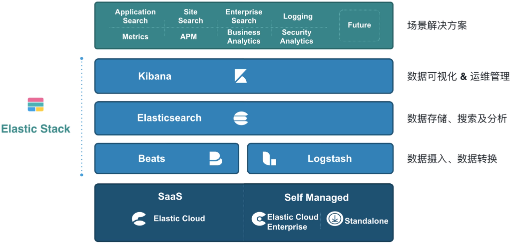
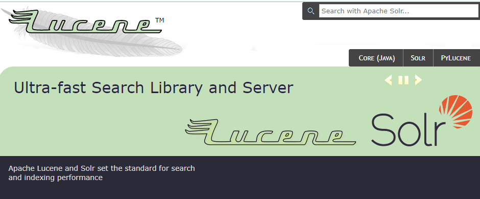
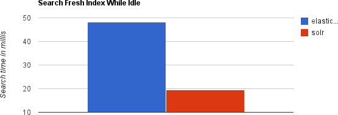
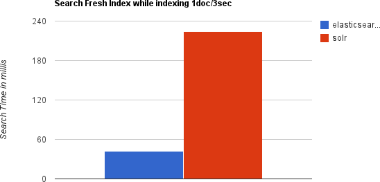
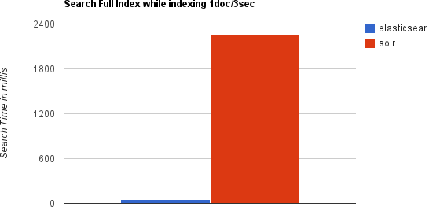
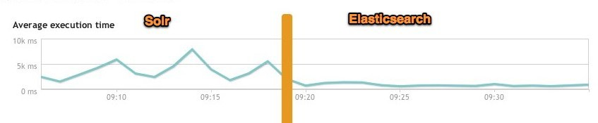
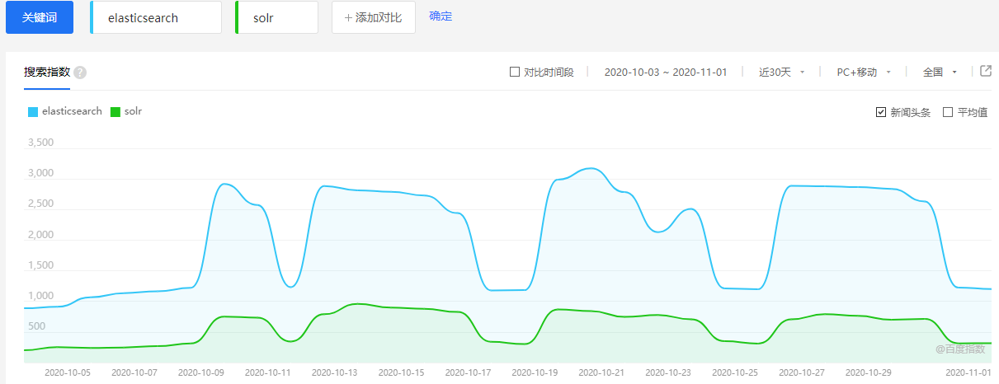

# 2、ElasticSearch 简介

## 2.1、搜索业务的需求

1. 在海量数据中执行搜索功能时，如果使用 `MySQL`，效率太低。
2. 如果关键字输入的不准确，一样可以搜索到想要的数据。
3. 将搜索关键字，以红色的字体展示。

## 2.2、Elasticsearch 概述

​		`ElasticSearch` 是一个基于 `Lucene` 的==搜索服务器==。它提供了一个==分布式多用户能力的全文搜索引擎==，基于 `RESTful web` 接口。`Elasticsearch` 是用 `Java` 开发的，并作为 `Apache` 许可条款下的开放源码发布，是当前流行的企业级搜索引擎。设计用于云计算中，能够达到实时搜索，稳定，可靠，快速，安装使用方便。 官方客户端也对多种语言都提供了相应的 ==API==。

> **ES 的由来**
>
> 
>
> **ES 的学习**
>
> [官网](https://www.elastic.co/cn/)、[英文文档](https://www.elastic.co/guide/index.html)、[中文文档](https://www.elastic.co/guide/cn/elasticsearch/guide/current/index.html)

## 2.3、Lucene 与 Elasticsearch 关系？

​		`Lucene` 不是一个完整的全文检索引擎，而是一个==全文检索引擎的架构==，提供了==完整的查询引擎==和==索引引擎==，==部分文本分析引擎==。想要使用它，你必须使用 `Java` 来作为开发语言并将其直接集成到你的应用中，更糟糕的是，`Lucene` 非常复杂，你需要深入了解==检索的相关知识==来理解它是如何工作的。

​		`Elasticsearch` 也使用 `Java` 开发并使用 `Lucene` 作为其核心来实现所有索引和搜索的功能，但是它的目的是通过简单的 `RESTful API` 来隐藏 `Lucene` 的复杂性，从而让全文搜索变得简单。当然`Elasticsearch` 并不仅仅是 `Lucene` 这么简单，它不但包括了==全文搜索功能==，还可以进行以下工作：

1. 分布式实时文件存储，并将每一个字段都编入索引，使其可以被搜索。
2. 实时分析的分布式搜索引擎。
3. 可以扩展到上百台服务器，处理 **PB 级别** 的==结构化或非结构化数据==。

​		这么多的功能被集成到一台服务器上，你可以轻松地通过客户端或者任何你喜欢的程序语言与 `ES` 的
`RESTful API` 进行交流。`Elasticsearch` 的上手是非常简单的。它附带了很多非常合理的默认值，这让初学者很好地避免一上手就要面对复杂的理论， 它安装好了就可以使用了，用很小的学习成本就可以变得很有生产力。随着越学越深入，还可以利用 `Elasticsearch` 更多高级的功能，整个引擎可以很灵活地进行配置。可以根据自身需求来定制属于自己的 `Elasticsearch` 。

> **概念补充：**
>
> - ==分布式==：突出 `ES` 的横向扩展能力，它搭建集群时不需要其他组件（不像 `Nginx` 需要 `keepalived`，`Redis` 需要 `Ruby`）
>
> - ==全文检索==：将一段词语进行分词，并将分出的词语统一的放在一个==分词库==中，再搜索时，根据==关键字==取分词库中检索，找到匹配的内容（==倒排索引==）。
>
> - ==restful 风格的 web 接口==：只要发送一个 `http` 请求，并且根据请求方式的不同，携带参数的不同，执行相应的功能。
>
>   应用广泛：`WIKI`、`github`、`Gold man`。

## 2.4、Elasticsearch 与 Solr 对比

### 2.4.1、Solr 优缺点

* **简介**
  		

​		`Solr` 是 `Apache Lucene` 项目的开源企业搜索平台。其主要功能包括==全文检索、命中标示、分面搜索、动态聚类、数据库集成，以及富文本（如Word、PDF）==的处理。`Solr是` 高度可扩展的，并提供了==分布式搜索==和==索引复制==。`Solr` 是最流行的企业级搜索引擎，`Solr4` 还增加了 `NoSQL` 支持。

​		`Solr` 是用 `Java` 编写、运行在 `Servlet` 容器（如 ==Apache Tomcat== 或 ==Jetty==）的一个独立的==全文搜索服务器==。`Solr` 采用了 `Lucene Java` 搜索库为核心的全文索引和搜索，并具有类似 `REST` 的 `HTTP/XML` 和 `JSON` 的 `API`。

​		`Solr` 强大的外部配置功能使得无需进行 `Java` 编码，便可对其进行调整以适应多种类型的应用程序。`Solr` 有一个插件架构，以支持更多的高级定制。

​		2010年 ==Apache Lucene== 和 ==Apache Solr== 项目合并，两个项目是由同一个 ==Apache软件基金会== 开发团队制作实现的。提到技术或产品时，==Lucene/Solr== 或 ==Solr/Lucene== 是一样的。

​		现实生活中我们都知道大多数网站或应用都必须具有某种搜索功能，问题是搜索功能往往是巨大的资源消耗并且它们由于沉重的数据库加载而拖垮你的应用的性能。这就是为什么转移负载到一个外部的搜索服务器是一个不错的主意，==Apache Solr== 是一个独立的企业级搜索应用服务器，它对外提供类似于 `Web-service` 的 `API` 接口。用户可以通过 `http` 请求，向搜索引擎服务器提交一定格式的`XML` 文件，生成索引；也可以通过 `Http Get` 操作提出查找请求，并得到 `XML` 格式的返回结果。它通过使用类似 `REST` 的 `HTTP API`，确保你能从几乎任何编程语言来使用 `Solr`。

* **优点**

  1. `Solr` 有一个更大、更成熟的用户、开发和贡献者社区。
  2. 支持添加多种格式的索引，如：==HTML、PDF、微软 Owice 系列软件格式以及 JSON、XML、CSV 等纯文本格式==。
  3. Solr比较成熟、稳定。
  4. 不考虑建索引的同时进行搜索，速度更快。

* **缺点** 

  ​		建立索引时，搜索效率下降，实时索引搜索效率不高 

### 2.4.2、Elasticsearch 优缺点

- **优点**

  1. `Elasticsearch` 是分布式的。分发是实时的，被叫做 =="Push replication"==。
  2. `Elasticsearch` 完全支持 `Apache Lucene` 的==接近实时的搜索==。
  3. 处理==云计算的多租户（multitenancy）==不需要特殊配置，而 `Solr` 则需要更多的高级设置。
  4. `Elasticsearch` 采用 `Gateway` 的概念，使得完全备份更加简单。
  5. 各节点组成对等的网络结构，某些节点出现故障时会自动分配其他节点代替其进行工作。

- **缺点**

  ​		还不够自动（不适合当前新的 `Index Warmup API`，即 ==冷启动/预热数据的方式==。当系统长期处于低水位的情况下，流量突然增加时，直接把系统拉升到高水位可能瞬间把系统压垮。通过 =="冷启动"==，让通过的流量缓慢增加，在一定时间内逐渐增加到阈值上限，给冷系统一个预热的时间，避免冷系统被压垮。）

### 2.4.2、性能比较

​		当单纯的对已有数据进行搜索时，`Solr` 更快。

​		当实时建立索引时，`Solr` 会产生==io 阻塞==，查询性能较差，`Elasticsearch` 具有明显的优势。

​		随着数据量的增加，`Solr` 的搜索效率会变得更低，而 `Elasticsearch` 却没有明显的变化。

​		**综上所述，Solr 的架构不适合实时搜索的应用。**

​		在实际生产环境测试中，将搜索引擎从 `Solr` 转到 `Elasticsearch`以后的平均查询速度有了50倍的提升。

### 2.4.3、热度比较

可以百度指数—大数据分享平台进行比对：

http://index.baidu.com/v2/main/index.html#/trend/elasticsearch?words=elasticsearch,solr

结果如下：

### 2.4.4、对比总结

1. `solr` 查询死数据，速度比 `es` 快。但是数据如果是改变的，`solr` 查询速度会降低很多，`ES` 的查询速度没有明显的改变。
2. 早期 `solr` 不支持集群，即使后期支持了，但`solr` 搭建集群依赖 `ZK`，而`ES` 搭建集群则不需要。
3. 最开始 `solr` 的社区很火爆，针对国内文档少，`ES` 出现后，国内社区火爆程度上升，`ES` 的文档非常健全。
4. `ES` 对云计算和大数据支持很好。

## 2.5、Elasticsearch 与关系型数据库对比

1.	一个 `ES` 集群可以包含多个索引（数据库），每个索引又包含了很多==类型==（ES7 中已作废，主要是为了提高搜索效率），类型中包含了很多==文档（行）==，每个文档又包含了很多==字段（列）==。
2.	传统数据库为特定列增加一个索引，例如 ==B-Tree 索引==来加速检索。`Elasticsearch` 和 `Lucene` 使用一种叫做==倒排索引（inverted index）==的数据结构来达到相同目的。 
3.	倒排索引源于实际应用中需要根据属性的值来查找记录。这种索引表中的每一项都包括一个==属性值==和==具有该属性值的各记录的地址==。由于不是由记录来确定属性值，而是由属性值来确定记录的位置，因而称为==倒排索引（inverted index）==。