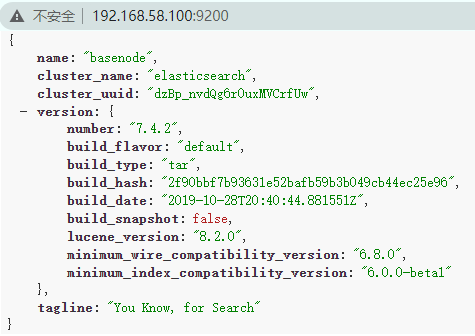

# 3、Elasticsearch 部署与启动

## 3.1、ES 的下载

去官网进行下载安装包，并在本地建安装。下载地址：https://www.elastic.co/cn/downloads/


## 3.2、ES 单机版

1. 将文件上传至服务器

```shell
# 上传 elasticsearch-7.4.2-linux-x86_64.tar.gz
[topcloud@basenode ~]$ rz -E
rz waiting to receive.

# 查看是否上传成功
[topcloud@basenode ~]$ ll
总用量 282008
drwxrwxr-x 2 topcloud topcloud        19 10月 30 20:29 bin
-rw-r--r-- 1 topcloud topcloud 288775500 10月 31 08:34 elasticsearch-7.4.2-linux-x86_64.tar.gz
```

2. 解压安装包并启动

```shell
# 解压到相应目录，若没有改目录则自己创建。
[topcloud@basenode ~]$ tar -zxvf elasticsearch-7.4.2-linux-x86_64.tar.gz -C /opt/lzj/

# 删除压缩包（看个人）
[topcloud@basenode ~]$ rm -rf elasticsearch-7.4.2-linux-x86_64.tar.gz

# 重命名文件夹（看个人）
[topcloud@basenode lzj]$ mv elasticsearch-7.4.2/ elasticsearch

# 进入 ES 的 bin 目录
[topcloud@basenode lzj]$ cd elasticsearch/bin/

# 启动 ES，结果发现启动失败，错误如下图显示（因为我是普通用户，所以不会出现错误2，但这里就当做同时出现了这两个错误）
[topcloud@basenode bin]$ ./elasticsearch
```


分析可知，出错的原因如下：

* **错误１：**`ES 7.4.2` 需要 `JDK11`，如果电脑安装了过低的 `JDK` 版本，会提示如下信息，`ES` 为了方便用户使用，自己集成了 ==OpenJDK==，但是如果系统环境变量中有 `JDK` 会优先使用==环境变量中的 JDK==。所以我们如果既想使用自己的 `JDK` 版本又想使用 `ES 7` 版本需要修改 ==ES 配置文件==。  

  ```shell
  # 修改配置文件 elasticsearch-env，在文件首行添加如下信息（具体的值看你的ES安装到哪）
  [topcloud@basenode bin]$ vim elasticsearch-env
  #!/bin/bash
  JAVA_HOME="/opt/lzj/elasticsearch/jdk"
  ```

* **错误２：**因为我操作的时候用的是普通用户（==topcloud==），所以并没有出现错误2。若你在搭建时出现了错误2。是因为当前是 ==root== 用户，==ES== 默认不允许 ==root== 用户操作 。

  ```shell
  # 创建 es 用户组和 es 用户，并将其添加到用户组 es 中
  [root@basenode ~]# groups es
  
  # 更改 es 文件夹及内部文件的所属用户及组为 es:es
  # -f 若该档案拥有者无法被更改也不要显示错误讯息
  [root@basenode ~]# chown -Rf es:es /opt/lzj/elasticsearch/
  
  # 切换到 es 用户
  [root@basenode ~]# su es
  ```

3. 解决完错误后，启动 ==ES==

```shell
# 进入bin目录
[topcloud@basenode ~]$ cd /opt/lzj/elasticsearch/bin/

# ElasticSearch 前端启动方式(推荐后端启动方式)
# [topcloud@basenode bin]$ ./elasticsearch

# ElasticSearch 后端启动命令(这里采用后端启动方式)
[topcloud@basenode bin]$ ./elasticsearch -d
```

​		`Elasticsearch` 的==对外服务端口==默认是 **9200**，==客户端==访问是 **9300**。通过启动日志信息可以看到警告信息。记住它们，因为一会将会变为错误信息，我们需要对他们做出处理。


4. 本地访问测试，若出现下面数据则表示，==ES== 在本机成功搭建并能正常访问。

```shell
# 在本机通过curl命令
[topcloud@basenode bin]$ curl http://localhost:9200
{
  "name" : "basenode",
  "cluster_name" : "elasticsearch",
  "cluster_uuid" : "dzBp_nvdQg6r0uxMVCrfUw",
  "version" : {
    "number" : "7.4.2",
    "build_flavor" : "default",
    "build_type" : "tar",
    "build_hash" : "2f90bbf7b93631e52bafb59b3b049cb44ec25e96",
    "build_date" : "2019-10-28T20:40:44.881551Z",
    "build_snapshot" : false,
    "lucene_version" : "8.2.0",
    "minimum_wire_compatibility_version" : "6.8.0",
    "minimum_index_compatibility_version" : "6.0.0-beta1"
  },
  "tagline" : "You Know, for Search"
}
```

但是我们想通过远程访问时，发现登录不成功。


5. 如果需要远程访问，还需要修改 ==elasticsearch.yml== 的第 **55** 行，来放行 `IP`。

```shell
# 修改 config/elasticsearch.yml 文件第 55 行，实际生产环境请添加允许访问的IP，学习时使用0.0.0.0 放行所有IP
[topcloud@basenode elasticsearch]$ vim config/elasticsearch.yml
network.host: 0.0.0.0
```

6. 切换至 ==root== 用户添加防火墙规则，重启防火墙，学习时==直接关闭防火墙==。

```shell
# 切换到 root 权限
topcloud@basenode elasticsearch]$ su 

# 配置规则，更多规则查看 https://www.cnblogs.com/kenshinobiy/p/4251620.html
[root@basenode elasticsearch]# -A INPUT -p tcp -m state --state NEW -m tcp --dport 9200 -j ACCEPT
[root@basenode elasticsearch]# systemctl restart iptables.service
```

7. 切换==普通用户（es）==重启 `elasticsearch`，重启之前先查询==普通用户（es）==进程然后杀死进程，并再次启动 ==ES==

```shell
# 查找进程
[root@basenode elasticsearch]# ps -ef | grep elasticsearch
topcloud  12073      1  4 13:57 pts/0    00:01:49 /opt/lzj/elasticsearch/
topcloud  12092  12073  0 13:57 pts/0    00:00:00 /opt/lzj/elasticsearch/modules

# 杀死进程
[root@basenode elasticsearch]# kill -9 12073

# 再次启动 ES,启动后报错
[root@basenode elasticsearch]# cd bin/
[root@basenode bin]# ./elasticsearch -d
```

​		报错如下所示：

```tex
ERROR: [4] bootstrap checks failed
[1] : max file descriptors [4096] for elasticsearch process is too low, increase to at least [65535]
[2] : max number of threads [3795] for user [es] is too low, increase to at least [4096]
[3] : max virtual memory areas vm.max_map_count [65530] is too low, increase to at least [262144]
[4] : the default discovery settings are unsuitable for production use; at least one of [discovery.seed_hosts, discovery.seed_providers, cluster.initial_master_nodes] must be configured
```

* **错误 1：**`Elasticsearch` 进程的最大文件描述符 ==[4096]== 太低，请至少增加到 ==[65535]==

  **[https://www.elastic.co/guide/en/elasticsearch/reference/7.4/vm-max-map-count.html](https://www.elastic.co/guide/en/elasticsearch/reference/7.4/vm-max-map-count.html)**

  ```shell
  # 切换到 root 用户
  [topcloud@basenode ~]$ su
  
  # 在文件末尾添加如下信息，topcloud 是我自己机器的用户，你们可以使用 es 用户
  [root@basenode ~]$ vim /etc/security/limits.conf
  # End of file
  topcloud soft nofile 65535
  topcloud hard nofile 65535
  ```

* **错误 2：**用户==[topcloud]== 可以创建的最大线程数 ==[3795]== 太低，请至少增加到 ==[4096]==

  https://www.elastic.co/guide/en/elasticsearch/reference/7.4/max-number-of-threads.html  

  ```shell
  # 切换到 root 用户
  [topcloud@basenode ~]$ su
  
  # 在文件末尾添加如下信息，topcloud 是我自己机器的用户，你们可以使用 es 用户
  [root@basenode ~]$ vim /etc/security/limits.conf
  # End of file
  topcloud soft nofile 65535
  topcloud hard nofile 65535
  topcloud soft nproc 4096
  topcloud hard nproc 4096
  ```

* **错误 3：**最大虚拟内存区域 `vm.max_map_count` ==[65530]== 太低，请至少增加到 ==[262144]==

  ```shell
  # 切换到 root 用户
  [topcloud@basenode ~]$ su
  
  # 编辑 sysctl.conf 文件，在文件末尾添加如下信息
  [root@basenode ~]$ vim /etc/sysctl.conf
  vm.max_map_count = 262144
  
  # 重新加载虚拟内存配置
  [root@basenode ~]# sysctl -p
  ```

* **错误 4：**当前配置不适合生产环境使用；必须至少配置以下之一

  1. ==discovery.seed_hosts==：集群发现配置，提供集群中符合主机要求的节点的列表。每个值的格式为 `host:port` 或 `host` ，其中 `port` 默认为设置。
  2. ==discovery.seed_providers==：以文件的方式提供主机列表，可以动态修改，而不用重启节点（容器化环境适用）。
  3. ==cluster.initial_master_nodes==：指定可以成为 `master` 的所有节点的 `name` 或 `ip` ，这些配置将会在第一次选举中进行计算。

  |             过时配置             |                 新配置                  |
  | :------------------------------: | :-------------------------------------: |
  | discovery.zen.ping.unicast.hosts |          discovery.seed_hosts           |
  |   discovery.zen.hosts_provider   |        discovery.seed_providers         |
  |                无                | cluster.initial_master_nodes（7新添加） |

  ```shell
  # 回到普通用户
  [root@basenode elasticsearch]# exit
  
  # 编辑文件，编辑 68 行，72 行数据。
  [topcloud@basenode elasticsearch]$ vim config/elasticsearch.yml
  discovery.seed_hosts: ["192.168.58.100"]
  cluster.initial_master_nodes: ["192.168.58.100"]
  ```

8. 重启机器，并启动

```shell
# 重启
[topcloud@basenode bin]$ sudo reboot

# 后台启动 ES
[topcloud@basenode bin]$ ./elasticsearch -d
```



9. 修改 ==config/jvm.options== 配置文件来去除警告信息。==ES== 已经可以正常访问了，但是我们在每次启动时都会看到一个警告信息


​		这是提醒你 ==CMS 垃圾收集器== 在 `JDK 9` 就开始被标注为 `@Deprecated`，`JDK 11` 支持的垃圾回收器为==G1== 和 ==ZGC==，而 ==ZGC== 在 `JDK 11` 还处于实验阶段。[参考资料](https://docs.oracle.com/en/java/javase/11/gctuning/garbage-first-garbage-collector.html#GUID-ED3AB6D3-FD9B-4447-9EDF-983ED2F7A573)

 

​		解决措施：修改 ==elasticsearch/config/jvm.options 配置文件==

```shell
# 修改config/jvm.options配置文件 35行，将：-XX:+UseConcMarkSweepGC 改为：XX:+UseG1GC
[topcloud@basenode elasticsearch]$ vim config/jvm.options
## GC configuration
# 注释CMS
#-XX:+UseConcMarkSweepGC
# 使用G1
-XX:+UseG1GC
-XX:CMSInitiatingOccupancyFraction=75
-XX:+UseCMSInitiatingOccupancyOnly
```

10. 如果想在任意位置启动，可以配置环境变量，配置完成后 `source /etc/profile`

```shell
# 这里我是在 profile.d 里面创建了个文件，你可以直接编辑 profile 文件来修改环境变量
[topcloud@node01 ~]$ vim /etc/profile.d/my_env.sh
export ES_HOME=/opt/lzj/elasticsearch
export PATH=$ES_HOME/bin:$PATH

# 重新加载配置文件
[topcloud@node01 ~]$ source /etc/profile.d/my_env.sh

# 测试是否配置成功
[topcloud@node01 ~]$ echo $ES_HOME
```


## 3.3、ES 集群版

​		`ElasticSearch` 天生就是为分布式而生的搜索引擎，我们搭建一下集群环境。这里准备了三台机器用于搭建集群，即 ==node01==、==node02==、==node03==。

1. 不要使用刚才的单机版，重新解压一份新的 `ES` 搭建，因为刚才的单机版 ES 已经运行过，会生成一些默认配置如果在其之上继续搭建可能会导致 `ES` 无法组成集群环境。

```shell
# 上传压缩文件
[topcloud@node01 ~]$ rz -E
rz waiting to receive.

# 解压文件
[topcloud@node01 ~]$ tar -zxvf elasticsearch-7.4.2-linux-x86_64.tar.gz -C /opt/lzj/

# 查看是否解压到相应目录
[topcloud@node01 ~]$ cd /opt/lzj/

# 查看解压文件
[topcloud@node01 lzj]$ ll
drwxr-xr-x   9 topcloud topcloud  154 10月 29 2019 elasticsearch-7.4.2

# 重命名（看个人）
[topcloud@node01 lzj]$ mv elasticsearch/ es1
```

2. 修改 ==config/elasticsearch.yml==

```shell
# 编辑文件，并在末尾添加，编辑内容如后面所示
[topcloud@node01 lzj]$ vim es1/config/elasticsearch.yml
```

```shell
# ---------------------------------- Cluster -----------------------------------
# 注意：如果设置了 node.name 需要将 cluster.initial_master_nodes 改为对应节点名称。
cluster.name: es # 集群名称，同一集群要一致

# ------------------------------------ Node ------------------------------------
node.name: node-1 # 集群下各节点名称

# ---------------------------------- Network ----------------------------------
network.host: 0.0.0.0
http.port: 9200 # 端口

# --------------------------------- Discovery ----------------------------------
# 集群发现配置，如果想启动单台机器多ES，则可以将 discovery.seed_hosts 地址都设置为一样的。这样也不用分发 ES 了。
# discovery.seed_hosts: ["node01", "node02","node03"]
# 其实不配置这些，集群也能跑起来，因为在同一个局域网下他们会互相发现对方的。
discovery.seed_hosts: ["192.168.58.101", "192.168.58.102", "192.168.58.103"]
# 哪些节点有资格参与竞选
cluster.initial_master_nodes: ["node-1", "node-2", "node-3"]
discovery.zen.ping_timeout: 60s

# --------------------------------- 跨域第三方插件可以请求es -----------------------
# 跨域请求配置(为了让类似head的第三方插件可以请求es)
http.cors.enabled: true
http.cors.allow-origin: "*"
```

3. 修改各个 ==elasticsearch.yml== 文件，搭建集群

```shell
# node02和node03分别对分发过来的目录进行重命名
[topcloud@node02 lzj]$ mv es1/ es2
[topcloud@node03 lzj]$ mv es1/ es3

# 修改 node02 机器上 es 的配置文件，只需改下 node.name 即可，其他更改看自己需求
[topcloud@node02 lzj]$ vim es2/config/elasticsearch.yml
node.name: node-2 # 集群下各节点名称

# 修改 node03 机器上 es 的配置文件，只需改下 node.name 即可，其他更改看自己需求
[topcloud@node03 lzj]$ vim es3/config/elasticsearch.yml
node.name: node-2 # 集群下各节点名称
```

4. 修改 ==bin/elasticsearch-env==，使用自带的 `jdk`

```shell
# 配置环境变量
[topcloud@node01 bin]$ vim elasticsearch-env
#!/bin/bash
JAVA_HOME="/opt/lzj/es1/jdk"

# 分发配置，分发完成后，在 node02 和 node 03 机器上进行修改，因为路径不同
[topcloud@node01 bin]$ rsync elasticsearch-env topcloud@node02:/opt/lzj/es2/bin
[topcloud@node01 bin]$ rsync elasticsearch-env topcloud@node03:/opt/lzj/es3/bin
```

5. 修改 ==es1/config/jvm.options 配置文件==，来忽略警告。

```shell
# 修改config/jvm.options配置文件 35行，将：-XX:+UseConcMarkSweepGC 改为：XX:+UseG1GC
[topcloud@basenode es1]$ vim config/jvm.options
## GC configuration
# 注释CMS
#-XX:+UseConcMarkSweepGC
# 使用G1
-XX:+UseG1GC
-XX:CMSInitiatingOccupancyFraction=75
-XX:+UseCMSInitiatingOccupancyOnly

# 分发配置，分发完成后
[topcloud@node01 config]$ rsync jvm.options topcloud@node02:/opt/lzj/es2/config/
[topcloud@node01 config]$ rsync jvm.options topcloud@node03:/opt/lzj/es3/config/
```

6. 修改 ==limits.conf== 配置文件，增大线程数和文件描述符。

```shell
# 切换到 root 用户
[topcloud@basenode ~]$ su

# 在文件末尾添加如下信息，topcloud 是我自己机器的用户，你们可以使用 es 用户
[root@basenode ~]$ vim /etc/security/limits.conf
# End of file
topcloud soft nofile 65535
topcloud hard nofile 65535
topcloud soft nproc 4096
topcloud hard nproc 4096

# 分发配置，分发完成后
[root@node01 config]# xsync /etc/security/limits.conf
```

7. 修改 ==sysctl.conf== 文件，增大内存数。

```shell
# 切换到 root 用户
[topcloud@basenode ~]$ su

# 编辑 sysctl.conf 文件，在文件末尾添加如下信息
[root@basenode ~]$ vim /etc/sysctl.conf
vm.max_map_count = 262144

# 分发修改后的文件
[root@node01 config]# xsync /etc/sysctl.conf

# 重新加载各个机器的虚拟内存配置
[root@basenode ~]# sysctl -p
```

8. 切换至 ==root== 用户添加防火墙规则，重启防火墙，学习时==直接关闭防火墙==。==node02== 和 ==node03== 操作如下。

```shell
# 切换到 root 权限
topcloud@basenode elasticsearch]$ su 

# 配置规则，更多规则查看 https://www.cnblogs.com/kenshinobiy/p/4251620.html
[root@basenode elasticsearch]# -A INPUT -p tcp -m state --state NEW -m tcp --dport 9200 -j ACCEPT
[root@basenode elasticsearch]# systemctl restart iptables.service
```

10. 配置环境变量，配置完成后 `source /etc/profile`。其它节点进行同样操作。

```shell
# 这里我是在 profile.d 里面创建了个文件，你可以直接编辑 profile 文件来修改环境变量
[topcloud@node01 ~]$ vim /etc/profile.d/my_env.sh
export ES_HOME=/opt/lzj/elasticsearch
export PATH=$ES_HOME/bin:$PATH

# 重新加载配置文件
[topcloud@node01 ~]$ source /etc/profile.d/my_env.sh

# 测试是否配置成功
[topcloud@node01 ~]$ echo $ES_HOME
```

11. 重启机器，启动 ES 进行测试，分别访问：
    * http://192.168.58.101:9200/_cluster/health?pretty
    * http://192.168.58.102:9200/_cluster/health?pretty
    * http://192.168.58.103:9200/_cluster/health?pretty
    * 或者访问 http://192.168.58.101:9200/_cat/nodes 可以，不过不详细。

```shell
# 因为配置了环境变量，所以不用在 bin 目录下也可以启动。
[topcloud@node01 bin]$ ./elasticsearch -d
[topcloud@node02 bin]$ ./elasticsearch -d
[topcloud@node03 bin]$ ./elasticsearch -d
```


* `“status”: “red”`表示集群环境不 ok，`“status”: “green”` 表示集群环境 ok
* ==green==：最健康得状态，说明所有的分片包括备份都可用。
* ==yellow==：基本的分片可用，但是备份不可用（或者是没有备份）。  
* ==red==：部分的分片可用，表明分片有一部分损坏。此时执行查询部分数据仍然可以查到，遇到这种情况，还是赶快解决比较好。


> **提示：如果不能分配给虚拟机多于 1 G 内存，那就需要修改下启动内存**
>
> ```shell
> OpenJDK 64-Bit Server VM warning: INFO: os::commit_memory(0x00000000c5330000, 986513408, 0) failed; error='Not enough space' (errno=12)
> at org.elasticsearch.tools.launchers.JvmErgonomics.flagsFinal(JvmErgonomics.java:111)
> at org.elasticsearch.tools.launchers.JvmErgonomics.finalJvmOptions(JvmErgonomics.java:79)
> at org.elasticsearch.tools.launchers.JvmErgonomics.choose(JvmErgonomics.java:57) at
> org.elasticsearch.tools.launchers.JvmOptionsParser.main(JvmOptionsParser.java:89)
> ```
>
> ​		错误信息的意思就是默认分配的 `jvm` 空间大小不足，无法启动。修改每个节点下的 ==config/jvm.options== 配置文件。
>
> ```shell
> # 修改每个节点下的 config/jvm.options 配置文件。
> [topcloud@node01 ~]$ vim /opt/lzj/es1/config/jvm.options
> 
> # 将默认大小 1g 改为 512m，注意着点别改成 512g 了。
> -Xms512m
> -Xmx512m
> ```


## 3.4、ES 伪集群（了解）

​		这一节主要是演示下单机器多 ES 的配置文件，其配置文件参考如下：

1. 修改 ==ES2==、==ES3==各自的 ==bin/elasticSearch.env== 中的 ==JAVA_HOME==
2. 开始修改各自的 ==config/elasticSearch.yml== 文件
3. 第一个 ==ES1== 的配置

```shell
# 注意：如果设置了 node.name 需要将 cluster.initial_master_nodes 改为对应节点名称。
cluster.name: es # 集群名称，同一集群要一致
node.name: node-1 # 集群下各节点名称
http.port: 9200 # 端口

# 跨域请求配置(为了让类似head的第三方插件可以请求es)
http.cors.enabled: true
http.cors.allow-origin: "*"

# 集群发现配置，如果想启动单台机器多ES，则可以将 discovery.seed_hosts 地址都设置为一样的。这样也不用分发 ES 了。
discovery.seed_hosts: ["192.168.10.100", "192.168.10.100", "192.168.10.100"]
cluster.initial_master_nodes: ["node-1", "node-2", "node-3"]
discovery.zen.ping_timeout: 60s
```

3. 第二个 ==ES2== 的配置，要改的地方如下，其它同 ==ES1== 相同

```shell
# 注意：如果设置了 node.name 需要将 cluster.initial_master_nodes 改为对应节点名称。
cluster.name: es # 集群名称，同一集群要一致
node.name: node-2 # 集群下各节点名称
http.port: 9201 # 端口
```

4. 第二个 ==ES3== 的配置，要改的地方如下，其它同 ==ES1== 相同

```shell
# 注意：如果设置了 node.name 需要将 cluster.initial_master_nodes 改为对应节点名称。
cluster.name: es # 集群名称，同一集群要一致
node.name: node-3 # 集群下各节点名称
http.port: 9202 # 端口
```

5. 添加防火墙规则并重启防火墙，学习时关闭防火墙

```shell
# 切换到 root 权限
topcloud@basenode elasticsearch]$ su 

# 配置规则，更多规则查看 https://www.cnblogs.com/kenshinobiy/p/4251620.html
[root@basenode elasticsearch]# -A INPUT -p tcp -m state --state NEW -m tcp --dport 9201 -j ACCEPT
[root@basenode elasticsearch]# -A INPUT -p tcp -m state --state NEW -m tcp --dport 9202 -j ACCEPT 
[root@basenode elasticsearch]# systemctl restart iptables.service
```
