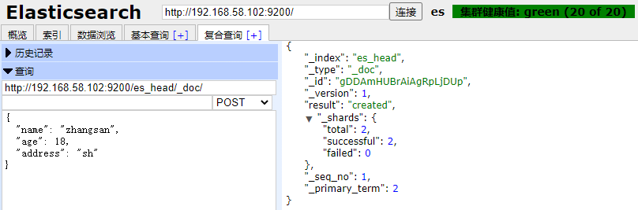
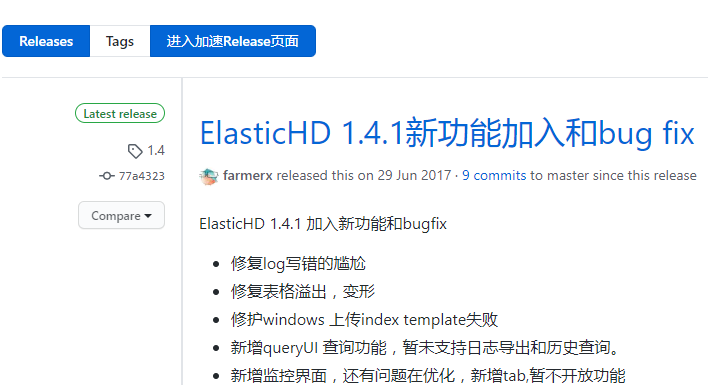

# 4、ES 可视化工具与软件

​		在学习和使用 `Elasticsearch` 的过程中，必不可少需要通过一些工具查看 `es` 的==运行状态以及数据==。如果都是通过 `rest` 请求，未免太过麻烦，而且也不够人性化。以下插件三选一即可。

## 4.1、head

​		==head== 可以完美帮我们快速学习和使用 ==es==。==head 插件== 在 `ES 5` 版本以前开箱即用非常简单，`ES 5` 版本以后需要运行在 ==node 环境下==，所以我们要先准备一下环境。

1. 安装 `Git`

```shell
[topcloud@node01 ~]$ sudo yum install -y git
```

2. 安装 ==Node==，根据自己的需求下载对应的版本，`node` 官网 https://nodejs.org/en/download/


3. 将文件上传至服务器并解压

```shell
# 上传文件
[topcloud@node01 ~]$ rz -E
rz waiting to receive.

# 查看上传的数据
[topcloud@node01 ~]$ ls
node-v12.13.1-linux-x64.tar.xz

# 解压压缩文件，-xvf 不要加 z 因为 不是 gzip
[topcloud@node01 ~]$ tar -xvf node-v12.13.1-linux-x64.tar.xz -C /opt/lzj/

# 重命名文件目录
[topcloud@node01 ~]$ cd /opt/lzj/
[topcloud@node01 lzj]$ mv node-v12.13.1-linux-x64/ nodejs/
```

4. 配置环境变量信息

```shell
# 配置环境变量
[topcloud@node01 ~]$ vim /etc/profile.d/my_env.sh
export NODE_HOME=/opt/lzj/nodejs
export PATH=$PATH:$NODE_HOME/bin

# 重新加载配置文件
[topcloud@node01 node]$ source /etc/profile.d/my_env.sh

# 测试
[topcloud@node01 node]$ node -v
v12.13.1
[topcloud@node01 node]$ npm -v
6.12.1
```

5. 安装 ==cnpm==

```shell
# 安装 cnpm
[root@node01 ~]$ npm install -g cnpm --registry=https://registry.npm.taobao.org
```

6. 安装 ==head==，官网：https://github.com/mobz/elasticsearch-head 

```shell
# 创建 plugins 文件夹用于放置该插件，另外别把插件放到 ES 的 plugins 中，否则ES启动不起来。
[topcloud@node01 ~]$ mkdir /opt/lzj/plugins

# 进入 plugins 目录
[topcloud@node01 ~]$ cd /opt/lzj/plugins/

# 直接从网页下载并上传至服务器
# https://github.com/mobz/elasticsearch-head/releases/tag/v5.0.0
# 或者通过命令下载文件
[topcloud@node01 plugins]$ git clone git://github.com/mobz/elasticsearch-head.git
```

7. 修改配置，进入 ==Elasticsearch== 安装目录下的 ==config== 目录，修改 ==elasticsearch.yml== 文件。在文件的末尾加入以下代码。更多配置见：https://www.ibm.com/support/knowledgecenter/zh/SSFPJS_8.5.6/com.ibm.wbpm.main.doc/topics/rfps_esearch_configoptions.html

```shell
#　去掉 network.host:192.168.0.1 的注释并改为 network.host: 0.0.0.0。
network.host: 0.0.0.0

# --------------------------------- 跨域第三方插件可以请求es -----------------------
# 跨域请求配置(为了让类似head的第三方插件可以请求es)
# 如果启用了 HTTP 端口，那么此属性会指定是否允许跨源 REST 请求。
http.cors.enabled: true

# 如果 http.cors.enabled 的值为 true，那么该属性会指定允许 REST 请求来自何处。
http.cors.allow-origin: "*"
```

8. 进入 ==elasticsearch-head== 目录，修改 ==Gruntfile.js== 文件

```shell
# 编辑 Gruntfile.js 文件
[topcloud@node01 elasticsearch-head]$ vim Gruntfile.js

# 97 行添加 hostname: '*',
connect: {
    server: {
        options: {
            hostname: '*',
            port: 9100,
            base: '.',
            keepalive: true
        }
    }
}
```

9. **非必须**：修改 ==elasticsearch-head/_site/app.js==，也可以不修改此文件，在启动 ==head 插件== 以后通过浏览器输入参数的方式连接也可以。


10. 在 ==elasticsearch-head== 目录下执行 `npm install` 安装（或者 `cnpm install`）

```shell
[topcloud@node01 elasticsearch-head]$ npm install
```

安装时报错，可知还需要安装 ==phantomjs-prebuilt@2.1.16==


11. 安装 ==phantomjs-prebuilt@2.1.16==，并再次执行 `npm install`

```shell
# 你报错什么版本，就对应什么版本，注意实在 elasticsearch-head 目录安装
[topcloud@node01 elasticsearch-head]$ npm install phantomjs-prebuilt@2.1.16 --ignore-scripts

# 再次执行 npm install
[topcloud@node01 elasticsearch-head]$ npm install
```

12. 完成后在 ==elasticsearch-head 目录== 下执行 `npm run start` 运行 ==head 插件==。启动 ==head 插件== 以后通过浏览器输入参数的方式连接。访问地址：http://192.168.58.101:9100/

```shell
# 前台执行
#[topcloud@node01 elasticsearch-head]$ npm run start

# 后台执行（推荐）
[topcloud@node01 elasticsearch-head]$ npm run start &

#------------------------------如果启动失败按下解决--------------------------------
# 提示：如果启动失败提示 grunt 相关错误信息，重新安装 grunt 再重新启动
# 安装 grunt 命令行工具 grunt-cli npm install grunt --save-dev 
[topcloud@node01 elasticsearch-head]$ npm install -g grunt-cli 
# 安装 grunt 及其插件
[topcloud@node01 elasticsearch-head]$ npm install grunt --save-dev
```


13. 启动 ES 集群（先启动 es1、es2），并用 head 进行连接。

```shell
# 打开 node01 和 node02 中的 ES，单台启动还是无法连接的。
# 启动 ES1
[topcloud@node01 ~]$ cd /opt/lzj/es1/bin
[topcloud@node01 bin]$ ./elasticsearch -d

# 启动 ES2
[topcloud@node02 ~]$ cd /opt/lzj/es2/bin
[topcloud@node02 bin]$ ./elasticsearch -d
```


​		建立索引（==相当于关系型数据库里的数据库==）测试


​		5 就是分片数，而 1 就是副本数，所以总共会有 10 个分片。如果是 2 副本数，总共会有 15 个分片。

​		**说明：**一个索引库默认==5个分片==（一组完整的数据），分片可以自定义设置修改，每个分片又有备份分片， 所以按默认值来计算，一个索引库就会有==10个分片==（两组完整数据），这 10 个分片会被分配到所有节点中。


​		可以看到分片，数据就是存在分片里面的，并不是直接放在节点里面的。就像 `Redis`，数据是放在槽位里面的，而槽位是放在节点里面的。

​		对于副片数，它只能==进行读==而==不能写==，它是由主片数同步过去的。一篇文章进行拆分后可能存在多个片数里边。

14. 启动 ==node3== 的 ==ES3==。重新访问，如下：

```shell
# 启动 ES3
[topcloud@node03 ~]$ cd /opt/lzj/es3/bin
[topcloud@node03 bin]$ ./elasticsearch -d
```

​		启动节点后，它会尽可能的分布在各个分片上。


​		若关闭 ==node3== 的 ==ES== 测试，则会出现 `yellow`。`yellow` 意思即虽然有分片不能提供服务，但是还能够从完整的分片读取完整的数据。


15. 再建立索引库进行测试


16. 通过 `PUT` 方式创建 `document`（相当于数据库的行），索引名字是 ==es_head==，本记录的 `id` 是1；
    * `_inde`：索引。
    * `_type`：这个 `_type` 是不用写也是不让写的，是**唯一默认**的。
    * `_id`：刚才写的 id。如果不给 id，要用 ==POST== 方式提交，这样会给随机 id。
    * `_version`：每次增删查改都会增加版本号。
    * `_result`：进行创建。
    * `total`：总共的片数。

​		返回的信息可以看到创建是成功的，并且版本号是 ==1==；==ES== 会对记录修改进行版本跟踪，第一次创建记录为 1，同一条记录每修改一次就追加 1。 至此一条记录就提交到 ==ES== 中建立了索引，注意 ==HTTP== 的方法是 `PUT`，`PUT` 需要指定 `_id` 。插入数据，否则报错。`POST` 无需指定 `_id` 插入数据，会使用随机值。


17. 通过 `POST` 方式提交，但不要给 `id`，这样会提交一个随机 `id`，否则就是为修改相应的 `id` 记录。




​	`PUT` 操作必须指定 `_id`，否则报错，存在则为更新否则新增。`POST` 操作无需指定 `_id` ，会使用随机值，存在则为更新否则新增。

18. 用 `POST` 方式提交，并写上 `id` 即能实现修改。


​		结果中的 ==version== 字段已经成了 2，因为我们这是是修改，索引版本递增；更新接口与创建接口完全一 样，==ES== 会查询记录是否存在，如果不存在就是创建，存在就是更新操作。

19. 通过 `get` 方式来获取所有数据
    * `total`：从分片中取获取，但是两条数据不一定同在一个分片里面的。
    * `value`：意味着命中了几条数据。
    * `max_score`：最大分数，百度排名就是按照分数来的。


20. 通过 `get` 方式来获取某条数据，需要加上 `id`。


​		`found` 值为 `true`，表明查询到该文档， `_source` 字段是文档的内容。

21. 通过 `delete` 方式来进行删除，要加上参数。


22. 删除索引库 ==test==。


## 4.2、cerebro

​	==cerebro== 是一个开源（==MIT许可==）的 `Elasticsearch` 可视化管理工具，使用 `Scala`，`AngularJS`，`Bootstrap` 构建。`cerebro` 需要 `Java 1.8` 或更新的运行环境。

1. 下载 `cerebro`，下载地址： [**https://github.com/lmenezes/cerebro/releases**](https://github.com/lmenezes/cerebro/releases)


2. 将文件上传至服务器，解压至指定路径

```shell
# 上传安装包
[topcloud@node02 ~]$ rz -E

# 解压安装包到相应的目录
[topcloud@node02 ~]$ tar -zxvf cerebro-0.8.5.tgz -C /opt/lzj/plugins/

# 进入之前创建的 plugins 目录
[topcloud@node02 ~]$ cd /opt/lzj/plugins/

# 查看解压文件
[topcloud@node02 plugins]$ ll
drwxr-xr-x 5 topcloud topcloud   57 11月 18 2019 cerebro-0.8.5
```

3. 启动（默认端口 9000 可访问 IP 0.0.0.0），访问

```shell
# 进入执行目录
[topcloud@node02 plugins]$ cd cerebro-0.8.5/bin/

# 后台执行 cerebro
[topcloud@node02 bin]$ ./cerebro &

# 或者指定端口和可访问IP
[topcloud@node02 bin]$./cerebro -Dhttp.port=9000 -Dhttp.address=192.168.58.102 &
```

4. 输入需要连接的 ==ES 服务器地址==


​		如果经常使用的话，可以先在 ==conf/application.conf== 中配置好 ==Elasticsearch== 服务器地址。

```shell
# 查看当前地址
[topcloud@node02 conf]$ pwd
/opt/lzj/plugins/cerebro-0.8.5/conf

# 编辑配置文件
[topcloud@node02 conf]$ vim application.conf
```

​		==host== 只需写上能运行 ==ES== 的机器 `IP` 即可。


​		界面如下：


## 4.3、elasticHD

​		==elasticHD== 是一款 `Elasticsearch` 的可视化管理工具。不依赖 ==ES== 的插件安装，更便捷；导航栏直接填写对应的 ==ES== `IP` 和端口就可以操作 ==ES==了。支持 ==ES== 监控、实时搜索，`Index template` 快捷替换修改，索引列表信息查看， `SQL converts to DSL` 等。

1. 下载 ==elasticHD== ，下载地址： https://github.com/360EntSecGroup-Skylar/ElasticHD/releases/



2. 将文件上传至服务器，安装 `unzip`

```shell
# 上传压缩包
[topcloud@node02 ~]$ rz -E

# 解压 .zip 压缩包
[topcloud@node02 ~]$ unzip elasticHD_linux_amd64.zip  -d /opt/lzj/plugins/

# 进入压缩目录
[topcloud@node02 ~]$ cd /opt/lzj/plugins/

# 查看当前压缩包
[topcloud@node02 plugins]$ ll
-rwxr-xr-x 1 topcloud topcloud 22871350 6月  29 2017 ElasticHD
```

3. 启动 ==ElasticHD==

```shell
# 启动 ElasticHD
[topcloud@node02 plugins]$ ./ElasticHD &

# 或者指定端口和可访问IP
[topcloud@node02 plugins]$ ./ElasticHD -p 192.168.58.102:9800 &
```

​		部署执行时报错 `exec: "xdg-open": executable file not found in $PATH`，原因是没有安装 `xdg-open` 安装 `xdg-utils` 之后，`xdg-open` 命令就可以使用了。

6. 安装 `xdg-utils`，并再次启动

```shell
# 安装 xdg-utils
[topcloud@node02 plugins]$ sudo yum install -y xdg-utils

# 再次启动
[topcloud@node02 plugins]$ ./ElasticHD -p 192.168.58.102:9800 &
```


## 4.4、Kibana  

​		首先明确一点，==Kibana== 是一个软件，不是插件。==Kibana== 是一款开源的==数据分析和可视化平台==，它是 `Elastic Stack` 成员之一，设计用于和 `Elasticsearch` 协作。您可以使用 `Kibana` 对 `Elasticsearch` 索引中的数据进行搜索、查看、交互操作。可以很方便的利用图表、表格及地图对数据进行多元化的分析和呈现（一张图胜过千万张日志）。

​		==Kibana== 可以使大数据通俗易懂。它很简单，基于浏览器的界面便于您快速==创建和分享动态数据仪表板==来追踪 `Elasticsearch` 的实时数据变化。

​		搭建 ==Kibana== 非常简单。可以分分钟完成 ==Kibana== 的安装并开始探索 `Elasticsearch` 的索引数据，它没有代码、不需要额外的基础设施。


### 4.4.1、下载与安装

1. 下载 `Kibana`，官网： https://www.elastic.co/products/kibana，==ELK== 版本最好保持一致。


2. 将文件上传至服务器，并解压

```shell
# 上传压缩包
[topcloud@node02 ~]$ rz -E

# 解压压缩包
[topcloud@node02 ~]$ tar -zxvf kibana-7.4.2-linux-x86_64.tar.gz -C /opt/lzj/

# 进入压缩目录
[topcloud@node02 ~]$ cd /opt/lzj/plugins

# 查看是否解压成功
[topcloud@node02 plugins]$ ll
drwxrwxr-x 14 topcloud topcloud  291 11月  6 12:07 kibana-7.4.2-linux-x86_64
```

3. 修改 ==kibana.yml== 配置文件

```shell
# 修改配置文件
[topcloud@node02 plugins]$ cd kibana-7.4.2-linux-x86_64/config
[topcloud@node02 config]$ vim config/kibana.yml 
```

​		编辑如下：

```shell
# 第2行，服务端口，默认5601 
server.port: 5601
# 第7行，允许访问IP
server.host: "0.0.0.0"
# 第28行，设置 elasticsearch 节点及端口
elasticsearch.hosts: ["http://192.168.58.101:9200","http://192.168.58.102:9200","http://192.168.58.103:9200"]
```

4. 启动 ==kibana==（需要先启动 ==es==），访问： http://192.168.10.100:5601/

```shell
# 启动 node[1,2,3] 的 es，如下的运行时因为先配置了环境变量
[topcloud@node01 ~]$ elasticsearch -d
[topcloud@node02 ~]$ elasticsearch -d
[topcloud@node03 ~]$ elasticsearch -d

# 启动 kibana
[topcloud@node02 kibana-7.4.2-linux-x86_64]$ bin/kibana --allow-root &
```


​		下图意思是：您可以尝试我们的示例数据和仪表板，也可以使用自己的数据。


​		最终界面


​		访问 ==head== 发现多了几个存储 ==kibana== 基础数据的索引库


### 4.4.2、关联索引库

​		创建 ==ES== 与 ==Kibana== 索引的关联（因为索引本来就是存在的）。


​		索引一定要有数据才能搜得到。否则显示如下


​		关联索引库成功


### 4.4.3、操作索引库

​		通过 `Discover` 查询关联的索引库


​		通过 `Dev Tools` 查询


### 4.4.4、删除关联索引库

注意左侧，如果操作 `Kibana` 中`Index Patterns`只是==删除关联索引库==，==ES 中索引库并不会被删除==。


如果操作 `Elasticsearch` 中`Index Management` 就是直接操作 ==ES== 了，删除就是==直接删除索引库==。

