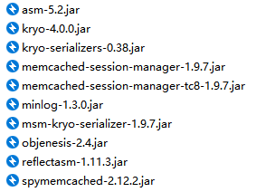

[TOC]

# 1、代理服务

1. **正向代理**，就是==代理服务器代理了客户端==，去和目标服务器进行交互。现实生活中场景：黄牛买票
2. **反向代理**，就是==代理服务器代理了目标服务器==，去和客户端进行交互。现实生活中场景：房屋中介


## 1.1、什么是代理？

　　要想弄明白反向代理，首先要知道啥是正向代理，要搞懂正向代理只需要知道啥是代理即可。代理其实就是一个中介，在不同事物或同一事物内部起到==居间联系作用==的环节。比如买票黄牛，房屋中介等等。

　　在互联网中代理更多指的是代理服务器，代理服务器位于客户端和服务器之间，它充当两者之间的中介。这种代理在生活中是比较常见的，比如我们常说的科学上网，用到的就是代理技术。


## 1.2、正向代理

​		==正向代理（forward proxy）==：是一个位于==客户端==和==目标服务器之==间的服务器（代理服务器），为了从目标服务器取得内容，客户端向代理服务器发送一个请求并指定目标，然后代理服务器向目标服务器转交请求并将获得的内容返回给客户端。

　　比如国内访问谷歌，直接访问是不行的，我们可以通过一个能够访问谷歌的正向代理服务器，请求发到代理服务器，由代理去谷歌获取数据并返回，这样就变相的实现了访问谷歌的需求。

　　**一句话总结：正向代理，就是代理服务器代理了客户端，去和目标服务器进行交互。**


> **正向代理的用途：**
>
> - 隐藏客户端真实 `IP`
> - 通过缓存加速访问资源
> - 突破 `IP` 访问限制
> - 客户端访问授权


## 1.3、反向代理

​		==反向代理（Reverse Proxy）==：与正向代理正好相反，反向代理中的代理服务器，代理的是服务器那端。代理服务器接收客户端请求，然后将请求转发给==内部网络上的服务器==，并将从服务器上得到的结果返回给客户端，整个过程中客户和实际处理服务器是不会直接建立连接的，此时代理服务器对外表现为一个==反向代理服务器==的角色。

　　反向代理服务器位于用户与目标服务器之间，但是对于用户而言，反向代理服务器就相当于目标服务器，即用户直接访问反向代理服务器就可以获得目标服务器的资源。同时，用户不需要知道目标服务器的地址，也无须在用户端作任何设定。

　　**一句话总结：反向代理，就是代理服务器代理了目标服务器，去和客户端进行交互。**


> **反向代理的用途**：
>
> - 隐藏服务器真实 `IP`
> - 通过缓存加速访问资源
> - 负载均衡
> - 提供安全保障
>
> 
>
> **反向代理与内网穿透：**
>
> 如果一台公网的服务器想代理几台内网的服务器，就需要使用到==内网渗透==技术。

# 2、高并发场景

​		高并发通常是指通过设计保证系统能够==同时并行处理很多请求==。通俗来讲，高并发是指在同一个时间点，有很多用户同时的访问同一 `API 接口`或者 `Url 地址`。它经常会发生在有大活跃用户量，用户高聚集的业务场景中。


​		通常高并发，会给==服务器和硬件环境==带来很大的压力，如大学选体育课：很卡，挤不进去。对于高并发的处理通常有有以下几种方式：

1. **池：**
   - 刚开始的时候==创建多个请求等待==使用。
   - 使用完毕后并不会销毁，而是重新归还到池。
   - 如果业务量比较大，我们通过池控制最大连接的数。
2. **负载均衡（load Balance）**
   - 将==请求/数据【均匀】==分摊到多个操作单元上执行，负载均衡的关键在于==【均匀】==


> **高可用**：一台服务器崩了后，另一台服务器能马上接收它的工作。

# 3、负载均衡

​		实际生产环境中，反向代理服务器代理的目标服务器可能不止一个。比如开发好的某个应用部署在一台 `Tomcat` 服务器上，而 `Tomcat` 的并发上限不优化情况下，默认只有==两百左右==，这时候为了解决高并发的问题，就只能选择==更替服务器==或者==搭建多台服务器==通过==反向代理与负载均衡==的技术解决并发问题。


　	==负载均衡（Load Balance）==是由多台服务器以==对称的方式组成一个服务器集群==，每台服务器都具有等价的地位，都可以单独对外提供服务而无须其他服务器的辅助。经过某种==负载分管==技术，将外部发送来的中央请求均匀分配到对称结构中的某一台服务器上。


## 3.1、负载均衡策略

### 3.1.1、请求轮询

将客户端的请求，依次转发给配置的服务器。


### 3.1.2、增加权重

​		因为不同的服务器其性能可能也不一致，为了让性能更好的服务器能够处理更多的请求，我们就不要使用==轮询策略==，而是采用==权重策略==，这样 `Nginx` 会将客户端的请求，根据服务器的权重值不同，分配不同的数量。

​		使用服务器权重，还可以进一步影响 `nginx`负载均衡算法，谁的权重越大，分发到的请求就越多。


### 3.1.3、最少连接数

​		在连接负载最少的情况下，`nginx` 会尽量避免将过多的请求分发给繁忙的应用程序服务器，而是将新请求分发给不太繁忙的服务器，避免服务器过载。


### 3.1.4、IpHash

​		在开发中，我们会让某一台服务器专门用于处理某项业务，所以我们得确保来自同一客户端的请求将始终定向到这一台服务器，除非此服务器不可用。

​		所以配置完 `IpHash` 后，则即使基于发起请求的客户端的 `ip` 地址不同，他始终会将请求发送到指定的服务器上。但是


​		但是 ==IpHash== 存在问题，如分布式缓存中，如果一旦增加了一台服务器，再进行计算时，会出现落点不一致的情况，从而找不到相对应的缓存服务器。如果服务器无法获取到缓存数据时（==缓存失效，产生大量雪崩==），则会向后端服务器请求数据，则系统可能会被压垮。为了解决该办法，就要使用==一致性 hash 算法==。


#### 3.1.4.1、一致性 hash 算法

> （1）一致性 hash 算法简介


> （2）hash 偏斜问题


更多详解：https://www.cnblogs.com/lpfuture/p/5796398.html

# 4、Nginx 简介

​		前面我们提到搭建多台服务器并通过==反向代理与负载均衡==的技术可以解决并发问题，那么负载均衡的实现从哪来？为了避免重复造轮子，我们选择现成已有的成熟工具帮助我们完成这项工作。`Nginx` 就是一个不错的选择。


​		`Nginx` 是由 ==Igor Sysoev（伊戈尔 · 赛索耶夫）==为俄罗斯访问量第二的站点https://www.rambler.ru/开发的。`Nginx` 是一个轻量级、高性能的==HTTP（Web） 和反向代理服务器==，可以扛得住 ==5W== 左右的并发。

​		`Ngnix` 一方面可以==做反向代理服务器==，另外一方面还可以做==静态资源服务器==（如放置一些静态资源服务器）。本文主要学习如何使用 `Nginx` 实现反向代理与负载均衡。


> 
>
> ​		`Nginx` 是一个轻量级、高性能的==HTTP（Web） 和反向代理服务器==，它占有内存少，并发能力强官方测试 `nginx` 能够支撑==5万并发==链接，并且CPU、内存等资源消耗却非常低，运行非常稳定。
>
> 
>
> ​		`Tengine` 淘宝基于 `Nginx` 研发的 `web`服务器。点击查看：[官网](http://tengine.taobao.org/)、[开发文档](http://tengine.taobao.org/book/)。
>
> 1. `Tengine` 相比 `Nginx` 默认配置，提升 ==200%== 的处理能力。
> 2. `Tengine` 相比 `Nginx` 优化配置，提升 ==60%== 的处理能力。

# 5、环境搭建


​	由图可知，我们接下来要做的事情如下所示：

1. `Nginx` 如何搭建三台服务器的小集群。
2. `Nginx` 如何配置均衡策略。
3. `Nginx` 配置为静态资源服务器。
4. `Nginx` 做 `Session` 的共享


> 封 IP、限流、Nginx + Keepalived 搭建高可用集群等自己了解


## 5.1、安装准备

### 5.1.1、软件

- 官网：http://nginx.org/
- 中文文档：https://www.nginx.cn/doc/index.html


### 5.1.2、环境

- 三台 `CentOS 7.8.2003` 机器
- `192.168.10.102` 安装 `Nginx 1.18.0`
- `192.168.10.103` 和 `192.168.10.104` 安装 `Tomcat 9.0.38`


### 5.1.3、常用命令

```shell
# 帮助
[root@localhost nginx]# sbin/nginx -h

# 查看版本
[root@localhost nginx]# sbin/nginx -v

# 查看版本及配置选项
[root@localhost nginx]# sbin/nginx -V

# 启动并通过 -c 指定启动时加载的配置文件，默认加载 conf/nginx.conf
sbin/nginx -c /usr/local/nginx/conf/nginx.conf

# 检测配置文件是否有语法错误，默认检测 conf/nginx.conf
[root@localhost nginx]# sbin/nginx -t -c /usr/local/nginx/conf/nginx.conf

# 平滑的重启，重新加载配置
sbin/nginx -s reload

# 快速停止
sbin/nginx -s stop

# 完整有序的停止
sbin/nginx -s quit

# 重新打开日志文件（日志切割）。
sbin/nginx -s reopen
```

> **重新打开日志文件的使用**
>
> 　　比如我们把架设在 `Nginx` 上的所有网站访问日志都存放在一个文件里，这样日积月累所有网站的访问记录就会把日志文件越积越大，当需要查看日志文件的时候就会变得非常麻烦。如果把每天的日志文件分割开来用相应的日期进行标识，查看日志的操作就会变得非常友好了。
>
> 　　==日志切割实现流程如下：==
>
> - 移动原文件到新文件目录中。其实这个时候 `Nginx` 还是会继续将日志写入该文件。
> - 执行 `nginx -s reopen` 打开一个新的日志文件，`Nginx` 会把新的日志信息写入该文件。
>
> 　　这样就完成了日志的切割工作，同时切割过程中也不会丢失任何日志信息。


## 5.2、安装 Nginx

### 5.2.1、源码安装 Nginx

1. 解压安装包
2. 编译并安装 `make && make install`，安装后的目录如下：
   - ==conf==：配置文件；
   - ==html==：静态资源文件；
   - ==sbin==：可执行文件；
   - ==logs==：日志文件；

```shell
# 下载 nginx 资源并解压，或者将准备好的安装包上传到 Linux 虚拟机
[topcloud@basenode ~]$ wget -P /usr/local/src http://nginx.org/download/nginx-1.18.0.tar.gz

# 解压，并把Nginx存放到指定目录，这里的 software 目录是位于 /opt 下自己创建的
[topcloud@basenode software]$ tar -zxvf nginx-1.8.1.tar.gz -C /opt/module/

# 需要安装 nginx 依赖的软件
[topcloud@basenode module]$ sudo yum install -y gcc gcc-c++ pcre pcre-devel zlib zlib-devel openssl-devel

# 进入 nginx 文件夹
[topcloud@basenode module]$ cd nginx-1.8.1/
[topcloud@basenode nginx-1.8.1]$ ll
总用量 640
drwxr-xr-x. 6 topcloud topcloud   4096 10月 29 15:29 auto
-rw-r--r--. 1 topcloud topcloud 251319 1月  26 2016 CHANGES
-rw-r--r--. 1 topcloud topcloud 383019 1月  26 2016 CHANGES.ru
drwxr-xr-x. 2 topcloud topcloud    168 10月 29 15:29 conf
-rwxr-xr-x. 1 topcloud topcloud   2478 1月  26 2016 configure
drwxr-xr-x. 4 topcloud topcloud     72 10月 29 15:29 contrib
drwxr-xr-x. 2 topcloud topcloud     40 10月 29 15:29 html
-rw-r--r--. 1 topcloud topcloud   1397 1月  26 2016 LICENSE
drwxr-xr-x. 2 topcloud topcloud     21 10月 29 15:29 man
-rw-r--r--. 1 topcloud topcloud     49 1月  26 2016 README
drwxr-xr-x. 8 topcloud topcloud     77 10月 29 15:29 src

# 配置安装路径
[topcloud@basenode nginx-1.8.1]$ ./configure --prefix=/opt/lzj/nginx

# 开始编译并安装nginx
[topcloud@basenode nginx-1.8.1]$ make && make install

# 查看已经安装完成
[topcloud@hadoop102 module]$ ll
总用量 4
drwxrwxr-x.  2 topcloud topcloud  112 10月 18 22:51 datas
drwxrwxr-x.  3 topcloud topcloud  102 10月 17 19:01 frp
drwxr-xr-x. 12 topcloud topcloud  188 10月 17 20:36 hadoop-3.1.3
drwxrwxr-x. 10 topcloud topcloud  165 10月 16 21:13 hive
drwxr-xr-x.  7       10      143  245 4月   2 2019 jdk1.8.0_212
drwxrwxr-x.  6 topcloud topcloud   54 10月 29 15:40 nginx
drwxr-xr-x.  9 topcloud topcloud  186 10月 29 15:38 nginx-1.8.1
drwxrwxr-x.  6 topcloud topcloud   50 3月   4 2016 scala
drwxrwxr-x.  3 topcloud topcloud 4096 10月 16 13:07 tez
drwxrwxr-x.  8 topcloud topcloud  160 10月 19 16:09 zookeeper

# 删除不需要的 nginx-1.8.1 避免误解
[topcloud@basenode module]$ rm -rf nginx-1.8.1/
```


### 5.2.2、启动 Nginx

使用 `root` 账户将 ==sbin/nginx== 启动起来 

```shell
# 进入可执行文件 sbin 目录
[topcloud@basenode module]$ cd lzj/nginx/
[topcloud@basenode nginx]$ ll
总用量 4
drwxrwxr-x. 2 topcloud topcloud 4096 10月 29 15:40 conf
drwxr-xr-x. 2 topcloud topcloud   40 10月 29 15:40 html
drwxrwxr-x. 2 topcloud topcloud    6 10月 29 15:40 logs
drwxrwxr-x. 2 topcloud topcloud   19 10月 29 15:40 sbin
[topcloud@hadoop102 nginx]$ cd sbin/
[topcloud@hadoop102 sbin]$ ll
总用量 3240
-rwxrwxr-x. 1 basenode topcloud 3313848 10月 29 15:40 nginx

# 启动nginx失败，因为Linux只有root用户可以使用1024一下的端口，所以提升权限即可
[topcloud@basenode sbin]$ ./nginx 
nginx: [emerg] bind() to 0.0.0.0:80 failed (13: Permission denied)

# 启动成功，打开windows输入服务器的ip进行查看（默认80端口），启动成功画面如下显示
[topcloud@basenode sbin]$ su
密码：
[root@basenode sbin]# ./nginx

# 发现启动后多了很多临时配置文件
[root@basenode sbin]# cd ..
[root@basenode nginx]# ll
总用量 4
drwx------. 2 nobody   topcloud    6 10月 29 20:45 client_body_temp
drwxrwxr-x. 2 topcloud topcloud 4096 10月 29 15:40 conf
drwx------. 2 nobody   topcloud    6 10月 29 20:45 fastcgi_temp
drwxr-xr-x. 2 topcloud topcloud   40 10月 29 15:40 html
drwxrwxr-x. 2 topcloud topcloud   58 10月 29 20:49 logs
drwx------. 2 nobody   topcloud    6 10月 29 20:45 proxy_temp
drwxrwxr-x. 2 topcloud topcloud   19 10月 29 15:40 sbin
drwx------. 2 nobody   topcloud    6 10月 29 20:45 scgi_temp
drwx------. 2 nobody   topcloud    6 10月 29 20:45 uwsgi_temp
```

==启动成功界面：==


### 5.2.3、修改文件并测试

​		这里主要是在 ==/html/index.html== 中加了一句话，而对于配置文件的话见后面详解。另外通过命令 `nginx -s reload` 可以重新加载配置文件。

```shell
# 进入 nginx 下的 html 文件夹
[root@hadoop102 nginx]# cd html/
[root@hadoop102 html]# ll
总用量 8
-rw-r--r--. 1 topcloud topcloud 537 10月 29 15:40 50x.html
-rw-r--r--. 1 topcloud topcloud 612 10月 29 15:40 index.html

# 修改显示页面，这里主要是在15行增加了一句话
[root@hadoop102 html]# vim index.html
<h1>Welcome to nginx!</h1>
<h1>Welcome to topcloud!</h1>

# 进入 conf 文件夹
[root@hadoop102 nginx]# cd conf/
[root@hadoop102 conf]# ll
总用量 60
-rw-r--r--. 1 topcloud topcloud 1034 10月 29 15:40 fastcgi.conf
-rw-r--r--. 1 topcloud topcloud 1034 10月 29 15:40 fastcgi.conf.default
-rw-r--r--. 1 topcloud topcloud  964 10月 29 15:40 fastcgi_params
-rw-r--r--. 1 topcloud topcloud  964 10月 29 15:40 fastcgi_params.default
-rw-r--r--. 1 topcloud topcloud 2837 10月 29 15:40 koi-utf
-rw-r--r--. 1 topcloud topcloud 2223 10月 29 15:40 koi-win
-rw-r--r--. 1 topcloud topcloud 3957 10月 29 15:40 mime.types
-rw-r--r--. 1 topcloud topcloud 3957 10月 29 15:40 mime.types.default
-rw-r--r--. 1 topcloud topcloud 2656 10月 29 15:40 nginx.conf
-rw-r--r--. 1 topcloud topcloud 2656 10月 29 15:40 nginx.conf.default
-rw-r--r--. 1 topcloud topcloud  596 10月 29 15:40 scgi_params
-rw-r--r--. 1 topcloud topcloud  596 10月 29 15:40 scgi_params.default
-rw-r--r--. 1 topcloud topcloud  623 10月 29 15:40 uwsgi_params
-rw-r--r--. 1 topcloud topcloud  623 10月 29 15:40 uwsgi_params.default
-rw-r--r--. 1 topcloud topcloud 3610 10月 29 15:40 win-utf
```


### 5.2.4、关闭 Nginx

使用 `./nginx -s quit` 命令关闭 ==nginx==。

```shell
# 查看nginx 进程
[root@hadoop102 sbin]# ps -ef | grep nginx
root       1793      1  0 20:49 ?        00:00:00 nginx: master process ./nginx
nobody     1794   1793  0 20:49 ?        00:00:00 nginx: worker process
root       2117   1757  0 21:16 pts/0    00:00:00 grep --color=auto nginx

# 完整有序的停止
[root@hadoop102 sbin]# ./nginx -s quit

# 快速停止
# [root@hadoop102 sbin]#./nginx -s stop

[root@hadoop102 sbin]# ps -ef | grep nginx
root       2121   1757  0 21:17 pts/0    00:00:00 grep --color=auto nginx
```


## 5.3、安装 Tomcat

1. 解压安装包

```shell
# 下载 tomcat 资源并解压，或者将准备好的安装包上传到 Linux 虚拟机
[topcloud@basenode ~]$ wget -P /usr/local/src https://mirrors.tuna.tsinghua.edu.cn/apache/tomcat/tomcat-9/v9.0.38/
bin/apache-tomcat-9.0.38.tar.gz

# 解压
[topcloud@basenode ~]$ tar -zxvf /usr/local/src/apache-tomcat-9.0.38.tar.gz -C /opt/lzj/tomcat
```

2. 修改三台 `Tomcat` 服务器上的 ==index.jsp==

```shell
# 查看当前路径
[topcloud@node01 lzj]$ pwd
/opt/lzj

# 修改 tomcat 服务器中 /webapps/ROOT/index.jsp 文件
[topcloud@node01 lzj]$ vim tomcat/webapps/ROOT/index.jsp
```

3. 修改 `jsp` 页面
   - 删掉 ==36 - 127== 行无用的代码，也可以不删。
   - 删除 `session="false"`
   - 写入下面 `<h1>` 以及 `<h3>` 的代码

```shell
<!DOCTYPE html>
<html lang="en">
    <head>
        <meta charset="UTF-8" />
        <title><%=request.getServletContext().getServerInfo() %></title>
        <link href="favicon.ico" rel="icon" type="image/x-icon" />
        <link href="favicon.ico" rel="shortcut icon" type="image/x-icon" />
        <link href="tomcat.css" rel="stylesheet" type="text/css" />
    </head>

    <body>
        <h1>welcome to tomcat topcloud101</h1>
        <h3>Server：<%=request.getLocalAddr()%></h3>
        <h3>Port：<%=request.getLocalPort()%></h3>
        <h3>Client：<%=request.getRemoteAddr()%></h3>
        <h3>Session：<%=session.getId()%></h3>
    </body>
</html>
```

4. 通过脚本分发 ==index.jsp== 到另外三台安装了 tomcat 的服务器

```shell
# 对于脚本的话，见linux的脚本
[topcloud@basenode ROOT]$ xsync index.jsp

# 或者使用 rsync 进行分发， `pwd` 指的是当前目录
# [topcloud@basenode ROOT]$ scp index.jsp root@192.168.58.102:`pwd`
```


## 5.4、负载均衡搭建

### 5.4.1、准备工作

1. 准备四台虚拟机，每台虚拟机安装 `JDK` 和 `Tomcat`。
2. 一台运行 `Nginx`，其他三台跑 `Tomcat`。


### 5.4.2、启动 Tomcat 服务器

启动 3 台 `Tomcat` 服务器

```shell
[topcloud@basenode ROOT]$ cd ../../bin/
[topcloud@basenode bin]$ ./startup.sh
```


### 5.4.3、修改配置文件

1. 修改 `Nginx` 的配置文件

```shell
# 查看当前位置
[root@basenode nginx]# pwd
/opt/lzj/nginx

# 修改配置文件
[root@basenode nginx]# vim conf/nginx.conf
```

2. 配置文件修改、
   - 在 `http` 节点下，添加 `upstream` 节点。使用 `upstream name{}` 语法定义一组服务器。
   - 然后在 `server` 节点的 80 端口下添加下图中的内容。默认情况下，`Nginx` 是按加权轮询的方式将请求分发到各个服务器，当权重 `weight` 不指定时，各服务器 `weight` 相同。关于 `Nginx` 启动用户的问题请根据自身实际环境进行配置。

```properties
# 这里改为0，即不要设置长连接，否则切换时效果不明显
keepalive_timeout  0;
#keepalive_timeout  65;

.........

# 配置集群地址
upstream lzj8080 {
	server 192.168.58.101:8080;
	server 192.168.58.102:8080;
	server 192.168.58.103:8080;
}

server {
	listen       80;
	# 这里可以写hosts文件，做个映射
	server_name  www.lzj.com;
	location / {
	proxy_pass http://lzj8080;
}


```


### 5.4.4、启动 Nginx 服务器

```shell
# 启动 Nginx 服务器
[root@basenode sbin]# ./nginx 

# # 平滑的重启，重新加载配置，注意要先启动 Nginx 服务器
[root@basenode sbin]# ./nginx -s reload
```

成功启动后，按 `ctrl + F5` 可查看配置效果 


## 5.5、负载均衡策略配置

> （1）请求轮询

- 在轮询中，如果服务器 `down` 掉了，会自动剔除该服务器。
- 缺省配置就是==轮询策略==。
- 此策略适合服务器配置相当，无状态且短平快的服务使用。


> （2）增加权重配置

```properties
# 说你行你就行不行也行，如下是 nginx 中的配置。使得机器出现概率分别为 1/6、2/6、3/6
upstream shsxt {
	server 192.168.58.101:8080 weight=1;
	server 192.168.58.102:8080 weight=2;
	server 192.168.58.103:8080 weight=3;
}


```


> （3）最少连接数配置

```properties
# 如下是 nginx 中的配置
upstream shsxt {
	least_conn;
	server 192.168.58.102:8080;
	server 192.168.58.103:8080;
}


```


> （4）IpHash 配置

```properties
# 如下是 nginx 中的配置
upstream shsxt {
	ip_hash;
	server 192.168.58.101:8080;
	server 192.168.58.103:8080;
}


```


## 5.6、实现资源静态化

**对于资源静态化的实现方式基本有以下种：**

1. 在写项目阶段，图片资源直接写死即可。

2. 由外部服务器统一管理图片。如千牛云、`Fastdfs`服务器、[图床](https://imgurl.org/)等

   

3. 若资源较少，可以将 `nginx` 作为==静态资源服务器==来进行存储。

   - 修改配置文件 ==nginx.conf==

   ```properties
   ##在Nginx的home目录下创建一个static文件夹，然后存放图片
   location ^~ /static/ {
   	# 如果拦截到的是图片，则走 nginx 下的 html 文件夹。
   	root html;
   }
   ```
   
   - 在 `nginx` 的 ==html== 文件夹创建图片。

   

   - 在 tomcat 服务器中配置静态资源的路径

   ```jsp
<body>
       <h1> welcome to shsxt</h1>
       <h1> 服务器地址： <%= request.getLocalAddr() %>   </h1>
       <h1> 客户端地址： <%= request.getRemoteAddr() %>   </h1>
       <h1> Session的ID ： <%= session.getId() %>   </h1>
       
   </body>
   ```
   
   - 启动 `Nginx` 服务器，并访问该网站。


## 5.7、Session 一致性

**看本节之前先看（6、单Linux搭建多Tomcat、7、虚拟主机），并进行相应的搭建**

| 节点\角色 | Nginx | Tomcat | JDK  | memcached |
| :-------: | :---: | :----: | :--: | :-------: |
| basenode  |   *   |        |      |     *     |
|  node01   |       |   *    |  *   |           |
|  node02   |       |   *    |  *   |           |
|  node03   |       |   *    |  *   |           |

1. 安装内存数据库，这里选用的是 `memcached`，你也可以选用 `Redis`。另外可以配置一台或者多态。

```shell
[topcloud@basenode sbin]$ sudo yum install memcached -y
```

2. 开启数据库服务

```shell
# 查看 memcached 服务的状态
[topcloud@basenode sbin]$ systemctl status memcached.service

# 开启 memcached 服务
[topcloud@basenode sbin]$ systemctl start memcached.service

# 让 memcached 服务自启
[topcloud@basenode sbin]$ systemctl enable memcached.service
```

3. 编辑 ==memcached== 配置文件

```shell
[topcloud@basenode sbin]$ vim /etc/sysconfig/memcached
# 端口
PORT="11211"
# 用户
USER="memcached"
# 最大连接数
MAXCONN="1024"
# 最大缓存数 64M
CACHESIZE="64"
# 其他参数
OPTIONS=""
```

4. 拷贝 `jar`  包到 ==Tomcat8080==、==Tomcat9090== 服务器 ==lib== 目录下，要注意 `memcached` 的版本



```shell
# 进入 lib 目录
[topcloud@node01 ~]$ cd /opt/lzj/tomcat8080/lib/

# 上传
[topcloud@node01 lib]$ rz -E
```

5. 如果一个机器有多个 ==tomcat== 都需要 ==session== 一致。所以配置下 ==tomcat/conf/server.xml==，把 `jvmRoute` 命名一致。让相同项目共享 ==session==，如果你只有一个 ==tomcat==，忽略此步骤。

```xml
<!--tomcat8080项目上的配置-->
<Engine name="Catalina" defaultHost="localhost" jvmRoute="jvmZLJ8080"></Engine>

<!--tomcat9090项目上的配置-->
<Engine name="Catalina" defaultHost="localhost" jvmRoute="jvmZLJ9090"></Engine>
```

6. 配置 ==tomcat/conf/context.xml==

```xml
<!--SessionManager 管理类-->
<!--我配置的memcachedNodes是在 basenode 服务器上，所以为192.168.58.100。
另外如果是集群，memcachedNodes 配置可以用逗号隔开如 m1:host1.yourdomain.com:11211,m2:host2.yourdomain.com:11211-->
<Manager
    className="de.javakaffee.web.msm.MemcachedBackupSessionManager"
    memcachedNodes="n1:192.168.58.100:11211"
    sticky="true"
    lockingMode="auto"
    sessionBackupAsync="false"
    requestUriIgnorePattern=".*\.(ico|png|gif|jpg|css|js)$"
    sessionBackupTimeout="1000"          transcoderFactoryClass="de.javakaffee.web.msm.serializer.kryo.KryoTranscoderFactory" />
```

7. 因为我是配置了三台机子，每台机子两台 Tomcat，所以配置完一台后就进行分发。接着启动或重启`Tomcat` 服务器。
   - 分发 ==tomcat8080==、==tomcat9090==
   - 分发环境变量 ==/etc/profile.d/my_env.sh==
8. 访问发现不同 ==server== 是可以共享同一个 ==session== 的。


# 6、单 Linux 搭建多 Tomcat

搭建多个 Tomcat 就可以实现多项目运行，各项目间不会互相干扰。

------

## 6.1、拷贝多台 Tomcat

```shell
# 查看当前
[topcloud@node01 lzj]$ ll
总用量 4
drwxr-xr-x.  9 topcloud topcloud  220 10月 30 09:06 tomcat
drwxr-xr-x  11 topcloud topcloud 4096 10月 30 16:23 zookeeper

# 重命名
[topcloud@node01 lzj]$ mv tomcat/ tomcat8080
[topcloud@node01 lzj]$ ll
总用量 4
drwxr-xr-x.  9 topcloud topcloud  220 10月 30 09:06 tomcat8080
drwxr-xr-x  11 topcloud topcloud 4096 10月 30 16:23 zookeeper

# 再拷贝一份 tomcat
[topcloud@node01 lzj]$ cp -r tomcat8080/ tomcat9090
[topcloud@node01 lzj]$ ll
总用量 4
drwxr-xr-x   9 topcloud topcloud  220 10月 31 04:53 tomcat8080
drwxr-xr-x.  9 topcloud topcloud  220 10月 30 09:06 tomcat9090
drwxr-xr-x  11 topcloud topcloud 4096 10月 30 16:23 zookeeper
```


## 6.2、配置环境变量

配置环境变量，配置完成后执行 `source` 命令

```shell
# 1、可以直接编辑profile文件
[topcloud@node01 /]$ vim /etc/profile

# 2、在 /etc/profile.d 下新建文件进行配置，这里是建立了 my_env.sh 文件
[topcloud@node01 profile.d]$ vim my_env.sh
```

编辑如下：

```shell
#tomcat8080
export CATALINA_HOME=/opt/lzj/tomcat8080
export CATALINA_BASE=/opt/lzj/tomcat8080
export TOMCAT_HOME=/opt/lzj/tomcat8080

#tomcat9090
export CATALINA_HOME9090=/opt/lzj/tomcat9090
export CATALINA_BASE9090=/opt/lzj/tomcat9090
export TOMCAT_HOME9090=/opt/lzj/tomcat9090
```


## 6.3、修改脚本文件

只需要修改 ==Tomcat9090== 即可，修改 ==catalina.sh==

```shell
[topcloud@node01 /]$ vim /opt/lzj/tomcat9090/bin/catalina.sh
```

编辑如下：

```shell
####################第二台tomcat配置,113行开始
export CATALINA_BASE=$CATALINA_BASE9090
export CATALINA_HOME=$CATALINA_HOME9090
export TOMCAT_HOME=$TOMCAT_HOME9090
```


## 6.4、修改启动端口

只需要修改 ==tomcat9090== 即可，第一台保持不变

```shell
# 进入 tomcat9090 的配置文件
[topcloud@node01 tomcat9090]$ cd conf/
[topcloud@node01 conf]$ ll
总用量 224
drwxr-x--- 3 topcloud topcloud     23 10月 31 04:53 Catalina
-rw------- 1 topcloud topcloud  13548 10月 31 04:53 catalina.policy
-rw------- 1 topcloud topcloud   7661 10月 31 04:53 catalina.properties
-rw------- 1 topcloud topcloud   1338 10月 31 04:53 context.xml
-rw------- 1 topcloud topcloud   1149 10月 31 04:53 jaspic-providers.xml
-rw------- 1 topcloud topcloud   2313 10月 31 04:53 jaspic-providers.xsd
-rw------- 1 topcloud topcloud   3916 10月 31 04:53 logging.properties
-rw------- 1 topcloud topcloud   7513 10月 31 04:53 server.xml
-rw------- 1 topcloud topcloud   2164 10月 31 04:53 tomcat-users.xml
-rw------- 1 topcloud topcloud   2633 10月 31 04:53 tomcat-users.xsd
-rw------- 1 topcloud topcloud 171482 10月 31 04:53 web.xml

# 编辑 server.xml 文件
[topcloud@node01 conf]$ vim server.xml
```

文件编辑如下：

```shell
# 关闭端口，默认为8005－－》修改为9005
<Server port="9005" shutdown="SHUTDOWN">

# 客户端访问端口，默认为8080－－》修改为9090
<Connector port="9090" protocol="HTTP/1.1" connectionTimeout="20000" redirectPort="8443" />

# AJP端口，默认为8009－－》修改为9009
<Connector port="9009" protocol="AJP/1.3" redirectPort="8443" />
```


## 6.5、分别启动两个 Tomcat

```shell
# 启动tomcat8080
[topcloud@node01 ~]$ cd /opt/lzj/tomcat8080/bin && ./startup.sh

# 启动tomcat9090
[topcloud@node01 ~]$ cd /opt/lzj/tomcat9090/bin && ./startup.sh

# 查看进程
[topcloud@node01 bin]$ jps
36592 Bootstrap
36690 Bootstrap
36743 Jps
```

# 7、虚拟主机

​		学完上节单 Linux 搭建多 Tomcat 知识点，即可学习本节虚拟主机的配置。

​		==虚拟主机==是指在网络服务器上分出一定的磁盘空间，用户可以租用此部分空间，以供用户放置站点及应用组件，提供必要的数据存放和传输功能。


**分类**

1. 基于==域名==的虚拟主机，通过==域名==来区分虚拟主机
2. 基于==端口==的虚拟主机，通过==端口==来区分虚拟主机


## 7.1、基于域名

1. 编辑 windows 的 ==hosts（C:\Windows\System32\drivers\etc）== 文件，写入下面域名和 ip

```shell
192.168.58.100 www.lzj8080.com
192.168.58.100 www.lzj9090.com
```

2. ==cmd== 进行 `ping`，查看是否配置成功

```shell
正在 Ping www.lzj8080.com [192.168.58.100] 具有 32 字节的数据:
来自 192.168.58.100 的回复: 字节=32 时间<1ms TTL=64
来自 192.168.58.100 的回复: 字节=32 时间<1ms TTL=64
来自 192.168.58.100 的回复: 字节=32 时间=2ms TTL=64
```

3. 编辑 Linux 系统下 ==nginx== 配置文件 

```shell
[topcloud@basenode ~]$ vim /opt/lzj/nginx/conf/nginx.conf
```

4. 编辑文件如下所示：

```properties
http {
	# lzj8080
    upstream lzj8080 {
    	server 192.168.58.101:8080;
    	server 192.168.58.102:8080;
    	server 192.168.58.103:8080;
    } 
    
    # lzj9090
    upstream lzj9090 {
    	server 192.168.58.101:9090;
    	server 192.168.58.102:9090;
    	server 192.168.58.103:9090;
    } 
    
    # 映射 lzj8080
    server {
        listen       80;
        server_name  www.lzj8080.com;

        location / {
			proxy_pass http://lzj8080;
        }
    }
    
    # 映射 lzj9090
    server {
        listen       80;
        server_name  www.lzj9090.com;

        location / {
			proxy_pass http://lzj9090;
        }
    }
}
```


## 7.2、基于端口

```properties
http {
	# lzj8080
    upstream lzj8080 {
    	server 192.168.58.101:8080;
    	server 192.168.58.102:8080;
    	server 192.168.58.103:8080;
    } 
    
    # lzj9090
    upstream lzj9090 {
    	server 192.168.58.101:9090;
    	server 192.168.58.102:9090;
    	server 192.168.58.103:9090;
    } 

    # 映射 lzj8080，这里的端口号自己设置
    server {
        listen       8888;
        server_name  www.lzj8080.com;

        location / {
			proxy_pass http://lzj8080;
        }
    }
    
    # 映射 lzj9090，这里的端口号自己设置
    server {
        listen       9999;
        server_name  www.lzj8080.com;

        location / {
			proxy_pass http://lzj9090;
        }
    }
}
```


# 8、配置文件详解

```properties
# user 指定运行 nginx 的用户和组（第一个参数为用户第二个为组，这里只有用户）
#user  nobody;
# 指定工作进程数（一般设置为CPU核数）
worker_processes  1;   

# 指定错误日志为 logs/ 目录下的 error.log 文件
#error_log  logs/error.log;
# 指定错误日志，并指定写入格式为 notice
#error_log  logs/error.log  notice;
# 指定错误日志，并指定写入格式为 info  
#error_log  logs/error.log  info;

# 指定 pid 文件（存放主进程 pid 号）
#pid        logs/nginx.pid;

# nginx 连接配置模块
events {
    # 指定每个工作进程最大连接数为 1024
    worker_connections  1024;
}

# http 配置模块
http {
    # 通过 include 加载 mime.types 文件，里面的 types {} 模块将文件扩展名映射到响应的 MIME 类型
    include       mime.types;
    # 定义响应的默认 MIME 类型
    default_type  application/octet-stream;

    # 写入格式 main 的内容格式如下
    #log_format  main  '$remote_addr - $remote_user [$time_local] "$request" '
    #                  '$status $body_bytes_sent "$http_referer" '
    #                  '"$http_user_agent" "$http_x_forwarded_for"';

    # 指定访问日志和写入格式为 main
    #access_log  logs/access.log  main;

    # 启用或者禁用 sendfile()
    sendfile        on;
    # 启用或者禁用使用套接字选项（仅在 sendfile 使用时使用）
    #tcp_nopush     on;

    # 0 值禁用保持活动的客户端连接
    #keepalive_timeout  0;
    # 65 s 超时
    keepalive_timeout  65;

    # 启用或者禁用 gzip
    #gzip  on;

    # 虚拟主机配置模块
    server {
        # 监听 80 端口
        listen       80;
        # 监听域名为 localhost
        server_name  localhost;
        # 将指定的 charset 添加到 “Content-Type” 响应头字段。
        # 如果此charset与source_charset指令中指定的charset不同，则执行转换。
        #charset koi8-r;

        # 指定该虚拟主机的访问日志
        #access_log  logs/host.access.log  main;

        # 将特定的文件或目录重新定位，如 php 文件，image 目录等
        location / {
            # 设置请求的根目录
            root   html;
            # 定义索引，按顺序匹配
            index  index.html index.htm;
        }

        # 定义显示 404 错误的 uri
        #error_page  404              /404.html;

        # redirect server error pages to the static page /50x.html
        #
        error_page   500 502 503 504  /50x.html;
        # location 精准匹配 '/50x.html'
        location = /50x.html {
            root   html;
        }

        # proxy the PHP scripts to Apache listening on 127.0.0.1:80
        # 正则表达式匹配 php 文件
        #location ~ \.php$ {
            # 设置代理服务器的协议和地址，以及应该映射位置的可选URI。作为协议，可以指定“http”或“https”。该地址可以指定为一个域名或IP地址，以及一个可选端口
        #    proxy_pass   http://127.0.0.1;
        #}

        # pass the PHP scripts to FastCGI server listening on 127.0.0.1:9000
        #
        #location ~ \.php$ {
        #    root           html;
             # 设置 FastCGI 服务器的地址。地址可以指定为一个域名或 IP 地址，以及一个端口
        #    fastcgi_pass   127.0.0.1:9000;
             # 设置将在以斜杠结尾的URI之后追加的文件名，
        #    fastcgi_index  index.php;
             # 设置一个应该传递给FastCGI服务器的参数。
        #    fastcgi_param  SCRIPT_FILENAME  /scripts$fastcgi_script_name;
             # 加载 conf/fastcgi_params 文件
        #    include        fastcgi_params;
        #}

        # deny access to .htaccess files, if Apache's document root
        # concurs with nginx's one
        #
        #location ~ /\.ht {
        #    deny  all;
        #}
    }


    # another virtual host using mix of IP-, name-, and port-based configuration
    #
    #server {
    #    listen       8000;
    #    listen       somename:8080;
    #    server_name  somename  alias  another.alias;

    #    location / {
    #        root   html;
    #        index  index.html index.htm;
    #    }
    #}


    # HTTPS server
    #
    # ssl 配置，要启用 ssl 模块需要在编译 nginx 时加上 --with-http_ssl_module 参数
    #server {
    #    listen       443 ssl;
    #    server_name  localhost;

    #    ssl_certificate      cert.pem;
    #    ssl_certificate_key  cert.key;

    #    ssl_session_cache    shared:SSL:1m;
    #    ssl_session_timeout  5m;

    #    ssl_ciphers  HIGH:!aNULL:!MD5;
    #    ssl_prefer_server_ciphers  on;

    #    location / {
    #        root   html;
    #        index  index.html index.htm;
    #    }
    #}
}
```

# 9、路径路由规则

```properties
# 访问根目录/， 比如http://localhost/ 将匹配规则A
location = / {
       #规则A
}

# 访问 http://localhost/login 将匹配规则B
location = /login {
       #规则B
}

# 访问 http://localhost/static/a.html 将匹配规则C
location ^~ /static/ {
       #规则C
}

# 访问 http://localhost/a.gif, http://localhost/b.jpg 将匹配规则D和规则E，但是规则D顺序优先，规则E不起作用， 而 http://localhost/static/c.png 则优先匹配到 规则C
location ~ \.(gif|jpg|png|js|css)$ {
       #规则D
}

# 访问 http://localhost/a.PNG 则匹配规则E， 而不会匹配规则D，因为规则E不区分大小写。
location ~* \.png$ {
       #规则E
}

# 访问 http://localhost/a.xhtml 不会匹配规则F和规则G，http://localhost/a.XHTML不会匹配规则G，因为不区分大小写。规则F，规则G属于排除法，符合匹配规则但是不会匹配到，所以想想看实际应用中哪里会用到。
location !~ \.xhtml$ {
       #规则F
}

location !~* \.xhtml$ {
       #规则G
}

# http://localhost/register 则匹配规则H，访问 http://localhost/category/id/1111 则最终匹配到规则H，因为以上规则都不匹配，这个时候应该是nginx 转发请求给后端应用服务器，比如FastCGI（php），tomcat（jsp），nginx作为反向代理服务器存在。
location / {
       #规则H
}
```