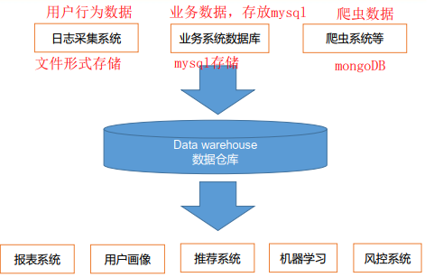
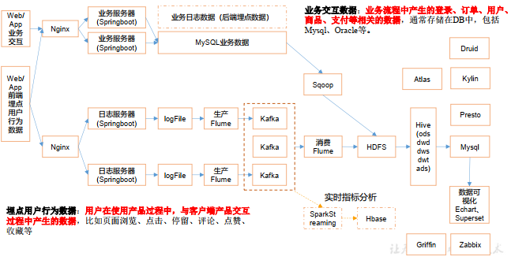
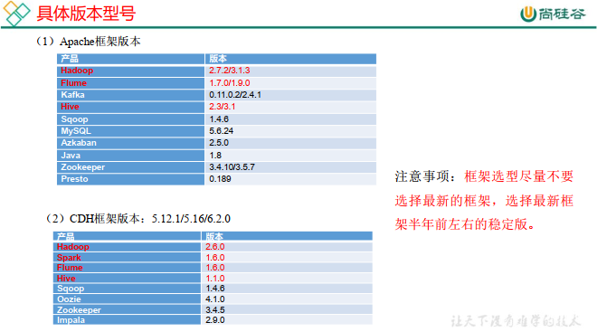
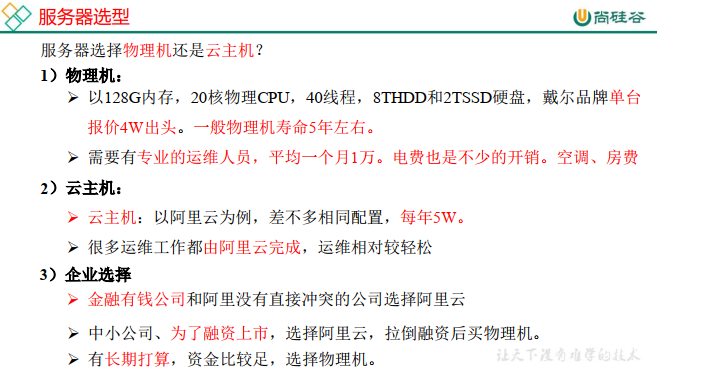
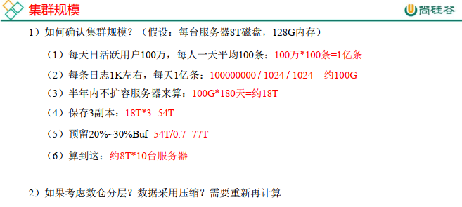

# 电商数仓（用户行为数据采集）  

## 数据仓库概念  

​		数据仓库（ Data Warehouse ） ，是*为企业所有决策制定过程，提供所有系统数据支持的战略集合*。通过对数据仓库中数据的分析，可以帮助企业，*改进业务流程、 控制成本、 提高产品质量等。*

​		数据仓库，并不是数据的最终目的地，而是为数据最终的目的地做好准备。这些准备包括对数据的：*清洗，转义，分类，重组，合并，拆分，统计等等。*

## 项目需求及架构设计

### 项目需求分析

一、 项目需求  

1、 用户行为数据采集平台搭建

2、 业务数据采集平台搭建  

3、 数据仓库维度建模  

4、 分析， 用户、 流量、 会员、 商品、 销售、 地区、 活动等电商核心主题， 统计的报表指标近100个。 完全对比中型公司。  

5、 采用即席查询工具， 随时进行指标分析  

6、 对集群性能进行监控， 发生异常需要报警。  

7、 元数据管理  

8、 质量监控  

二、 思考题  

1、 项目技术如何选型？  

2、 框架版本如何选型（Apache、 CDH、 HDP）  

3、 服务器使用物理机还是云主机？  

4、 如何确认集群规模？ （假设每台服务器8T硬盘）  

### 项目框架 

---

#### 技术选型  

技术选型主要考虑因素： 数据量大小、业务需求、行业内经验、技术成熟度、开发
维护成本、总成本预算  

- 数据采集传输： *Flume*， *Kafka*， *Sqoop*， Logstash， DataX，
-  数据存储：*MySql*， *HDFS*， HBase， Redis， MongoDB
- 数据计算：*Hive*，*Tez*，*Spark*， Flink， Storm
- 数据查询： *Presto*，*Druid*， Impala， Kylin
- 数据可视化： Echarts、*Superset*、 Tableau、 QuickBI、 DataV
- 任务调度：*Azkaban*、Oozie
- 集群监控：*Zabbix*
- 元数据管理：*Atlas*

#### 系统数据流程设计

#### 框架版本选型

1） 如何选择Apache/CDH/HDP版本？

1. Apache： 运维麻烦， 组件间兼容性需要自己调研。 （一般大厂使用， 技
    术实力雄厚， 有专业的运维人员） （建议使用）
2. CDH：国内使用最多的版本， 但CM不开源， 今年开始要收费， 一个节
    点1万美金。
3. HDP：开源， 可以进行二次开发， 但是没有CDH稳定， 国内使用较少  

#### 服务器选型

#### 集群资源规划设计

