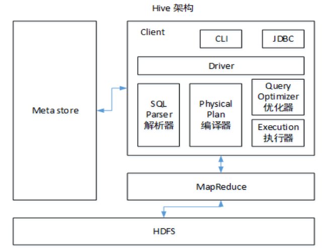

# 框架简单总结

## Linux

​    1、写出常用的5个高级命令
​        top/ps  iotop  tail  tar  df -h find  netstat   crontab
​    2、查看端口号、查看进程、查看磁盘使用情况  、配置定时器
​       netstat     ps -aux      df -h    crontab

二、Shell
    1、shell的工具（知道就行 17年京东爱问）
        awk、sed、sort、cut
    2、写过哪些shell脚本
        启动停止、分发

```shell
#!/bin/bash       
   case $1 in
    "start"){
    
    };;
    "stop"){
    
    };;        
    esac

```

3、如果进程我忘了进程号，不知道哪个是flume进程
      ps -ef |grep flume

三、Hadoop
    1、入门
        1）常用端口有哪些？(HR )
            hadoop3.x    9870   8088  19888  8020   50010
            hadoop2.x    50070

        2）安装hadoop需要配置哪些文件？4组成
            core-site.xml hdfs-site.xml yarn-site.xml mapred-site.xml
            workers（slaves）
    
    2、HDFS
        1）读写流程（笔试题）  10亿 
        
        2）默认块大小
           集群模式     128m
           本地模式     32m
           hadoop1.x    64m
           在业务开发是时候通常有：128m   256m一块的
           hive的文件块大小多大：256m
        
        3）小文件问题
            （1）危害
            namenode 内存 128g；
            一个文件块占用namenode 150字节
            128g*1024m*1024k*1024字节/150字节=9亿
            
            增加了切片数，maptask（1g）
            （2）解决办法
                a）har归档，自定义FileInputformat  seq  (k文件名称v内容)
                b）combineInputformat 减少切片个数，进而减少的是maptask
                c）开启JVM重用  60%
                开始
                    执行  3s
     
                    执行  3s
                结束
    3、MapReduce
        shuffle及优化 
        map方法之后，reduce方法之前，混洗过程
    
    4、YARN
        1）工作机制
        
        2）调度器
            （1）FIFO、容量、公平调度器
            Apache默认调度器：容量
            CDH默认调度器：公平调度器
           （2）FIFO调度器特点：
                单队列，先进先出，在企业开发中没人使用
            （3）容量调度器：
                支持多队列，先进来的任务优先享有资源
            （4）公平调度器
                支持多队列，每个任务公平享有资源  并发度最高。
            （5）在生产环境如何选择掉调度器
            对并发度要求比较高，同时机器性能比较好，选择公平； 大公司
            如果并发度不高，机器性能比较差，选择容量： 中小公司
            
            （6）在生产环境下队列怎么创建？
            容量调度器默认只有一个default队列；
            按照框架名称：hive、spark、flink
            按照业务名称：登录、购物车、支付模块、部门1、部门2  （居多）
            好处：解耦、降低风险、可以实现任务降级（部门1》部门2》购物车）
四、Flume 三件事
    1、组成（  source channel sink 2个事务）
        1）taildir source
            （1）断点续传、多目录
            （2）在Apache flume1.7之后产生的；如果是CDH，1.6之后；
            （3）自定义source实现断点续传的功能（只要能自定义，有很多想象空间了）
            （4）taildir source挂了怎么办？  不会丢失、可能产生数据重复
            （5）对重复数据怎么处理？
                不处理； 
                处理：（自身：自定义source实现事务，额外增加了运算量）
                    在下一级处理：hive的数仓里面（dwd层，数据清洗ETL）
                                spark Streaming里面处理
                    去重的手段：group by （id）   开窗（id）,只取窗口第一条
            （6）是否支持递归读取文件？
                不支持；自定义tail source(递归+读取)    消费kafka+上传hdfs
        2）channel
            （1）File Channel :基于磁盘、效率低、可靠性高

            （2）memoryChannel：基于内存、效率高、可靠性低
            
            （3）KafkaChannel：数据存储在Kafka里面，基于磁盘、效率高于memoryChannel+kafkasink,因为省了sink
                flume1.6时  topic + 内容； 无论true还是false都不起作用； bug
                flume1.7解决bug,被大家广泛使用；
            （4）在生产环境：如果下一级是kafka的话，优先选择KafkaChannel；
                如果不是kafka，如果更关心可靠性选择FileChannel；如果更关心性能，选择memoryChannel
        3）HDFS sink
            （1）控制小文件；
                时间（1-2小时）、大小（128m）、event个数(0禁止)
            （2）压缩
                开启压缩流；指定压缩编码方式（lzop/snappy）
    2、三个器
        1）拦截器
            (1)ETL（判断json的完整性 { }； 服务器时间（13  全数字）） 、
            (2)分类型（启动日志、事件日志） kafka（的topic要满足下一级所又消费者）  一张表一个topic
                商品列表、商品详情、商品点击
                广告
                点赞、评论、收藏
                后台活跃、通知
                故障
                启动日志
            (3)自定义拦截器步骤
                定义一个类  实现interceptor接口  
                重写4个方法：初始化、关闭、单event、多event（）
                创建一个静态内部类Builder
            （4）拦截器不要行不行？
                看需求
        
        2）选择器
            rep（默认）  mul（选择性发往下一级通道）
    
        3）监控器
            ganglia  发现尝试提交的次数 远远大于最终提交成功次数； 说明flume性能不行；
            
            自身；提高自己的内存 4-6g  flume_env.sh
            外援：增加flume台数  服务器配置（16g/32g  8T）
    3、优化
        1）File Channel   能多目录就多目录（要求在不同的磁盘），提高吞吐量
        2）控制小文件；
                时间（1-2小时）、大小（128m）、event个数(0禁止)
        3）监控器（百度、京东）
           自身；
           外援：
五、Kafka 24件事
    1、基本信息
        1）Kafka组成：zk里面存储broker信息  消费者信息  唯独没有生产者信息。
        2）搭建多少台Kafka：2（生产者峰值生产速率 * 副本/100）+1 =3 
            2 * ( 生产者峰值生产速率* 2/100)+1=3  =>生产者峰值生产速率<50m/s
            50m/s*60秒=3g 
        3）副本数：2个居多、3个
                好处：提高可靠性；坏处：增加了网络IO
        4）压测（生产者峰值生产速率）  消费速率
        5）默认数据保存多久
            7天=》生产环境；3天
        6）Kafka的磁盘预留多大空间
            100g数据*2个副本*3天/0.7=
        7）数据量计算
            100万日活 1个人100条日志  100万*100条=1亿条
            平均速度是的多少  1亿条/(24*3600s)=1150条/s
            每秒多少m  1条日志1k => 1m/s
            生产环境，你的数据量什么时候达到峰值？618  1111
            早上  中午、晚上  晚上8点以后  只要不超过50m/s就行  20-30m/s
        8）分区数设置多少？
            先设置一个分区；
            压测他的  峰值生产速率tp; 峰值消费速率tc
            用户有个期望的吞吐量 p 
            p/min(tp,tc)=分区数   P 100m/s   tp  20m/s   tc 30m/s
            100/20 = 5个分区   （3-10个）   
            消费者要有对应的CPU核数
        9）ISR  主要解决Leader挂了谁当老大？ 在ISR队列里面都有机会当老大；
            旧版：延迟时间和延迟条数； 新版：延迟时间
        10）分区分配策略
            range(默认)   容易导致数据倾斜
                10个  3个分区 
                    0 1  2 3 
                    4 5 6
                    7 8 9 
            round robin  能够减少数据倾斜
                hash 随机打散，再采用轮询的方式；
        11）监控Kafka
            eagle  Kafkamanager  Kafkamontor
            面试官 说 他们的自己写的监控器？

    2、挂了  重新启动
        短时间内数据进入flume channel
        长时间，日志服务器保存数据30天
    
    3、丢数
        ack = 
        0   ：发送过去数据，就不管了； 可靠性最差，传输效率是最快的
        1   ：发送过去数据，Leader应答； 可靠性一般；传输效率一般；
        -1  ：发送过去数据，Leader+follower应答； 可靠性最高；传输效率最低
        
        在生产环境，通常不会用0； 选择1的最多；
        在绝大多数场景都是传输的普通日志，都是效率至上；  配置1
        金融行业，和钱有关的行业，要选-1
       
    4、重复数据了
        幂等性+事务+  ack=-1
    	幂等性：单分区内部保证数据不重复
        下一级去重（hive的dwd层；sparksteaming）group by和开窗
        
        幂等性的是（单分区、会话内不重；Kafka重启容易数据重复）


​    
    5、积压了
        自身：增加分区，消费者CPU核数 
        外援：增加消费者消费速度  f  kafka   f  hdfs
                                            batchsize  1000条=>2000条-3000条
    
    6、优化
        num.network.threads 计算型任务线程数    CPU +1 =线程数
        num.io.threads      IO密集型任务线程数  CPU*2
    
    7、其他
        1）Kafka 高效读写数据
            （1）分布式模式、分区
            （2）顺序读写600m/s  100m/s
            （3）零拷贝技术
        2）1条日志大小  2m   传输过程会发生什么问题？
            默认为单条最大值是1M
        
        3）Kafka里面的数据过期了后的处理策略
            （1）压缩
            （2）删除
        4）Kafka可以按照时间消费数据
六、Zookeeper
    1、安装什么数台？ 奇数
    2、选举机制：半数机制  pax（今日头条）
    3、常用命令：ls  get create
    4、Zk不是越多越好也不是越少越好
        zk多好处：可靠性高；  坏处：通信延时加长了（选举）
        10台服务器安装多少台； 3台
        20台服务器安装多少台； 5台
        100台服务器安装多少台：11台
    
九、项目
    1、我的数据在文件中有一部分；还有一部分在mysql里面；
    2、mysql里面有27张表=》你来做数仓
    （全量都导入、今天新增、数据变化）
    

## Hive    

### hive的组成架构



- mr      基于磁盘（虽然慢但是总能将结果跑出来）    统计周、月、年，数据量比较大的场景 （7天）。             
- tez     基于内存    最快；数据量小的场景（OOM）
- spark   基于磁盘（Shuffle）+内存  绝大多数（主要处理`当天`的任务）
                         6.5 +0.5


### Hive与MySQL数据库的比较

|          | Hive       | MySQL        |
| -------- | ---------- | ------------ |
| 数据量   | 数据量大   | 数据量小     |
| 速度     | 大数据量快 | 小数据量快   |
| 常用功能 | 查询       | 增删改查     |
| 存储位置 | HDFS       | 本地文件系统 |


### 内部表和外部表的区别

内部表和外部表的区别主要体现在删除表的时候的不同。

内部表删除表时会删除元数据和原始数据。

外部表删除表时只会删除元数据。

在企业中，99%的表都是外部表，只有在**自己**使用的临时表，才会常见**内部表**。


### 4个By的使用和区别

1. Order By：全局排序，只有一个Reducer；

2. Sort By：分区内有序；
3. Distrbute By：类似MR中Partition，进行分区，结合sort by使用。
4.  Cluster By：当Distribute by和Sorts by字段相同时，可以使用Cluster by方式。Cluster by除了具有Distribute by的功能外还兼具Sort by的功能。但是排序只能是升序排序，不能指定排序规则为ASC或者DESC。

在生产环境中Order By用的比较少，容易导致OOM。

在生产环境中Sort By+ Distrbute By用的多。


### 系统函数

1. date_add、date_sub函数（加减日期）
2. next_day函数（周指标相关）
3. date_format函数（根据格式整理日期）

4. last_day函数（求当月最后一天日期）

5. collect_set函数
6. get_json_object解析json函数
7. NVL（表达式1，表达式2）：如果表达式1为空值，NVL返回值为表达式2的值，否则返回表达式1的值。


### 窗口函数

1. **Rank**

    （1）RANK() 排序相同时会重复，总数不会变

    （2）DENSE_RANK() 排序相同时会重复，总数会减少

    （3）ROW_NUMBER() 会根据顺序计算

2. **OVER()**：指定分析函数工作的数据窗口大小，这个数据窗口大小可能会随着行的变而变化

    （1）CURRENT ROW：当前行

    （2）n PRECEDING：往前n行数据

    （3） n FOLLOWING：往后n行数据

    （4）UNBOUNDED：起点，UNBOUNDED PRECEDING 表示从前面的起点， UNBOUNDED FOLLOWING表示到后面的终点

    （5） LAG(col,n)：往前第n行数据

    （6）LEAD(col,n)：往后第n行数据

    （7） NTILE(n)：把有序分区中的行分发到指定数据的组中，各个组有编号，编号从1开始，对于每一行，NTILE返回此行所属的组的编号。注意：n必须为int类型。

3. **手写TopN**


### 自定义UDTF,UDF


### Hive的优化


### Hive解决数据倾斜的方法


### Hive的分隔符


### Tex引擎的优点


### MySQL元数据的备份


### Union和Union all的区别


内部表和外部表区别？

元数据和原始数据


4. 4个By

    - order by：全局排序，只有一个reduce
    - sort by：排序，reducer内部排序
    - distribute by ：分区排序，结合sort by使用
    - cluster by：当distribute by和sorts by字段相同时，可以使用cluster by方式，只能升序。

    企业中怎么使用？

    使用最多的是distribute by 和sort by 。order by基本不使用（容易内存溢出OOM），cluster by 使用不多。

5. 函数

    - 系统函数

        日：date_add，date_sub

        周：

        月：

        年：

        

    - 自定义函数

    - 窗口函数

6. 


