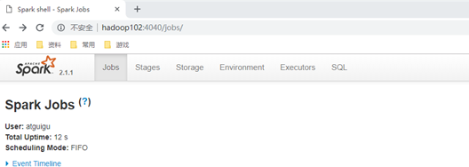

# Spark的安装配置

## 本地模式


1. 上传jar包，解压并重命名

```
[atguigu@hadoop102 sorfware]$ tar -zxvf spark-2.1.1-bin-hadoop2.7.tgz -C /opt/module/
[atguigu@hadoop102 module]$ mv spark-2.1.1-bin-hadoop2.7 spark-local
```

2. 官方求 PI 案例  

```
[atguigu@hadoop102 spark-local]$ bin/spark-submit \
--class org.apache.spark.examples.SparkPi \
--master local[2] \
./examples/jars/spark-examples_2.11-2.1.1.jar \
10
```

-  --class：表示要执行程序的主类；

- --master local[2]

    （1）local: 没有指定线程数，则所有计算都运行在一个线程当中，没有任何并行计算

    （2）local[K]:指定使用K个Core来运行计算，比如local[2]就是运行2个Core来执行

    （3）local[*]: 自动帮你按照CPU最多核来设置线程数。比如CPU有4核，Spark帮你自动设置4个线程计算。

- spark-examples_2.11-2.1.1.jar：要运行的程序；

- 10：要运行程序的输入参数（计算圆周率π的次数，计算次数越多，准确率越高）；

3. 结果展示

    该算法是利用蒙特·卡罗算法求PI

    

### 官方WordCount案例

1. 准备文件

    ```
    [atguigu@hadoop102 spark-local]$ mkdir input
    ```

    在input下创建2个文件==1.txt==和==2.txt==，并输入以下内容

    ```
    hello atguigu
    hello spark
    ```

2. 启动spark-shell

    ```
    [atguigu@hadoop102 spark-local]$ bin/spark-shell
    
    Using Spark's default log4j profile: org/apache/spark/log4j-defaults.properties
    Setting default log level to "WARN".
    To adjust logging level use sc.setLogLevel(newLevel). For SparkR, use setLogLevel(newLevel).
    18/09/29 08:50:52 WARN NativeCodeLoader: Unable to load native-hadoop library for your platform... using builtin-java classes where applicable
    18/09/29 08:50:58 WARN ObjectStore: Failed to get database global_temp, returning NoSuchObjectException
    Spark context Web UI available at http://192.168.9.102:4040
    Spark context available as 'sc' (master = local[*], app id = local-1538182253312).
    Spark session available as 'spark'.
    Welcome to
          ____              __
         / __/__  ___ _____/ /__
        _\ \/ _ \/ _ `/ __/  '_/
       /___/ .__/\_,_/_/ /_/\_\   version 2.1.1
          /_/
             
    Using Scala version 2.11.8 (Java HotSpot(TM) 64-Bit Server VM, Java 1.8.0_144)
    Type in expressions to have them evaluated.
    Type :help for more information.
    
    scala>
    ```

    注意：sc是SparkCore程序的入口；spark是SparkSQL程序入口；master = local[*]表示本地模式运行。

3. 再开启一个hadoop102远程连接窗口，发现了一个SparkSubmit进程

    ```
    [atguigu@hadoop102 spark-local]$ jps
    3627 SparkSubmit
    4047 Jps
    ```

    运行任务方式说明：spark-submit，是将jar上传到集群，执行Spark任务；spark-shell，相当于命令行工具，本身也是一个Application。

4. 登录hadoop102:4040，查看程序运行情况（注意：spark-shell窗口关闭掉，则hadoop102:4040页面关闭）

    

    说明：本地模式下，默认的调度器为FIFO。

5. 运行WordCount程序

    ```
    scala>sc.textFile("/opt/module/spark-local/input").flatMap(_.split(" ")).map((_,1)).reduceByKey(_+_).collect
    
    res0: Array[(String, Int)] = Array((hadoop,6), (oozie,3), (spark,3), (hive,3), (atguigu,3), (hbase,6))
    ```

    注意：只有collect开始执行时，才会加载数据。

**可登录hadoop102:4040查看程序运行结果**


##  Standalone模式

1. 集群规划

    |       | hadoop102      | hadoop103 | hadoop104 |
    | ----- | -------------- | --------- | --------- |
    | Spark | Master  Worker | Worker    | Worker    |

2. 再解压一份Spark安装包，并修改解压后的文件夹名称为spark-standalone

    ```
    [atguigu@hadoop102 sorfware]$ tar -zxvf spark-2.1.1-bin-hadoop2.7.tgz -C /opt/module/
    [atguigu@hadoop102 module]$ mv spark-2.1.1-bin-hadoop2.7 spark-standalone
    ```

    

3. 进入Spark的配置目录/opt/module/spark-standalone/conf

    ```
    [atguigu@hadoop102 spark-standalone]$ cd conf
    ```

4. 修改==slave==文件，添加work节点：

    ```
    [atguigu@hadoop102 conf]$ mv slaves.template slaves
    [atguigu@hadoop102 conf]$ vim slaves
    hadoop102
    hadoop103
    hadoop104
    ```

5. 修改==spark-env.sh==文件，添加master节点

    ```
    [atguigu@hadoop102 conf]$ mv spark-env.sh.template spark-env.sh
    [atguigu@hadoop102 conf]$ vim spark-env.sh
    
    SPARK_MASTER_HOST=hadoop102
    SPARK_MASTER_PORT=7077
    ```

6. 分发spark-standalone包

    ```
    [atguigu@hadoop102 module]$ xsync spark-standalone/
    ```

7. 启动spark集群

    ```
    [atguigu@hadoop102 spark-standalone]$ sbin/start-all.sh
    ```

查看三台服务器运行进程（xcall.sh是以前数仓项目里面讲的脚本）

```
[atguigu@hadoop102 spark-standalone]$ xcall.sh jps
```

```
==============atguigu@hadoop102================
3330 Jps
3238 Worker
3163 Master
================atguigu@hadoop103================
2966 Jps
2908 Worker
================atguigu@hadoop104================
2978 Worker
3036 Jps
```

**注意：**如果遇到 “JAVA_HOME not set” 异常，可以在sbin目录下的==spark-config.sh== 文件中加入如下配置：

```
export JAVA_HOME=XXXX
```

8. 网页查看：hadoop102:8080（master web的端口，相当于hadoop的9870端口）

    目前还看不到任何任务的执行信息。

9. 官方求PI案例

    ```
    [atguigu@hadoop102 spark-standalone]$ bin/spark-submit \
    --class org.apache.spark.examples.SparkPi \
    --master spark://hadoop102:7077 \
    ./examples/jars/spark-examples_2.11-2.1.1.jar \
    10
    ```

    参数：--master spark://hadoop102:7077指定要连接的集群的master

10. 页面查看[http://hadoop102:8080/，发现执行本次任务，默认采用三台服务器节点的总核数24](http://hadoop102:8080/，发现运行本次任务采用了24)核，每个节点内存1024M。

    **8080：master的webUI**

    **4040：application的webUI的端口号**

    

**参数说明**