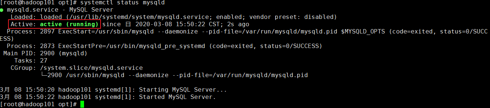

# MySQL高级

# 一、MySQL简介

## 1.什么是Mysql

l MySQL是一个关系型数据库管理系统，由瑞典MySQL AB公司开发，目前属于Oracle公司。 

l Mysql是开源的，可以定制的，采用了GPL协议，你可以修改源码来开发自己的Mysql系统。 

l MySQL使用标准的SQL数据语言形式。

l Mysql可以允许于多个系统上，并且支持多种语言。这些编程语言包括C、C++、Python、Java、Perl、PHP、Eiffel、Ruby和Tcl等。

l MySQL支持大型数据库，支持5000万条记录的数据仓库，32位系统表文件最大可支持4GB，64位系统支持最大的表文件为8TB。

## 2.Linux上MySQL的安装

### 2.1 检查当前系统是否安装过MySQL

CentOS 6 命令： rpm -qa|grep mysql  

默认 Linux 在安装的时候，自带了 mysql 相关的组件。  

执行卸载指令：rpm -e --nodeps mysql-libs  （忽略依赖关系）

CentOS 7 命令： rpm -qa|grep mariadb  

执行卸载指令：rpm -e --nodeps mariadb -libs

检查：rpm -qa | grep mariadb

### 2.2 MySQL的安装

安装的版本是 mysql 5.7， 官网下载地址： http://dev.mysql.com/downloads/mysql/  

1. 解压整合包：tar -xvf mysql-5.7.28-1.el7.x86_64.rpm-bundle.tar

2. 执行 rpm 安装，必须按照下面的顺序安装  

   rpm -ivh mysql-community-common-5.7.16-1.el7.x86_64.rpm

   rpm -ivh mysql-community-libs-5.7.16-1.el7.x86_64.rpm

   rpm -ivh mysql-community-client-5.7.16-1.el7.x86_64.rpm

   rpm -ivh mysql-community-server-5.7.16-1.el7.x86_64.rpm  

3. 查看是否安装成功： mysqladmin --version  

   

   或者也可以通过 rpm 命令来查看：  

   

4. mysql 服务的初始化  

   为了保证数据库目录为与文件的所有者为 mysql 登录用户，如果你是以 root 身份运行 mysql 服务，需要执行下面的命令初始化
   mysqld --initialize --user=mysql
   另外 --initialize 选项默认以“安全”模式来初始化，则会为 root 用户生成一个密码并将该密码标记为过期，登录后你需要设置一个新的密码
   查看密码： cat /var/log/mysqld.log  

   

5. 启动 MySQL 的服务  

   systemctl start mysqld  

6. 更新密码
   首次登陆通过 mysql -uroot -p 进行登录，在 Enter password：录入初始化密码  

   

   修改密码：
   ALTER USER 'root'@'localhost' IDENTIFIED BY '你的密码'; 

    

   设置完密码就可以用新密码登录，正常使用数据库了  

   

### 2.3 Mysql 服务  

#### 2.3.1 Mysql 服务自启状态

查看是否是开机自启： systemctl is-enabled mysqld  

默认是开机自启的  

查看启动状态： systemctl status mysqld  

#### 2.3.2 Mysql 的安装位置  

| 参数              | 路径                            | 解释                           | 备注                        |
| ----------------- | ------------------------------- | ------------------------------ | --------------------------- |
| --datadir         | /var/lib/mysql/                 | mysql 数据库文件的存放路径     |                             |
| --basedir         | /usr/bin                        | 相关命令目录                   | mysqladmin mysqldump 等命令 |
| --plugin-dir      | /usr/lib64/mysql/plugin         | mysql 插件存放路径             |                             |
| --log-error       | /var/lib/mysql/jack.atguigu.err | mysql 错误日志路径             |                             |
| --pid-file        | /var/lib/mysql/jack.atguigu.pid | 进程 pid 文件                  |                             |
| --socket          | /var/lib/mysql/mysql.sock       | 本地连接时用的 unix 套接字文件 |                             |
| /usr/share/mysql  | 配置文件目录                    | mysql 脚本及配置文件           |                             |
| /etc/init.d/mysql | 服务启停相关脚本                |                                |                             |

### 2.4 修改字符集  

#### 2.4.1 常用命令  

| SQL 语句                                         | 描述                               | 备注                                        |
| ------------------------------------------------ | ---------------------------------- | ------------------------------------------- |
| show databases                                   | 列出所有数据库                     |                                             |
| create database 库名                             | 创建一个数据库                     |                                             |
| create database 库名 character set utf8          | 创建数据库，顺便执行字符集为 utf-8 |                                             |
| show create database 库名                        | 查看数据库的字符集                 |                                             |
| show variables like '%char%'                     | 查询所有跟字符集相关的信息         |                                             |
| set [字符集属性]=utf8                            | 设置相应的属性为 utf8              | 只是临时修改，当前有效。服务重启后， 失效。 |
| alter database 库名 character set 'utf8'         | 修改数据库的字符集                 |                                             |
| alter table 表名 convert to character set 'utf8' | 修改表的字符集                     |                                             |

实验 SQL:  

| CREATE database mydb;                           |
| ----------------------------------------------- |
| CREATE table mytable(id int,name varchar(30));  |
| insert into mytable(id,name) values (1,'jack'); |
| insert into mytable(id,name) values (2,'张三')  |

#### 2.4.2 直接插入中文数据报错原因  

如果在建库建表的时候，没有明确指定字符集，则采用默认的字符集 latin1,其中是不包含中文字符的。 查看默认的编码字符集：  show variables like '%char%';

#### 2.4.3 永久修改  

修改配置文件：
vim /etc/my.cnf
在 mysqld 节点下最后加上中文字符集配置
character_set_server=utf8  

重新启动 mysql 服务后再次查看：  systemctl restart mysqld

注意：已经创建的数据库的设定不会发生变化，参数修改只对新建的数据库有效！  

#### 2.4.4 已生成的库表字符集如何变更  

修改数据库的字符集

alter database 数据库名 character set 'utf8';

修改数据表的字符集

alter table 表名 convert to character set 'utf8';  

# 二、MySql的用户和权限管理

## 1. Mysql的用户管理

### 1.1 相关命令

| 命令                                                         | 描述                                     | 备注                                                         |
| ------------------------------------------------------------ | ---------------------------------------- | ------------------------------------------------------------ |
| create user zhang3 identified by '123123';                   | 创建名称为zhang3的用户，密码设为123123； |                                                              |
| select host,user,password,select_priv,insert_priv,drop_priv  from mysql.user; | 查看用户和权限的相关信息                 |                                                              |
| set  password =password('123456')                            | 修改当前用户的密码                       |                                                              |
| update  mysql.user set password=password('123456') where user='li4'; | 修改其他用户的密码                       | 所有通过user表的修改，必须用flush privileges;命令才能生效    |
| update  mysql.user set user='li4' where user='wang5';        | 修改用户名                               | 所有通过user表的修改，必须用flush privileges;命令才能生效    |
| drop  user li4                                               | 删除用户                                 | 不要通过delete from user  u where user='li4' 进行删除，系统会有残留信息保留。 |

### 1.2 示例说明                               

**host** :表示连接类型

​    % 表示所有远程通过 TCP方式的连接

​    IP 地址 如 (192.168.1.2,127.0.0.1) 通过制定ip地址进行的TCP方式的连接

​    机器名  通过制定i网络中的机器名进行的TCP方式的连接

​    ::1  IPv6的本地ip地址 等同于IPv4的 127.0.0.1

​    localhost 本地方式通过命令行方式的连接 ，比如mysql -u xxx -p 123xxx 方式的连接。

 **user**:表示用户名

​    同一用户通过不同方式链接的权限是不一样的。

 **password**:密码

​    所有密码串通过 password(明文字符串) 生成的密文字符串。加密算法为MYSQLSHA1 ，不可逆 。

​    mysql 5.7 的密码保存到 authentication_string 字段中不再使用password 字段。

 **select_priv , insert_priv**等

为该用户所拥有的权限。

## 2. Mysql的权限管理

### 2.1 授予权限

| 命令                                                         | 描述                                                         |
| ------------------------------------------------------------ | ------------------------------------------------------------ |
| grant 权限1,权限2,…权限n  on 数据库名称.表名称 to 用户名@用户地址  identified by ‘连接口令’ | 该权限如果发现没有该用户，则会直接新建一个用户。  示例：  grant select,insert,delete,drop on atguigudb.* to  li4@localhost ;  给li4用户用本地命令行方式下，授予atguigudb这个库下的所有表的插删改查的权限。 |
| `grant  all privileges on *.* to root@'%'   identified by '123';  ` | 授予通过网络方式登录的的joe用户 ，对所有库所有表的全部权限，密码设为123. |

### 2.2 收回权限

| 命令                                                         | 描述                                | 备注 |
| ------------------------------------------------------------ | ----------------------------------- | ---- |
| show grants                                                  | 查看当前用户权限                    |      |
| revoke [权限1,权限2,…权限n]  on   库名.表名   from 用户名@用户地址 ; | 收回权限命令                        |      |
| REVOKE ALL PRIVILEGES ON mysql.* FROM joe@localhost;         | 收回全库全表的所有权限              |      |
| REVOKE select,insert,update,delete ON mysql.* FROM  joe@localhost; | 收回mysql库下的所有表的插删改查权限 |      |

权限收回后，必须用户重新登录后，才能生效。

**flush privileges;**  #所有通过user表的修改，必须用该命令才能生效。

### 2.3 使用远程工具连接MySQL

1)     关闭Linux的防火墙

2)     授权远程连接的用户和密码

3)     使用授权的账户和密码通过SQLyog或Navicat连接

# 三、索引优化分析

## 1. 索引的概念

### 1.1 是什么

MySQL官方对索引的定义为：索引（Index）是帮助MySQL高效获取数据的数据结构。可以得到索引的本质：索引是数据结构。可以简单理解为排好序的快速查找数据结构。

在数据之外，数据库系统还维护着满足特定查找算法的数据结构，这些数据结构以某种方式引用（指向）数据，这样就可以在这些数据结构上实现高级查找算法。这种数据结构，就是索引。下图就是一种可能的索引方式示例：                            

左边是数据表，一共有两列七条记录，最左边的是数据记录的物理地址。为了加快Col2的查找，可以维护一个右边所示的二叉查找树，每个节点分别包含索引键值和一个指向对应数据记录物理地址的指 针，这样就可以运用二叉查找在一定的复杂度内获取到相应数据，从而快速的检索出符合条件的记录。

一般来说索引本身也很大，不可能全部存储在内存中，因此索引往往以索引文件的形式存储的磁盘上。

### 1.2 优缺点

**优势**：

- 提高数据检索的效率，降低数据库的IO成本。
- 通过索引列对数据进行排序，降低数据排序的成本，降低了CPU的消耗。

 

**劣势**：

- 虽然索引大大提高了查询速度，同时却会降低更新表的速度，如对表进行INSERT、UPDATE和DELETE。因为更新表时，MySQL不仅要保存数据，还要保存一下索引文件每次更新添加了索引列的字段，都会调整因为更新所带来的键值变化后的索引信息。
- 实际上索引也是一张表，该表保存了主键与索引字段，并指向实体表的记录，所以索引列也是要占用空间的。

## 2. Mysql的索引

### 2.1 Btree索引

MySQL使用的是Btree索引。

​                               

【初始化介绍】 

一颗b树，白色的块我们称之为一个磁盘块，可以看到每个磁盘块包含几个数据项（紫色所示）和指针（蓝色所示），

如磁盘块1包含数据项17和35，包含指针P1、P2、P3，

P1表示小于17的磁盘块，P2表示在17和35之间的磁盘块，P3表示大于35的磁盘块。

【查找过程】

如果要查找数据项29，那么首先会把磁盘块1由磁盘加载到内存，此时发生一次IO，在内存中用二分查找确定29在17和35之间，锁定磁盘块1的P2指针，内存时间因为非常短（相比磁盘的IO）可以忽略不计，通过磁盘块1的P2指针的磁盘地址把磁盘块3由磁盘加载到内存，发生第二次IO，29在26和30之间，锁定磁盘块3的P2指针，通过指针加载磁盘块8到内存，发生第三次IO，同时内存中做二分查找找到29，结束查询，总计三次IO。

 

真实的情况是，3层的b+树可以表示上百万的数据，如果上百万的数据查找只需要三次IO，性能提高将是巨大的，如果没有索引，每个数据项都要发生一次IO，那么总共需要百万次的IO，显然成本非常非常高。

### 2.2 B+tree索引

 

B+Tree与B-Tree 的区别

　1）B-树的关键字、记录和索引是放在一起的；B+树的非叶子节点中只有关键字和指向下一个节点的索引，记录只放在叶子节点中。

　 2）在B-树中，越靠近根节点的记录查找时间越快，只要找到关键字即可确定记录的存在；而B+树中每个记录的查找时间基本是一样的，都需要从根节点走到叶子节点，而且在叶子节点中还要再比较关键字。从这个角度看B-树的性能好像要比B+树好，而在实际应用中却是B+树的性能要好些。因为B+树的非叶子节点不存放实际的数据，这样每个节点可容纳的元素个数比B-树多，树高比B-树小，这样带来的好处是减少磁盘访问次数。尽管B+树找到一个记录所需的比较次数要比B-树多，但是一次磁盘访问的时间相当于成百上千次内存比较的时间，因此实际中B+树的性能可能还会好些，而且B+树的叶子节点使用指针连接在一起，方便顺序遍历（例如查看一个目录下的所有文件，一个表中的所有记录等），这也是很多数据库和文件系统使用B+树的缘故。 

　

思考：为什么说B+树比B-树更适合实际应用中操作系统的文件索引和数据库索引？

1) B+树的磁盘读写代价更低 

　　B+树的内部结点并没有指向关键字具体信息的指针。因此其内部结点相对B 树更小。如果把所有同一内部结点的关键字存放在同一盘块中，那么盘块所能容纳的关键字数量也越多。一次性读入内存中的需要查找的关键字也就越多。相对来说IO读写次数也就降低了。 

2) B+树的查询效率更加稳定 

由于非终结点并不是最终指向文件内容的结点，而只是叶子结点中关键字的索引。所以任何关键字的查找必须走一条从根结点到叶子结点的路。所有关键字查询的路径长度相同，导致每一个数据的查询效率相当。

 

## 3. Mysql索引分类

### 3.1 单值索引

概念：即一个索引只包含单个列，一个表可以有多个单列索引

语法：

| 随表一起创建：                                               |
| ------------------------------------------------------------ |
| CREATE TABLE customer (id INT(10) UNSIGNED AUTO_INCREMENT ,customer_no VARCHAR(200),customer_name  VARCHAR(200),   PRIMARY  KEY(id),   KEY (customer_name)  ); |
| 单独建单值索引：                                             |
| CREATE INDEX  idx_customer_name ON customer(customer_name);  |

 

### 3.2 唯一索引

概念：索引列的值必须唯一，但允许有空值

| 随表一起创建：                                               |
| ------------------------------------------------------------ |
| CREATE TABLE customer (id INT(10) UNSIGNED AUTO_INCREMENT ,customer_no  VARCHAR(200),customer_name VARCHAR(200),   PRIMARY  KEY(id),   KEY  (customer_name),     UNIQUE (customer_no)  ); |
| 单独建唯一索引：                                             |
| CREATE UNIQUE INDEX idx_customer_no ON customer(customer_no); |

 

### 3.3 主键索引

概念：设定为主键后数据库会自动建立索引，innodb为聚簇索引

| 随表一起建索引                                               |
| ------------------------------------------------------------ |
| CREATE TABLE customer (id INT(10) UNSIGNED AUTO_INCREMENT ,customer_no  VARCHAR(200),customer_name VARCHAR(200),     PRIMARY KEY(id)   ); |
| 单独建主键索引：                                             |
| ALTER TABLE customer add PRIMARY  KEY customer(customer_no); |
| 删除建主键索引：                                             |
| ALTER TABLE customer drop PRIMARY KEY ;                      |
| 修改建主键索引：                                             |
| 必须先删除掉(drop)原索引，再新建(add)索引                    |

 

### 3.4 复合索引

概念：即一个索引包含多个列

| 随表一起建索引：                                             |
| ------------------------------------------------------------ |
| CREATE TABLE customer (id INT(10) UNSIGNED AUTO_INCREMENT ,customer_no  VARCHAR(200),customer_name VARCHAR(200),   PRIMARY  KEY(id),   KEY  (customer_name),     UNIQUE (customer_name),   KEY  (customer_no,customer_name)  ); |
| 单独建索引：                                                 |
| CREATE  INDEX idx_no_name ON  customer(customer_no,customer_name); |

 

### 3.5 基本语法

| 操作                                                         | 命令                                                         |
| ------------------------------------------------------------ | ------------------------------------------------------------ |
| 创建                                                         | CREATE [UNIQUE  ] INDEX [indexName] ON  table_name(column))  |
| 删除                                                         | DROP INDEX [indexName] ON mytable;                           |
| 查看                                                         | SHOW INDEX FROM table_name\G                                 |
| 使用Alter命令                                                | ALTER TABLE tbl_name ADD  PRIMARY KEY (column_list) : 该语句添加一个主键，这意味着索引值必须是唯一的，且不能为NULL。 |
| ALTER  TABLE tbl_name ADD PRIMARY KEY (column_list)          |                                                              |
| ALTER TABLE tbl_name ADD INDEX index_name  (column_list): 添加普通索引，索引值可出现多次。 |                                                              |
| ALTER  TABLE tbl_name ADD FULLTEXT index_name (column_list):该语句指定了索引为 FULLTEXT ，用于全文索引。 |                                                              |

## 4. 索引的创建时机

### 4.1 适合创建索引的情况

l 主键自动建立唯一索引；

l 频繁作为查询条件的字段应该创建索引

l 查询中与其它表关联的字段，外键关系建立索引

l 单键/组合索引的选择问题， 组合索引性价比更高

l 查询中排序的字段，排序字段若通过索引去访问将大大提高排序速度

l 查询中统计或者分组字段

### 4.2 不适合创建索引的情况

l 表记录太少

l 经常增删改的表或者字段

l Where条件里用不到的字段不创建索引

l 过滤性不好的不适合建索引

# 四、Explain性能分析

## 1. 概念

使用EXPLAIN关键字可以模拟优化器执行SQL查询语句，从而知道MySQL是如何处理你的SQL语句的。分析你的查询语句或是表结构的性能瓶颈。

用法： Explain+SQL语句。

Explain执行后返回的信息：

 

## 2. Explain准备工作

​     **插入****50****万条数据**

### 2.1 建表语句

CREATE TABLE `dept` (

 `id` INT(11) NOT NULL AUTO_INCREMENT,

 `deptName` VARCHAR(30) DEFAULT NULL,

 `address` VARCHAR(40) DEFAULT NULL,

 ceo INT NULL ,

 PRIMARY KEY (`id`)

) ENGINE=INNODB AUTO_INCREMENT=1 DEFAULT CHARSET=utf8;

CREATE TABLE `emp` (

 `id` INT(11) NOT NULL AUTO_INCREMENT,

 `empno` INT NOT NULL ,

 `name` VARCHAR(20) DEFAULT NULL,

 `age` INT(3) DEFAULT NULL,

 `deptId` INT(11) DEFAULT NULL,

 PRIMARY KEY (`id`)

 \#CONSTRAINT `fk_dept_id` FOREIGN KEY (`deptId`) REFERENCES `t_dept` (`id`)

) ENGINE=INNODB AUTO_INCREMENT=1 DEFAULT CHARSET=utf8;

### 2.2 设置参数

在执行创建函数之前，首先请保证log_bin_trust_function_creators参数为1，即on开启状态。

否则会报错：

 

查询：show variables like 'log_bin_trust_function_creators';

设置：set global log_bin_trust_function_creators=1;

​     当然，如上设置只存在于当前操作，想要永久生效，需要写入到配置文件中：

在[mysqld]中加上log_bin_trust_function_creators=1

### 2.3 编写随机函数

创建函数，保证每条数据都不同。

#### 2.3.1 随机产生字符串

DELIMITER $$

CREATE FUNCTION rand_string(n INT) RETURNS VARCHAR(255)

BEGIN  

DECLARE chars_str VARCHAR(100) DEFAULT 'abcdefghijklmnopqrstuvwxyzABCDEFJHIJKLMNOPQRSTUVWXYZ';

 DECLARE return_str VARCHAR(255) DEFAULT '';

 DECLARE i INT DEFAULT 0;

 WHILE i < n DO 

 SET return_str =CONCAT(return_str,SUBSTRING(chars_str,FLOOR(1+RAND()*52),1)); 

 SET i = i + 1;

 END WHILE;

 RETURN return_str;

END $$

 

如果要删除函数，则执行：drop function rand_string;

#### 2.3.2 随机产生部门编号

\#用于随机产生多少到多少的编号

DELIMITER $$

CREATE FUNCTION rand_num (from_num INT ,to_num INT) RETURNS INT(11)

BEGIN  

 DECLARE i INT DEFAULT 0; 

 SET i = FLOOR(from_num +RAND()*(to_num -from_num+1))  ;

RETURN i; 

 END$$

 

如果要删除函数：drop function rand_num;

### 2.4 创建存储过程

#### 2.4.1 创建往emp表中插入数据的存储过程

DELIMITER $$

CREATE PROCEDURE insert_emp( START INT , max_num INT )

BEGIN 

DECLARE i INT DEFAULT 0;  

\#set autocommit =0 把autocommit设置成0 

 SET autocommit = 0;  

 REPEAT 

 SET i = i + 1; 

 INSERT INTO emp (empno, NAME ,age ,deptid ) VALUES ((START+i) ,rand_string(6)  , rand_num(30,50),rand_num(1,10000)); 

 UNTIL i = max_num 

 END REPEAT; 

 COMMIT; 

 END$$ 

 

\#删除

\# DELIMITER ;

\# drop PROCEDURE insert_emp;

 

#### 2.4.2 创建往dept表中插入数据的存储过程

\#执行存储过程，往dept表添加随机数据

DELIMITER $$

CREATE PROCEDURE `insert_dept`( max_num INT )

BEGIN 

DECLARE i INT DEFAULT 0;  

 SET autocommit = 0;  

 REPEAT 

 SET i = i + 1; 

 INSERT INTO dept ( deptname,address,ceo ) VALUES (rand_string(8),rand_string(10),rand_num(1,500000)); 

 UNTIL i = max_num 

 END REPEAT; 

 COMMIT; 

 END$$

 

\#删除

\# DELIMITER ;

\# drop PROCEDURE insert_dept;

 

### 2.5 调用存储过程

#### 2.5.1 添加数据到部门表

\#执行存储过程，往dept表添加1万条数据

DELIMITER ;

CALL insert_dept(10000);

#### 2.5.2 添加数据到员工表

\#执行存储过程，往emp表添加50万条数据

DELIMITER ;

CALL insert_emp(100000,500000);

 

### 2.6 批量删除某个表上的所有索引

#### 2.6.1 删除索引的存储过程

DELIMITER $$

CREATE PROCEDURE `proc_drop_index`(dbname VARCHAR(200),tablename VARCHAR(200))

BEGIN

​    DECLARE done INT DEFAULT 0;

​    DECLARE ct INT DEFAULT 0;

​    DECLARE _index VARCHAR(200) DEFAULT '';

​    DECLARE _cur CURSOR FOR SELECT  index_name  FROM information_schema.STATISTICS  WHERE table_schema=dbname AND table_name=tablename AND seq_in_index=1 AND  index_name <>'PRIMARY' ;

​    DECLARE CONTINUE HANDLER FOR NOT FOUND set done=2 ;   

​    OPEN _cur;

​    FETCH  _cur INTO _index;

​    WHILE _index<>'' DO 

​        SET @str = CONCAT("drop index ",_index," on ",tablename ); 

​        PREPARE sql_str FROM @str ;

​        EXECUTE sql_str;

​        DEALLOCATE PREPARE sql_str;

​        SET _index=''; 

​        FETCH  _cur INTO _index; 

​    END WHILE;

  CLOSE _cur;

  END$$

 

#### 2.6.2 执行存储过程

调用：CALL proc_drop_index("dbname","tablename");

 

# 五、单表使用索引及常见的索引失效的情况

## 1. 全值匹配我最爱

### 1.1 有以下SQL语句

 EXPLAIN SELECT SQL_NO_CACHE * FROM emp WHERE emp.age=30 

 EXPLAIN SELECT SQL_NO_CACHE * FROM emp WHERE emp.age=30 and deptid=4

 EXPLAIN SELECT SQL_NO_CACHE * FROM emp WHERE emp.age=30 and deptid=4 AND emp.name = 'abcd' 

 

### 1.2 建立索引

CREATE INDEX idx_age_deptid_name ON emp(age,deptid,NAME);

 

结论：全职匹配我最爱指的是，查询的字段按照顺序在索引中都可以匹配到！

 

 

SQL中查询字段的顺序，跟使用索引中字段的顺序，没有关系。优化器会在不影响SQL执行结果的前提下，给你自动地优化。

 

## 2. 最佳左前缀法则

 

查询字段与索引字段顺序的不同会导致，索引无法充分使用，甚至索引失效！

原因：使用复合索引，需要遵循最佳左前缀法则，即如果索引了多列，要遵守最左前缀法则。指的是查询从索引的最左前列开始并且不跳过索引中的列。

**结论：过滤条件要使用索引必须按照索引建立时的顺序，依次满足，一旦跳过某个字段，索引后面的字段都无法被使用。**

## 3. 不要在索引列上做任何操作

不在索引列上做任何操作（计算、函数、(自动or手动)类型转换），会导致索引失效而转向全表扫描。

### 3.1 在查询列上使用了函数

EXPLAIN SELECT SQL_NO_CACHE * FROM emp WHERE age=30;

EXPLAIN SELECT SQL_NO_CACHE * FROM emp WHERE LEFT(age,3)=30;

 

 

结论：等号左边无计算！

### 3.2 在查询列上做了转换

| create index idx_name on emp(name);                         |
| ----------------------------------------------------------- |
| explain select sql_no_cache * from emp where  name='30000'; |
| explain select sql_no_cache * from emp where name=30000;    |

字符串不加单引号，则会在name列上做一次转换！

 

​     结论：等号右边无转换！

## 4. 索引列上有范围查询时，范围条件右边的列将失效

| explain SELECT SQL_NO_CACHE * FROM emp WHERE emp.age=30  and deptid=5 AND emp.name = 'abcd'; |
| ------------------------------------------------------------ |
| explain SELECT SQL_NO_CACHE * FROM emp WHERE emp.age=30  and deptid<5 AND emp.name = 'abcd'; |

 

 

 

建议：将可能做范围查询的字段的索引顺序放在最后

## 5. 使用不等于(!= 或者<>)的时候索引失效

​     mysql 在使用不等于(!= 或者<>)时，有时会无法使用索引会导致全表扫描。

 

 

## 6. is not null 不能使用索引，is null可以使用索引

 

当字段允许为Null的条件下：

 

 is not null用不到索引，is null可以用到索引。

## 7. like以通配符%或_开头索引失效

 

​     前缀不能出现模糊匹配！

## 8. 字符串不加单引号索引失效

 

## 9. 减少使用or

 

 

使用union all或者union来替代：

 

## 10. 尽量使用覆盖索引

​     即查询列和索引列一致，不要写select *!

| explain SELECT  SQL_NO_CACHE * FROM emp WHERE emp.age=30   and deptId=4 and name='XamgXt'; |
| ------------------------------------------------------------ |
| explain SELECT SQL_NO_CACHE age,deptId,name FROM emp WHERE emp.age=30 and deptId=4 and name='XamgXt'; |

 

 

**覆盖索引**是select的数据列只用从索引中就能够取得，不必读取数据行，换句话说查询列要被所建的索引覆盖

 

## 11. 练习

假设index(a,b,c)；

| **Where****语句**                                       | **索引是否被使用**                                           |
| ------------------------------------------------------- | ------------------------------------------------------------ |
| where a = 3                                             | Y,使用到a                                                    |
| where a = 3 and b = 5                                   | Y,使用到a，b                                                 |
| where a = 3 and b = 5  and c = 4                        | Y,使用到a,b,c                                                |
| where b = 3 或者 where b = 3 and c = 4 或者 where c = 4 | N                                                            |
| where a = 3 and c = 5                                   | 使用到a， 但是c不可以，b中间断了                             |
| where a = 3 and b  > 4 and c = 5                        | 使用到a和b， c不能用在范围之后，b断了                        |
| where a is null and b  is not null                      | is null 支持索引 但是is not null 不支持,所以 a 可以使用索引,但是 b不可以使用 |
| where a <>  3                                           | 不能使用索引                                                 |
| where  abs(a) =3                                        | 不能使用 索引                                                |
| where a = 3 and b  like 'kk%' and c = 4                 | Y,使用到a,b,c                                                |
| where a = 3 and b  like '%kk' and c = 4                 | Y,只用到a                                                    |
| where a = 3 and b  like '%kk%' and c = 4                | Y,只用到a                                                    |
| where a = 3 and b  like 'k%kk%' and c = 4               | Y,使用到a,b,c                                                |

 