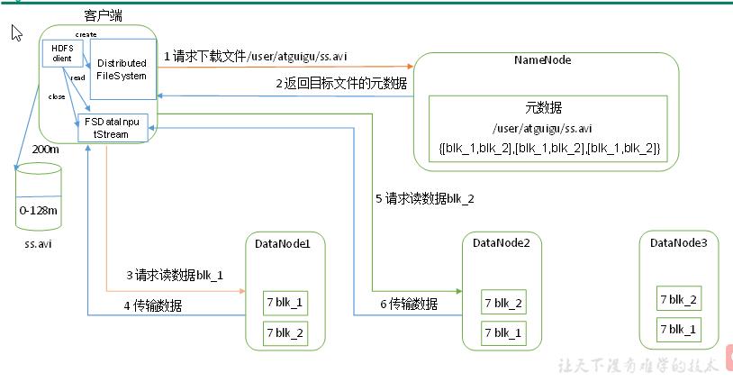
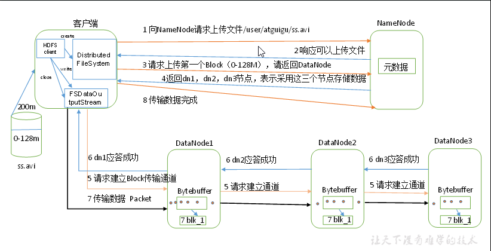

# Hadoop面试题总结

## 1 hadoop常用端口号

|                    | hadoop2.x | hadoop3.x |
| ------------------ | --------- | --------- |
| 访问HDFS端口       | 50070     | 9870      |
| 访问MR执行情况端口 | 8088      | 8088      |
| 历史服务器         | 19888     | 19888     |
| 客户端访问集群端口 | 9000      | 8020      |

## 2 Hadoop配置文件以及简单的Hadoop集群搭建

（1）配置文件：

​		Hadoop2.x core-site.xml、hdfs-site.xml、mapred-site.xml、yarn-site.xml slaves

​		Hadoop3.x core-site.xml、hdfs-site.xml、mapred-site.xml、yarn-site.xml workers

（2）简单的集群搭建过程：

  		 JDK安装

​		配置SSH免密登录

​		配置hadoop核心文件: 

​		格式化namenode

## 3 HDFS读流程和写流程

**HDFS的读数据流程**

**HDFS的写数据流程**

## 4 HDFS小文件处理

1）会有什么影响

   （1）1个文件块，占用namenode多大内存150字节，小文件过多会占用NameNode的内存，并且会产生很多的索引文件，索引文件多大，使得索引速度变慢。

1亿个小文件*150字节

1 个文件块 * 150字节

128G能存储多少文件块？  128  * 1024 * 1024 * 1024 byte/150字节 = 9亿文件块

2）怎么解决

（1）Hadoop Archivc 是一个高效地将小文件放入HDFS块中的文件存档工具，它能够将多个小文件打包成一个HAR文件，这样就减少了NameNode的内存使用。

使用方法：

①把/user/atguigu/input 目录里面的所有文件归档成一个叫input.har 的归档文件，并把归档后文件存储到/user/atguigu/output 路径下。

`[atguigu@hadoop102 hadoop-2.7.2]$ bin/hadoop archive - archiveName input.har –p /user/atguigu/input /user/atguigu/output`

（2）采用CombineTextInputFormat，或自定义

（3）有小文件场景开启JVM重用；如果没有小文件，不要开启JVM重用，因为会一直占用使用到的task卡槽，直到任务完成才释放。

JVM重用可以使得JVM实例在同一个job中重新使用N次，N的值可以在Hadoop的mapred-site.xml文件中进行配置。通常在10-20之间

 

  mapreduce.job.jvm.numtasks

  10

  How many tasks to run per jvm,if set to -1 ,there is   

  no limit

## 5 Shuffle过程

**MapReduce详细工作流程(一)**

**MapReduce详细工作流程(二)**

**2、优化**

1）Map阶段

（1）增大环形缓冲区大小。由100m扩大到200m

（2）增大环形缓冲区溢写的比例。由80%扩大到90%

（3）减少对溢写文件的merge次数。（10个文件，一次20个merge）

（4）不影响实际业务的前提下，采用Combiner提前合并，减少 I/O。

2）Reduce阶段

（1）合理设置Map和Reduce数：两个都不能设置太少，也不能设置太多。太少，会导致Task等待，延长处理时间；太多，会导致 Map、Reduce任务间竞争资源，造成处理超时等错误。

（2）设置Map、Reduce共存：调整slowstart.completedmaps参数，使Map运行到一定程度后，Reduce也开始运行，减少Reduce的等待时间。

（3）规避使用Reduce，因为Reduce在用于连接数据集的时候将会产生大量的网络消耗。

（4）增加每个Reduce去Map中拿数据的并行数

（5）集群性能可以的前提下，增大Reduce端存储数据内存的大小。

3）IO传输

采用数据压缩的方式，减少网络IO的的时间。安装Snappy和LZOP压缩编码器。

压缩：

（1）map输入端主要考虑数据量大小和切片，支持切片的有Bzip2、LZO。注意：LZO要想支持切片必须创建索引；

（2）map输出端主要考虑速度，速度快的snappy、LZO；

（3）reduce输出端主要看具体需求，例如作为下一个mr输入需要考虑切片，永久保存考虑压缩率比较大的gzip。

4）整体

（1）NodeManager默认内存8G，需要根据服务器实际配置灵活调整，例如128G内存，配置为100G内存左右，yarn.nodemanager.resource.memory-mb。

（2）单任务默认内存8G，需要根据该任务的数据量灵活调整，例如128m数据，配置1G内存，yarn.scheduler.maximum-allocation-mb。

（3）mapreduce.map.memory.mb ：控制分配给MapTask内存上限，如果超过会kill掉进程（报：Container is running beyond physical memory limits. Current usage:565MB of512MB physical memory used；Killing Container）。默认内存大小为1G，如果数据量是128m，正常不需要调整内存；如果数据量大于128m，可以增加MapTask内存，最大可以增加到4-5g。

（4）mapreduce.reduce.memory.mb：控制分配给ReduceTask内存上限。默认内存大小为1G，如果数据量是128m，正常不需要调整内存；如果数据量大于128m，可以增加ReduceTask内存大小为4-5g。

（5）mapreduce.map.java.opts：控制MapTask堆内存大小。（如果内存不够，报：java.lang.OutOfMemoryError）

（6）mapreduce.reduce.java.opts：控制ReduceTask堆内存大小。（如果内存不够，报：java.lang.OutOfMemoryError）

（7）可以增加MapTask的CPU核数，增加ReduceTask的CPU核数

（8）增加每个Container的CPU核数和内存大小

（9）在hdfs-site.xml文件中配置多目录

（10）NameNode有一个工作线程池，用来处理不同DataNode的并发心跳以及客户端并发的元数据操作。dfs.namenode.handler.count=20 * log2(Cluster Size)，比如集群规模为10台时，此参数设置为60。