[TOC]

#### 01、Hadoop常用端口号

|                    | hadoop2.x | Hadoop3.x |
| ------------------ | --------- | --------- |
| 访问HDFS端口       | 50070     | 9870      |
| 访问MR执行情况端口 | 8088      | 8088      |
| 历史服务器         | 19888     | 19888     |
| 客户端访问集群端口 | 9000      | 8020      |


#### 02、Hadoop配置文件以及简单的Hadoop集群搭建

（1）配置文件：

Hadoop2.x core-site.xml、hdfs-site.xml、mapred-site.xml、yarn-site.xml  slaves

Hadoop3.x core-site.xml、hdfs-site.xml、mapred-site.xml、yarn-site.xml  workers

（2）简单的集群搭建过程：

​    JDK安装

配置SSH免密登录

配置hadoop核心文件: 

格式化namenode


#### 03、HDFS读流程和写流程

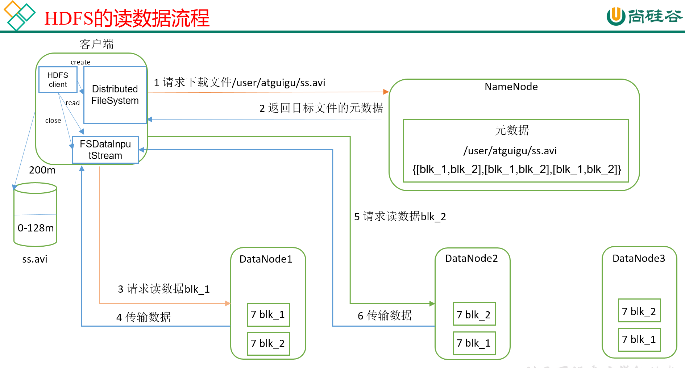

（1） 客户端通过 Distributed FileSystem 模块向 NameNode 请求上传文件， NameNode 检查目标文件是否已存在，父目录是否存在。

（2） NameNode 返回是否可以上传。

（3） 客户端请求第一个 Block 上传到哪几个 DataNode 服务器上。

（4） NameNode 返回 3 个 DataNode 节点， 分别为 dn1、 dn2、 dn3。

（5） 客户端通过 FSDataOutputStream 模块请求 dn1 上传数据， dn1 收到请求会继续调用dn2，然后 dn2 调用 dn3，将这个通信管道建立完成。

（6） dn1、 dn2、 dn3 逐级应答客户端。

（7）客户端开始往 dn1 上传第一个 Block（先从磁盘读取数据放到一个本地内存缓存），以 Packet 为单位， dn1 收到一个 Packet 就会传给 dn2， dn2 传给 dn3； dn1 每传一个 packet会放入一个应答队列等待应答。

（8） 当一个 Block 传输完成之后，客户端再次请求 NameNode 上传第二个 Block 的服务器。（重复执行 3-7 步）。  

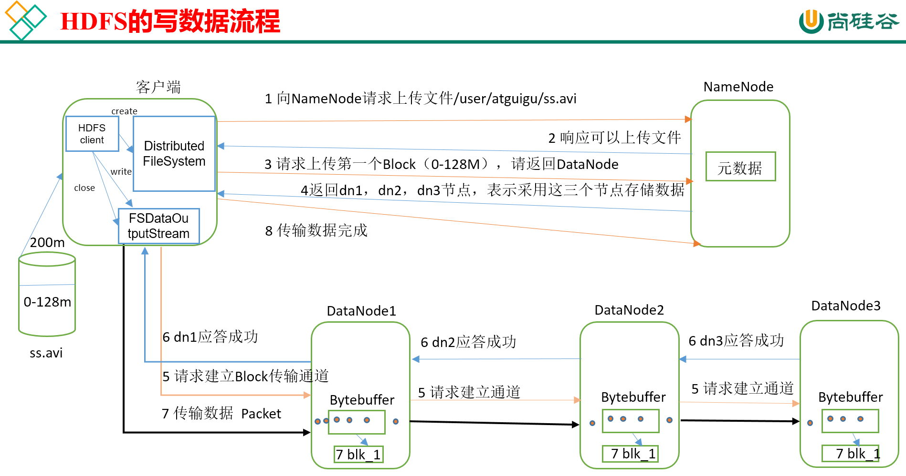

（1） 客户端通过 Distributed FileSystem 向 NameNode 请求下载文件， NameNode 通过查询元数据，找到文件块所在的 DataNode 地址。

（2） 挑选一台 DataNode（就近原则，然后随机）服务器，请求读取数据。

（3） DataNode 开始传输数据给客户端（从磁盘里面读取数据输入流，以 Packet 为单位来做校验）。  

（4） 客户端以 Packet 为单位接收，先在本地缓存，然后写入目标文件。  、


#### NN 和 2NN 工作机制  

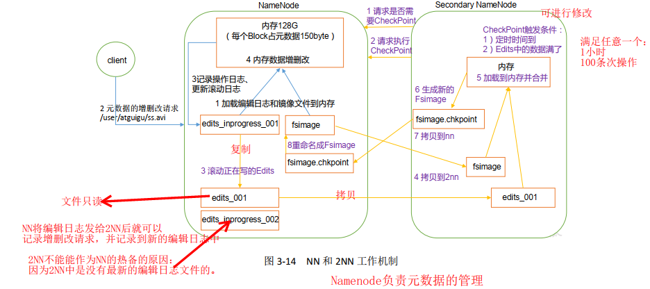

上图工作过程：

1. 第一阶段： NameNode 启动

    （1）第一次启动 NameNode 格式化后， 创建 Fsimage 和 Edits 文件。如果不是第一次启动，直接加载编辑日志和镜像文件到内存。

    （2） 客户端对元数据进行增删改的请求。

    （3） NameNode 记录操作日志，更新滚动日志。

    （4） NameNode 在内存中对数据进行增删改。

2. 第二阶段： Secondary NameNode 工作
    （1） Secondary NameNode 询问 NameNode 是否需要 CheckPoint。 直接带回 NameNode是否检查结果。

    （2） Secondary NameNode 请求执行 CheckPoint。

    （3） NameNode 滚动正在写的 Edits 日志。

    （4）将滚动前的编辑日志和镜像文件拷贝到 Secondary NameNode。

    （5） Secondary NameNode 加载编辑日志和镜像文件到内存，并合并。

    （6） 生成新的镜像文件 fsimage.chkpoint。

    （7） 拷贝 fsimage.chkpoint 到 NameNode。

    （8） NameNode 将 fsimage.chkpoint 重新命名成 fsimage。  

**详解**

Fsimage： NameNode 内存中元数据序列化后形成的文件，用于记录元数据的状态。 

Edits： 记录客户端更新元数据信息的每一步操作（可通过 Edits 运算出元数据） 。

​		 NameNode启动时，先滚动Edits并生成一个空的edits.inprogress，然后加载Edits和Fsimage 到内存中，此时 NameNode 内存就持有最新的元数据信息。 Client 开始对 NameNode 发送元数据的增删改的请求，这些请求的操作首先会被记录到 edits.inprogress 中（查询元数据的操作不会被记录在 Edits 中，因为查询操作不会更改元数据信息），如果此时 NameNode 挂掉，重启后会从 Edits 中读取元数据的信息。然后，NN会在内存中执行元数据 的增删改的操作。 由于 Edits 中记录的操作会越来越多， Edits文件会越来越大，导致 NameNode 在启动加载 Edits 时会很慢，所以需要对 Edits 和 Fsimage 进行合并（所谓合并，就是将 Edits 和 Fsimage 加载到内存中，照着 Edits 中的操作一步步执行，最终形成新的 Fsimage）。 

​		SecondaryNameNode 的作用就是帮助 NameNode 进行 Edits 和 Fsimage 的合并工作。 SecondaryNameNode 首先会询问 NameNode 是否需要 CheckPoint（触发 CheckPoint 需要 满足两个条件中的任意一个，定时时间到和 Edits 中数据写满了)。 直接带回 NameNode 是否检查结果。2NN 执行 CheckPoint 操作，首先会让 NameNode 滚动 Edits 并生成一个空的edit.inpropress, 滚动 Edits 的目的是给 Edits 打个标记，以后所有新的操 作都写入 edits.inprogress，其他未合并的 Edits 和 Fsimage 会拷贝到 2NN的本地，然后将拷贝的 Edits 和 Fsimage 加载到内存中进行合并，生成 fsimage.chkpoint， 然后将 fsimage.chkpoint 拷贝给 NameNode，重命名为 Fsimage 后替换掉原来的 Fsimage。 NameNode 在启动时就只需要加载之前未合并的 Edits 和 Fsimage 即可，因为合并过的 Edits 中的元数据信息已经被记录在 Fsimage 中。

#### 04、HDFS小文件处理

1）会有什么影响

​    （1）1个文件块，占用namenode多大内存150字节

1亿个小文件*150字节 

1 个文件块 * 150字节

128G能存储多少文件块？  128 * 1024*1024*1024byte/150字节 = 9亿文件块

2）怎么解决

（1）采用har归档方式，将小文件归档

（2）采用CombineTextInputFormat

（3）有小文件场景开启JVM重用；如果没有小文件，不要开启JVM重用，因为会一直占用使用到的task卡槽，直到任务完成才释放。

JVM重用可以使得JVM实例在同一个job中重新使用N次，N的值可以在Hadoop的mapred-site.xml文件中进行配置。通常在10-20之间

```xml
<property>
    <name>mapreduce.job.jvm.numtasks</name>
    <value>10</value>
    <description>
        How many tasks to run per jvm,if set to -1 ,there is no limit
    </description>
</property>  
```


#### 05、Shuffle及优化


###### 5.1、Shuffle过程

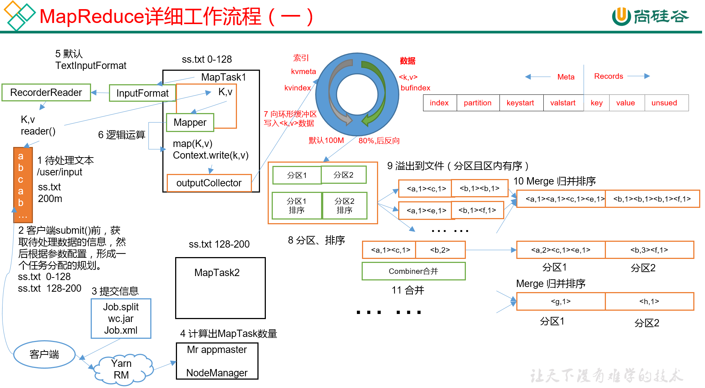

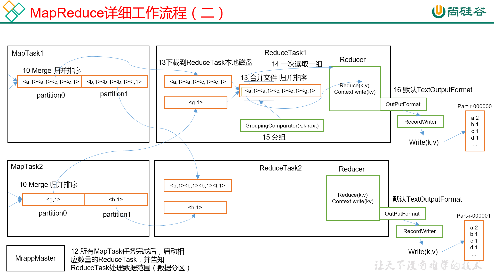


###### 5.2、优化

> （1）Map阶段

（1）增大环形缓冲区大小。由100m扩大到200m

（2）增大环形缓冲区溢写的比例。由80%扩大到90%

（3）减少对溢写文件的merge次数。（10个文件，一次20个merge）

（4）不影响实际业务的前提下，采用Combiner提前合并，减少 I/O。

> （2）Reduce阶段

（1）合理设置Map和Reduce数：两个都不能设置太少，也不能设置太多。太少，会导致Task等待，延长处理时间；太多，会导致 Map、Reduce任务间竞争资源，造成处理超时等错误。

（2）设置Map、Reduce共存：调整slowstart.completedmaps参数，使Map运行到一定程度后，Reduce也开始运行，减少Reduce的等待时间。

（3）规避使用Reduce，因为Reduce在用于连接数据集的时候将会产生大量的网络消耗。

（4）增加每个Reduce去Map中拿数据的并行数

（5）集群性能可以的前提下，增大Reduce端存储数据内存的大小。 

> （3）IO传输

采用数据压缩的方式，减少网络IO的的时间。安装Snappy和LZOP压缩编码器。

压缩：

（1）map输入端主要考虑数据量大小和切片，支持切片的有Bzip2、LZO。注意：LZO要想支持切片必须创建索引；

（2）map输出端主要考虑速度，速度快的snappy、LZO；

（3）reduce输出端主要看具体需求，例如作为下一个mr输入需要考虑切片，永久保存考虑压缩率比较大的gzip。

> （4）整体

（1）NodeManager默认内存8G，需要根据服务器实际配置灵活调整，例如128G内存，配置为100G内存左右，yarn.nodemanager.resource.memory-mb。

（2）单任务默认内存8G，需要根据该任务的数据量灵活调整，例如128m数据，配置1G内存，yarn.scheduler.maximum-allocation-mb。

（3）mapreduce.map.memory.mb ：控制分配给MapTask内存上限，如果超过会kill掉进程（报：Container is running beyond physical memory limits. Current usage:565MB of512MB physical memory used；Killing Container）。默认内存大小为1G，如果数据量是128m，正常不需要调整内存；如果数据量大于128m，可以增加MapTask内存，最大可以增加到4-5g。

（4）mapreduce.reduce.memory.mb：控制分配给ReduceTask内存上限。默认内存大小为1G，如果数据量是128m，正常不需要调整内存；如果数据量大于128m，可以增加ReduceTask内存大小为4-5g。

（5）mapreduce.map.java.opts：控制MapTask堆内存大小。（如果内存不够，报：java.lang.OutOfMemoryError）

（6）mapreduce.reduce.java.opts：控制ReduceTask堆内存大小。（如果内存不够，报：java.lang.OutOfMemoryError）

（7）可以增加MapTask的CPU核数，增加ReduceTask的CPU核数

（8）增加每个Container的CPU核数和内存大小

（9）在hdfs-site.xml文件中配置多目录 

（10）NameNode有一个工作线程池，用来处理不同DataNode的并发心跳以及客户端并发的元数据操作。dfs.namenode.handler.count=20 * log2(Cluster Size)，比如集群规模为10台时，此参数设置为60。


#### 06、Yarn 工作机制

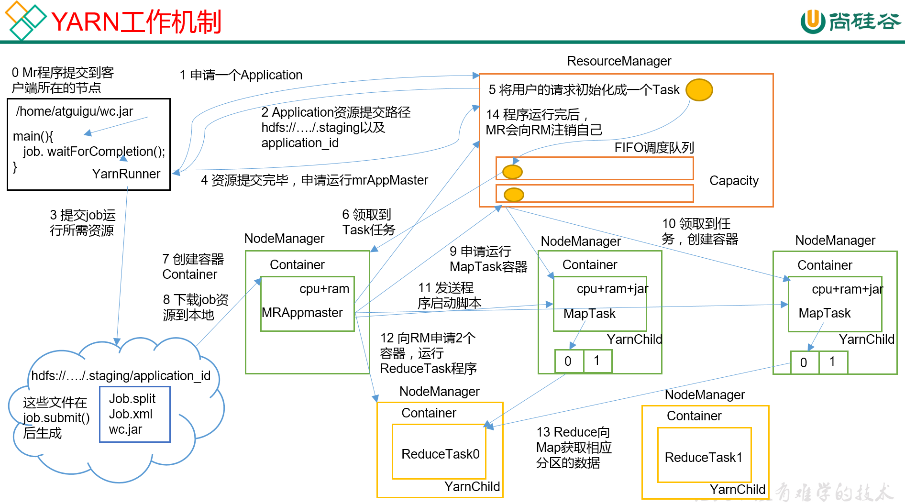


#### 07、 Yarn调度器

1）Hadoop调度器重要分为三类：

FIFO 、Capacity Scheduler（容量调度器）和Fair Sceduler（公平调度器）。

Apache默认的资源调度器是容量调度器；

CDH默认的资源调度器是公平调度器。

2）区别：

FIFO调度器：支持单队列 、先进先出  生产环境不会用。

容量调度器：支持多队列，保证先进入的任务优先执行。

公平调度器：支持多队列，保证每个任务公平享有队列资源。

3）在生产环境下怎么选择？

   大厂：如果对并发度要求比较高，选择公平，要求服务器性能必须OK；

   中小公司，集群服务器资源不太充裕选择容量。


4）在生产环境怎么创建队列？

（1）调度器默认就1个default队列，不能满足生产要求。

   （2）按照框架：hive /spark/ flink 每个框架的任务放入指定的队列（企业用的不是特别多）

（3）按照业务模块：登录注册、购物车、下单、业务部门1、业务部门2

5）创建多队列的好处？

（1）因为担心员工不小心，写递归死循环代码，把所有资源全部耗尽。

（2）实现任务的降级使用，特殊时期保证重要的任务队列资源充足。

业务部门1（重要）=》业务部门2（比较重要）=》下单（一般）=》购物车（一般）=》登录注册（次要）


#### 08、项目经验之基准测试

搭建完Hadoop集群后需要对HDFS读写性能和MR计算能力测试。测试jar包在hadoop的share文件夹下。


#### 09、Hadoop宕机

1）如果MR造成系统宕机。此时要控制Yarn同时运行的任务数，和每个任务申请的最大内存。调整参数：yarn.scheduler.maximum-allocation-mb（单个任务可申请的最多物理内存量，默认是8192MB）

2）如果写入文件过快造成NameNode宕机。那么调高Kafka的存储大小，控制从Kafka到HDFS的写入速度。例如，可以调整Flume每批次拉取数据量的大小参数batchsize。。


#### 10、Hadoop解决数据倾斜方法

1. **提前在map进行combine，减少传输的数据量**

在Mapper加上combiner相当于提前进行reduce，即把一个Mapper中的相同key进行了聚合，减少shuffle过程中传输的数据量，以及Reducer端的计算量。

如果导致数据倾斜的key大量分布在不同的mapper的时候，这种方法就不是很有效了。

2. **导致数据倾斜的key大量分布在不同的mapper**

（1）局部聚合加全局聚合。

第一次在map阶段对那些导致了数据倾斜的key 加上1到n的随机前缀，这样本来相同的key 也会被分到多个Reducer中进行局部聚合，数量就会大大降低。

第二次mapreduce，去掉key的随机前缀，进行全局聚合。

思想：二次mr，第一次将key随机散列到不同reducer进行处理达到负载均衡目的。第二次再根据去掉key的随机前缀，按原key进行reduce处理。

这个方法进行两次mapreduce，性能稍差。

（2）增加Reducer，提升并行度
 JobConf.setNumReduceTasks(int)

（3）实现自定义分区

根据数据分布情况，自定义散列函数，将key均匀分配到不同Reducer


#### 11、集群资源分配参数（项目中遇到的问题）

集群有30台机器，跑mr任务的时候发现5个map任务全都分配到了同一台机器上，这个可能是由于什么原因导致的吗？

解决方案：yarn.scheduler.fair.assignmultiple 这个参数 默认是开的，需要关掉

https://blog.csdn.net/leone911/article/details/51605172


#### 12、yarn执行一个任务用了多少core


#### 13下列哪个程序通常与 NameNode 在一个节点启动？

a) SecondaryNameNode	 b) DataNode	 c) TaskTracker	 d) Jobtracker

答案	D
分析：
hadoop的集群是基于master/slave模式，namenode和jobtracker属于master，datanode和tasktracker属于slave，master只有一个，而slave有多个

SecondaryNameNode内存需求和NameNode在一个数量级上，所以通常secondary NameNode（运行在单独的物理机器上）和NameNode运行在不同的机器上。
JobTracker和TaskTracker
JobTracker 对应于 NameNode
TaskTracker 对应于 DataNode
DataNode 和NameNode 是针对数据存放来而言的
JobTracker和TaskTracker是对于MapReduce执行而言的

mapreduce中几个主要概念，mapreduce整体上可以分为这么几条执行线索：
jobclient，JobTracker与TaskTracker。
1、JobClient会在用户端通过JobClient类将应用已经配置参数打包成jar文件存储到hdfs，
并把路径提交到Jobtracker,然后由JobTracker创建每一个Task（即MapTask和ReduceTask）
并将它们分发到各个TaskTracker服务中去执行
2、JobTracker是一个master服务，软件启动之后JobTracker接收Job，负责调度Job的每一个子任务task运行于TaskTracker上，
并监控它们，如果发现有失败的task就重新运行它。一般情况应该把JobTracker部署在单独的机器上。
3、TaskTracker是运行在多个节点上的slaver服务。TaskTracker主动与JobTracker通信，接收作业，并负责直接执行每一个任务。
TaskTracker都需要运行在HDFS的DataNode上

#### 14、Hadoop的瓶颈

Hadoop集群最大的瓶颈可以说是Namenode节点的服务器性能。还有以下：

1. 磁盘IO（个人观点）当我们面临集群作战的时候，我们所希望的是即读即得。可是面对大数据，读取数据需要经过IO，这里可以把IO理解为水的管道。管道越大越强，我们对于T级的数据读取就越快。所以IO的好坏，直接影响了集群对于数据的处理。

2. 迭代计算。一个Job四次心跳，再快也要十几秒，跑个几万迭代的玩意，就得等上几小时。
3. MapReduce。
4. 节点间的有限的带宽资源，集群的各个节点之间通过网络相连，节点之间有限的带宽资源往往成为整个系统的性能瓶颈。

#### 15. 下列哪项通常是集群的最主要瓶颈

a) CPU  	b) 网络	 c) 磁盘IO 	d) 内存

答案：C磁盘
首先集群的目的是为了节省成本，用廉价的pc机，取代小型机及大型机。小型机和大型机有什么特点？

1.cpu处理能力强
2.内存够大
所以集群的瓶颈不可能是a和d
3.如果是互联网有瓶颈，可以让集群搭建内网。 每次写入数据都要通过网络（集群是内网），然后还要写3份数据，所以IO就会打折扣。

#### 16、Reduce的3个阶段，Reduce百分之90+，又降下去，反复几次是什么原因，怎么解决


#### 17、map一直百分之90多，之后报错，是什么原因，怎么解决


#### 16、3个表关联，写下大概的mr过程


#### 17、当你使用hdfs作为作为状态后端时，它是怎么将状态存进去的，是直接存的吗


#### 18、Hadoop的进程的启动顺序？

1. 启动zookeeper进程：zkServer.sh start

    启动命令：cd .../zookeeper-3.4.5/bin/

    　　./zkServer.sh start

2. 启动journalnode 

    Hadoop中为了两个NameNode的数据同步，会使用journalnode的独立进程相互通信，必须至少3个节点。个数为奇数个。

    启动命令：cd .../hadoop-2.7.1/sbin/

    　　　　　　hadoop-daemon.sh start joournalnode

3. 启动hdfs

    start-dfs.sh

4. 启动yarn

    start-yarn.sh


#### Hadoop 实操：

1）har归档 自定义Inputformat将小文件存储成SequenceFile文件

2）采用ConbinFileInputFormat来作为输入，解决输入端大量小文件场景

3）对于大量小文件Job，可以开启JVM重用


#### Hadoop启动的时候都有哪些进程？

NameNode，DataNode，ResourceManager，NodeManager，JournalNode，DFSZKFailoverController等

#### \10. namenode、datanode、secondnamenode怎么协作的？

**默认1小时，100w条checkpoint**

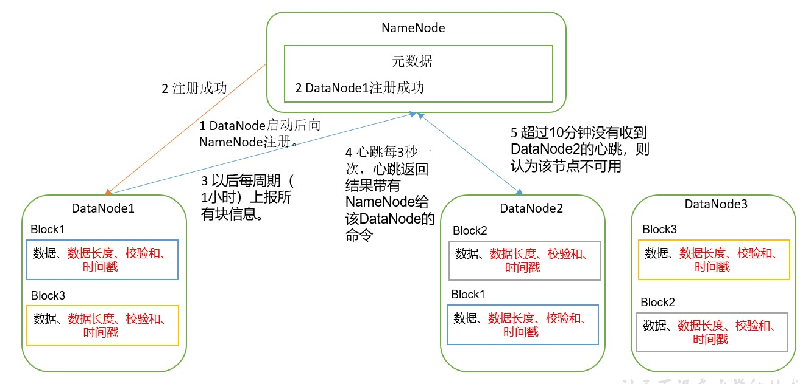

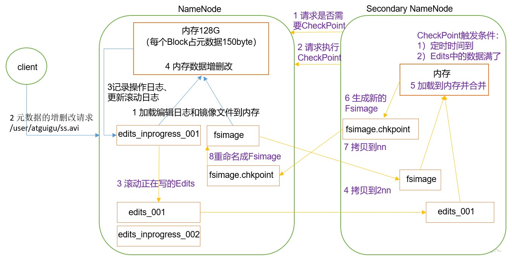


#### Hadoop是自己搭的吗，用的什么版本？hadoop、flume、kafka、sqoop、spark版本号


#### 8、你了解的hadoop生态圈的框架，及其大概在怎样的一个位置？

1. Sqoop：Sqoop是一款开源数据传输的工具，主用于Hadoop，Hive与传统数据库（MySQL）间进行数据的传输。能够将一个关系型数据库中的数据导到Hadoop的HDFS中，也可以将HDFS中的数据导到关系型数据库中。
2. Flume：Flume是一个高可用，高可靠的，分布式的海量日志采集，聚合和传输的系统。Flume 支持在日志系统中定制各类数据发送方，用于收集数据；同时， Flume提供对数据进行简单处理，并写到各种数据接受方（可定制）的能力。
3. Kafka：Kafka 是一种分布式基于发布/订阅模式的消息队列，主要用于大数据实时处理领域。
4. Spark：Spark是目前最流行的大数据内存计算框架，能够基于Hadoop存储的大数据进行计算。
5. Oozie：一个管理Hadoop中job的工作流程调度的管理系统。
6. Azkaban：同Oozie的作用一样。
7. Zookeeper：Zookeeper是一个针对分布式系统的可靠协调系统。能够提供：配置维护，统一的命名服务，分布式同步等服务。
8. Hive：Hive是一种数据仓库工具。能够将结构化的数据文件映射成数据库表，并提供了简单地SQL查询语句。能够将SQL语句转化为MapReduce任务进行。优点是学习成本低，十分适合数据仓库的统计分析。
9. HBase：HBase是一种面向列存储的数据库。适合存储非结构化的数据。能够做到亿级数据秒级查询。

#### 1、MapReduce中reduce总是在执行到99%是卡住什么情况怎么解决

集群提交MapReduce作业执行卡住问题原因：

可能防火墙没关；

集群某个进程没启来；

可能在Reduce类中使用了String；

可能内存不够用；

就是你说的数据倾斜造成的；

Reduce个数不够；

hadoop 的 job 的 timeout 过短。


#### HDFS常用端口号？HDFS配置文件？默认几个副本？块大小？

2.x   50070 19888 9000 8088
3.x   9870  19888 8020 8088 

---

2.x   core-site.xml   hdfs-site.xml

yarn-site.xml  mapred-site.xml

hadoop-env.sh

yarn-env.sh

mapred-env.sh 

slaves  不能有空格、空行

3.x   workers  不能有空格、空行

---

3个

---

2.x 128
2.x  本地模式  32m
1.x  64m
在大企业，服务器性能比较好，传输速度快   256m
hive默认块  256m


#### HDFS 中小文件有什么危害？有什么防护措施

1. 容易吧namenode内存给撑满了  
                   （任何一个文件块，都会占用nn  150字节）
                               128g内存的nn  能存储多少文件块
               128g * 1024m * 1024kb * 1024字节  /150字节 =约 9亿

2. 默认按照文件块个数  启动maptask
               会导致开启多个maptask   服务器内存不够；

    2）防护措施
               （1）采用har归档   
               （2）combineTextInputformat  减少切片的个数  进而减少maptask
               （3） JVM
                   开始 3s
                       干活  2s

   ​						干活  2s
   ​       			 结束  3s

```xml
<property>
    <name>mapreduce.job.jvm.numtasks</name>
    <value>10</value>
    <description>How many tasks to run per jvm,if set to -1 ,there is  no limit</description>
</property> 
```


#### 3、MapReduce中Shuffle及其优化

​        map方法之后 reduce方法之前；混洗过程


#### 4、yarn工作机制


（1） MR 程序提交到客户端所在的节点。
（2） YarnRunner 向 ResourceManager 申请一个 Application。
（3） RM 将该应用程序的资源路径返回给 YarnRunner。
（4）该程序将运行所需资源提交到 HDFS 上。
（5）程序资源提交完毕后，申请运行 mrAppMaster。
（6） RM 将用户的请求初始化成一个 Task。
（7）其中一个 NodeManager 领取到 Task 任务。
（8）该 NodeManager 创建容器 Container， 并产生 MRAppmaster。
（9） Container 从 HDFS 上拷贝资源到本地。
（10） MRAppmaster 向 RM 申请运行 MapTask 资源。
（11） RM 将运行 MapTask 任务分配给另外两个 NodeManager， 另两个 NodeManager 分
别领取任务并创建容器。
（12） MR 向两个接收到任务的 NodeManager 发送程序启动脚本， 这两个 NodeManager
分别启动 MapTask， MapTask 对数据分区排序。
（13）MrAppMaster 等待所有 MapTask 运行完毕后，向 RM 申请容器， 运行 ReduceTask。
（14） ReduceTask 向 MapTask 获取相应分区的数据。
（15）程序运行完毕后， MR 会向 RM 申请注销自己。  

#### yarn调度器有几种？默认调度器有几种？各个调度器原理？在生产环境怎么选？在生产环境我们要配置多个队列

1. fifo、容量、公平

2. Apache  容量；

   CDH    公平；

3. FIFO调度器：    先进先出；  支持单队列   在生产环境不使用

   容量调度器： 支持多队列、由多个FIFO调度器组成；

   公平调度器：  支持多队列、每个任务公平享有队列资源

4. 看企业对并发度的要求： 

   并发度要求比较高、集群性能OK，公平

   并发度要求不高、集群性能一般 ，容量

5. 容量调度器为例：
   默认只有一个default队列

   * 按照框架分：hive、spark、flink
   * 按照业务模块分：
     订单模块、登录注册、支付模块、物流模块

   解耦、处理这种刚入职的实习生，提交代码，把整个集群资源耗尽


#### 5、mapreduce过程

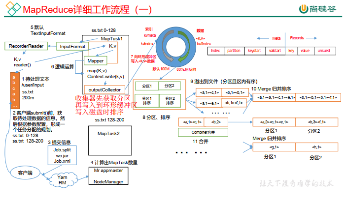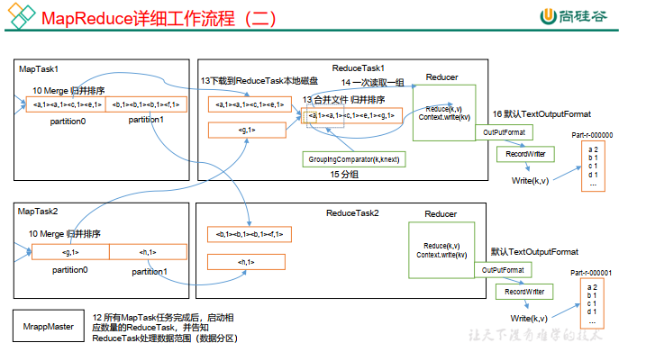

1. 一个待处理的文件，在客户端提交之前，会去先获取待处理数据的信息，然后根据参数配置形成一个任务的分配规划，这里指的就是切片过程，获取切片信息。
2. 提交信息，信息包括：Job.split,wcjar,Job.xml
3. 提交完信息后有YARN控制，YARN调用ResourceManager，ResourceManager会去创建一个MR APPmaster，一个job的管理者。MR APPmaster根据切片信息计算MapTask的个数。并开启MapTask。
4. **Map阶段**：启动完MapTask后，就要去读取数据，通过默认的TextInputFormat（一行一行的读，可以自定义）去待处理的文件中读取数据，读取出一个个的Key/value。将获取的数据给Mapper，在map()的方法中对数据进行处理然后写出。收集器会先获取分区信息，再将数据写入到环形缓冲区（内存中）。
5. **收集阶段**：收集器将数据写出到环形缓冲区（默认大小100M），右侧写数据，左侧写索引（元数据），元数据值的是kv的存储位置，起始位置，长度等数据，当数据写到80%时，对数据进行分区排序。
6. **溢写阶段**：将分区，区内有序的数据溢写到文件中。
7. **Combine**：归并阶段，将分好区的文件归并排序。
8. 当所有的MapTask结束后，然后进入ReduceTask阶段。
9. **Copy阶段**：ReduceTask 从各个 MapTask 上远程拷贝一片数据，并针对某一片数据，如果其大小超过一定阈值，则写到磁盘上，否则直接放到内存中。  
10. **Merge 阶段**：在远程拷贝数据的同时， ReduceTask 启动了两个后台线程对内存和磁盘上的文件进行合并，以防止内存使用过多或磁盘上文件过多。 
11. **sort阶段** ：Sort 阶段：按照 MapReduce 语义，用户编写 reduce()函数输入数据是按 key 进行聚集的一组数据。 为了将 key 相同的数据聚在一起， Hadoop 采用了基于排序的策略。由于各个 MapTask 已经实现对自己的处理结果进行了局部排序，因此， ReduceTask 只需对所有数据进行一次归并排序即可。  
12. **Reduce 阶段**： reduce()函数将计算结果写到 HDFS 上。  


#### 自己写过mapreduce吗？怎么写的？

写过

最简单的MapReduce代码只有3个类，分别是一个继承Mapper的类，一个继承Reducer的类和一个Driver类

Mapper类中默认通过TextInputFormat类去读取一行数据。在map()方法中对数据进行处理，然后将处理好的数据提交，写入到Reduce阶段

Reducer类中获取Mapper类传过来相同key的数据，对数据进行合并，然后将数据输出。

Driver类获取配置，封装job，设置map和reducer类，设置map阶段的输出数据的类型，最终输出的数据类型，设置输入输出路径，提交job。

以上为最简单MR程序，其中map获取数据方式还有FileInputFormat切片机制，CombineTextInputFormat 切片机制，也支持自定义。Reduce输出数据的方式默认为文本输出TextOutputFormat，还可以使用SequenceFileOutputFormat输出作为后续的MR任务的输入。也支持自定义。

#### shuffle源码？其中reduce的分区是怎么设置的，针对每个key，怎么把它放到对应的分区中？

```java
public class HashPartitioner<K, V> extends Partitioner<K, V> {
    public int getPartition(K key, V value, int numReduceTasks) {
        return (key.hashCode() & Integer.MAX_VALUE) % numReduceTasks;
    }
}
```

默认分区是根据key的hashCode对ReduceTasks个数取模得到的。 用户没法控制哪个key存储到哪个分区。  

用户可以自定义分区，需要自定义类继承Partitioner类，重写getPartition()方法，还需要在驱动类中设置自定义分区，和相应的ReduceTask的数量。

#### 2.说一下HA的原理，它们是怎么通信的，以及怎么读写的

HA中解决了hadoop原有的单点故障的问题。

HA中可也有多个NameNode同时工作，但是只有一个作为ActiveNameNode,其他的NameNode作为StandbyNameNode节点，当主ANN故障时，Hadoop集群将备用的SNN切换为主节点。使用Zookeeper集群监控主备节点的健康状态。Zookeeper有一定的选举机制来帮助我们确定主从关系。

HA中将日志文件单独的存储在QJM共享存储系统中。NameNode通过共享存储系统实现日志数据同步。ANN产生日志文件的时候，就会将日志数据发送到JournalNode的集群上，JournalNode集群不要求所有的jn节点都接收到日志吗，只要有半数以上的（n/2+1）节点接受收到日志，那么本条日志就生效，SNN会每隔一段时间就去JN上获取最新的日志文件。

#### HDFS如果DN都出现故障的话，你的客户端反应的情况是什么样子的？

DN全部都出现故障的话，NN会与所有的DN失去连接，集群不会对外服务，客户端无法连接到集群。

#### HDFS的数据丢失会出现在哪个时间点？

当操作日志写入大NN内存中时，NN宕机了，我们只能怪依靠2NN恢复数据，且可能造成数据的丢失。

#### hdfs小文件解决方案，

1. 采用har归档方式，将小数据进行归档

2. 采用CombineTextInputFormat

3. 开启JVM重用。如果没有小文件，不要开启 JVM 重用，因为会一
    直占用使用到的 task 卡槽，直到任务完成才释放。 

    JVM 重用可以使得 JVM 实例在同一个 job 中重新使用 N 次， N 的值可以在 Hadoop 的
    mapred-site.xml 文件中进行配置。通常在 10-20 之间 

    ```xml
    <property>
    <name>mapreduce.job.jvm.numtasks</name>
    <value>10</value>
    <description>How many tasks to run per jvm,if set to - 1 ,there is no limit</description>
    </property>
    ```

     

#### 以中小型公司为例，公司每天要从mysql导入多少业务数据到hdfs中？

几十万-百万条


#### hdfs主节点宕机后怎么解决？（如果已经配置了HA呢？）       

未配置高可用。只配置了一个NameNode，那么只能重启NameNode

配置了高可用，当主节点宕机后，会在配置的StandbyNameNode节点中选取出一个新的ActiveNameNode，将其装换为ANN，成为新的主节点。

#### 介绍一下hadoop? hdfs  yarn  mapreduce

Hadoop是一个分布式系统基础结构，主要用于解决大数据的存储和分析计算的问题。通常我们说的hadoop指的是Hadoop这个生态圈。这个生态圈中有着很多的组件，能够帮我们对数据进行处理。生态圈结构大致如图

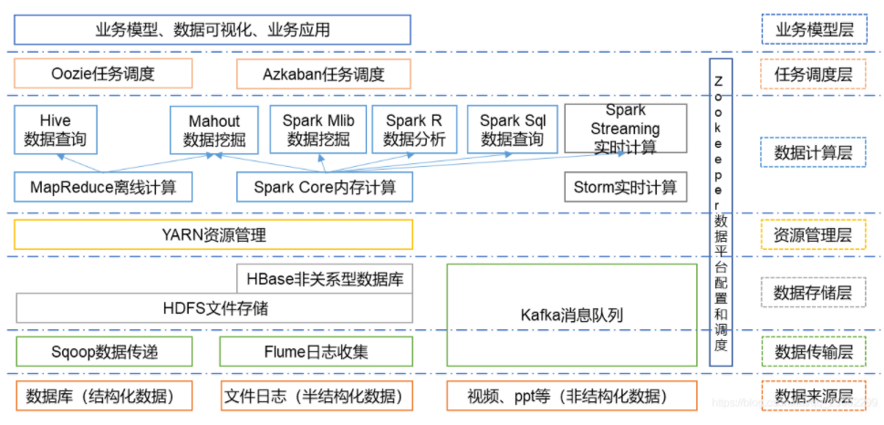

Hadoop的核心组件是HDFS，MapReduce和Yarn。

HDFS是一种分布式的文件管理系统，能够管理多台机器上的文件，适用于一次写入多次读出的场景，且不支持文件的修改。HDFS适合处理大数据量，文件规模也相当之大，并且可以构建在廉价服务器上，同时保存多个副本。

MapReduce是一个分布式的编程框架，核心功能是将用户编写的业务逻辑代码和自带默认组件整合成一个完整的分布式运算程序，并运行在一个Hadoop集群上。优点是使用简单，只需编写简单地代码，可以通过增加服务器来扩展计算能力，适合处理大数据量。缺点是慢，不适合实时计算。

Yarn是负责为运算程序提供服务器运算资源，相当于一个分布式的操作系统平台。

#### HDFS的四大机制? 两大核心？

四大机制：心跳机制   安全机制   机架策略  负载均衡      

两大核心：文件上传  文件下载


#### 你们yarn的资源分配   并且yarn有几个队列  我说两个感觉不对

根据项目实际情况回答。

#### 小文件过多都有什么影响？

答：占用yarn内存，占用namenode内存


#### yarn的调度器，具体讲解一下如何工作的?

fifo  容量  公平

fifo只支持单队列，先进的先出，有较大的的缺陷。

容量调度器支持多队列，每个队列采用FIFO调度策略并增加了一些特点。适用于并发度不高，集群性能不高的使用场景。

公平调度器支持多个队列，同一队列的作业按照其优先级分享整个队列的资源并发执行，每个作业可以设置最小的资源值，调度器会保证作业获得其以上的资源。适用于并发度要求高，集群性高的场景。


#### 请说一下mapreduce 的shuffle阶段?

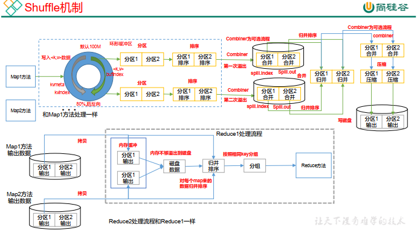

Shuffle 过程详解， 如下：

（1） MapTask 收集我们的 map()方法输出的 kv 对，放到内存缓冲区中

（2） 从内存缓冲区不断溢出本地磁盘文件，可能会溢出多个文件

（3） 多个溢出文件会被合并成大的溢出文件

（4） 在溢出过程及合并的过程中，都要调用 Partitioner 进行分区和针对 key 进行排序

（5） ReduceTask 根据自己的分区号，去各个 MapTask 机器上取相应的结果分区数据

（6） ReduceTask 会取到同一个分区的来自不同 MapTask 的结果文件， ReduceTask 会将这些文件再进行合并（归并排序）

（7） 合并成大文件后， Shuffle 的过程也就结束了，后面进入 ReduceTask 的逻辑运算过程（从文件中取出一个一个的键值对 Group，调用用户自定义的 reduce()方法）。

#### MapReduce全流程，要求说出具体类，源码级别


#### 那HA的zookeeper节点类型是哪一种呢？

ANN在zookeeper上会生成两个节，一个临时节点和一个持久节点。

#### 讲一下hadoop的心跳机制?  nn 跟  dn 心跳连接  nn通过心跳来判断dn是否还活着

当主节点NN启动时会开启一个RPC server，workers(DN)启动时进行连接主节点，并每隔3秒钟主动向master发送一个“心跳”，将自己的状态信息告诉主节点NN，然后主节点NN通过这个心跳的返回值，向DN节点传达指令。当超过10分30秒，NN没有收到DN的心跳，NN则认为该DN不可用。将其定性为“dead node”，NN会检查dead node中的副本数据，复制到其他的DN中。


#### 算法题，100万数据，需要对他进行排序，讲讲你的实现思路

hadoop手写mr


#### hadoop的map端的一个分区数据如果有大量的重复，怎么去重？


#### （4）详解Hadoop的WordCount


#### （6）百度不用Spark，只用Hadoop和MapReduce（至少这个部门是这样，这个部门的主要业务是做用户画像），把MapReduce工作的各个阶段过程吃透


#### （7）是否看过Hadoop源码


#### （7）请列出正常工作的hadoop集群中hadoop都分别需要启动哪些进程，他们的作用分别是什么，尽可能写的全面些

zookeeper

JournalNode

hdfs

yarn


#### （2）About hadoop map/reduce，The right answer is？ C

A.reduce的数量必须大于零

B.reduce总是在所有map完成之后再执行

C.combiner过程实际也是reduce 过程

D.Mapper的数量由输入的文件个数决定


#### （1）对Hadoop各组件之间通信RPC协议了解


#### （3）然后看着简历说你知道HDFS的存储过程，我说需不需要我说一下

然后我就把海哥hadoop存储过程那几个图给他说了一遍


#### （6）列出几个配置文件优化Hadoop，怎么做数据平衡？列出步骤

数据压缩的配置文件


#### （6）你了解的Hadoop生态圈的框架，及其大概在怎样的一个位置？