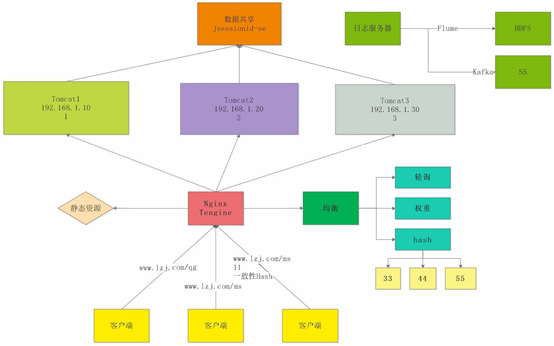

[TOC]

#### 1、Nginx的作用，只做收集数据吗？



1. `Nginx` 可以作为正反向代理服务器。
2. `Nginx` 如何按照不同的均衡策略来实现负载均衡。
   * **请求轮询**：每个请求按时间顺序逐一分配到不同的后端服务器，如果后端服务器 down 掉，能自动剔除。
   * **增加权重**： `Nginx` 会将客户端的请求，根据服务器的权重值不同，分配不同的数量。
   * **最少连接数**：下一个请求将被分派到活动连接数量最少的服务器
   * **IpHash**：每个请求按访问 `ip` 的 hash 结果分配，这样每个访客固定访问一个后端服务器，可以解决 `session` 共享的问题。当然，实际场景下，一般不考虑使用 `ip_hash` 解决 `session` 共享。因为 `IpHash` 有缺陷。
3. `Nginx` 可以配置为==静态资源服务器==。
4. `Nginx` 可以配置==虚拟主机==。
5. `Nginx` 可以配置 `Session` 一致。
6. 其他：限流、封IP等。


#### 2、Nginx 常用命令？

- 启动 `nginx` 。
- 停止 `nginx -s stop` 或 `nginx -s quit` 。
- 重载配置 `./sbin/nginx -s reload(平滑重启)` 或 `service nginx reload` 。
- 重载指定配置文件 `.nginx -c /usr/local/nginx/conf/nginx.conf` 。
- 查看 nginx 版本 `nginx -v` 。
- 检查配置文件是否正确 `nginx -t` 。
- 显示帮助信息 `nginx -h` 。


#### 3、Nginx 有哪些优点？

- 跨平台、配置简单。
- 非阻塞、高并发连接：处理 2-3 万并发连接数，官方监测能支持 5 万并发。
- 内存消耗小：开启 10 个 Nginx 才占 150M 内存。
- 成本低廉，且开源。
- 稳定性高，宕机的概率非常小。


#### 4、用 Nginx 服务器解释 -s 的目的是什么?

`-s signal`：发送信号给主进程:停止，退出，重新打开，重新加载。

```shell
# 快速停止
sbin/nginx -s stop

# 完整有序的停止
sbin/nginx -s quit

# 重新打开日志文件（日志切割）。
sbin/nginx -s reopen

# 平滑的重启，重新加载配置
sbin/nginx -s reload
```

> **重新打开日志文件的使用**
>
> 　　比如我们把架设在 `Nginx` 上的所有网站访问日志都存放在一个文件里，这样日积月累所有网站的访问记录就会把日志文件越积越大，当需要查看日志文件的时候就会变得非常麻烦。如果把每天的日志文件分割开来用相应的日期进行标识，查看日志的操作就会变得非常友好了。
>
> 　　==日志切割实现流程如下：==
>
> - 移动原文件到新文件目录中。其实这个时候 `Nginx` 还是会继续将日志写入该文件。
> - 执行 `nginx -s reopen` 打开一个新的日志文件，`Nginx` 会把新的日志信息写入该文件。
>
> 　　这样就完成了日志的切割工作，同时切割过程中也不会丢失任何日志信息。


